# ❄️ Chapitre 4 — Gérer les accès à Snowflake : le modèle RBAC

> **Niveau** : Débutant → Intermédiaire  
> **Durée estimée** : 2-3h  
> **Prérequis** : Avoir un compte Snowflake actif, notions SQL de base

---

## 📋 Sommaire

1. [Introduction à la gestion des privilèges](#1-introduction-à-la-gestion-des-privilèges)
2. [Personne vs Rôle : pourquoi les rôles ?](#2-personne-vs-rôle--pourquoi-les-rôles-)
3. [Le modèle RBAC qu'on va mettre en place](#3-le-modèle-rbac-quon-va-mettre-en-place)
4. [Création du premier rôle](#4-création-du-premier-rôle)
5. [Donner plus de privilèges au rôle DevSecOps](#5-donner-plus-de-privilèges-au-rôle-devsecops)
6. [Configurer le rôle DevOps et Engineer](#6-configurer-le-rôle-devops-et-engineer)
7. [Configurer le rôle AppRole](#7-configurer-le-rôle-approle)
8. [Privilège vs Posséder un objet (Ownership)](#8-privilège-vs-posséder-un-objet-ownership)
9. [Code SQL complet et documenté](#9-code-sql-complet-et-documenté)
10. [Révoquer des privilèges — REVOKE en détail](#10-révoquer-des-privilèges--revoke-en-détail)
11. [Cas pratique guidé](#11-cas-pratique-guidé)
12. [Canevas de réutilisation](#12-canevas-de-réutilisation)
13. [Référence des privilèges par objet](#13-référence-des-privilèges-par-objet)
14. [Commandes utiles de diagnostic](#14-commandes-utiles-de-diagnostic)

---

## 1. Introduction à la gestion des privilèges

### Qu'est-ce qu'un privilège dans Snowflake ?

Quand tu envoies une requête SQL à Snowflake, deux étapes se passent en coulisse :

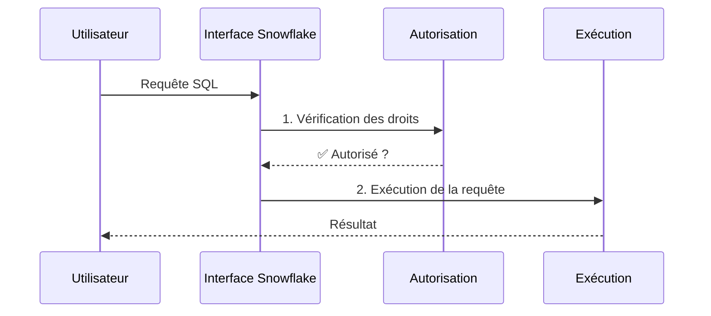

> **En résumé** : avant qu'une requête s'exécute, Snowflake vérifie si tu as le droit de faire cette action. Ces droits s'appellent des **privilèges**.

### Principes fondamentaux

- Les **autorisations** (privilèges) sont définies au niveau de chaque schéma et objet
- Un privilège peut autoriser **une seule opération** (`INSERT`) ou **plusieurs** (`ALL`)
- Chaque **type d'objet** a sa propre liste de privilèges possibles
- Un privilège peut être attribué à un **utilisateur** ou à un **rôle**

> 💡 **Bonne pratique** : On assigne toujours les privilèges à des **rôles**, pas directement aux utilisateurs. Cela rend la gestion des accès beaucoup plus simple à maintenir.

---

## 2. Personne vs Rôle : pourquoi les rôles ?

### Le problème sans rôles

Imagine que tu as 5 développeurs qui ont tous besoin des mêmes accès. Sans rôles, tu devrais assigner les mêmes privilèges 5 fois, et les maintenir individuellement.

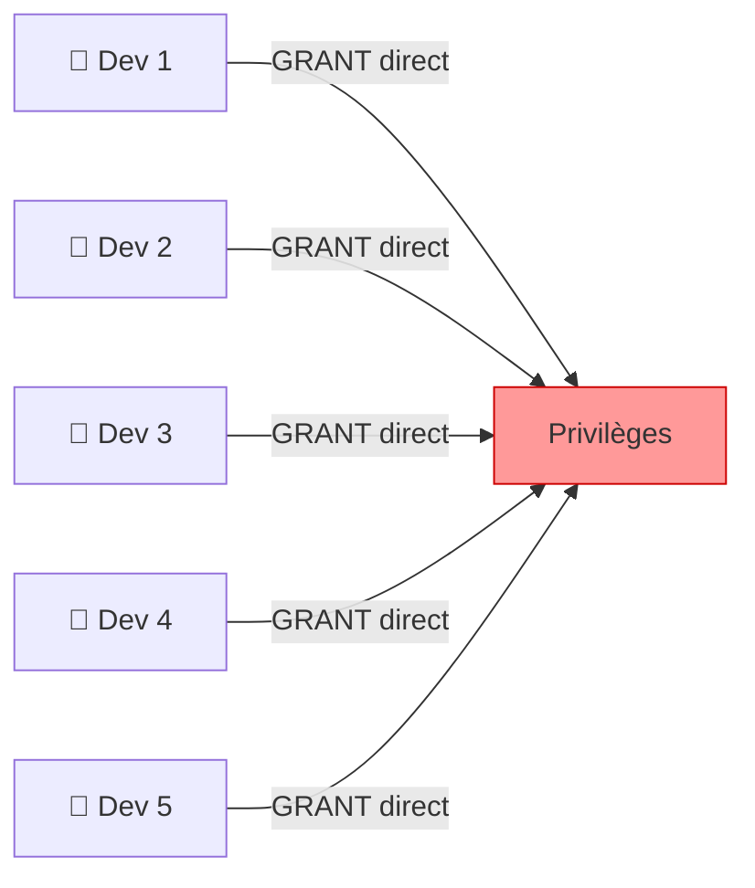

❌ **Problème** : Si les accès changent, tu dois modifier chaque utilisateur individuellement.

### La solution avec les rôles

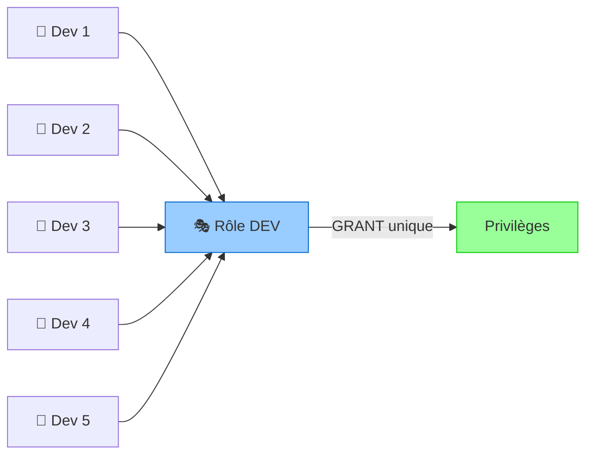

✅ **Avantage** : Tu modifies le rôle une seule fois, tous les utilisateurs héritent du changement.

---

## 3. Le modèle RBAC qu'on va mettre en place

**RBAC** = Role-Based Access Control (Contrôle d'accès basé sur les rôles)

Voici l'architecture des rôles qu'on va construire pour l'application `health_app` :

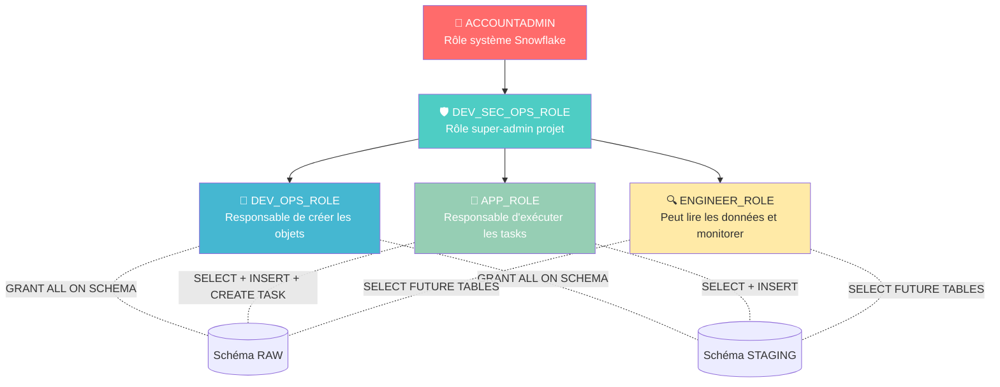

### Description de chaque rôle

| Rôle | Responsabilité | Privilèges clés |
|------|----------------|-----------------|
| `ACCOUNTADMIN` | Rôle système Snowflake, accès total | Tout |
| `DEV_SEC_OPS_ROLE` | Super-admin du projet, crée les autres rôles | CREATE DATABASE, CREATE ROLE, MANAGE GRANTS, CREATE WAREHOUSE |
| `DEV_OPS_ROLE` | Gère les objets de la base (tables, stages...) | ALL sur les schémas RAW et STAGING |
| `APP_ROLE` | Exécute les pipelines de données | SELECT, INSERT, CREATE TASK, EXECUTE TASK |
| `ENGINEER_ROLE` | Analyse les données, monitore | SELECT sur les futures tables |

---

## 4. Création du premier rôle

### Objectifs de cette section
- Créer un rôle dans Snowflake
- Assigner des privilèges à ce rôle
- Comprendre les **rôles secondaires** d'un utilisateur

### Commandes de diagnostic utiles

```sql
-- Afficher tous les rôles existants dans le compte
SHOW ROLES;

-- Afficher tous les grants (privilèges) assignés à un rôle
SHOW GRANTS TO ROLE dev_sec_ops_role;

-- Afficher tous les utilisateurs du compte
SHOW USERS;

-- Afficher tous les grants d'un utilisateur spécifique
SHOW GRANTS TO USER coursdbt;

-- Inspecter la configuration complète d'un utilisateur
DESCRIBE USER coursdbt;
```

* Liste des rôles disponibles dans ❄️ Snowflake : https://docs.snowflake.com/fr/user-guide/security-access-control-privileges
  
### Créer et assigner un rôle de base

```sql
-- Étape 1 : Se positionner avec le rôle administrateur
USE ROLE accountadmin;

-- Étape 2 : Créer le rôle (IF NOT EXISTS évite l'erreur si déjà existant)
CREATE ROLE IF NOT EXISTS dev_sec_ops_role;

-- Étape 3 : Assigner ce rôle à un utilisateur
-- ⚠️ Sans cette étape, le rôle existe mais personne ne peut l'utiliser !
GRANT ROLE dev_sec_ops_role TO USER coursdbt;

-- Étape 4 : Donner un premier privilège d'accès à une database
GRANT USAGE ON DATABASE health_app TO ROLE dev_sec_ops_role;
```
*"coursdbt" > remplacer par l'user actuel*

### Comprendre les rôles secondaires

Un utilisateur Snowflake possède un **rôle actif principal** et peut avoir des **rôles secondaires** actifs simultanément.

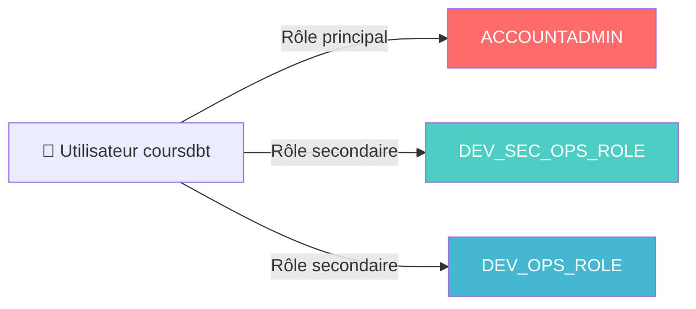

```sql
-- Activer le mode "aucun rôle secondaire" (plus restrictif, recommandé pour tester)
USE SECONDARY ROLES NONE;

-- Vérifier quels rôles secondaires sont actifs
SELECT CURRENT_SECONDARY_ROLES();

-- Définir les rôles secondaires par défaut (tableau vide = aucun)
ALTER USER coursdbt SET DEFAULT_SECONDARY_ROLES = ();
```

> 💡 **Pourquoi c'est important** : Par défaut, un utilisateur avec le rôle `ACCOUNTADMIN` en secondaire peut réaliser des opérations avec des droits élevés même en étant connecté avec un rôle moins privilégié. Désactiver les rôles secondaires force à être explicite sur les droits utilisés.

---

## 5. Donner plus de privilèges au rôle DevSecOps

### Objectif
Configurer `DEV_SEC_OPS_ROLE` pour qu'il puisse créer des ressources au niveau du compte.

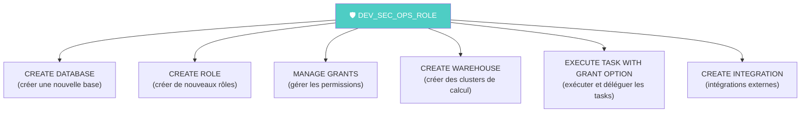

```sql
-- ============================================================
-- CONFIGURATION DU RÔLE DEV_SEC_OPS_ROLE (depuis ACCOUNTADMIN)
-- ============================================================

USE ROLE accountadmin;

-- Créer le rôle (idempotent : ne plante pas si déjà existant)
CREATE ROLE IF NOT EXISTS dev_sec_ops_role;

-- Assigner le rôle à l'utilisateur du cours
GRANT ROLE dev_sec_ops_role TO USER coursdbt;

-- Privilèges au niveau du COMPTE (ON ACCOUNT)
-- Permet de créer des databases depuis ce rôle
GRANT CREATE DATABASE ON ACCOUNT TO ROLE dev_sec_ops_role;

-- Permet de créer des rôles depuis ce rôle
GRANT CREATE ROLE ON ACCOUNT TO ROLE dev_sec_ops_role;

-- Permet de gérer/modifier les permissions (GRANT/REVOKE)
GRANT MANAGE GRANTS ON ACCOUNT TO ROLE dev_sec_ops_role;

-- Permet de créer des warehouses (ressources de calcul)
GRANT CREATE WAREHOUSE ON ACCOUNT TO ROLE dev_sec_ops_role;

-- Permet d'exécuter des tasks ET de déléguer ce droit à d'autres rôles
-- WITH GRANT OPTION = peut re-GRANT ce privilège à d'autres
GRANT EXECUTE TASK ON ACCOUNT TO ROLE dev_sec_ops_role WITH GRANT OPTION;
```

* La commande **GRANT PRIVILEGE** dans ❄️ Snowflake : https://docs.snowflake.com/fr/sql-reference/sql/grant-privilege

### Test : créer une database avec le nouveau rôle

```sql
-- Basculer vers notre nouveau rôle
USE ROLE dev_sec_ops_role;

-- Créer une base de données (preuve que le privilège fonctionne)
CREATE DATABASE TEST_DATABASE;

-- Revenir en admin pour nettoyer
USE ROLE accountadmin;
USE DATABASE test_database;
```

> ⚠️ **Note** : `CREATE WAREHOUSE` nécessite aussi `GRANT CREATE WAREHOUSE` depuis ACCOUNTADMIN. Sans ce privilège, la création de warehouse depuis `dev_sec_ops_role` échouera avec "Insufficient privileges".

---

## 6. Configurer le rôle DevOps et Engineer

### Objectifs
- Configurer `DEV_OPS_ROLE` avec tous les droits sur les schémas
- Configurer `ENGINEER_ROLE` avec lecture sur les tables futures
- Comprendre `GRANT ON FUTURE TABLES`

### Architecture de la database health_app_2

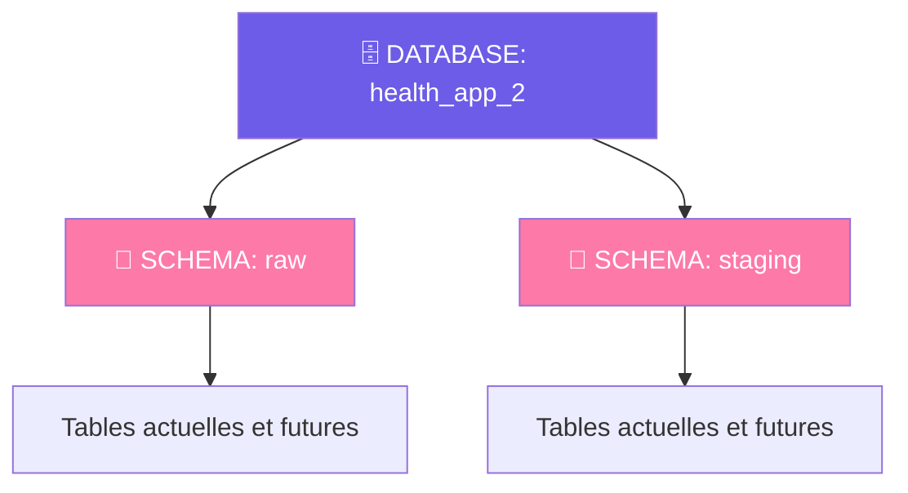

### Code complet : setup de la database et des rôles

```sql
-- ============================================================
-- ÉTAPE 1 : SETUP DEPUIS ACCOUNTADMIN
-- ============================================================

USE ROLE accountadmin;

-- Créer et assigner le rôle DevSecOps (point d'entrée pour la suite)
CREATE ROLE IF NOT EXISTS dev_sec_ops_role;
GRANT ROLE dev_sec_ops_role TO USER coursdbt;

-- Privilèges compte nécessaires pour la suite
GRANT CREATE DATABASE ON ACCOUNT TO ROLE dev_sec_ops_role;
GRANT CREATE ROLE ON ACCOUNT TO ROLE dev_sec_ops_role;
GRANT MANAGE GRANTS ON ACCOUNT TO ROLE dev_sec_ops_role;
GRANT CREATE WAREHOUSE ON ACCOUNT TO ROLE dev_sec_ops_role;

-- ============================================================
-- ÉTAPE 2 : CRÉATION DE LA DATABASE ET DES SCHÉMAS
-- (depuis DEV_SEC_OPS_ROLE)
-- ============================================================

USE ROLE dev_sec_ops_role;

-- Créer la database principale du projet
-- CREATE OR ALTER = crée si inexistant, modifie si existant (idempotent)
CREATE OR ALTER DATABASE health_app_2;

USE DATABASE health_app_2;

-- Créer les deux zones de données
CREATE OR ALTER SCHEMA raw;      -- Données brutes ingérées
CREATE OR ALTER SCHEMA staging;  -- Données transformées/nettoyées

-- ============================================================
-- ÉTAPE 3 : CRÉATION DES RÔLES MÉTIER
-- ============================================================

-- Ces rôles seront les "personnages" qui interagissent avec la data
CREATE OR ALTER ROLE dev_ops_role;    -- Équipe DevOps (gestion objets)
CREATE OR ALTER ROLE engineer_role;   -- Data Engineers (lecture/monitoring)
CREATE OR ALTER ROLE app_role;        -- Application (pipelines de données)

-- ============================================================
-- ÉTAPE 4 : ATTRIBUTION DES PRIVILÈGES PAR RÔLE
-- ============================================================

-- === DEV_OPS_ROLE : accès total aux schémas ===
-- ALL = tous les privilèges disponibles sur ce type d'objet
-- (CREATE TABLE, MODIFY, MONITOR, USAGE, etc.)
GRANT ALL ON SCHEMA raw TO ROLE dev_ops_role;
GRANT ALL ON SCHEMA staging TO ROLE dev_ops_role;

-- === ENGINEER_ROLE : lecture seule sur les tables ===
-- FUTURE TABLES = s'applique aussi aux tables créées APRÈS ce GRANT
-- C'est très puissant : pas besoin de re-GRANT à chaque nouvelle table !
GRANT SELECT ON FUTURE TABLES IN SCHEMA raw TO ROLE engineer_role;
GRANT SELECT ON FUTURE TABLES IN SCHEMA staging TO ROLE engineer_role;
```

### Comprendre `GRANT ON FUTURE TABLES`

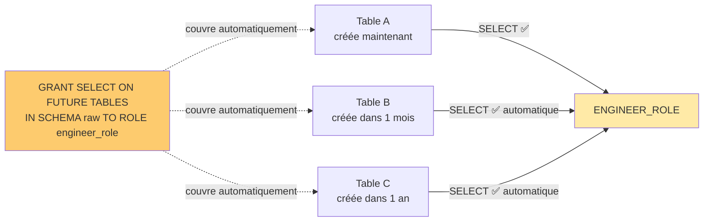

> 💡 **Sans FUTURE TABLES** : tu devrais faire un GRANT pour chaque nouvelle table. Avec un pipeline qui crée des dizaines de tables, c'est ingérable.

---

## 7. Configurer le rôle AppRole

### Objectifs
- Configurer `APP_ROLE` avec SELECT, INSERT et gestion des tasks
- Comprendre `WITH GRANT OPTION`
- Comprendre `EXECUTE AS CALLER` pour les procédures

### Matrice des privilèges de APP_ROLE

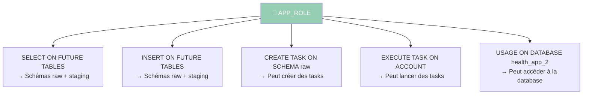

```sql
-- ============================================================
-- CONFIGURATION DU APP_ROLE
-- (depuis DEV_SEC_OPS_ROLE qui a GRANT EXECUTE TASK WITH GRANT OPTION)
-- ============================================================

USE ROLE dev_sec_ops_role;

-- Lecture sur les tables futures des deux schémas
GRANT SELECT ON FUTURE TABLES IN SCHEMA raw TO ROLE app_role;
GRANT SELECT ON FUTURE TABLES IN SCHEMA staging TO ROLE app_role;

-- Écriture sur les tables futures des deux schémas
GRANT INSERT ON FUTURE TABLES IN SCHEMA raw TO ROLE app_role;
GRANT INSERT ON FUTURE TABLES IN SCHEMA staging TO ROLE app_role;

-- Création de tasks dans le schéma raw
-- (les tasks sont des objets Snowflake qui planifient des requêtes SQL)
GRANT CREATE TASK ON SCHEMA raw TO ROLE app_role;

-- Exécution de tasks au niveau du compte
-- Note : possible car DEV_SEC_OPS_ROLE a reçu ce droit WITH GRANT OPTION
GRANT EXECUTE TASK ON ACCOUNT TO ROLE app_role;
```

### Comprendre `WITH GRANT OPTION`

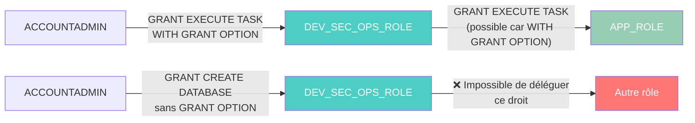

> **Règle** : Pour qu'un rôle puisse `GRANT` un privilège à un autre rôle, il doit avoir reçu ce privilège avec `WITH GRANT OPTION`. Sans ça, erreur `Insufficient privileges`.

### Donner accès à la database pour les rôles "lecture"

```sql
-- Sans USAGE sur la DATABASE, un rôle ne peut pas accéder aux schémas qu'elle contient
-- (même avec des droits sur les schémas/tables !)
GRANT USAGE ON DATABASE HEALTH_APP_2 TO ROLE engineer_role;
GRANT USAGE ON DATABASE HEALTH_APP_2 TO ROLE app_role;
```

> ⚠️ **Piège classique débutant** : Tu peux avoir SELECT sur une table mais quand même avoir une erreur si tu n'as pas USAGE sur le DATABASE et le SCHEMA parent. La permission doit exister à chaque niveau de la hiérarchie.

---

## 8. Privilège vs Posséder un objet (Ownership)

### Objectifs
- Comprendre la notion de **propriétaire** (owner) d'un objet dans Snowflake
- Savoir transférer la propriété avec `GRANT OWNERSHIP`

### Concept d'ownership

Dans Snowflake, **chaque objet a un propriétaire**. Le rôle qui crée un objet en devient automatiquement le propriétaire.

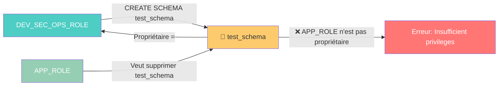

### Transférer la propriété

```sql
-- Depuis DEV_SEC_OPS_ROLE : créer un schéma test
CREATE SCHEMA test_schema;

-- Transférer la propriété du schéma au rôle APP_ROLE
-- Après cette commande, APP_ROLE peut supprimer/modifier test_schema
GRANT OWNERSHIP ON SCHEMA test_schema TO ROLE app_role;

-- Vérification : assigner APP_ROLE à l'utilisateur pour tester
USE ROLE dev_sec_ops_role;
GRANT ROLE app_role TO USER coursdbt;

-- Basculer vers APP_ROLE et supprimer le schéma (maintenant possible)
USE ROLE app_role;
USE DATABASE health_app_2;
DROP SCHEMA test_schema CASCADE;  -- CASCADE supprime aussi tous les objets dans le schéma

-- Nettoyage : révoquer le rôle et les accès de test
REVOKE ROLE app_role FROM USER coursdbt;
REVOKE USAGE ON DATABASE HEALTH_APP_2 FROM ROLE app_role;
```

### Révoquer des privilèges

```sql
-- Syntaxe générale pour révoquer
-- REVOKE <privilege> ON <object_type> <object_name> FROM ROLE <role_name>;

-- Exemples :
REVOKE ROLE app_role FROM USER coursdbt;
REVOKE USAGE ON DATABASE HEALTH_APP_2 FROM ROLE app_role;
REVOKE SELECT ON FUTURE TABLES IN SCHEMA raw FROM ROLE engineer_role;
```

---

## 9. Code SQL complet et documenté

Voici le script final consolidé (branche `application_avec_rbac`) :

```sql
-- ================================================================
-- SCRIPT COMPLET : MISE EN PLACE DU RBAC POUR HEALTH_APP_2
-- ================================================================
-- Description : Configure la hiérarchie de rôles RBAC complète
-- pour l'application health_app_2
-- Auteur : Cours Snowflake
-- Prérequis : Être connecté avec ACCOUNTADMIN
-- ================================================================

-- ----------------------------------------------------------------
-- SECTION 1 : SETUP DEPUIS ACCOUNTADMIN
-- Création du rôle super-admin et attribution des droits globaux
-- ----------------------------------------------------------------

USE ROLE accountadmin;

-- Créer le rôle super-admin du projet (idempotent)
CREATE ROLE IF NOT EXISTS dev_sec_ops_role;

-- Attacher ce rôle à l'utilisateur de cours
GRANT ROLE dev_sec_ops_role TO USER coursdbt;

-- Droits au niveau du COMPTE (ON ACCOUNT)
-- Nécessaires pour que dev_sec_ops_role puisse bootstrapper le projet
GRANT CREATE DATABASE ON ACCOUNT TO ROLE dev_sec_ops_role;       -- Créer des bases de données
GRANT CREATE ROLE ON ACCOUNT TO ROLE dev_sec_ops_role;           -- Créer des rôles
GRANT MANAGE GRANTS ON ACCOUNT TO ROLE dev_sec_ops_role;         -- Gérer les permissions
GRANT CREATE WAREHOUSE ON ACCOUNT TO ROLE dev_sec_ops_role;      -- Créer des warehouses

-- WITH GRANT OPTION : dev_sec_ops_role pourra déléguer ce droit à d'autres rôles
GRANT EXECUTE TASK ON ACCOUNT TO ROLE dev_sec_ops_role WITH GRANT OPTION;

-- ----------------------------------------------------------------
-- SECTION 2 : CRÉATION DE L'INFRASTRUCTURE
-- Depuis DEV_SEC_OPS_ROLE : database, schémas, rôles métier
-- ----------------------------------------------------------------

USE ROLE dev_sec_ops_role;

-- Créer la database du projet (CREATE OR ALTER = idempotent)
CREATE OR ALTER DATABASE health_app_2;

USE DATABASE health_app_2;

-- Deux zones de données selon le pattern Medallion/Lambda
CREATE OR ALTER SCHEMA raw;      -- Zone d'ingestion : données brutes
CREATE OR ALTER SCHEMA staging;  -- Zone de transformation : données nettoyées

-- Créer les rôles métier (CREATE OR ALTER = idempotent)
CREATE OR ALTER ROLE dev_ops_role;    -- Équipe plateforme/infrastructure
CREATE OR ALTER ROLE engineer_role;   -- Data Engineers & Analysts
CREATE OR ALTER ROLE app_role;        -- Processus applicatifs et pipelines

-- ----------------------------------------------------------------
-- SECTION 3 : DROITS DU RÔLE DEV_OPS_ROLE
-- Accès complet aux schémas pour gérer les objets de données
-- ----------------------------------------------------------------

-- ALL = USAGE + CREATE TABLE/VIEW/STREAM/TASK/PIPE/... + MODIFY + MONITOR
GRANT ALL ON SCHEMA raw TO ROLE dev_ops_role;
GRANT ALL ON SCHEMA staging TO ROLE dev_ops_role;

-- ----------------------------------------------------------------
-- SECTION 4 : DROITS DU RÔLE ENGINEER_ROLE
-- Lecture seule, y compris sur les tables qui seront créées plus tard
-- ----------------------------------------------------------------

-- FUTURE TABLES : couvre automatiquement toutes les tables créées après ce GRANT
GRANT SELECT ON FUTURE TABLES IN SCHEMA raw TO ROLE engineer_role;
GRANT SELECT ON FUTURE TABLES IN SCHEMA staging TO ROLE engineer_role;

-- Accès à la database parent (obligatoire pour naviguer dans la hiérarchie)
GRANT USAGE ON DATABASE HEALTH_APP_2 TO ROLE engineer_role;

-- ----------------------------------------------------------------
-- SECTION 5 : DROITS DU RÔLE APP_ROLE
-- Lecture + écriture + gestion des tasks pour les pipelines
-- ----------------------------------------------------------------

-- Lecture des données (pour les transformations)
GRANT SELECT ON FUTURE TABLES IN SCHEMA raw TO ROLE app_role;
GRANT SELECT ON FUTURE TABLES IN SCHEMA staging TO ROLE app_role;

-- Écriture des données (pour charger les résultats)
GRANT INSERT ON FUTURE TABLES IN SCHEMA raw TO ROLE app_role;
GRANT INSERT ON FUTURE TABLES IN SCHEMA staging TO ROLE app_role;

-- Gestion des tasks (pour orchestrer les pipelines)
GRANT CREATE TASK ON SCHEMA raw TO ROLE app_role;    -- Créer des tasks
GRANT EXECUTE TASK ON ACCOUNT TO ROLE app_role;      -- Lancer des tasks

-- Accès à la database parent
GRANT USAGE ON DATABASE HEALTH_APP_2 TO ROLE app_role;
```

---

## 10. Révoquer des privilèges — REVOKE en détail

> Si `GRANT` donne des droits, `REVOKE` les retire. C'est une opération critique pour la sécurité et la gestion du cycle de vie des accès.

### Syntaxe générale

```sql
-- Révoquer un privilège d'un rôle
REVOKE <privilege> ON <object_type> <object_name> FROM ROLE <role_name>;

-- Révoquer un rôle d'un utilisateur
REVOKE ROLE <role_name> FROM USER <user_name>;

-- Révoquer un rôle d'un autre rôle (hiérarchie)
REVOKE ROLE <role_enfant> FROM ROLE <role_parent>;
```

> ⚠️ **Qui peut REVOKE ?** Seul un rôle avec `MANAGE GRANTS` (comme `ACCOUNTADMIN` ou `DEV_SEC_OPS_ROLE`) peut révoquer des privilèges sur n'importe quel objet. Sans ce droit, tu ne peux révoquer que les privilèges que tu as toi-même accordés.

---

### Cas 1 : Révoquer un rôle d'un utilisateur

```sql
-- Un développeur quitte l'équipe → retirer son accès
REVOKE ROLE dev_ops_role FROM USER alice;

-- Vérification : alice ne doit plus avoir ce rôle
SHOW GRANTS TO USER alice;
```

---

### Cas 2 : Révoquer un privilège sur une database ou un schéma

```sql
-- Retirer l'accès à la database pour un rôle
REVOKE USAGE ON DATABASE health_app_2 FROM ROLE engineer_role;

-- Retirer tous les droits sur un schéma
REVOKE ALL ON SCHEMA raw FROM ROLE dev_ops_role;

-- Retirer un droit spécifique sur un schéma
REVOKE CREATE TASK ON SCHEMA raw FROM ROLE app_role;
```

---

### Cas 3 : Révoquer des privilèges sur les tables

```sql
-- Retirer SELECT sur une table précise
REVOKE SELECT ON TABLE health_app_2.raw.patients FROM ROLE engineer_role;

-- Retirer SELECT sur toutes les tables existantes d'un schéma
REVOKE SELECT ON ALL TABLES IN SCHEMA raw FROM ROLE engineer_role;

-- Retirer le GRANT sur les futures tables
-- ⚠️ Attention : ceci n'affecte PAS les droits déjà accordés aux tables existantes !
REVOKE SELECT ON FUTURE TABLES IN SCHEMA raw FROM ROLE engineer_role;
```

> 💡 **Piège important** : `REVOKE SELECT ON FUTURE TABLES` n'enlève les droits que sur les tables **créées après** la révocation. Les tables existantes qui avaient reçu le droit le conservent. Pour tout retirer, combine les deux :
> ```sql
> REVOKE SELECT ON ALL TABLES IN SCHEMA raw FROM ROLE engineer_role;
> REVOKE SELECT ON FUTURE TABLES IN SCHEMA raw FROM ROLE engineer_role;
> ```

---

### Cas 4 : Révoquer des privilèges niveau ACCOUNT

```sql
-- Retirer le droit de créer des databases
REVOKE CREATE DATABASE ON ACCOUNT FROM ROLE dev_sec_ops_role;

-- Retirer le droit de gérer les permissions
REVOKE MANAGE GRANTS ON ACCOUNT FROM ROLE dev_sec_ops_role;

-- Retirer le droit d'exécuter des tasks
REVOKE EXECUTE TASK ON ACCOUNT FROM ROLE app_role;
```

> ⚠️ Ces commandes doivent être exécutées depuis `ACCOUNTADMIN` car elles concernent des privilèges au niveau du compte.

---

### Cas 5 : Révoquer WITH GRANT OPTION (CASCADE)

Quand un rôle a reçu un privilège **`WITH GRANT OPTION`** et l'a délégué à d'autres rôles, le comportement de REVOKE peut varier :

```sql
-- Option RESTRICT (par défaut) : échoue si le droit a été délégué
REVOKE EXECUTE TASK ON ACCOUNT FROM ROLE dev_sec_ops_role;
-- ❌ Peut échouer si dev_sec_ops_role a déjà délégué ce droit à app_role

-- Option CASCADE : révoque en cascade sur tous les rôles qui ont reçu ce droit via ce rôle
REVOKE EXECUTE TASK ON ACCOUNT FROM ROLE dev_sec_ops_role CASCADE;
-- ✅ Retire aussi le droit d'app_role automatiquement
```

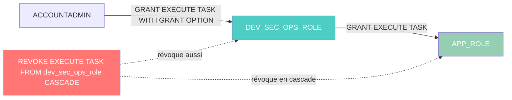

---

### Vue d'ensemble : GRANT vs REVOKE

| Action | Commande GRANT | Commande REVOKE équivalente |
|--------|---------------|----------------------------|
| Accès à une database | `GRANT USAGE ON DATABASE db TO ROLE r` | `REVOKE USAGE ON DATABASE db FROM ROLE r` |
| Accès à un schéma | `GRANT USAGE ON SCHEMA s TO ROLE r` | `REVOKE USAGE ON SCHEMA s FROM ROLE r` |
| Lecture table | `GRANT SELECT ON TABLE t TO ROLE r` | `REVOKE SELECT ON TABLE t FROM ROLE r` |
| Lecture futures tables | `GRANT SELECT ON FUTURE TABLES IN SCHEMA s TO ROLE r` | `REVOKE SELECT ON FUTURE TABLES IN SCHEMA s FROM ROLE r` |
| Écriture table | `GRANT INSERT ON TABLE t TO ROLE r` | `REVOKE INSERT ON TABLE t FROM ROLE r` |
| Créer un objet | `GRANT CREATE TABLE ON SCHEMA s TO ROLE r` | `REVOKE CREATE TABLE ON SCHEMA s FROM ROLE r` |
| Droit compte | `GRANT CREATE DATABASE ON ACCOUNT TO ROLE r` | `REVOKE CREATE DATABASE ON ACCOUNT FROM ROLE r` |
| Assigner un rôle | `GRANT ROLE r TO USER u` | `REVOKE ROLE r FROM USER u` |

---

### Bonnes pratiques pour REVOKE

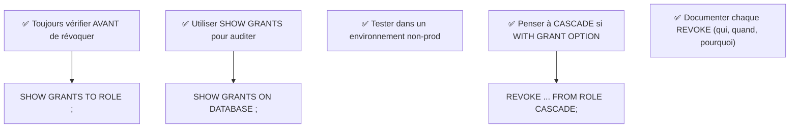

```sql
-- Avant de révoquer : auditer les droits existants
SHOW GRANTS TO ROLE engineer_role;

-- Après révocation : vérifier que le droit a bien été retiré
SHOW GRANTS TO ROLE engineer_role;

-- Vérifier qui a des droits sur un objet précis
SHOW GRANTS ON TABLE health_app_2.raw.patients;
```

---

## 11. Cas pratique guidé

> **Scénario** : Tu joins une startup qui crée une app de suivi de dépenses `expense_tracker`. Mets en place le RBAC pour une équipe de 3 personnes : Alice (DevOps), Bob (Engineer), et un service applicatif.

### Architecture cible

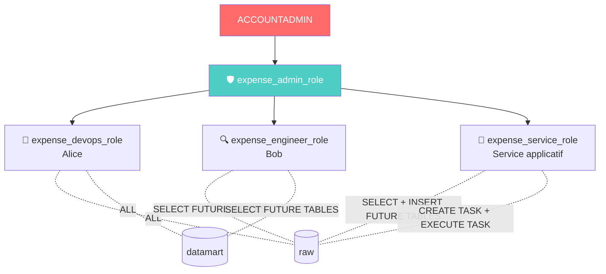

### Ta mission

**Étape 1** : Depuis `ACCOUNTADMIN`, créer et configurer `expense_admin_role`

```sql
USE ROLE accountadmin;

-- TODO : créer le rôle expense_admin_role
-- TODO : l'assigner à ton utilisateur
-- TODO : donner les droits CREATE DATABASE, CREATE ROLE, MANAGE GRANTS, CREATE WAREHOUSE
-- TODO : donner EXECUTE TASK WITH GRANT OPTION
```

**Étape 2** : Depuis `expense_admin_role`, créer l'infrastructure

```sql
USE ROLE expense_admin_role;

-- TODO : créer la database expense_tracker
-- TODO : créer les schémas raw et datamart
-- TODO : créer les 3 rôles métier
```

**Étape 3** : Attribuer les bons privilèges

```sql
-- TODO : devops_role -> ALL sur raw et datamart
-- TODO : engineer_role -> SELECT FUTURE TABLES sur raw et datamart
-- TODO : service_role -> SELECT + INSERT FUTURE TABLES sur raw
-- TODO : service_role -> CREATE TASK + EXECUTE TASK
```

**Étape 4** : Vérification

```sql
-- Tester que engineer_role ne peut pas insérer
USE ROLE expense_engineer_role;
-- Cette commande devrait échouer :
-- INSERT INTO raw.transactions VALUES (...);

-- Tester que service_role peut insérer
USE ROLE expense_service_role;
-- Cette commande devrait réussir :
-- INSERT INTO raw.transactions VALUES (...);
```

<details>
<summary>💡 Solution complète (cliquer pour révéler)</summary>

```sql
-- ÉTAPE 1
USE ROLE accountadmin;
CREATE ROLE IF NOT EXISTS expense_admin_role;
GRANT ROLE expense_admin_role TO USER <ton_user>;
GRANT CREATE DATABASE ON ACCOUNT TO ROLE expense_admin_role;
GRANT CREATE ROLE ON ACCOUNT TO ROLE expense_admin_role;
GRANT MANAGE GRANTS ON ACCOUNT TO ROLE expense_admin_role;
GRANT CREATE WAREHOUSE ON ACCOUNT TO ROLE expense_admin_role;
GRANT EXECUTE TASK ON ACCOUNT TO ROLE expense_admin_role WITH GRANT OPTION;

-- ÉTAPE 2
USE ROLE expense_admin_role;
CREATE OR ALTER DATABASE expense_tracker;
USE DATABASE expense_tracker;
CREATE OR ALTER SCHEMA raw;
CREATE OR ALTER SCHEMA datamart;
CREATE OR ALTER ROLE expense_devops_role;
CREATE OR ALTER ROLE expense_engineer_role;
CREATE OR ALTER ROLE expense_service_role;

-- ÉTAPE 3
GRANT ALL ON SCHEMA raw TO ROLE expense_devops_role;
GRANT ALL ON SCHEMA datamart TO ROLE expense_devops_role;

GRANT SELECT ON FUTURE TABLES IN SCHEMA raw TO ROLE expense_engineer_role;
GRANT SELECT ON FUTURE TABLES IN SCHEMA datamart TO ROLE expense_engineer_role;
GRANT USAGE ON DATABASE expense_tracker TO ROLE expense_engineer_role;

GRANT SELECT ON FUTURE TABLES IN SCHEMA raw TO ROLE expense_service_role;
GRANT INSERT ON FUTURE TABLES IN SCHEMA raw TO ROLE expense_service_role;
GRANT CREATE TASK ON SCHEMA raw TO ROLE expense_service_role;
GRANT EXECUTE TASK ON ACCOUNT TO ROLE expense_service_role;
GRANT USAGE ON DATABASE expense_tracker TO ROLE expense_service_role;
```
</details>

---

## 12. Canevas de réutilisation

Copie ce template et adapte-le pour n'importe quel nouveau projet Snowflake.

```sql
-- ================================================================
-- TEMPLATE RBAC SNOWFLAKE — À ADAPTER POUR CHAQUE PROJET
-- ================================================================
-- Variables à remplacer :
--   <PROJECT_NAME>  → ex: health_app, expense_tracker, analytics
--   <YOUR_USER>     → ton username Snowflake
-- ================================================================

-- ----------------------------------------------------------------
-- [1/4] BOOTSTRAP (depuis ACCOUNTADMIN)
-- ----------------------------------------------------------------
USE ROLE accountadmin;

CREATE ROLE IF NOT EXISTS <PROJECT_NAME>_admin_role;
GRANT ROLE <PROJECT_NAME>_admin_role TO USER <YOUR_USER>;

GRANT CREATE DATABASE   ON ACCOUNT TO ROLE <PROJECT_NAME>_admin_role;
GRANT CREATE ROLE       ON ACCOUNT TO ROLE <PROJECT_NAME>_admin_role;
GRANT MANAGE GRANTS     ON ACCOUNT TO ROLE <PROJECT_NAME>_admin_role;
GRANT CREATE WAREHOUSE  ON ACCOUNT TO ROLE <PROJECT_NAME>_admin_role;
GRANT EXECUTE TASK      ON ACCOUNT TO ROLE <PROJECT_NAME>_admin_role WITH GRANT OPTION;

-- ----------------------------------------------------------------
-- [2/4] INFRASTRUCTURE (depuis <PROJECT_NAME>_admin_role)
-- ----------------------------------------------------------------
USE ROLE <PROJECT_NAME>_admin_role;

CREATE OR ALTER DATABASE <PROJECT_NAME>;
USE DATABASE <PROJECT_NAME>;

-- Adapter les schémas selon ton architecture (Medallion, Lambda, etc.)
CREATE OR ALTER SCHEMA raw;
CREATE OR ALTER SCHEMA staging;
-- CREATE OR ALTER SCHEMA mart;  -- si besoin d'une couche présentation

-- Créer les rôles métier
CREATE OR ALTER ROLE <PROJECT_NAME>_devops_role;
CREATE OR ALTER ROLE <PROJECT_NAME>_engineer_role;
CREATE OR ALTER ROLE <PROJECT_NAME>_app_role;

-- ----------------------------------------------------------------
-- [3/4] ATTRIBUTION DES PRIVILÈGES
-- ----------------------------------------------------------------

-- DevOps : contrôle total sur les schémas
GRANT ALL ON SCHEMA raw     TO ROLE <PROJECT_NAME>_devops_role;
GRANT ALL ON SCHEMA staging TO ROLE <PROJECT_NAME>_devops_role;

-- Engineer : lecture seule (inclut les futures tables)
GRANT USAGE ON DATABASE <PROJECT_NAME>         TO ROLE <PROJECT_NAME>_engineer_role;
GRANT SELECT ON FUTURE TABLES IN SCHEMA raw     TO ROLE <PROJECT_NAME>_engineer_role;
GRANT SELECT ON FUTURE TABLES IN SCHEMA staging TO ROLE <PROJECT_NAME>_engineer_role;

-- App : lecture + écriture + tasks
GRANT USAGE ON DATABASE <PROJECT_NAME>          TO ROLE <PROJECT_NAME>_app_role;
GRANT SELECT ON FUTURE TABLES IN SCHEMA raw      TO ROLE <PROJECT_NAME>_app_role;
GRANT SELECT ON FUTURE TABLES IN SCHEMA staging  TO ROLE <PROJECT_NAME>_app_role;
GRANT INSERT ON FUTURE TABLES IN SCHEMA raw      TO ROLE <PROJECT_NAME>_app_role;
GRANT INSERT ON FUTURE TABLES IN SCHEMA staging  TO ROLE <PROJECT_NAME>_app_role;
GRANT CREATE TASK ON SCHEMA raw                  TO ROLE <PROJECT_NAME>_app_role;
GRANT EXECUTE TASK ON ACCOUNT                    TO ROLE <PROJECT_NAME>_app_role;

-- ----------------------------------------------------------------
-- [4/4] ASSIGNATION DES RÔLES AUX UTILISATEURS
-- (à adapter selon ton organisation)
-- ----------------------------------------------------------------
-- GRANT ROLE <PROJECT_NAME>_devops_role   TO USER alice;
-- GRANT ROLE <PROJECT_NAME>_engineer_role TO USER bob;
-- GRANT ROLE <PROJECT_NAME>_app_role      TO USER service_account;
```

---

## 13. Référence des privilèges par objet

### Hiérarchie des objets Snowflake

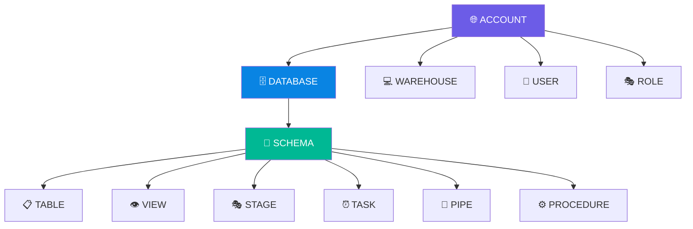

### Tableau des privilèges les plus courants

| Objet | Privilège | Description |
|-------|-----------|-------------|
| ACCOUNT | `CREATE DATABASE` | Créer une base de données |
| ACCOUNT | `CREATE ROLE` | Créer un rôle |
| ACCOUNT | `CREATE WAREHOUSE` | Créer un warehouse (calcul) |
| ACCOUNT | `MANAGE GRANTS` | Gérer les permissions |
| ACCOUNT | `EXECUTE TASK` | Lancer des tasks |
| DATABASE | `USAGE` | Accéder à la database (nécessaire pour tout) |
| DATABASE | `CREATE SCHEMA` | Créer des schémas |
| SCHEMA | `USAGE` | Accéder au schéma |
| SCHEMA | `CREATE TABLE` | Créer des tables |
| SCHEMA | `CREATE TASK` | Créer des tasks |
| SCHEMA | `ALL` | Tous les privilèges disponibles |
| TABLE | `SELECT` | Lire les données |
| TABLE | `INSERT` | Insérer des données |
| TABLE | `UPDATE` | Modifier des données |
| TABLE | `DELETE` | Supprimer des données |
| TABLE | `ALL` | Tous les privilèges |
| WAREHOUSE | `USAGE` | Utiliser le warehouse pour exécuter des requêtes |

---

## 14. Commandes utiles de diagnostic

```sql
-- ============================================================
-- INSPECTION DES RÔLES ET PERMISSIONS
-- ============================================================

-- Lister tous les rôles du compte
SHOW ROLES;

-- Voir les privilèges accordés À un rôle
SHOW GRANTS TO ROLE dev_sec_ops_role;

-- Voir les privilèges accordés PAR un rôle (ce qu'il a délégué)
SHOW GRANTS OF ROLE dev_sec_ops_role;

-- Voir tous les utilisateurs
SHOW USERS;

-- Voir les grants d'un utilisateur spécifique
SHOW GRANTS TO USER coursdbt;

-- Voir la configuration complète d'un utilisateur (rôle par défaut, etc.)
DESCRIBE USER coursdbt;

-- Voir quel rôle est actuellement actif
SELECT CURRENT_ROLE();

-- Voir quels rôles secondaires sont actifs
SELECT CURRENT_SECONDARY_ROLES();

-- ============================================================
-- VÉRIFICATION DE L'ACCÈS ACTUEL
-- ============================================================

-- Voir la database courante
SELECT CURRENT_DATABASE();

-- Voir le schéma courant
SELECT CURRENT_SCHEMA();

-- Voir le warehouse courant
SELECT CURRENT_WAREHOUSE();

-- ============================================================
-- COMMANDES UTILES EN CAS D'ERREUR
-- ============================================================

-- Si "Insufficient privileges" sur un GRANT :
-- → Vérifier que tu as MANAGE GRANTS ou que tu es propriétaire du privilège

-- Si "Object does not exist" sur un GRANT :
-- → Vérifier que tu es dans la bonne database/schema avec USE DATABASE/SCHEMA

-- Basculer entre rôles pour diagnostiquer
USE ROLE accountadmin;
USE ROLE dev_sec_ops_role;
```

---

## 📚 Ressources complémentaires

- [Documentation Snowflake : GRANT PRIVILEGE](https://docs.snowflake.com/en/sql-reference/sql/grant-privilege)
- [Documentation Snowflake : CREATE ROLE](https://docs.snowflake.com/en/sql-reference/sql/create-role)
- [Documentation Snowflake : GRANT OWNERSHIP](https://docs.snowflake.com/en/sql-reference/sql/grant-ownership)
- [Documentation Snowflake : SHOW GRANTS](https://docs.snowflake.com/en/sql-reference/sql/show-grants)
- [Documentation Snowflake : Rôles secondaires](https://docs.snowflake.com/en/user-guide/security-access-control-overview#secondary-roles)
- [Liste complète des privilèges par objet](https://docs.snowflake.com/en/user-guide/security-access-control-privileges)

---

## 🎯 Résumé du chapitre

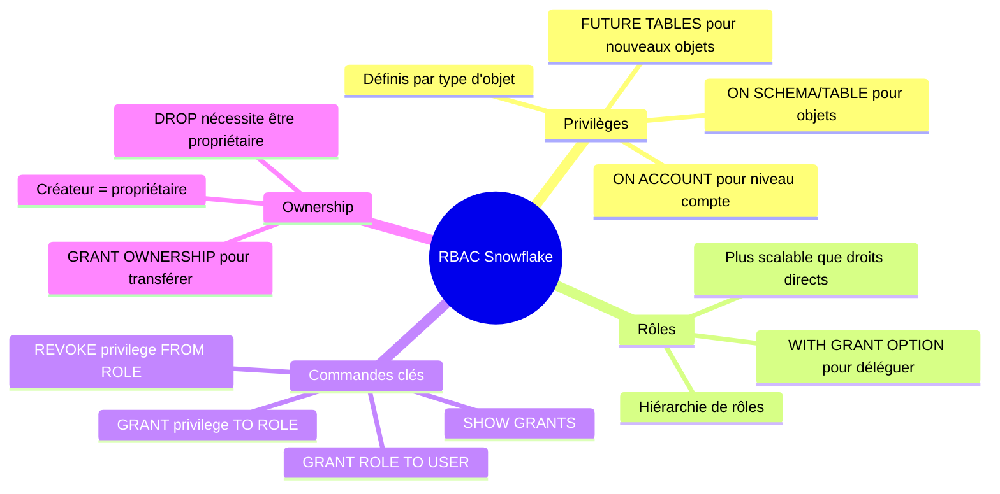

**Les points essentiels à retenir** :

1. **Toujours assigner les privilèges aux rôles**, pas aux utilisateurs directement
2. **GRANT ON FUTURE TABLES** évite de re-GRANT à chaque nouvelle table
3. **WITH GRANT OPTION** permet à un rôle de déléguer un privilège
4. **USAGE sur DATABASE et SCHEMA** est obligatoire même si tu as des droits sur les tables
5. **L'ownership** d'un objet détermine qui peut le modifier/supprimer

---

## 🔧 Méthodologie de résolution de problèmes RBAC

> Tu rencontres une erreur d'accès ? Suis ce flowchart avant de faire n'importe quel GRANT.

### Arbre de décision : "Insufficient privileges"

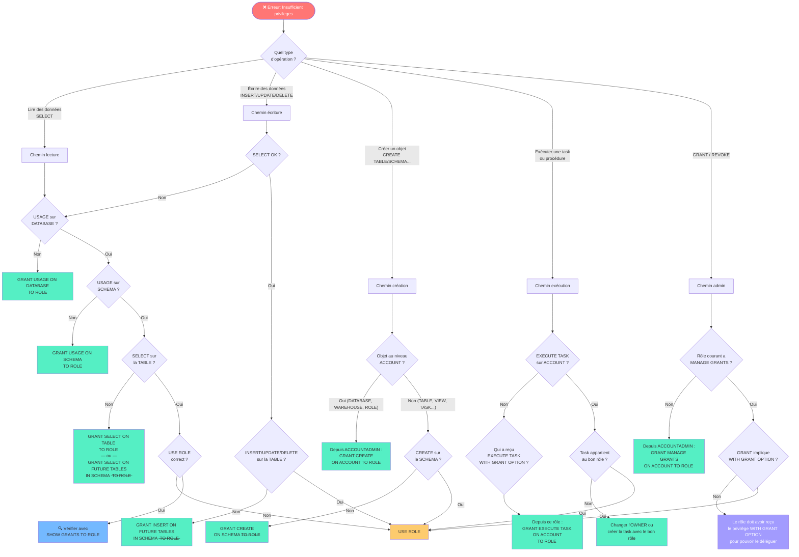

---

### Les 5 étapes du diagnostic RBAC

Avant de lancer une commande GRANT au hasard, pose-toi ces 5 questions dans l'ordre :

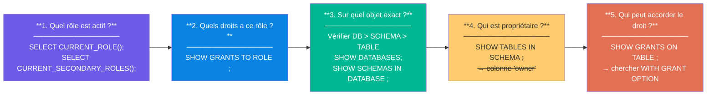

---

### Checklist : "Mon GRANT ne fonctionne pas"

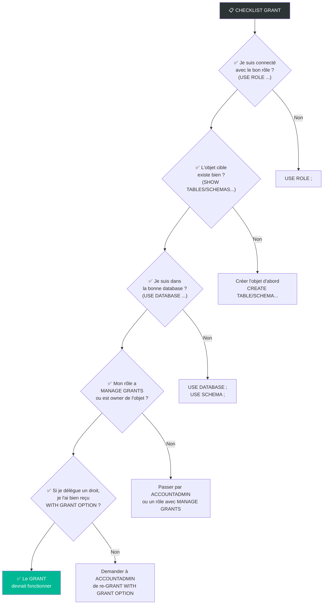

---

### Tableau des erreurs fréquentes et leurs causes

| Message d'erreur | Cause probable | Solution rapide |
|---|---|---|
| `Insufficient privileges to operate on database` | Pas de `USAGE` sur la DATABASE | `GRANT USAGE ON DATABASE <db> TO ROLE <r>` |
| `Insufficient privileges to operate on schema` | Pas de `USAGE` sur le SCHEMA | `GRANT USAGE ON SCHEMA <s> TO ROLE <r>` |
| `Grant not executed: Insufficient privileges` | Le rôle courant ne peut pas faire de GRANT | Passer par ACCOUNTADMIN ou un rôle avec `MANAGE GRANTS` |
| `Insufficient privileges on table` | Pas de `SELECT`/`INSERT` sur la table | `GRANT SELECT ON TABLE <t> TO ROLE <r>` |
| `Cannot create task: Insufficient privileges` | Pas de `CREATE TASK ON SCHEMA` | `GRANT CREATE TASK ON SCHEMA <s> TO ROLE <r>` |
| `Task execution failed: Insufficient privileges` | Pas de `EXECUTE TASK ON ACCOUNT` | `GRANT EXECUTE TASK ON ACCOUNT TO ROLE <r>` |
| `Object does not exist` lors d'un GRANT | Mauvaise database/schema active | `USE DATABASE <db>; USE SCHEMA <s>;` |
| `Only owner of object can change its ownership` | Tu n'es pas propriétaire de l'objet | `GRANT OWNERSHIP` depuis le rôle propriétaire actuel |

---

*Chapitre 4 — Cours Snowflake | Dernière mise à jour : 2026*

