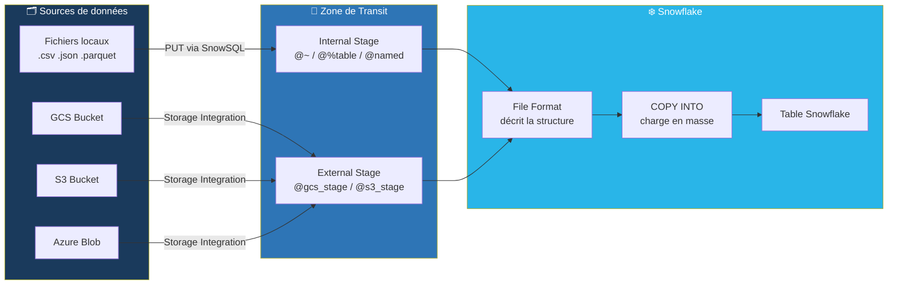
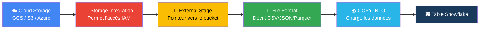
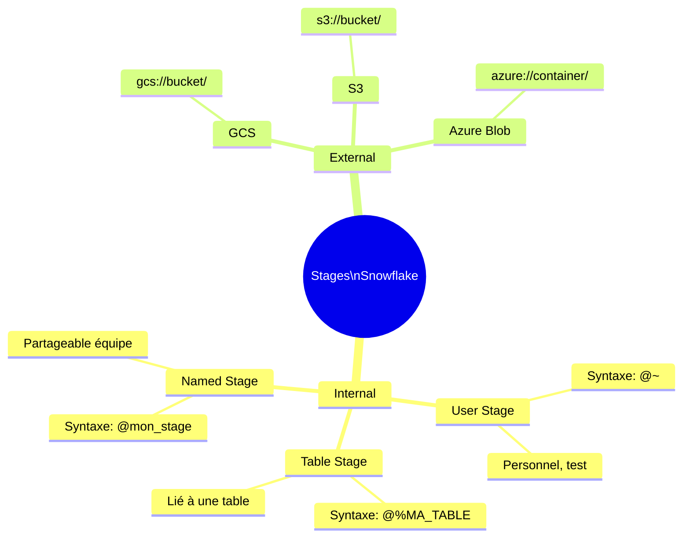
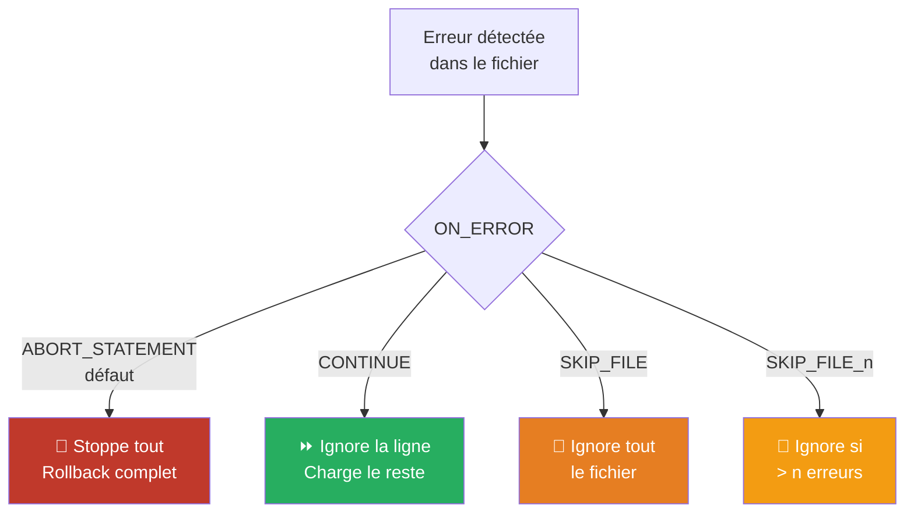
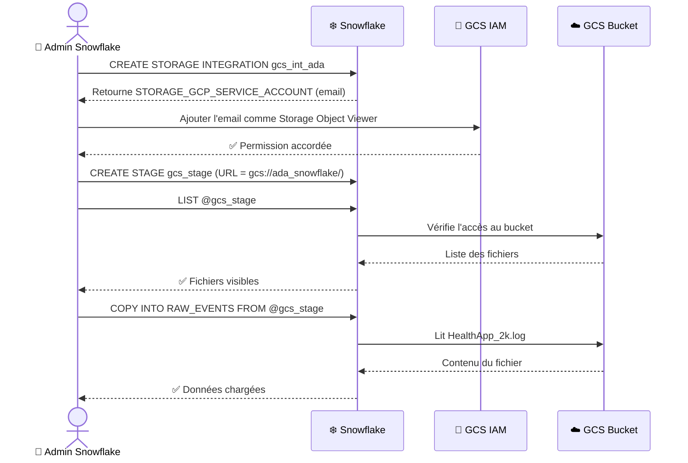
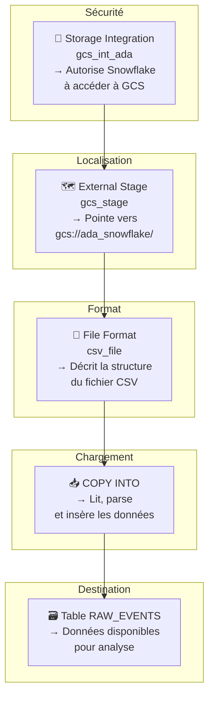
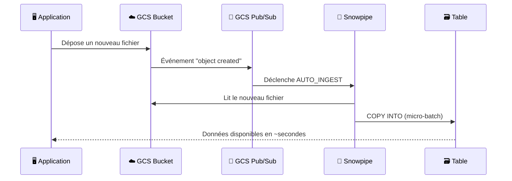
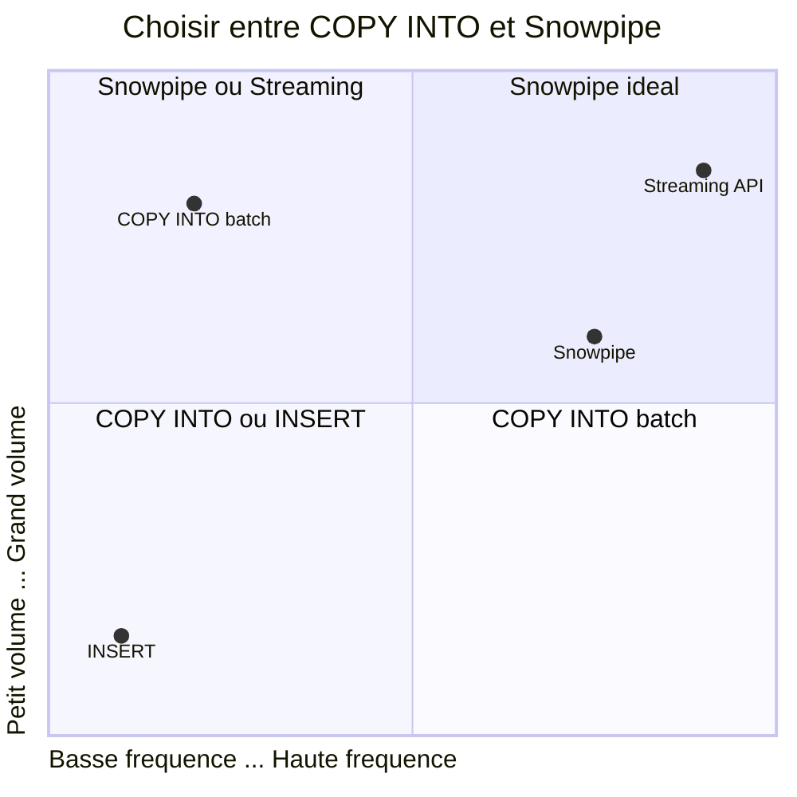
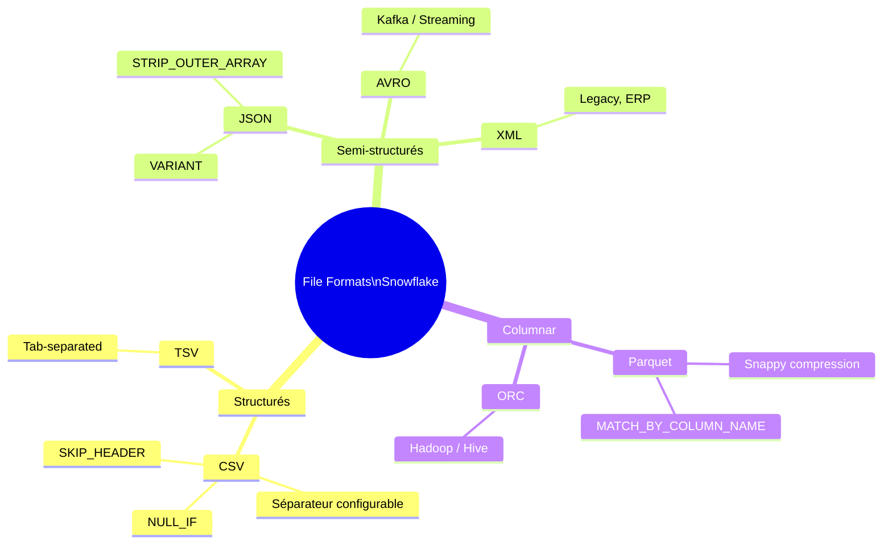
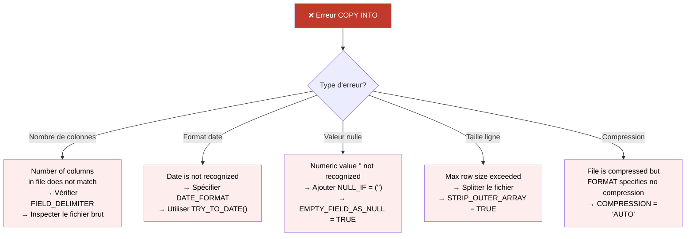

# ❄️ Snowflake — Chapitre : Charger les Données

> **Niveau** : Débutant → Intermédiaire | **Version** : 2024  
> **Objectif** : Maîtriser tous les mécanismes de chargement Snowflake, du fichier local au pipeline GCS/S3/Azure en production.

---

## 📋 Sommaire

1. [Vue d'ensemble & Architecture](#1-vue-densemble--architecture)
2. [Créer la structure de données](#2-créer-la-structure-de-données)
3. [Les Stages : zone de transit](#3-les-stages--zone-de-transit)
4. [File Formats : décrire vos fichiers](#4-file-formats--décrire-vos-fichiers)
5. [COPY INTO : chargement en masse](#5-copy-into--chargement-en-masse)
6. [Workflow complet GCS → Snowflake](#6-workflow-complet-gcs--snowflake)
7. [Chargement INSERT (petits volumes)](#7-chargement-insert-petits-volumes)
8. [Snowpipe : ingestion continue](#8-snowpipe--ingestion-continue)
9. [PUT & GET : CLI SnowSQL](#9-put--get--cli-snowsql)
10. [Formats de fichiers supportés](#10-formats-de-fichiers-supportés)
11. [🔴 Dictionnaire des erreurs communes](#11--dictionnaire-des-erreurs-communes)
12. [✅ Checklist & Bonnes pratiques](#12--checklist--bonnes-pratiques)

---

## 1. Vue d'ensemble & Architecture

### 1.1 Les 3 grandes méthodes

| Méthode | Cas d'usage | Latence | Complexité |
|---|---|---|---|
| **COPY INTO** (Batch) | Fichiers en masse (CSV, JSON, Parquet…) | Minutes | ⭐ Faible |
| **Snowpipe** (Streaming) | Ingestion continue / near-realtime | Secondes | ⭐⭐ Moyenne |
| **PUT + COPY** (CLI) | Dev/test, uploads manuels | Variable | ⭐ Faible |

### 1.2 Architecture globale



### 1.3 Flux de chargement simplifié (schéma mental)



📖 **Doc officielle** : [Data Loading Overview](https://docs.snowflake.com/fr/user-guide/data-load-overview)

---

## 2. Créer la Structure de Données

Avant de charger, il faut créer la destination.

### 2.1 Créer Database, Schema, Table

```sql
-- ① Créer la base de données
CREATE DATABASE IF NOT EXISTS HEALTH_APP
  COMMENT = 'Base principale application santé';

-- ② Créer le schéma
CREATE SCHEMA IF NOT EXISTS HEALTH_APP.RAW
  COMMENT = 'Données brutes avant transformation';

-- ③ Sélectionner le contexte
USE DATABASE HEALTH_APP;
USE SCHEMA RAW;

-- ④ Créer la table de destination
CREATE OR REPLACE TABLE RAW_EVENTS (
  event_id      INTEGER,
  timestamp     TIMESTAMP,
  user_id       VARCHAR(50),
  event_type    VARCHAR(100),
  value         FLOAT,
  source        VARCHAR(50)
);
```

📖 Docs officielles :
- [CREATE DATABASE](https://docs.snowflake.com/fr/sql-reference/sql/create-database)
- [CREATE SCHEMA](https://docs.snowflake.com/fr/sql-reference/sql/create-schema)
- [CREATE TABLE](https://docs.snowflake.com/fr/sql-reference/sql/create-table)
- [Types de données](https://docs.snowflake.com/fr/sql-reference-data-types)

### 2.2 Types de données courants

| Type Snowflake | Exemples | Notes |
|---|---|---|
| `INTEGER` / `NUMBER` | 1, 42, -5 | Entiers |
| `FLOAT` / `DOUBLE` | 3.14, -0.5 | Décimaux |
| `VARCHAR(n)` | "hello" | Chaîne jusqu'à n chars |
| `DATE` | 2024-01-15 | Date seule |
| `TIMESTAMP` | 2024-01-15 10:30:00 | Date + heure |
| `BOOLEAN` | TRUE / FALSE | Booléen |
| `VARIANT` | `{"key": "val"}` | JSON semi-structuré |

---

## 3. Les Stages : Zone de Transit

Un **Stage** est une zone de stockage temporaire où les fichiers transitent avant d'être chargés dans une table.

### 3.1 Types de Stages



### 3.2 Comparaison des Stages

| Type | Syntaxe | Stockage | Usage recommandé |
|---|---|---|---|
| User Stage | `@~` | Interne Snowflake | Tests perso rapides |
| Table Stage | `@%NOM_TABLE` | Interne Snowflake | Lié à une seule table |
| Named Stage (interne) | `@mon_stage` | Interne Snowflake | Partageable entre équipes |
| Named Stage (externe) | `@mon_stage_gcs` | GCS / S3 / Azure | **Production, volumes importants** |

### 3.3 Créer un Stage Interne Nommé

```sql
-- Stage interne simple
CREATE OR REPLACE STAGE mon_stage_interne
  COMMENT = 'Stage interne pour chargement CSV';

-- Lister les fichiers dans le stage
LIST @mon_stage_interne;

-- Supprimer un fichier du stage
REMOVE @mon_stage_interne/mon_fichier.csv;
```

📖 [CREATE STAGE](https://docs.snowflake.com/fr/sql-reference/sql/create-stage)

---

## 4. File Formats : Décrire vos Fichiers

Un **File Format** est un objet Snowflake qui décrit comment interpréter les fichiers (séparateur, encoding, header…).

### 4.1 Format CSV

```sql
CREATE OR REPLACE FILE FORMAT csv_file
  TYPE = CSV
  FIELD_DELIMITER = ','          -- Séparateur de colonnes
  SKIP_HEADER = 1                -- Ignorer la 1ère ligne (en-têtes)
  FIELD_OPTIONALLY_ENCLOSED_BY = '"'  -- Guillemets autour des champs
  NULL_IF = ('NULL', 'null', '', '\\N')  -- Valeurs → NULL
  EMPTY_FIELD_AS_NULL = TRUE
  TRIM_SPACE = TRUE              -- Supprimer les espaces
  DATE_FORMAT = 'YYYY-MM-DD'
  TIMESTAMP_FORMAT = 'YYYY-MM-DD HH24:MI:SS';
```

### 4.2 Format JSON

```sql
CREATE OR REPLACE FILE FORMAT fmt_json
  TYPE = JSON
  STRIP_OUTER_ARRAY = TRUE   -- [{...},{...}] → lignes séparées
  STRIP_NULL_VALUES = FALSE
  IGNORE_UTF8_ERRORS = FALSE;
```

### 4.3 Format Parquet

```sql
CREATE OR REPLACE FILE FORMAT fmt_parquet
  TYPE = PARQUET
  SNAPPY_COMPRESSION = TRUE
  BINARY_AS_TEXT = FALSE;
```

📖 [CREATE FILE FORMAT](https://docs.snowflake.com/fr/sql-reference/sql/create-file-format)

---

## 5. COPY INTO : Chargement en Masse

`COPY INTO` est la commande principale pour charger des fichiers depuis un stage vers une table.

### 5.1 Syntaxe complète

```sql
COPY INTO ma_table
  FROM @mon_stage/fichier.csv
  FILE_FORMAT = (TYPE = 'CSV' FIELD_DELIMITER = ',' SKIP_HEADER = 1)
  ON_ERROR = 'CONTINUE'   -- Comportement en cas d'erreur
  PURGE = FALSE           -- Supprimer le fichier après chargement
  FORCE = FALSE;          -- Ne pas recharger les fichiers déjà traités
```

### 5.2 Options ON_ERROR



| Option | Comportement | Quand l'utiliser |
|---|---|---|
| `ABORT_STATEMENT` (défaut) | Stoppe tout, rollback | Données critiques, 0 tolérance erreur |
| `CONTINUE` | Charge les lignes valides, ignore les mauvaises | Données semi-fiables |
| `SKIP_FILE` | Ignore tout le fichier si 1 erreur | Fichiers atomiques |
| `SKIP_FILE_n` | Ignore le fichier si > n erreurs | Seuil d'erreur tolérable |

### 5.3 Valider avant de charger (Dry Run)

```sql
-- VALIDATION_MODE : teste le fichier sans charger
COPY INTO ma_table FROM @mon_stage/fichier.csv
  FILE_FORMAT = (FORMAT_NAME = 'csv_file')
  VALIDATION_MODE = 'RETURN_ALL_ERRORS';
```

### 5.4 COPY avec Transformation

```sql
-- Charger avec transformation à la volée
COPY INTO clients (id, nom, email, date_inscription)
FROM (
  SELECT
    $1::INTEGER               AS id,
    UPPER($2)                 AS nom,
    LOWER($3)                 AS email,
    TO_DATE($4, 'DD/MM/YYYY') AS date_inscription
  FROM @mon_stage/clients.csv
)
FILE_FORMAT = (FORMAT_NAME = 'csv_file');
```

### 5.5 Vérifier l'historique de chargement

```sql
-- Historique des 24 dernières heures
SELECT
  FILE_NAME, STATUS, ROW_COUNT, ERROR_COUNT,
  FIRST_ERROR, FIRST_ERROR_LINE, LAST_LOAD_TIME
FROM TABLE(INFORMATION_SCHEMA.COPY_HISTORY(
  TABLE_NAME => 'RAW_EVENTS',
  START_TIME => DATEADD('HOURS', -24, CURRENT_TIMESTAMP())
))
ORDER BY LAST_LOAD_TIME DESC;
```

📖 [COPY INTO \<table\>](https://docs.snowflake.com/fr/sql-reference/sql/copy-into-table)

---

## 6. Workflow Complet GCS → Snowflake

Cas concret : ingestion du fichier `HealthApp_2k.log` depuis Google Cloud Storage.

### 6.1 Schéma du workflow GCS



### 6.2 Étape 1 — Définir le contexte

```sql
USE ROLE ACCOUNTADMIN;
USE DATABASE HEALTH_APP;
USE SCHEMA RAW;
```

> ⚠️ **Pourquoi ACCOUNTADMIN ?** La création d'une Storage Integration nécessite des privilèges élevés. En production, créez un rôle dédié avec uniquement les permissions nécessaires.

### 6.3 Étape 2 — Créer la Storage Integration GCS

```sql
CREATE OR REPLACE STORAGE INTEGRATION gcs_int_ada
  TYPE = EXTERNAL_STAGE
  STORAGE_PROVIDER = GCS
  ENABLED = TRUE
  STORAGE_ALLOWED_LOCATIONS = ('gcs://ada_snowflake/');
```

> 💡 **C'est quoi une Storage Integration ?** C'est un objet Snowflake qui contient les credentials sécurisés pour accéder à un bucket cloud. Elle évite de mettre des clés API en dur dans le code.

### 6.4 Étape 3 — Récupérer l'email Snowflake

```sql
DESC INTEGRATION gcs_int_ada;
-- → Copier la valeur de STORAGE_GCP_SERVICE_ACCOUNT
-- Exemple : abc123@gcpserviceaccount.com
```

**Ensuite dans Google Cloud Console :**
1. Aller dans `GCS > Votre bucket > Permissions`
2. Cliquer `+ Grant Access`
3. Coller l'email Snowflake
4. Rôle : `Storage Object Viewer` (lecture) ou `Storage Object Admin` (lecture + écriture)

📖 [Configurer GCS IAM](https://docs.snowflake.com/fr/user-guide/data-load-gcs-config)

### 6.5 Étape 4 — Créer le File Format

```sql
CREATE OR REPLACE FILE FORMAT csv_file
  TYPE = CSV
  FIELD_DELIMITER = ','
  SKIP_HEADER = 1
  FIELD_OPTIONALLY_ENCLOSED_BY = '"';
```

### 6.6 Étape 5 — Créer le Stage Externe GCS

```sql
CREATE OR REPLACE STAGE gcs_stage
  URL = 'gcs://ada_snowflake/'
  STORAGE_INTEGRATION = gcs_int_ada
  FILE_FORMAT = csv_file;
```

### 6.7 Étape 6 — Tester l'accès

```sql
-- Lister les fichiers visibles dans le bucket
LIST @gcs_stage;
-- Doit retourner les fichiers présents dans gcs://ada_snowflake/
```

### 6.8 Étape 7 — Charger les données

```sql
COPY INTO RAW_EVENTS
FROM @gcs_stage
FILES = ('HealthApp_2k.log')   -- Fichier spécifique
ON_ERROR = 'CONTINUE';
```

### 6.9 Étape 8 — Vérifier les données

```sql
SELECT * FROM RAW_EVENTS LIMIT 20;

-- Vérification du volume
SELECT COUNT(*) AS total_lignes FROM RAW_EVENTS;

-- Vérification de la répartition
SELECT event_type, COUNT(*) FROM RAW_EVENTS GROUP BY 1 ORDER BY 2 DESC;
```

### 6.10 Résumé visuel du rôle de chaque composant



📖 Docs officielles GCS :
- [CREATE STORAGE INTEGRATION](https://docs.snowflake.com/fr/sql-reference/sql/create-storage-integration)
- [Configurer GCS pour Snowflake](https://docs.snowflake.com/fr/user-guide/data-load-gcs-config)

---

## 7. Chargement INSERT (Petits Volumes)

Pour de petits volumes de données (tests, référentiels statiques), `INSERT` est plus simple.

```sql
-- INSERT simple
INSERT INTO clients (id, nom, email) VALUES
  (1, 'Alice Dupont', 'alice@example.com'),
  (2, 'Bob Martin',  'bob@example.com'),
  (3, 'Clara Petit',  'clara@example.com');

-- INSERT depuis une autre table (ETL interne)
INSERT INTO clients_archive
SELECT * FROM clients WHERE created_at < DATEADD('YEAR', -1, CURRENT_DATE());
```

> ⚠️ **Attention** : `INSERT` crée une transaction par lot de lignes. Pour des millions de lignes, préférez toujours `COPY INTO` qui est massivement parallélisé.

📖 [INSERT](https://docs.snowflake.com/fr/sql-reference/sql/insert)

---

## 8. Snowpipe : Ingestion Continue

Snowpipe charge automatiquement les nouveaux fichiers dès qu'ils arrivent dans un stage.

### 8.1 Comment ça fonctionne



### 8.2 Créer un Pipe

```sql
-- Créer le pipe avec AUTO_INGEST
CREATE OR REPLACE PIPE pipe_events
  AUTO_INGEST = TRUE
AS
COPY INTO events_raw
  FROM @gcs_stage/events/
  FILE_FORMAT = (FORMAT_NAME = 'fmt_json');

-- Récupérer le Notification Channel (Pub/Sub GCS)
DESC PIPE pipe_events;
-- → Copier notification_channel pour configurer GCS Pub/Sub
```

### 8.3 Surveiller Snowpipe

```sql
-- Statut du pipe
SELECT PARSE_JSON(SYSTEM$PIPE_STATUS('pipe_events'));

-- Historique d'ingestion
SELECT * FROM TABLE(INFORMATION_SCHEMA.COPY_HISTORY(
  TABLE_NAME => 'EVENTS_RAW',
  START_TIME => DATEADD('HOURS', -1, CURRENT_TIMESTAMP())
));

-- Pause / Reprise
ALTER PIPE pipe_events PAUSE;
ALTER PIPE pipe_events RESUME;
```

📖 Docs officielles :
- [Snowpipe Introduction](https://docs.snowflake.com/fr/user-guide/data-load-snowpipe-intro)
- [Snowpipe Streaming](https://docs.snowflake.com/fr/user-guide/snowpipe-streaming/data-load-snowpipe-streaming-overview)

### 8.4 COPY INTO vs Snowpipe



---

## 9. PUT & GET : CLI SnowSQL

`PUT` et `GET` permettent de transférer des fichiers entre votre machine locale et un stage **interne**.

> ⚠️ `PUT` et `GET` fonctionnent **uniquement en SnowSQL CLI** ou via le connecteur Python. Pas dans l'UI Snowsight.

### 9.1 Installer SnowSQL

```bash
# macOS
brew install --cask snowflake-snowsql

# Linux
curl -O https://sfc-repo.snowflakecomputing.com/snowsql/bootstrap/1.2/linux_x86_64/snowsql-1.2.9-linux_x86_64.bash
bash snowsql-1.2.9-linux_x86_64.bash

# Connexion
snowsql -a <account_identifier> -u <username>
```

### 9.2 PUT — Uploader un fichier vers un Stage

```sql
-- Uploader un fichier local
PUT file:///chemin/local/data.csv @mon_stage;

-- Uploader plusieurs fichiers (wildcard)
PUT file:///data/*.csv @mon_stage AUTO_COMPRESS=TRUE;

-- Options complètes
PUT file:///data/big_file.csv @mon_stage
  AUTO_COMPRESS = TRUE    -- Compresser avant upload
  PARALLEL = 4            -- Threads parallèles
  OVERWRITE = FALSE;      -- Ne pas écraser si déjà présent
```

### 9.3 GET — Télécharger depuis un Stage

```sql
-- Télécharger un fichier
GET @mon_stage/data.csv file:///tmp/output/;

-- Télécharger tous les fichiers
GET @mon_stage file:///tmp/output/ PARALLEL = 8;
```

### 9.4 Via Python Connector

```python
import snowflake.connector

conn = snowflake.connector.connect(
    account='mon_account',
    user='mon_user',
    password='mon_password',
    database='HEALTH_APP',
    schema='RAW'
)

cur = conn.cursor()

# Upload vers stage
cur.execute("PUT file:///tmp/HealthApp_2k.log @mon_stage AUTO_COMPRESS=TRUE")

# Charger dans la table
cur.execute("""
    COPY INTO RAW_EVENTS
    FROM @mon_stage/HealthApp_2k.log.gz
    FILE_FORMAT = (FORMAT_NAME = 'csv_file')
    ON_ERROR = 'CONTINUE'
""")

# Vérifier
cur.execute("SELECT COUNT(*) FROM RAW_EVENTS")
print(f"Lignes chargées : {cur.fetchone()[0]}")

conn.close()
```

---

## 10. Formats de Fichiers Supportés



| Format | Compression auto | Semi-structuré | Perf. lecture | Recommandé pour |
|---|---|---|---|---|
| CSV | Optionnelle | Non | Moyenne | Exports, fichiers plats |
| JSON | Optionnelle | ✅ Oui | Moyenne | APIs, logs, événements |
| Parquet | ✅ Oui (Snappy) | Partiel | ⚡ Excellente | Analytics, Data Lake |
| ORC | ✅ Oui | Non | ⚡ Excellente | Ecosystème Hadoop/Hive |
| AVRO | Optionnelle | ✅ Oui | Bonne | Kafka, streaming |
| XML | Non | ✅ Oui | Faible | Legacy, ERP |

---

## 11. 🔴 Dictionnaire des Erreurs Communes

### 11.1 Erreurs Fichiers & Formats



---

#### Tableau complet des erreurs

| Code / Message | Cause | Solution | Doc |
|---|---|---|---|
| `Number of columns in file does not match` | Nb colonnes fichier ≠ table | Vérifier `FIELD_DELIMITER`, inspecter le fichier brut avec `SELECT $1,$2 FROM @stage` | [Troubleshooting](https://docs.snowflake.com/fr/user-guide/data-load-troubleshooting) |
| `Field delimiter ',' found after quoted field` | Guillemets mal fermés dans le CSV | Vérifier `FIELD_OPTIONALLY_ENCLOSED_BY` et nettoyer les guillemets non échappés | [File Format](https://docs.snowflake.com/fr/sql-reference/sql/create-file-format) |
| `Numeric value '' is not recognized` | Champ vide dans colonne numérique | Ajouter `NULL_IF = ('')` ou `EMPTY_FIELD_AS_NULL = TRUE` | [File Format](https://docs.snowflake.com/fr/sql-reference/sql/create-file-format) |
| `Date 'xx/xx/xxxx' is not recognized` | Format de date incorrect | Spécifier `DATE_FORMAT = 'DD/MM/YYYY'` ou utiliser `TRY_TO_DATE()` | [TRY_TO_DATE](https://docs.snowflake.com/fr/sql-reference/functions/try_to_date) |
| `Max row size exceeded (16MB)` | Ligne dépasse 16MB (JSON imbriqué) | Splitter le fichier, `STRIP_OUTER_ARRAY=TRUE`, préparer en amont | [Data Prep](https://docs.snowflake.com/fr/user-guide/data-load-considerations-prepare) |
| `File is compressed but FORMAT specifies no compression` | Fichier `.gz` mais `COMPRESSION = NONE` | Changer `COMPRESSION = 'AUTO'` | [File Format](https://docs.snowflake.com/fr/sql-reference/sql/create-file-format) |

### 11.2 Erreurs d'Accès & Stage

| Code / Message | Cause | Solution | Doc |
|---|---|---|---|
| `Stage does not exist or not authorized` | Stage inexistant ou droits manquants | `SHOW STAGES;` et `GRANT USAGE ON STAGE mon_stage TO ROLE mon_role;` | [Access Control](https://docs.snowflake.com/fr/user-guide/security-access-control-privileges) |
| `GCS: 403 Access Denied` | IAM GCS mal configuré | Vérifier l'email Snowflake dans les permissions du bucket (`DESC INTEGRATION`) | [GCS Config](https://docs.snowflake.com/fr/user-guide/data-load-gcs-config) |
| `Invalid credentials for GCS bucket` | Storage Integration mal configurée | Vérifier `DESC INTEGRATION` et `ENABLED = TRUE`. Recréer si nécessaire. | [Storage Integration](https://docs.snowflake.com/fr/sql-reference/sql/create-storage-integration) |
| `File not found in stage` | Chemin ou nom de fichier incorrect | `LIST @mon_stage;` — les chemins sont **case-sensitive** | [LIST](https://docs.snowflake.com/fr/sql-reference/sql/list) |

### 11.3 Erreurs de Permissions

| Code / Message | Cause | Solution | Doc |
|---|---|---|---|
| `Insufficient privileges to operate on table` | Rôle sans droit INSERT | `GRANT INSERT ON TABLE ma_table TO ROLE mon_role;` | [Privileges](https://docs.snowflake.com/fr/user-guide/security-access-control-privileges) |
| `No active warehouse` | Aucun Virtual Warehouse sélectionné | `USE WAREHOUSE mon_wh;` puis vérifier `SHOW WAREHOUSES;` | [Warehouses](https://docs.snowflake.com/fr/user-guide/warehouses-overview) |
| `Schema does not exist` | Schéma absent ou contexte incorrect | `USE DATABASE ma_db; USE SCHEMA mon_schema;` | [USE SCHEMA](https://docs.snowflake.com/fr/sql-reference/sql/use-schema) |

### 11.4 Erreurs Snowpipe

| Code / Message | Cause | Solution | Doc |
|---|---|---|---|
| `Auto-ingest not triggering` | Notification GCS Pub/Sub non configurée | Vérifier `DESC PIPE mon_pipe` et configurer la notification Pub/Sub avec le `notification_channel` | [Snowpipe GCS](https://docs.snowflake.com/fr/user-guide/data-load-snowpipe-auto-gcs) |
| `Files already loaded (skipped)` | Snowpipe ne recharge pas les fichiers traités (normal) | Retraitement : renommer le fichier ou utiliser `COPY INTO` avec `FORCE=TRUE` | [Snowpipe Manage](https://docs.snowflake.com/fr/user-guide/data-load-snowpipe-manage) |
| `Pipe is in PAUSED state` | Pipe mis en pause manuellement ou suite à erreur | `ALTER PIPE mon_pipe RESUME;` + vérifier `SYSTEM$PIPE_STATUS()` | [Snowpipe Manage](https://docs.snowflake.com/fr/user-guide/data-load-snowpipe-manage) |

### 11.5 Commandes de Diagnostic Rapide

```sql
-- ① Inspecter le fichier brut sans charger
SELECT $1, $2, $3, $4
FROM @gcs_stage/HealthApp_2k.log
(FILE_FORMAT => (TYPE = 'CSV'))
LIMIT 20;

-- ② Dry run complet (liste toutes les erreurs)
COPY INTO RAW_EVENTS FROM @gcs_stage/HealthApp_2k.log
  FILE_FORMAT = (FORMAT_NAME = 'csv_file')
  VALIDATION_MODE = 'RETURN_ALL_ERRORS';

-- ③ Voir l'historique des erreurs de chargement
SELECT
  FILE_NAME, STATUS, ERROR_COUNT,
  FIRST_ERROR, FIRST_ERROR_LINE, FIRST_ERROR_COLUMN_NAME
FROM TABLE(INFORMATION_SCHEMA.COPY_HISTORY(
  TABLE_NAME => 'RAW_EVENTS',
  START_TIME => DATEADD('HOURS', -24, CURRENT_TIMESTAMP())
))
WHERE STATUS = 'LOAD_FAILED' OR ERROR_COUNT > 0
ORDER BY LAST_LOAD_TIME DESC;

-- ④ Vérifier les grants d'un rôle
SHOW GRANTS TO ROLE mon_role;

-- ⑤ Statut d'un pipe
SELECT PARSE_JSON(SYSTEM$PIPE_STATUS('pipe_events'));

-- ⑥ Voir les stages disponibles
SHOW STAGES;
```

---

## 12. ✅ Checklist & Bonnes Pratiques

### Avant de charger

- [ ] Vérifier le format du fichier (séparateur, encoding UTF-8, fin de ligne)
- [ ] Tester avec `VALIDATION_MODE = 'RETURN_ALL_ERRORS'` sur un échantillon
- [ ] S'assurer que le Virtual Warehouse est actif (`SHOW WAREHOUSES;`)
- [ ] Vérifier les droits du rôle : STAGE, TABLE, WAREHOUSE
- [ ] Estimer le volume : `SMALL` < 10 GB, `MEDIUM` < 100 GB, `LARGE` > 100 GB

### Pendant le chargement

- [ ] Utiliser `ON_ERROR = 'CONTINUE'` en phase de découverte
- [ ] Utiliser `ON_ERROR = 'ABORT_STATEMENT'` en production critique
- [ ] Activer `PURGE = TRUE` uniquement si les fichiers sources ne sont plus utiles
- [ ] Ne **pas** utiliser `FORCE = TRUE` en production (perd la déduplication)
- [ ] Partitionner les gros fichiers en chunks de **100-250 MB**

### Après le chargement

- [ ] Toujours faire un `COUNT(*)` et vérifier un échantillon
- [ ] Contrôler via `COPY_HISTORY` les éventuelles erreurs
- [ ] Archiver ou nettoyer le stage : `REMOVE @stage_name;`
- [ ] Documenter la structure du File Format utilisé

### Bonnes pratiques générales

- [ ] **Toujours créer un `FILE FORMAT` nommé** réutilisable (pas inline)
- [ ] **Utiliser des `STORAGE INTEGRATION`** — ne jamais mettre de clés en dur
- [ ] **Nommer les objets clairement** : `stage_gcs_health_prod`, `pipe_events_raw`
- [ ] **Monitorer Snowpipe** avec `SYSTEM$PIPE_STATUS` et des alertes Snowflake
- [ ] **Pour les batchs récurrents** : créer une `TASK` Snowflake plutôt qu'un cron externe

---

## 🔗 Ressources Officielles

| Sujet | Lien |
|---|---|
| Vue d'ensemble chargement | [data-load-overview](https://docs.snowflake.com/fr/user-guide/data-load-overview) |
| CREATE DATABASE | [create-database](https://docs.snowflake.com/fr/sql-reference/sql/create-database) |
| CREATE SCHEMA | [create-schema](https://docs.snowflake.com/fr/sql-reference/sql/create-schema) |
| CREATE TABLE | [create-table](https://docs.snowflake.com/fr/sql-reference/sql/create-table) |
| Types de données | [sql-reference-data-types](https://docs.snowflake.com/fr/sql-reference-data-types) |
| CREATE STAGE | [create-stage](https://docs.snowflake.com/fr/sql-reference/sql/create-stage) |
| CREATE FILE FORMAT | [create-file-format](https://docs.snowflake.com/fr/sql-reference/sql/create-file-format) |
| COPY INTO \<table\> | [copy-into-table](https://docs.snowflake.com/fr/sql-reference/sql/copy-into-table) |
| INSERT | [insert](https://docs.snowflake.com/fr/sql-reference/sql/insert) |
| CREATE STORAGE INTEGRATION | [create-storage-integration](https://docs.snowflake.com/fr/sql-reference/sql/create-storage-integration) |
| Configurer GCS IAM | [data-load-gcs-config](https://docs.snowflake.com/fr/user-guide/data-load-gcs-config) |
| Snowpipe Introduction | [data-load-snowpipe-intro](https://docs.snowflake.com/fr/user-guide/data-load-snowpipe-intro) |
| Snowpipe Streaming | [snowpipe-streaming-overview](https://docs.snowflake.com/fr/user-guide/snowpipe-streaming/data-load-snowpipe-streaming-overview) |
| Troubleshooting | [data-load-troubleshooting](https://docs.snowflake.com/fr/user-guide/data-load-troubleshooting) |

---

*❄️ Snowflake Data Loading — Guide Professionnel | docs.snowflake.com/fr*
