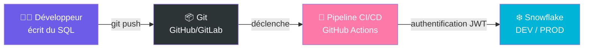
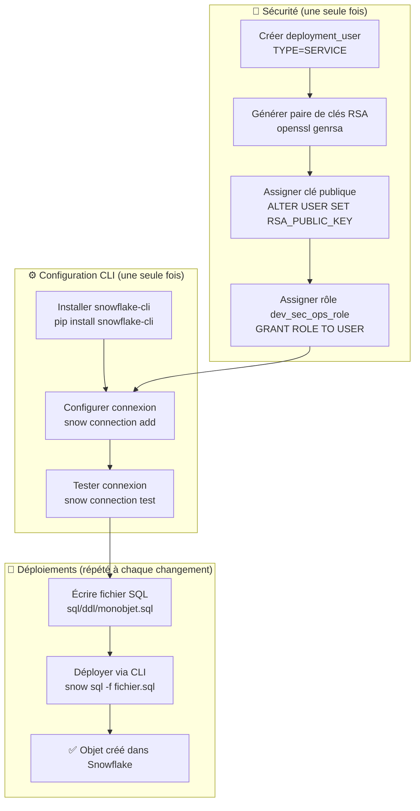
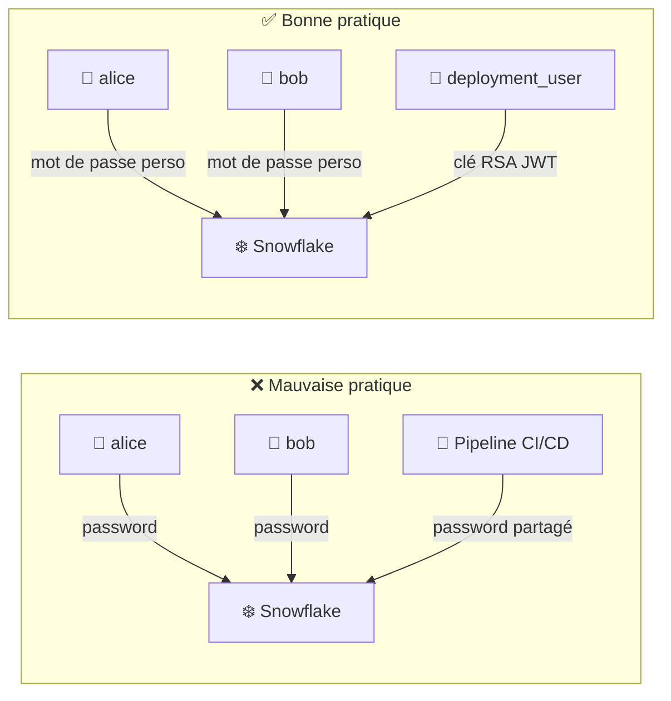
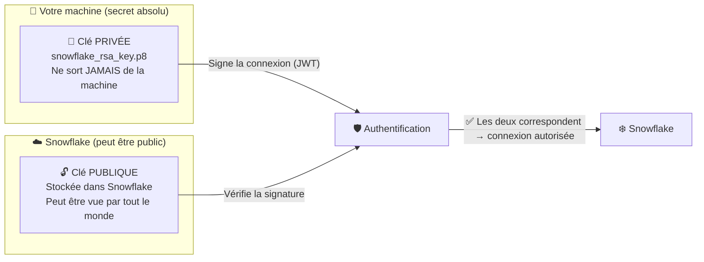
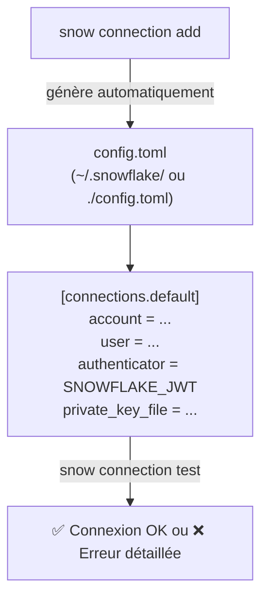
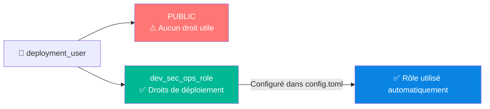
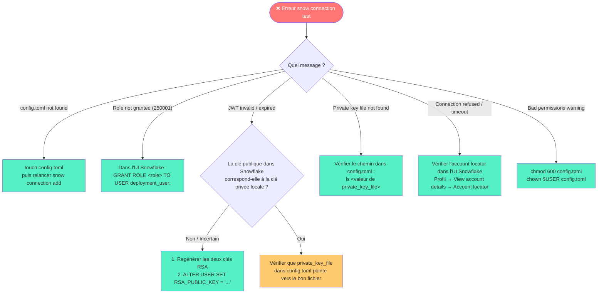
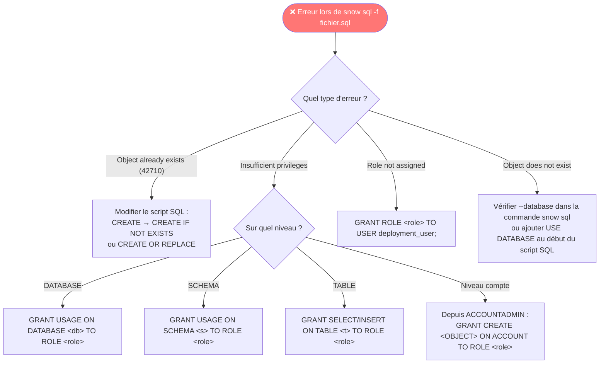
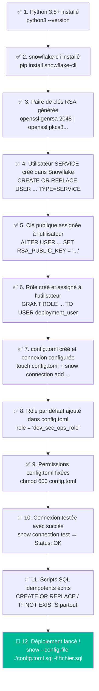
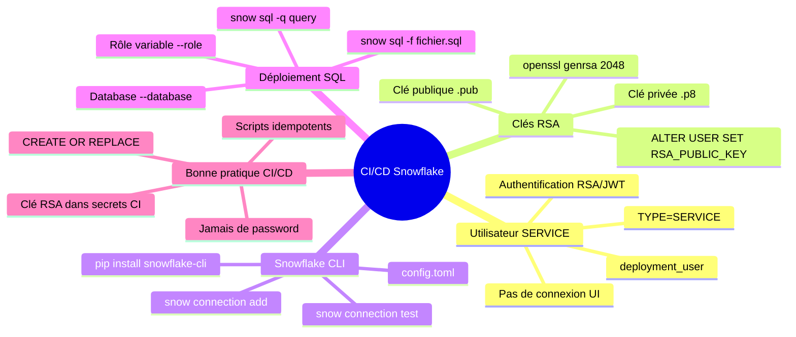

# ❄️ Chapitre 5 — Déploiement automatique avec Snowflake CLI

> **Niveau** : Intermédiaire  
> **Durée estimée** : 3-4h  
> **Prérequis** : Chapitre 4 (RBAC), Python installé, compte Snowflake actif, Git

---

## 📋 Sommaire

1. [Introduction au CI/CD avec Snowflake](#1-introduction-au-cicd-avec-snowflake)
2. [Installation de Snowflake CLI](#2-installation-de-snowflake-cli)
3. [Créer un utilisateur de type SERVICE](#3-créer-un-utilisateur-de-type-service)
4. [Générer une paire de clés RSA](#4-générer-une-paire-de-clés-rsa)
5. [Configurer Snowflake CLI](#5-configurer-snowflake-cli)
6. [Assigner un rôle par défaut à la connexion](#6-assigner-un-rôle-par-défaut-à-la-connexion)
7. [Premier déploiement avec Snowflake CLI](#7-premier-déploiement-avec-snowflake-cli)
8. [Déployer avec un rôle différent du rôle par défaut](#8-déployer-avec-un-rôle-différent-du-rôle-par-défaut)
9. [Code complet et commenté](#9-code-complet-et-commenté)
10. [Cas pratique guidé](#10-cas-pratique-guidé)
11. [Gestion des erreurs courantes](#11-gestion-des-erreurs-courantes)
12. [Méthodologie pas à pas : checklist de déploiement](#12-méthodologie-pas-à-pas--checklist-de-déploiement)
13. [Référence des commandes Snowflake CLI](#13-référence-des-commandes-snowflake-cli)

---

## 1. Introduction au CI/CD avec Snowflake

### Qu'est-ce que le CI/CD ?

**CI/CD** = Continuous Integration / Continuous Deployment (Intégration continue / Déploiement continu)

C'est une pratique DevOps qui consiste à **automatiser** le déploiement de code vers un environnement cible, sans intervention humaine manuelle.



### Pourquoi automatiser les déploiements Snowflake ?

Sans CI/CD, un data engineer doit :
- Se connecter manuellement à Snowflake
- Exécuter les scripts SQL dans le bon ordre
- Mémoriser quels objets ont déjà été créés
- Gérer les différences entre environnements (DEV, STAGING, PROD)

Avec CI/CD :
- ✅ Chaque `git push` sur `main` déclenche automatiquement le déploiement
- ✅ Les scripts SQL sont versionnés et traçables
- ✅ Zéro intervention manuelle → zéro risque d'oubli
- ✅ Même processus reproductible à chaque déploiement

### Architecture complète du chapitre



---

## 2. Installation de Snowflake CLI

### Prérequis

Avant d'installer Snowflake CLI, on vérifie que Python est bien présent sur la machine.
Python est nécessaire car Snowflake CLI est un outil écrit en Python.

```bash
# "python3" = le programme Python version 3
# "--version" = affiche la version installée et quitte
# On a besoin d'au moins Python 3.8 pour que Snowflake CLI fonctionne
python3 --version
# Résultat attendu dans le terminal : Python 3.10.x (ou plus récent)

# "pip" = le gestionnaire de paquets Python (comme un "app store" pour Python)
# "--version" = affiche la version de pip installée
# Si pip n'est pas disponible, installer Python depuis python.org
pip --version
# Résultat attendu : pip 23.x.x from /usr/lib/python3/...
```

### Installation

```bash
# "pip install" = télécharger et installer un paquet Python depuis internet
# "snowflake-cli" = le nom officiel du paquet Snowflake CLI sur PyPI (le dépôt de paquets Python)
# Cette commande installe automatiquement toutes les dépendances nécessaires
pip install snowflake-cli

# Après installation, la commande "snow" devient disponible dans le terminal
# "snow --help" = afficher toutes les commandes disponibles dans Snowflake CLI
# C'est comme taper "help" pour voir ce qu'on peut faire avec l'outil
snow --help
```

> 💡 **Note** : Sur certaines machines, il faudra utiliser `pip3` au lieu de `pip`, ou ajouter `--user` si vous n'avez pas les droits admin :
> ```bash
> # "pip3" = version explicitement pour Python 3 (utile si pip pointe vers Python 2)
> # "--user" = installe dans le dossier personnel de l'utilisateur (pas besoin d'admin)
> pip3 install snowflake-cli --user
> ```

### Vérifier la version installée

```bash
# Affiche le numéro de version de Snowflake CLI installé
# Utile pour vérifier que l'installation a fonctionné et connaître la version
snow --version
# Résultat attendu : Snowflake CLI version: 3.x.x

# Affiche toutes les commandes disponibles organisées par catégorie
# (connection, sql, object, stage, streamlit, etc.)
snow --help
```

### Structure du projet recommandée

Voici comment organiser ses fichiers SQL pour travailler proprement avec Snowflake CLI.
Chaque dossier a un rôle précis :

```
cours_snowflake/
│
├── sql/                        ← Tous les fichiers SQL du projet
│   ├── ddl/                    ← DDL = Data Definition Language
│   │                              Scripts qui CRÉENT des objets (CREATE TABLE, CREATE VIEW...)
│   │                              Ces objets définissent la STRUCTURE de la base
│   │   ├── database.sql        ← Crée la database principale
│   │   ├── file_format.sql     ← Crée les formats de fichiers CSV/JSON
│   │   ├── external_stage.sql  ← Crée les stages (connexion vers S3/Azure/GCS)
│   │   └── raw_tbl.sql         ← Crée les tables de données brutes
│   │
│   ├── dml/                    ← DML = Data Manipulation Language
│   │                              Scripts qui MANIPULENT les données (INSERT, UPDATE, DELETE)
│   │                              Ces scripts remplissent ou modifient les données
│   │
│   └── rbac/                   ← RBAC = Role-Based Access Control
│                                  Scripts de gestion des droits et rôles (voir Chapitre 4)
│       ├── dev_sec_ops_role.sql
│       └── initialisation_application.sql
│
├── config.toml                 ← Fichier de configuration de Snowflake CLI
│                                  Contient les paramètres de connexion (user, account, clé...)
│                                  ⚠️ NE JAMAIS mettre dans git (contient des secrets !)
│
├── snowflake_rsa_key.p8        ← Clé PRIVÉE RSA pour s'authentifier à Snowflake
│                                  ⚠️ JAMAIS dans git ! C'est comme un mot de passe.
│
└── snowflake_rsa_public.pub    ← Clé PUBLIQUE RSA (peut être partagée, elle est dans Snowflake)
```

> ⚠️ **CRITIQUE — Protéger ses secrets** : Les fichiers `snowflake_rsa_key.p8` et `config.toml` contiennent des informations sensibles. Les ajouter au `.gitignore` pour ne JAMAIS les envoyer sur GitHub par accident.

```bash
# ".gitignore" = fichier qui dit à git quels fichiers ignorer
# ">>" = ajouter une ligne à la fin du fichier (sans l'écraser)

# Ignorer tous les fichiers .p8 (clés privées RSA)
echo "*.p8" >> .gitignore

# Ignorer le fichier de config Snowflake CLI (contient le chemin vers la clé privée)
echo "config.toml" >> .gitignore

# Vérifier que le .gitignore a bien été mis à jour
cat .gitignore
```

---

## 3. Créer un utilisateur de type SERVICE

### Concept : l'utilisateur de déploiement

Dans une architecture CI/CD, on ne se connecte **jamais** avec un compte utilisateur personnel.
On crée un compte technique dédié, de type `SERVICE`.



### Différence entre TYPE=PERSON et TYPE=SERVICE

| Propriété | PERSON (défaut) | SERVICE |
|---|---|---|
| Peut se connecter via UI Snowflake | ✅ Oui | ❌ Non |
| Mot de passe requis | Oui | Non |
| Authentification par clé RSA | Optionnel | Recommandé |
| Usage | Humains | Pipelines, outils CI/CD |
| MFA (authentification multifacteur) | Possible | Non applicable |

### Créer l'utilisateur de déploiement

```sql
-- ============================================================
-- On commence toujours par se mettre dans le bon rôle
-- avant de faire des opérations d'administration
-- ============================================================

-- "USE ROLE" = changer de rôle actif pour cette session
-- "accountadmin" = le rôle le plus puissant de Snowflake,
--  le seul qui peut créer des utilisateurs et gérer le compte
USE ROLE accountadmin;


-- ============================================================
-- Création de l'utilisateur de service
-- ============================================================

-- "CREATE OR REPLACE USER" = créer l'utilisateur
--   → Si l'utilisateur n'existe pas encore : le créer
--   → Si l'utilisateur existe déjà : le recréer proprement (sans erreur)
--   C'est ce qu'on appelle une commande "idempotente" : peut être rejouée sans problème

-- "deployment_user" = le nom qu'on choisit pour cet utilisateur technique
--   C'est le nom qui apparaîtra dans les logs de connexion Snowflake

-- "TYPE=SERVICE" = type spécial pour les comptes non-humains (robots, pipelines CI/CD)
--   Un utilisateur SERVICE :
--   - Ne peut PAS se connecter via l'interface web Snowflake
--   - N'a pas besoin de mot de passe
--   - S'authentifie uniquement par clé RSA ou token
--   - Apparaît différemment dans les audits de sécurité
CREATE OR REPLACE USER deployment_user TYPE = SERVICE;


-- ============================================================
-- Vérification après création
-- ============================================================

-- "DESC USER" = afficher toutes les propriétés d'un utilisateur
-- DESC est l'abréviation de DESCRIBE
-- Cette commande affiche un tableau avec toutes les colonnes :
--   NAME          → le nom de l'utilisateur (DEPLOYMENT_USER)
--   TYPE          → doit afficher SERVICE (confirmation de notre TYPE=SERVICE)
--   RSA_PUBLIC_KEY → vide pour l'instant (sera rempli à la section 4)
--   DISABLED      → false (l'utilisateur est actif)
-- Et bien d'autres propriétés...
DESC USER deployment_user;
```

---

## 4. Générer une paire de clés RSA

### Pourquoi des clés RSA et pas un mot de passe ?

Un mot de passe peut être partagé, volé, ou exposé dans des logs. Une **paire de clés RSA** offre une sécurité asymétrique :



**Analogie simple** : c'est comme un cadenas et une clé.
- La **clé publique** = le cadenas (tu peux le montrer à tout le monde, le déposer partout)
- La **clé privée** = la clé du cadenas (seul toi la possèdes, elle ne quitte jamais ta machine)
- Snowflake garde le cadenas. Toi tu gardes la clé. Seul quelqu'un avec la clé peut ouvrir le cadenas.

### Générer la clé privée (format PKCS8)

La commande suivante peut faire peur car elle est longue, mais chaque partie a un rôle précis.

```bash
# Cette commande fait DEUX choses en une grâce au symbole "|" (pipe) :
#   1. openssl genrsa 2048      → génère une clé RSA brute
#   2. openssl pkcs8 ...        → convertit cette clé au bon format pour Snowflake
#
# Le "|" (pipe) = "prend le résultat de la commande à gauche
#                  et l'envoie en entrée à la commande à droite"
#
# Détail de chaque option :
#
#   openssl         → l'outil de cryptographie OpenSSL (standard industrie)
#   genrsa          → sous-commande : "generate RSA key" (générer une clé RSA)
#   2048            → taille de la clé en bits (2048 = standard sécurisé)
#                     Plus c'est grand, plus c'est sécurisé (mais plus lent)
#
#   |               → pipe : envoyer le résultat à la commande suivante
#
#   openssl         → même outil, deuxième utilisation
#   pkcs8           → sous-commande : convertir au format PKCS8
#                     (PKCS8 = standard de format de clé privée, requis par Snowflake)
#   -topk8          → "to PKCS8" = conversion vers le format PKCS8
#   -inform PEM     → "input format PEM" = le format d'entrée est PEM
#                     (PEM = format texte en base64, standard pour les clés)
#   -out snowflake_rsa_key.p8
#                   → fichier de sortie : où sauvegarder la clé privée
#                     ".p8" = extension conventionnelle pour les clés PKCS8
#   -nocrypt        → "no encryption" = ne pas chiffrer la clé avec un mot de passe
#                     Avantage : plus simple pour le CI/CD (pas besoin de taper un mdp)
#                     Inconvénient : si quelqu'un vole le fichier, il a accès direct
#                     → C'est pour ça qu'on protège ce fichier avec chmod 600 ensuite

openssl genrsa 2048 | openssl pkcs8 -topk8 -inform PEM -out snowflake_rsa_key.p8 -nocrypt

# Si la commande réussit : aucun message d'erreur, et le fichier snowflake_rsa_key.p8 est créé
# Pour vérifier que le fichier existe :
ls -la snowflake_rsa_key.p8
```

> ⚠️ **Alternative avec clé chiffrée (production recommandée)** : En supprimant `-nocrypt`, OpenSSL demandera de choisir un mot de passe pour chiffrer la clé. Plus sécurisé, mais il faudra fournir ce mot de passe à chaque connexion.
> ```bash
> # Version AVEC mot de passe (plus sécurisé)
> # OpenSSL demandera de saisir et confirmer un mot de passe
> openssl genrsa 2048 | openssl pkcs8 -topk8 -v2 des3 -inform PEM -out rsa_key.p8
> # "-v2 des3" = utiliser l'algorithme de chiffrement DES3 pour protéger la clé privée
> ```

### Générer la clé publique à partir de la clé privée

```bash
# Cette commande lit la clé PRIVÉE et en extrait la partie PUBLIQUE
#
# Détail de chaque option :
#
#   openssl         → l'outil OpenSSL
#   rsa             → sous-commande pour travailler avec des clés RSA
#   -in snowflake_rsa_key.p8
#                   → "input" = fichier d'entrée : notre clé PRIVÉE générée juste avant
#   -pubout         → "public output" = extraire UNIQUEMENT la partie publique
#                     Sans cette option, openssl sortirait la clé privée complète
#   -out snowflake_rsa_public.pub
#                   → fichier de sortie : où sauvegarder la clé PUBLIQUE
#                     ".pub" = extension conventionnelle pour les clés publiques

openssl rsa -in snowflake_rsa_key.p8 -pubout -out snowflake_rsa_public.pub

# Résultat attendu dans le terminal : "writing RSA key"
# Ce message confirme que la clé publique a bien été extraite et sauvegardée
```

### Protéger les fichiers de clés

```bash
# "chmod" = "change mode" = modifier les permissions d'un fichier
# "600" = code octal de permissions Unix :
#   6 = lecture + écriture pour le PROPRIÉTAIRE du fichier (toi)
#   0 = aucune permission pour le GROUPE
#   0 = aucune permission pour les AUTRES utilisateurs
# Résultat : seul toi peux lire/modifier ce fichier → la clé privée est protégée
chmod 600 snowflake_rsa_key.p8

# "ls" = lister les fichiers
# "-la" = "-l" (format long avec les permissions) + "-a" (afficher les fichiers cachés)
# Vérifier que les permissions sont bien "-rw-------"
# "-rw-------" se lit :
#   - = c'est un fichier (pas un dossier)
#   rw = le propriétaire peut lire (r) et écrire (w)
#   --- = le groupe n'a aucun droit
#   --- = les autres n'ont aucun droit
ls -la snowflake_rsa_key.p8
# Résultat attendu : -rw------- 1 tonnom tongroupe 1704 Oct 12 14:23 snowflake_rsa_key.p8
```

### Assigner la clé publique à l'utilisateur Snowflake

La clé publique a ce format quand on ouvre le fichier `snowflake_rsa_public.pub` :
```
-----BEGIN PUBLIC KEY-----
MIIBIjANBgkqhkiG9w0BAQEFAAOCAQ8AMIIBCgKCAQEAzKZ/Fp1uZi...
... plusieurs lignes de caractères en base64 ...
xwIDAQAB
-----END PUBLIC KEY-----
```

Pour Snowflake, on ne copie **que le contenu** entre les deux lignes BEGIN/END, **sans les lignes de séparation elles-mêmes**.

```bash
# Commande pratique pour extraire UNIQUEMENT le contenu base64 (sans les headers BEGIN/END)
#
# "grep -v" = afficher toutes les lignes SAUF celles qui contiennent le pattern
# "BEGIN\|END" = le pattern : les lignes contenant "BEGIN" ou "END"
# "|" = pipe : envoyer le résultat à la commande suivante
# "tr -d '\n'" = "translate - delete newlines" = supprimer tous les sauts de ligne
#
# Résultat : une seule longue ligne de base64, prête à coller dans le SQL
grep -v "BEGIN\|END" snowflake_rsa_public.pub | tr -d '\n'
```

```sql
-- ============================================================
-- Assigner la clé publique RSA à l'utilisateur dans Snowflake
-- ============================================================

-- "ALTER USER" = modifier les propriétés d'un utilisateur existant
-- "deployment_user" = l'utilisateur qu'on a créé à la section 3
-- "SET RSA_PUBLIC_KEY" = définir (ou remplacer) la clé publique RSA de cet utilisateur
-- La valeur entre quotes = le contenu base64 de la clé publique
--   ⚠️ SANS les lignes "-----BEGIN PUBLIC KEY-----" et "-----END PUBLIC KEY-----"
--   ⚠️ Tout sur UNE SEULE ligne (pas de sauts de ligne dans la valeur SQL)
--   ⚠️ Remplacer par VOTRE clé publique générée avec openssl

ALTER USER deployment_user SET RSA_PUBLIC_KEY = 'MIIBIjANBgkqhkiG9w0BAQEFAAOCAQ8AMIIBCgKCAQEAzKZ/...VotreClePublique...IDAQAB';


-- ============================================================
-- Vérification : la clé a-t-elle bien été enregistrée ?
-- ============================================================

-- "DESC USER" = afficher toutes les propriétés de l'utilisateur
-- Dans le résultat, chercher ces deux lignes importantes :
--   RSA_PUBLIC_KEY     → doit maintenant afficher le début de votre clé (MIIBIjAN...)
--   RSA_PUBLIC_KEY_FP  → "fingerprint" = une signature courte de la clé
--                        Format : SHA256:xxxxxxxxxxxx=
--                        Utile pour vérifier que c'est bien la bonne clé sans afficher toute la clé
DESC USER deployment_user;
```

> ⚠️ **Erreur fréquente** : Si vous copiez les lignes `-----BEGIN PUBLIC KEY-----` dans la valeur SQL, Snowflake retournera une erreur. Ne copier **que** le contenu base64 entre ces deux lignes.

---

## 5. Configurer Snowflake CLI

### Vue d'ensemble de la configuration

Snowflake CLI utilise un fichier de configuration `config.toml`.
Le format TOML (Tom's Obvious Minimal Language) est un format de fichier de configuration lisible par les humains, organisé en sections entre crochets `[section]`.



### Trouver l'identifiant de votre compte Snowflake

Avant de configurer la CLI, vous avez besoin de l'identifiant de votre compte Snowflake.

Dans l'UI Snowflake : cliquer sur votre **profil (en bas à gauche)** → cliquer sur le **nom du compte** → "View account details"

```
Account identifier :  JCHLZDA-UCB30964      ← format long (org-account)
Account locator    :  ONB31943              ← format court ← C'EST CELUI-CI qu'on utilise pour la CLI
Account/Server URL :  JCHLZDA-UCB30964.snowflakecomputing.com
```

> 💡 **Quelle valeur utiliser ?** Pour la CLI Snowflake, utiliser le **Account locator** (format court, ex: `ONB31943`).

### Méthode 1 : Configuration interactive (pour usage local, la plus simple)

```bash
# "snow connection add" = ajouter une nouvelle connexion à Snowflake dans la CLI
# En mode interactif, l'outil pose des questions une par une
# Il suffit de répondre à chacune et d'appuyer sur Entrée
# (laisser vide = appuyer sur Entrée sans rien taper = valeur par défaut)

snow connection add

# L'outil va poser ces questions dans l'ordre :

# Enter connection name: default
#   → Le nom de cette connexion (comme un surnom)
#   → "default" = connexion utilisée quand on ne précise pas de connexion
#   → On peut avoir plusieurs connexions : "dev", "prod", "staging"...

# Enter account: ONB31943
#   → L'Account locator de votre compte Snowflake (trouvé à l'étape précédente)
#   → Format court, sans ".snowflakecomputing.com"

# Enter user: deployment_user
#   → Le nom de l'utilisateur SERVICE créé à la section 3

# Enter password: (appuyer sur Entrée sans rien taper)
#   → On n'utilise PAS de mot de passe, on utilise une clé RSA
#   → Laisser vide

# Enter role: (appuyer sur Entrée sans rien taper)
#   → On configurera le rôle plus tard (section 6)
#   → Laisser vide pour l'instant

# Enter warehouse: (appuyer sur Entrée sans rien taper)
# Enter database: (appuyer sur Entrée sans rien taper)
# Enter schema: (appuyer sur Entrée sans rien taper)
# Enter host: (appuyer sur Entrée sans rien taper)
# Enter port: (appuyer sur Entrée sans rien taper)
# Enter region: (appuyer sur Entrée sans rien taper)
#   → Tout laisser vide, pas nécessaire pour ce cours

# Enter authenticator: SNOWFLAKE_JWT
#   → Le TYPE d'authentification qu'on utilise
#   → "SNOWFLAKE_JWT" = authentification par clé RSA (JWT = JSON Web Token)
#   → C'est ce qui permet de se connecter SANS mot de passe
#   → ⚠️ Taper exactement "SNOWFLAKE_JWT" (en majuscules)

# Enter workload identity provider: (appuyer sur Entrée sans rien taper)
#   → Laisser vide

# Enter private key file: /chemin/complet/vers/snowflake_rsa_key.p8
#   → Le chemin ABSOLU vers votre fichier de clé privée
#   → Exemple sur Mac : /Users/tonnom/projets/cours_snowflake/snowflake_rsa_key.p8
#   → Exemple sur Linux : /home/tonnom/cours_snowflake/snowflake_rsa_key.p8
#   → Pour trouver le chemin absolu : dans le terminal, taper "pwd" dans le dossier du projet

# Enter token file path: (appuyer sur Entrée sans rien taper)
#   → Laisser vide
```

### Méthode 2 : Configuration via script (recommandée pour CI/CD, tout en une ligne)

Cette méthode évite les questions interactives. Parfaite pour automatiser la configuration.

```bash
# Cette commande fait exactement la même chose que la méthode interactive,
# mais tout est précisé en une seule commande (pas de questions/réponses)
#
# Le "\" en fin de ligne = continuation de la commande à la ligne suivante
# C'est juste pour la lisibilité, la commande est en réalité sur une seule ligne
#
# Décryptage de chaque option :

snow \
  --config-file ./config.toml \
  # "--config-file" = quel fichier de config utiliser et où le créer
  # "./config.toml" = dans le dossier COURANT (là où on tape la commande)
  # Si on ne le précise pas, snow utilise ~/.snowflake/config.toml (dossier global)
  # Utiliser un config.toml LOCAL au projet est une bonne pratique

  connection add \
  # "connection add" = ajouter une connexion

  --connection-name default \
  # "--connection-name" = nom de cette connexion (comme un label)
  # "default" = connexion utilisée par défaut quand on ne précise rien

  --user deployment_user \
  # "--user" = nom de l'utilisateur Snowflake qui se connecte

  --authenticator SNOWFLAKE_JWT \
  # "--authenticator" = méthode d'authentification
  # "SNOWFLAKE_JWT" = utiliser une clé RSA (JWT = JSON Web Token)
  # C'est le standard pour les connexions programmatiques sécurisées

  --private-key ./snowflake_rsa_key.p8 \
  # "--private-key" = chemin vers le fichier de clé PRIVÉE RSA
  # "./" = dans le dossier courant
  # En production/CI-CD on utilisera un chemin absolu ou une variable d'environnement

  --account ONB31943 \
  # "--account" = l'Account locator de votre compte Snowflake
  # Remplacer ONB31943 par VOTRE account locator (trouvé dans l'UI Snowflake)

  --no-interactive
  # "--no-interactive" = ne pas poser de questions, utiliser les valeurs par défaut pour tout le reste
  # Indispensable pour les pipelines CI/CD qui tournent de façon automatique
```

> ⚠️ **Erreur `File './config.toml' does not exist`** : snow a besoin que le fichier existe déjà avant de pouvoir y écrire. Créer le fichier vide d'abord :
> ```bash
> # "touch" = créer un fichier vide (ou mettre à jour sa date si il existe déjà)
> touch config.toml
> ```

### Le fichier config.toml généré — ligne par ligne

Après avoir lancé `snow connection add`, le fichier `config.toml` ressemblera à ceci.
Voici une explication de chaque ligne :

```toml
# ============================================================
# SECTION [cli] : paramètres généraux de Snowflake CLI
# ============================================================
[cli]
# "ignore_new_version_warning" : afficher ou non les messages "une nouvelle version est disponible"
# "false" = afficher le warning (conseillé pour rester à jour)
# "true" = masquer le warning (utile dans les pipelines CI/CD pour des logs plus propres)
ignore_new_version_warning = false

# ============================================================
# SECTION [cli.logs] : paramètres de journalisation (logs)
# ============================================================
[cli.logs]
# "save_logs" = sauvegarder les logs dans un fichier (true) ou non (false)
save_logs = true

# "path" = où sauvegarder les fichiers de log
# Utile pour débugger en cas de problème de connexion
path = "/Users/user/Library/Application Support/snowflake/logs"

# "level" = niveau de détail des logs
# "info" = logs informatifs (standard)
# Autres valeurs possibles : "debug" (très verbeux), "warning", "error"
level = "info"

# ============================================================
# SECTION [connections.default] : paramètres de connexion
# "default" est le NOM de cette connexion
# On peut avoir plusieurs connexions : [connections.dev], [connections.prod]...
# ============================================================
[connections.default]

# "account" = l'Account locator de votre compte Snowflake
# C'est l'identifiant court (ex: ONB31943), pas l'URL complète
account = "ONB31943"

# "user" = le nom de l'utilisateur Snowflake qui se connecte
# C'est l'utilisateur SERVICE créé à la section 3
user = "deployment_user"

# "authenticator" = méthode d'authentification utilisée pour se connecter
# "SNOWFLAKE_JWT" = authentification par clé RSA (JSON Web Token)
# Cette méthode ne nécessite pas de mot de passe
authenticator = "SNOWFLAKE_JWT"

# "private_key_file" = chemin vers le fichier de clé PRIVÉE RSA
# C'est ce fichier qui prouve l'identité lors de la connexion
# ⚠️ Ce chemin doit pointer vers un fichier .p8 qui EXISTE sur votre machine
private_key_file = "./snowflake_rsa_key.p8"

# "role" = le rôle Snowflake à utiliser par défaut pour cette connexion
# Décommenter et remplir après avoir assigné le rôle (section 6)
# role = "dev_sec_ops_role"
```

### Tester la connexion

```bash
# "snow connection test" = tenter une connexion réelle à Snowflake et afficher le résultat
# Snow va utiliser la connexion "default" du config.toml par défaut
snow connection test

# Si vous avez un config.toml LOCAL (pas dans ~/.snowflake/) :
# "--config-file" = préciser quel fichier de config utiliser
snow --config-file ./config.toml connection test

# ✅ Résultat si tout fonctionne :
# +--------------------+-----------------------------------------------+
# | key                | value                                         |
# |--------------------|-----------------------------------------------|
# | Connection name    | default           ← nom de la connexion       |
# | Status             | OK                ← ✅ connexion réussie      |
# | Host               | ONB31943.snowflakecomputing.com               |
# | Account            | ONB31943          ← votre account locator     |
# | User               | deployment_user   ← l'utilisateur connecté    |
# | Role               | PUBLIC            ← rôle actif (pour l'instant PUBLIC)
# | Database           | not set           ← pas de database par défaut
# | Warehouse          | not set           ← pas de warehouse par défaut
# +--------------------+-----------------------------------------------+
```

> ⚠️ **Warning courant** : `UserWarning: Bad owner or permissions on config.toml`
> Ce message signifie que le fichier config.toml est lisible par d'autres utilisateurs du système.
> Ce n'est pas bloquant, mais c'est un risque de sécurité. Pour corriger :
> ```bash
> # "chown $USER" = changer le propriétaire du fichier pour l'utilisateur courant
> # "$USER" = variable d'environnement = votre nom d'utilisateur système
> chown $USER "config.toml"
>
> # "chmod 0600" = permissions : lecture+écriture pour le propriétaire seulement
> # 0 = aucun droit pour le groupe et les autres
> chmod 0600 "config.toml"
> ```

---

## 6. Assigner un rôle par défaut à la connexion

### Pourquoi le rôle actuel est `PUBLIC` ?

Quand `deployment_user` se connecte, il utilise automatiquement le rôle `PUBLIC`.
`PUBLIC` est le rôle par défaut de Snowflake assigné à tous les utilisateurs — il n'a pratiquement aucun droit.

Il faut faire deux choses :
1. Dans **Snowflake** → assigner le rôle `dev_sec_ops_role` à `deployment_user`
2. Dans **config.toml** → dire à la CLI d'utiliser ce rôle par défaut



### Étape 1 : Assigner le rôle dans Snowflake

```sql
-- ============================================================
-- Cette étape s'exécute dans l'UI Snowflake (Worksheets)
-- Elle DOIT être faite par accountadmin
-- ============================================================

-- Se mettre en tant qu'administrateur du compte
USE ROLE accountadmin;


-- "GRANT ROLE ... TO USER ..." = donner le droit d'utiliser un rôle à un utilisateur
-- C'est différent de "GRANT privilege TO ROLE" (qui donne des droits sur des objets)
-- Ici on dit : "deployment_user a maintenant le droit d'UTILISER le rôle dev_sec_ops_role"
--
-- Sans ce GRANT :
--   → deployment_user essaie d'utiliser dev_sec_ops_role
--   → Snowflake répond : erreur 250001 "Role not granted to this user"
--
-- Avec ce GRANT :
--   → deployment_user peut maintenant "USE ROLE dev_sec_ops_role" ou le configurer dans CLI
GRANT ROLE dev_sec_ops_role TO USER deployment_user;


-- Vérification : lister tous les rôles assignés à deployment_user
-- Dans le résultat, on doit voir "DEV_SEC_OPS_ROLE" dans la colonne "role"
SHOW GRANTS TO USER deployment_user;
```

### Étape 2 : Ajouter le rôle dans config.toml

```toml
# Ouvrir config.toml et ajouter la ligne "role" dans la section [connections.default]
# Avant cette modification, la section ressemblait à ceci :
#
# [connections.default]
# account = "ONB31943"
# user = "deployment_user"
# authenticator = "SNOWFLAKE_JWT"
# private_key_file = "./snowflake_rsa_key.p8"
#
# Après la modification :

[connections.default]
account = "ONB31943"
user = "deployment_user"
authenticator = "SNOWFLAKE_JWT"
private_key_file = "./snowflake_rsa_key.p8"
role = "dev_sec_ops_role"
# ↑ Cette ligne dit à snow CLI :
#   "À chaque connexion, utiliser automatiquement le rôle dev_sec_ops_role"
#   Sans cette ligne : Snowflake utilise PUBLIC (aucun droit)
#   Avec cette ligne : Snowflake utilise dev_sec_ops_role (droits de déploiement)
```

### Étape 3 : Vérifier que le rôle est bien actif

```bash
# Relancer le test de connexion
# Cette fois, la colonne "Role" doit afficher "DEV_SEC_OPS_ROLE" (et non plus "PUBLIC")
snow --config-file ./config.toml connection test

# ✅ Résultat attendu maintenant :
# | Role     | DEV_SEC_OPS_ROLE |   ← ✅ Le bon rôle est actif !
```

---

## 7. Premier déploiement avec Snowflake CLI

### La commande principale : `snow sql`

```bash
# "snow sql --help" = afficher l'aide complète de la sous-commande "sql"
# Permet de voir toutes les options disponibles avec leurs descriptions
snow sql --help

# Il y a deux façons d'utiliser snow sql :
#
# Mode fichier (-f) : exécute TOUT le contenu d'un fichier .sql
#   → Idéal pour déployer des scripts complets
#   → Les instructions sont exécutées dans l'ordre du fichier
#
# Mode inline (-q) : exécute une seule requête SQL tapée directement
#   → Idéal pour des tests rapides ou des vérifications
#   → La requête est entre guillemets dans la commande
```

### Déployer un fichier SQL

```bash
# Commande complète pour déployer un fichier SQL via Snowflake CLI
#
# Détail de chaque partie :
#
#   snow
#   → le programme Snowflake CLI
#
#   --config-file ./config.toml
#   → "utilise CE fichier de config" (pas le config global de ~/.snowflake/)
#   → Toujours préciser si votre config.toml est dans le dossier du projet
#
#   sql
#   → sous-commande "sql" : on veut exécuter du SQL
#
#   -f sql/rbac/initialisation_application.sql
#   → "-f" est l'abréviation de "--filename"
#   → "exécute le contenu de CE fichier SQL"
#   → Le chemin est relatif au dossier où on tape la commande

snow --config-file ./config.toml sql -f sql/rbac/initialisation_application.sql
```

### Exemple de fichier à déployer : `initialisation_application.sql`

Ce fichier crée toute l'infrastructure de l'application (database, schémas, rôles).
Chaque ligne est expliquée :

```sql
-- ============================================================
-- FICHIER : sql/rbac/initialisation_application.sql
-- ============================================================
-- Ce script initialise la structure complète de l'application health_app_2
-- Il est conçu pour être exécuté par deployment_user avec le rôle dev_sec_ops_role
-- Il peut être rejoué sans erreur grâce aux clauses IF NOT EXISTS
-- ============================================================


-- ──────────────────────────────────────────────────────────
-- PARTIE 1 : Créer la base de données
-- ──────────────────────────────────────────────────────────

-- "CREATE DATABASE" = créer une nouvelle base de données dans Snowflake
-- "IF NOT EXISTS" = ne rien faire (sans erreur) si la database existe déjà
--   Sans IF NOT EXISTS : erreur si la database existe → le script s'arrête
--   Avec IF NOT EXISTS : le script continue → comportement "idempotent"
-- "HEALTH_APP_2" = nom de la database (convention : majuscules pour les objets Snowflake)
CREATE DATABASE IF NOT EXISTS HEALTH_APP_2;


-- ──────────────────────────────────────────────────────────
-- PARTIE 2 : Créer les schémas
-- Un schéma = un "dossier" logique à l'intérieur d'une database
-- Il permet d'organiser les tables par thème ou par zone de traitement
-- ──────────────────────────────────────────────────────────

-- Schéma RAW = zone d'atterrissage des données brutes
-- Les données arrivent ici telles quelles, sans transformation
-- (ex: fichiers CSV uploadés depuis S3)
CREATE SCHEMA IF NOT EXISTS HEALTH_APP_2.RAW;

-- Schéma STAGING = zone de transformation
-- Les données du schéma RAW sont nettoyées et transformées ici
-- (ex: colonnes renommées, types corrigés, doublons supprimés)
CREATE SCHEMA IF NOT EXISTS HEALTH_APP_2.STAGING;


-- ──────────────────────────────────────────────────────────
-- PARTIE 3 : Créer les rôles métier
-- ──────────────────────────────────────────────────────────

-- "CREATE ROLE IF NOT EXISTS" = créer le rôle seulement s'il n'existe pas encore
-- Si on utilise CREATE ROLE sans IF NOT EXISTS et que le rôle existe → erreur 42710

-- devops_role = rôle pour l'équipe DevOps
-- Aura tous les droits sur les schémas (CREATE TABLE, MODIFY, etc.)
CREATE ROLE IF NOT EXISTS devops_role;

-- application_role = rôle pour les processus applicatifs (pipelines de données)
-- Aura SELECT + INSERT sur les tables
CREATE ROLE IF NOT EXISTS application_role;

-- engineer_role = rôle pour les data engineers
-- Aura uniquement SELECT (lecture seule) pour analyser les données
CREATE ROLE IF NOT EXISTS engineer_role;


-- ──────────────────────────────────────────────────────────
-- PARTIE 4 : Donner les droits aux rôles
-- ──────────────────────────────────────────────────────────

-- Rappel : pour accéder à des tables dans Snowflake, il faut OBLIGATOIREMENT :
--   1. USAGE sur la DATABASE (pour "entrer" dans la database)
--   2. USAGE sur le SCHEMA (pour "entrer" dans le schéma)
--   3. Le droit sur la TABLE (SELECT, INSERT, etc.)
-- Si l'un de ces trois niveaux manque → erreur "Insufficient privileges"

-- Donner le droit d'accéder à la database au rôle devops_role
-- Sans ce GRANT, même avec ALL sur les schémas, devops_role ne peut pas accéder à la database
GRANT USAGE ON DATABASE HEALTH_APP_2 TO ROLE DEVOPS_ROLE;

-- "GRANT ALL ON SCHEMA" = donner TOUS les droits sur ce schéma
-- ALL inclut : USAGE + CREATE TABLE + CREATE VIEW + CREATE TASK + CREATE STREAM + MODIFY + MONITOR
-- On donne ALL à devops_role car c'est lui qui va créer et gérer tous les objets
GRANT ALL ON SCHEMA HEALTH_APP_2.RAW TO ROLE devops_role;
GRANT ALL ON SCHEMA HEALTH_APP_2.STAGING TO ROLE devops_role;


-- ──────────────────────────────────────────────────────────
-- PARTIE 5 : Assigner les rôles à deployment_user
-- ──────────────────────────────────────────────────────────

-- "GRANT ROLE ... TO USER ..." = permettre à deployment_user d'utiliser ces rôles
-- Nécessaire pour que le pipeline CI/CD puisse utiliser "--role devops_role" dans snow sql
-- Sans ces GRANTs → erreur lors du déploiement avec --role
GRANT ROLE devops_role TO USER deployment_user;
GRANT ROLE application_role TO USER deployment_user;
```

### Résultats d'un déploiement

**✅ Succès** : chaque instruction SQL affiche son résultat :
```
CREATE DATABASE HEALTH_APP_2;
+--------------------------------------------------+
| status                                           |
|--------------------------------------------------|
| Database HEALTH_APP_2 successfully created.      |
+--------------------------------------------------+

GRANT ALL ON SCHEMA HEALTH_APP_2.RAW TO ROLE devops_role;
+----------------------------------+
| status                           |
|----------------------------------|
| Statement executed successfully. |
+----------------------------------+
```

**❌ Erreur** si on oublie `IF NOT EXISTS` :
```
CREATE ROLE engineer_role;
Error
002002 (42710): SQL compilation error:
Object 'ENGINEER_ROLE' already exists.
```

> 💡 **Règle d'or** : Toujours écrire des scripts **idempotents** — c'est-à-dire qui peuvent être rejoués plusieurs fois sans erreur et sans effet indésirable.

```sql
-- ❌ NON IDEMPOTENT : plante si l'objet existe déjà
CREATE ROLE engineer_role;
CREATE DATABASE HEALTH_APP_2;

-- ✅ IDEMPOTENT option 1 : ne fait rien si l'objet existe déjà
CREATE ROLE IF NOT EXISTS engineer_role;
CREATE DATABASE IF NOT EXISTS HEALTH_APP_2;

-- ✅ IDEMPOTENT option 2 : recrée l'objet si nécessaire (attention : perd les données pour les tables !)
CREATE OR REPLACE ROLE engineer_role;
CREATE OR REPLACE DATABASE HEALTH_APP_2;
```

---

## 8. Déployer avec un rôle différent du rôle par défaut

### Le problème : un rôle ne peut pas tout faire

Dans notre architecture RBAC, chaque rôle a ses responsabilités :
- `dev_sec_ops_role` → crée les databases, gère les rôles (niveau compte)
- `devops_role` → crée les tables, file formats, stages (niveau schéma)

Quand on déploie un file format, on doit utiliser `devops_role` (pas le rôle par défaut `dev_sec_ops_role`).

```bash
# Déployer un fichier SQL en CHANGEANT le rôle pour cette commande spécifique
#
# Nouvelles options par rapport à avant :
#
#   --role devops_role
#   → "Pour CETTE commande seulement, utiliser le rôle devops_role"
#   → Cela ÉCRASE temporairement le rôle défini dans config.toml
#   → Après la commande, le rôle par défaut de config.toml reprend le dessus
#   → Utiliser quand l'objet à créer nécessite un rôle différent du rôle par défaut
#
#   --database health_app_2
#   → "Utiliser cette database comme contexte d'exécution"
#   → Équivaut à écrire "USE DATABASE health_app_2;" au début du fichier SQL
#   → Pratique pour ne pas avoir à écrire le nom de la database dans chaque fichier SQL

snow --config-file ./config.toml sql \
  --role devops_role \
  --database health_app_2 \
  -f sql/ddl/file_format.sql
```

### Exemple concret : déployer un File Format

Un **File Format** dans Snowflake = une définition qui dit "comment lire les fichiers".
Il faut indiquer le type (CSV, JSON...), le séparateur, le format des dates, etc.

```sql
-- ============================================================
-- FICHIER : sql/ddl/file_format.sql
-- ============================================================
-- Définit le format des fichiers CSV utilisés dans ce projet
-- ⚠️ Ce script doit être exécuté avec le rôle devops_role
--    (qui a le droit CREATE sur le schéma raw)
-- ============================================================


-- "CREATE OR ALTER FILE FORMAT" = créer le format de fichier s'il n'existe pas,
--   ou modifier ses propriétés s'il existe déjà
--   Équivalent à CREATE OR REPLACE mais plus sécurisé (ne supprime pas l'objet)

-- "raw.csv_file" = nom complet de l'objet : schéma.nom
--   "raw" = le schéma dans lequel créer ce format (défini dans le contexte de la database)
--   "csv_file" = le nom qu'on donne à ce format de fichier

CREATE OR ALTER FILE FORMAT raw.csv_file

  -- "TYPE = CSV" = les fichiers à lire sont au format CSV (texte avec séparateurs)
  -- Autres valeurs possibles : JSON, PARQUET, AVRO, ORC, XML
  TYPE = CSV

  -- "FIELD_DELIMITER = '|'" = le caractère qui sépare les colonnes dans le CSV
  -- Ici on utilise le pipe "|" (pas la virgule "," qui est le défaut)
  -- Exemple de ligne dans le fichier : "ALICE|MARTIN|1990-01-15|Paris"
  FIELD_DELIMITER = '|'

  -- "TIMESTAMP_FORMAT = ..." = comment interpréter les colonnes de type date/heure
  -- 'YYYYMMDD-HH24:MI:SS:FF3' se lit :
  --   YYYY = année sur 4 chiffres (ex: 2024)
  --   MM   = mois sur 2 chiffres (ex: 01 pour janvier)
  --   DD   = jour sur 2 chiffres (ex: 15)
  --   -    = tiret littéral
  --   HH24 = heures en format 24h (ex: 14 pour 14h)
  --   :MI  = minutes (ex: 30)
  --   :SS  = secondes (ex: 45)
  --   :FF3 = millisecondes sur 3 chiffres (ex: 123)
  -- Exemple de timestamp dans le fichier : "20240115-14:30:45:123"
  TIMESTAMP_FORMAT = 'YYYYMMDD-HH24:MI:SS:FF3';


-- "DESC FILE FORMAT" = afficher les propriétés du format de fichier qu'on vient de créer
-- Permet de vérifier que toutes les propriétés ont bien été enregistrées
-- (TYPE, FIELD_DELIMITER, TIMESTAMP_FORMAT, et toutes les autres propriétés par défaut)
DESC FILE FORMAT raw.csv_file;
```

```bash
# Déploiement : utiliser devops_role car c'est lui qui a le droit CREATE sur le schéma raw
# Préciser la database pour que Snowflake sache dans quel contexte chercher le schéma "raw"
snow --config-file ./config.toml sql \
  --role devops_role \
  --database health_app_2 \
  -f sql/ddl/file_format.sql

# ✅ Résultat attendu :
# CREATE OR ALTER FILE FORMAT raw.csv_file
# TYPE=CSV
# FIELD_DELIMITER='|'
# TIMESTAMP_FORMAT='YYYYMMDD-HH24:MI:SS:FF3';
# (suivi du résultat de DESC FILE FORMAT : tableau avec toutes les propriétés)
```

### Et pour supprimer et recréer proprement ?

```bash
# Parfois on veut supprimer un objet pour le recréer proprement
# (test, modification majeure, etc.)

# Supprimer le file format avec une query inline (-q)
# "--role devops_role" = utiliser le rôle qui a les droits sur ce schéma
# "--database health_app_2" = contexte de la database
# "-q" = query inline (une seule commande SQL, entre guillemets)
snow --config-file ./config.toml sql \
  --role devops_role \
  --database health_app_2 \
  -q "drop file format raw.csv_file"

# ✅ Résultat attendu :
# drop file format raw.csv_file
# +------------------------------------+
# | status                             |
# |------------------------------------|
# | CSV_FILE successfully dropped.     |
# +------------------------------------+

# Puis redéployer depuis le fichier pour recréer proprement
snow --config-file ./config.toml sql \
  --role devops_role \
  --database health_app_2 \
  -f sql/ddl/file_format.sql
```

---

## 9. Code complet et commenté

### Script complet : setup du deployment_user

```sql
-- ================================================================
-- FICHIER : sql/rbac/setup_deployment_user.sql
-- ================================================================
-- OBJECTIF   : Créer et configurer l'utilisateur de déploiement CI/CD
-- QUI EXÉCUTE: Administrateur (accountadmin) via l'UI Snowflake
-- QUAND      : Une seule fois, lors de la mise en place initiale du projet
-- PRÉREQUIS  : Avoir générés les clés RSA avec openssl (section 4)
-- ================================================================


-- ── Étape 0 : Se positionner avec le bon rôle ──────────────────
-- Toutes les opérations suivantes nécessitent accountadmin
USE ROLE accountadmin;


-- ── Étape 1 : Créer l'utilisateur de service ───────────────────

-- TYPE=SERVICE = pas de connexion UI, authentification programmatique uniquement
-- CREATE OR REPLACE = si l'utilisateur existe déjà, le recréer sans erreur (idempotent)
CREATE OR REPLACE USER deployment_user TYPE = SERVICE;


-- ── Étape 2 : Assigner la clé publique RSA ─────────────────────

-- Commande pour extraire la clé publique (à faire dans le terminal) :
--   grep -v "BEGIN\|END" snowflake_rsa_public.pub | tr -d '\n'
-- Copier le résultat et le coller à la place de 'VotreClePubliqueIci'

-- RSA_PUBLIC_KEY = la partie PUBLIQUE de votre paire de clés RSA
--   → C'est ce que Snowflake utilise pour VÉRIFIER que c'est bien vous qui vous connectez
--   → Copier UNIQUEMENT le contenu entre les lignes -----BEGIN/END PUBLIC KEY-----
--   → Tout sur UNE seule ligne SQL (pas de sauts de ligne dans la valeur)
ALTER USER deployment_user SET RSA_PUBLIC_KEY = 'MIIBIjANBgkqhkiG...VotreClePubliqueIci...IDAQAB';


-- ── Étape 3 : Assigner les rôles nécessaires ───────────────────

-- GRANT ROLE = donner le droit d'UTILISER ce rôle à cet utilisateur
-- Sans ce GRANT : si config.toml précise role="dev_sec_ops_role" → erreur à la connexion
-- dev_sec_ops_role = le rôle principal du pipeline (peut créer databases, rôles, etc.)
GRANT ROLE dev_sec_ops_role TO USER deployment_user;


-- ── Étape 4 : Vérifications finales ────────────────────────────

-- Lister TOUS les rôles assignés à deployment_user
-- Dans le résultat : chercher DEV_SEC_OPS_ROLE dans la colonne "role"
SHOW GRANTS TO USER deployment_user;

-- Afficher toutes les propriétés de deployment_user
-- Vérifications clés :
--   TYPE              → doit être "SERVICE"
--   RSA_PUBLIC_KEY    → doit afficher le début de votre clé (MIIBIjAN...)
--   RSA_PUBLIC_KEY_FP → doit afficher un fingerprint SHA256:...
--   DISABLED          → doit être "false" (l'utilisateur est actif)
DESC USER deployment_user;
```

### Script shell de déploiement complet

```bash
#!/bin/bash
# ================================================================
# FICHIER : deploy.sh
# ================================================================
# OBJECTIF : Déployer l'application health_app_2 sur Snowflake
# USAGE    : ./deploy.sh  (depuis le dossier racine du projet)
# PRÉREQUIS: - snow CLI installé (pip install snowflake-cli)
#            - config.toml présent et configuré
#            - snowflake_rsa_key.p8 présent
#            - deployment_user créé et configuré dans Snowflake
# ================================================================

# "set -e" = arrêter le script IMMÉDIATEMENT si une commande échoue
# Sans "set -e" : le script continue même si snow sql retourne une erreur
# Avec "set -e" : si une étape échoue, tout s'arrête → évite des déploiements partiels
set -e

echo "🚀 Début du déploiement health_app_2"
echo "======================================"


# ── ÉTAPE 1 : Tester la connexion avant de commencer ──────────
echo ""
echo "📡 Étape 1/4 : Test de connexion à Snowflake..."

# On teste la connexion AVANT de commencer le déploiement
# Si la connexion échoue, "set -e" arrêtera le script ici
# → Évite de commencer un déploiement partiel
snow --config-file ./config.toml connection test

echo "✅ Connexion OK !"


# ── ÉTAPE 2 : Initialisation (database, schémas, rôles) ───────
echo ""
echo "🏗️  Étape 2/4 : Initialisation de l'infrastructure..."

# Ce script crée la database, les schémas, les rôles et les droits de base
# Rôle utilisé : dev_sec_ops_role (celui du config.toml par défaut)
# Ce rôle peut créer des databases et des rôles au niveau du compte
snow --config-file ./config.toml sql \
  -f sql/rbac/initialisation_application.sql

echo "✅ Infrastructure créée !"


# ── ÉTAPE 3 : Création des objets DDL (file formats, tables...) ──
echo ""
echo "📋 Étape 3/4 : Création des objets de données..."

# Déployer le file format CSV
# --role devops_role  : ce rôle a ALL sur les schémas → peut créer des file formats
# --database health_app_2 : contexte de la database (pour que "raw.csv_file" soit résolu)
snow --config-file ./config.toml sql \
  --role devops_role \
  --database health_app_2 \
  -f sql/ddl/file_format.sql

echo "   ✅ File formats créés"

# Déployer les stages (connexions vers le stockage cloud S3/Azure/GCS)
# Même logique : --role devops_role car il a les droits sur le schéma
snow --config-file ./config.toml sql \
  --role devops_role \
  --database health_app_2 \
  -f sql/ddl/external_stage.sql

echo "   ✅ Stages créés"

# Déployer les tables de données brutes
snow --config-file ./config.toml sql \
  --role devops_role \
  --database health_app_2 \
  -f sql/ddl/raw_tbl.sql

echo "   ✅ Tables créées"


# ── ÉTAPE 4 : Message de fin ───────────────────────────────────
echo ""
echo "======================================"
echo "✅ Déploiement terminé avec succès !"
echo "   Database : HEALTH_APP_2"
echo "   Schémas  : RAW, STAGING"
echo "   Rôles    : devops_role, application_role, engineer_role"
```

---

## 10. Cas pratique guidé

> **Scénario** : Tu rejoins l'équipe data d'une startup `expense_tracker`. Mets en place le pipeline CI/CD pour déployer l'application Snowflake depuis ton poste de travail.

### Étape 1 : Préparer l'environnement

```bash
# Installer Snowflake CLI si pas déjà fait
pip install snowflake-cli

# Vérifier que snow est disponible dans le terminal
snow --version

# Créer l'arborescence du projet
# "mkdir -p" = créer les dossiers, y compris les dossiers parents si nécessaires
mkdir -p expense_tracker/sql/{ddl,dml,rbac}

# Se déplacer dans le dossier du projet
cd expense_tracker

# Créer le fichier de config vide (nécessaire avant de lancer snow connection add)
touch config.toml

# Vérifier l'arborescence créée
ls -la
```

### Étape 2 : Générer les clés RSA

```bash
# Générer la clé PRIVÉE (format PKCS8 requis par Snowflake, sans chiffrement)
openssl genrsa 2048 | openssl pkcs8 \
  -topk8 \           # → convertir au format PKCS8
  -inform PEM \      # → le format d'entrée est PEM
  -out expense_rsa_key.p8 \  # → nom du fichier de sortie
  -nocrypt           # → ne pas chiffrer la clé (plus simple pour CI/CD)

# Générer la clé PUBLIQUE à partir de la clé privée
openssl rsa \
  -in expense_rsa_key.p8 \        # → lire la clé privée
  -pubout \                         # → extraire uniquement la partie publique
  -out expense_rsa_public.pub       # → sauvegarder dans ce fichier

# Protéger la clé privée (lecture uniquement par son propriétaire)
chmod 600 expense_rsa_key.p8

# Vérifier que les deux fichiers ont été créés avec les bonnes permissions
ls -la expense_rsa_key.p8 expense_rsa_public.pub
# expense_rsa_key.p8    doit avoir : -rw------- (600)
# expense_rsa_public.pub peut avoir : -rw-r--r-- (644, lecture possible par tous)
```

### Étape 3 : Créer l'utilisateur Snowflake

```sql
-- Exécuter dans l'interface web Snowflake (Worksheets)

USE ROLE accountadmin;

-- Créer l'utilisateur de service pour le projet expense_tracker
CREATE OR REPLACE USER expense_deployment_user TYPE = SERVICE;

-- Extraire la clé publique dans le terminal :
--   grep -v "BEGIN\|END" expense_rsa_public.pub | tr -d '\n'
-- Copier le résultat et remplacer 'VotreClePubliqueIci'
ALTER USER expense_deployment_user SET RSA_PUBLIC_KEY = 'VotreClePubliqueIci';

-- Créer le rôle admin pour ce projet
CREATE ROLE IF NOT EXISTS expense_admin_role;

-- Donner les droits nécessaires à ce rôle
GRANT CREATE DATABASE   ON ACCOUNT TO ROLE expense_admin_role;  -- peut créer des databases
GRANT CREATE ROLE       ON ACCOUNT TO ROLE expense_admin_role;  -- peut créer des rôles
GRANT MANAGE GRANTS     ON ACCOUNT TO ROLE expense_admin_role;  -- peut gérer les droits
GRANT CREATE WAREHOUSE  ON ACCOUNT TO ROLE expense_admin_role;  -- peut créer des warehouses

-- Assigner le rôle à notre utilisateur de déploiement
GRANT ROLE expense_admin_role TO USER expense_deployment_user;

-- Vérification : expense_deployment_user doit avoir expense_admin_role
SHOW GRANTS TO USER expense_deployment_user;
```

### Étape 4 : Configurer la CLI et tester

```bash
# Configurer la connexion (mode non-interactif)
snow --config-file ./config.toml connection add \
  --connection-name default \
  --user expense_deployment_user \
  --authenticator SNOWFLAKE_JWT \
  --private-key ./expense_rsa_key.p8 \
  --account <VOTRE_ACCOUNT_LOCATOR> \   # ← remplacer par votre account locator
  --no-interactive

# Ajouter le rôle par défaut dans config.toml
# (ouvrir le fichier et ajouter la ligne, ou utiliser cette commande)
echo 'role = "expense_admin_role"' >> config.toml

# Fixer les permissions du config.toml
chmod 600 config.toml

# Tester la connexion - la colonne "Role" doit afficher "EXPENSE_ADMIN_ROLE"
snow --config-file ./config.toml connection test
```

### Étape 5 : Écrire et déployer le premier script

```sql
-- sql/rbac/initialisation_expense.sql

-- Créer la database principale du projet
CREATE DATABASE IF NOT EXISTS expense_tracker;

-- Créer les schémas
CREATE SCHEMA IF NOT EXISTS expense_tracker.raw;      -- données brutes
CREATE SCHEMA IF NOT EXISTS expense_tracker.datamart;  -- données agrégées pour les dashboards

-- Créer les rôles métier
CREATE ROLE IF NOT EXISTS expense_devops_role;
CREATE ROLE IF NOT EXISTS expense_engineer_role;

-- Donner les droits à expense_devops_role
GRANT USAGE ON DATABASE expense_tracker TO ROLE expense_devops_role;
GRANT ALL ON SCHEMA expense_tracker.raw TO ROLE expense_devops_role;
GRANT ALL ON SCHEMA expense_tracker.datamart TO ROLE expense_devops_role;

-- Donner les droits à expense_engineer_role (lecture seule)
GRANT USAGE ON DATABASE expense_tracker TO ROLE expense_engineer_role;
GRANT SELECT ON FUTURE TABLES IN SCHEMA expense_tracker.raw TO ROLE expense_engineer_role;
GRANT SELECT ON FUTURE TABLES IN SCHEMA expense_tracker.datamart TO ROLE expense_engineer_role;

-- Assigner les rôles à l'utilisateur de déploiement
GRANT ROLE expense_devops_role TO USER expense_deployment_user;
```

```bash
# Déployer le script !
snow --config-file ./config.toml sql -f sql/rbac/initialisation_expense.sql

# Si tout va bien : chaque CREATE et GRANT affichera "Statement executed successfully."
```

<details>
<summary>💡 Solution complète config.toml</summary>

```toml
[connections.default]
account = "votre_account_locator"        # ← remplacer par le vôtre
user = "expense_deployment_user"
authenticator = "SNOWFLAKE_JWT"
private_key_file = "./expense_rsa_key.p8"
role = "expense_admin_role"
```
</details>

---

## 11. Gestion des erreurs courantes

### Dictionnaire des erreurs Snowflake CLI

| Message d'erreur | Ce que ça signifie | Solution |
|---|---|---|
| `File './config.toml' does not exist` | Le fichier config.toml n'a pas encore été créé | `touch config.toml` puis relancer |
| `No such option: -c` | Une option de commande est incorrecte ou mal orthographiée | Vérifier la syntaxe : `snow --help` ou `snow connection add --help` |
| `250001 (08001): Role 'X' is not granted to this user` | Le rôle mis dans config.toml n'est pas assigné à deployment_user dans Snowflake | Exécuter dans l'UI : `GRANT ROLE <role> TO USER deployment_user;` |
| `Bad owner or permissions on config.toml` | config.toml est lisible par d'autres utilisateurs (risque sécurité) | `chmod 600 config.toml && chown $USER config.toml` |
| `002002 (42710): Object 'X' already exists` | L'objet existe déjà dans Snowflake et on a utilisé CREATE sans IF NOT EXISTS | Remplacer par `CREATE OR REPLACE` ou `CREATE IF NOT EXISTS` dans le script SQL |
| `SQL access control error: Requested role 'X' is not assigned` | deployment_user n'a pas le rôle spécifié avec `--role` | `GRANT ROLE <role> TO USER deployment_user;` dans l'UI Snowflake |
| `Insufficient privileges` | Le rôle utilisé n'a pas les droits suffisants sur l'objet cible | Vérifier les droits : `SHOW GRANTS TO ROLE <role>;` |
| `Connection refused` / timeout | Mauvais account locator dans config.toml | Retrouver le bon locator dans l'UI Snowflake → profil → Account details |
| `JWT token is invalid` ou `JWT expired` | La clé privée ne correspond pas à la clé publique enregistrée dans Snowflake | Regénérer les deux clés et réassigner la clé publique avec `ALTER USER SET RSA_PUBLIC_KEY` |
| `Private key file not found` | Le chemin vers la clé privée dans config.toml est incorrect | Vérifier avec `ls <chemin_dans_config>` ; utiliser un chemin absolu si nécessaire |

### Arbre de décision : erreurs de connexion



### Arbre de décision : erreurs lors de snow sql



### Commandes de diagnostic

```bash
# ── Vérifier que la connexion fonctionne ──────────────────────
# Affiche le statut, l'utilisateur connecté, le rôle actif, etc.
snow --config-file ./config.toml connection test

# ── Vérifier le rôle et l'utilisateur actifs ──────────────────
# Exécute deux fonctions SQL :
#   CURRENT_ROLE()  → affiche le rôle actif dans cette connexion
#   CURRENT_USER()  → affiche l'utilisateur connecté
# Utile pour confirmer qu'on est connecté avec les bons identifiants
snow --config-file ./config.toml sql \
  -q "SELECT CURRENT_ROLE(), CURRENT_USER()"

# ── Lister toutes les connexions configurées ──────────────────
# Affiche le nom et les paramètres de chaque connexion dans config.toml
# (sans afficher les secrets comme la clé privée)
snow connection list

# ── Vérifier les droits d'un rôle ─────────────────────────────
# "SHOW GRANTS TO ROLE" liste tous les privilèges assignés à ce rôle
# Permet de voir exactement quels objets ce rôle peut accéder
snow --config-file ./config.toml sql \
  -q "SHOW GRANTS TO ROLE dev_sec_ops_role"

# ── Supprimer une connexion et la reconfigurer ─────────────────
# Utile si on veut tout recommencer proprement
# "remove default" = supprimer la connexion nommée "default"
snow connection remove default
# Puis relancer : snow --config-file ./config.toml connection add ...
```

---

## 12. Méthodologie pas à pas : checklist de déploiement



---

## 13. Référence des commandes Snowflake CLI

### Commandes principales

| Commande | Ce qu'elle fait | Exemple |
|---|---|---|
| `snow --version` | Afficher la version de Snowflake CLI installée | `snow --version` |
| `snow --help` | Afficher toutes les commandes disponibles avec leur description | `snow --help` |
| `snow connection add` | Ajouter une connexion à Snowflake (interactive ou non) | `snow connection add` |
| `snow connection list` | Lister toutes les connexions configurées | `snow connection list` |
| `snow connection test` | Tester que la connexion fonctionne et afficher les infos | `snow connection test` |
| `snow connection remove <n>` | Supprimer une connexion | `snow connection remove default` |
| `snow sql -f <fichier>` | Exécuter tout le contenu d'un fichier SQL | `snow sql -f mon_script.sql` |
| `snow sql -q "<query>"` | Exécuter une requête SQL directement en ligne de commande | `snow sql -q "SELECT CURRENT_USER()"` |

### Options réutilisables dans toutes les commandes

| Option | Rôle | Exemple d'utilisation |
|---|---|---|
| `--config-file <chemin>` | Préciser quel fichier config.toml utiliser (si pas le global) | `--config-file ./config.toml` |
| `--connection <nom>` | Utiliser une connexion nommée spécifique (ex: "prod") | `--connection prod` |
| `--role <rôle>` | Utiliser un rôle différent de celui du config.toml pour cette commande | `--role devops_role` |
| `--database <db>` | Utiliser une database différente pour cette commande | `--database health_app_2` |
| `--schema <schema>` | Utiliser un schéma différent pour cette commande | `--schema raw` |
| `--warehouse <wh>` | Utiliser un warehouse différent pour cette commande | `--warehouse compute_wh` |

### Exemples de commandes complètes

```bash
# ── Déployer un fichier SQL avec le rôle et la database par défaut ──
snow --config-file ./config.toml sql -f sql/rbac/init.sql

# ── Déployer un fichier avec un rôle et une database spécifiques ───
# Utiliser devops_role (différent du rôle par défaut) dans la database health_app_2
snow --config-file ./config.toml sql \
  --role devops_role \
  --database health_app_2 \
  -f sql/ddl/file_format.sql

# ── Exécuter une requête SQL rapide pour tester ─────────────────────
# Afficher le rôle et l'utilisateur actuellement actifs dans la connexion
snow --config-file ./config.toml sql -q "SELECT CURRENT_ROLE(), CURRENT_USER()"

# ── Supprimer un objet avec une query inline ────────────────────────
snow --config-file ./config.toml sql \
  --role devops_role \
  --database health_app_2 \
  -q "drop file format raw.csv_file"

# ── Utiliser une connexion spécifique (ex: "prod") ──────────────────
# Utile quand on a plusieurs environnements configurés dans config.toml
snow --connection prod sql -f sql/ddl/file_format.sql
```

---

## 📚 Ressources complémentaires

- [Documentation Snowflake CLI](https://docs.snowflake.com/en/developer-guide/snowflake-cli/connecting/configure-cli)
- [Documentation CREATE USER](https://docs.snowflake.com/fr/sql-reference/sql/create-user)
- [Documentation ALTER USER](https://docs.snowflake.com/fr/sql-reference/sql/alter-user)
- [Authentification par paire de clés RSA](https://docs.snowflake.com/en/user-guide/key-pair-auth)

---

## 🎯 Résumé du chapitre



**Les 5 points essentiels à retenir** :

1. **Toujours utiliser `TYPE=SERVICE`** pour les utilisateurs de pipeline — jamais un compte personnel
2. **L'authentification JWT par clé RSA** = la clé privée reste sur votre machine, la clé publique est dans Snowflake. Seul quelqu'un avec la clé privée peut se connecter.
3. **`snow sql -f`** pour exécuter un fichier SQL complet, **`snow sql -q`** pour une requête rapide en ligne de commande
4. **`--role` et `--database`** permettent de changer le contexte d'exécution pour une commande spécifique, sans modifier config.toml
5. **Toujours écrire des scripts idempotents** avec `CREATE OR REPLACE` ou `IF NOT EXISTS` : un script qu'on peut rejouer 10 fois sans erreur ni effet indésirable

---

*Chapitre 5 — Cours Snowflake | Dernière mise à jour : 2026*
