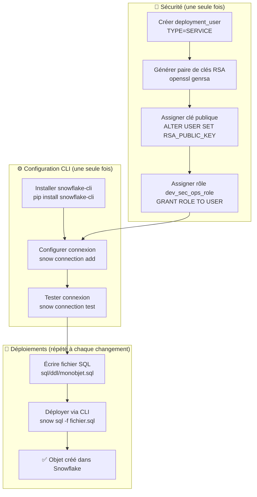
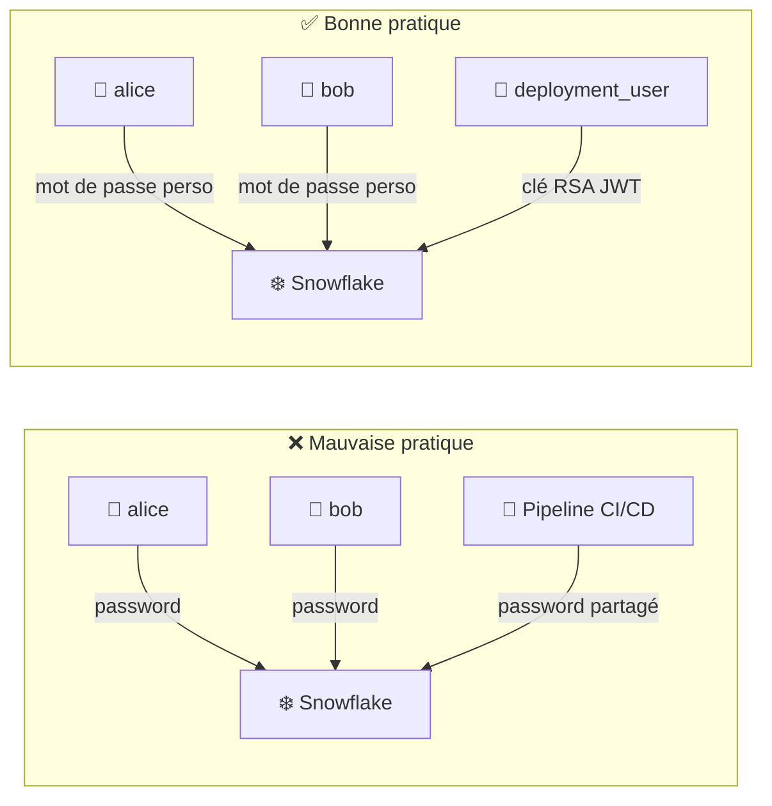
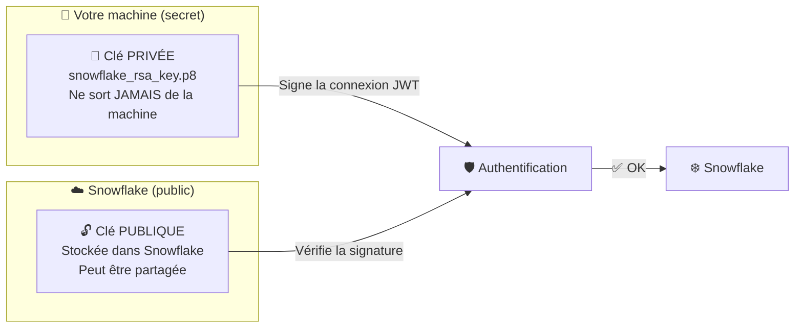
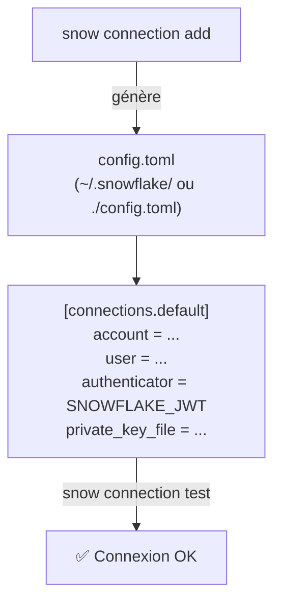
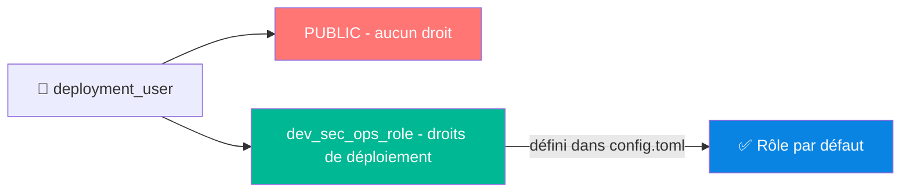
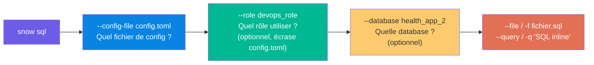
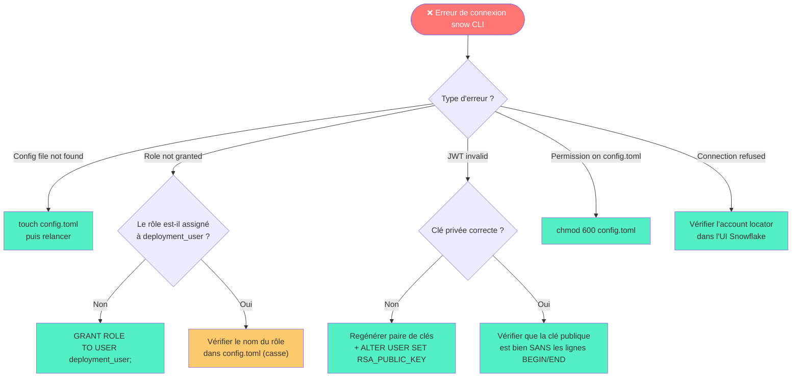
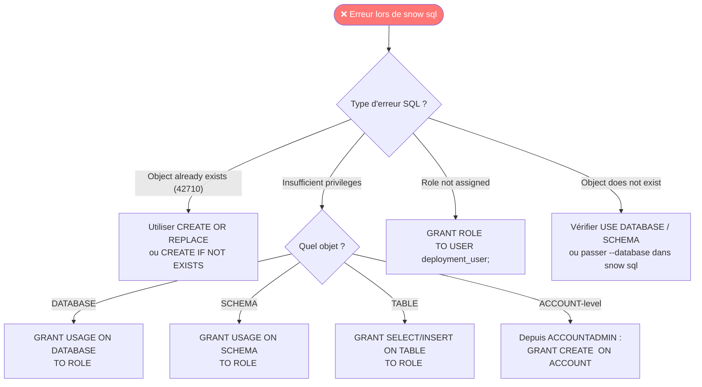
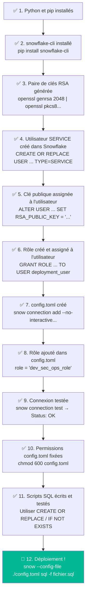
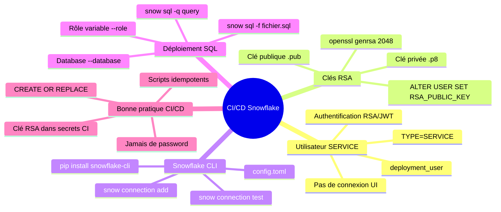

# ❄️ Chapitre 5 — Déploiement automatique avec Snowflake CLI

> **Niveau** : Intermédiaire  
> **Durée estimée** : 3-4h  
> **Prérequis** : Chapitre 4 (RBAC), Python installé, compte Snowflake actif, Git

---

## 📋 Sommaire

1. [Introduction au CI/CD avec Snowflake](#1-introduction-au-cicd-avec-snowflake)
2. [Installation de Snowflake CLI](#2-installation-de-snowflake-cli)
3. [Créer un utilisateur de type SERVICE](#3-créer-un-utilisateur-de-type-service)
4. [Générer une paire de clés RSA](#4-générer-une-paire-de-clés-rsa)
5. [Configurer Snowflake CLI](#5-configurer-snowflake-cli)
6. [Assigner un rôle par défaut à la connexion](#6-assigner-un-rôle-par-défaut-à-la-connexion)
7. [Premier déploiement avec Snowflake CLI](#7-premier-déploiement-avec-snowflake-cli)
8. [Déployer avec un rôle différent du rôle par défaut](#8-déployer-avec-un-rôle-différent-du-rôle-par-défaut)
9. [Code complet et commenté](#9-code-complet-et-commenté)
10. [Cas pratique guidé](#10-cas-pratique-guidé)
11. [Gestion des erreurs courantes](#11-gestion-des-erreurs-courantes)
12. [Méthodologie pas à pas : checklist de déploiement](#12-méthodologie-pas-à-pas--checklist-de-déploiement)
13. [Référence des commandes Snowflake CLI](#13-référence-des-commandes-snowflake-cli)

---

## 1. Introduction au CI/CD avec Snowflake

### Qu'est-ce que le CI/CD ?

**CI/CD** = Continuous Integration / Continuous Deployment (Intégration continue / Déploiement continu)

C'est une pratique DevOps qui consiste à **automatiser** le déploiement de code vers un environnement cible, sans intervention humaine manuelle.


### Pourquoi automatiser les déploiements Snowflake ?

Sans CI/CD, un data engineer doit :
- Se connecter manuellement à Snowflake
- Exécuter les scripts SQL dans le bon ordre
- Mémoriser quels objets ont déjà été créés
- Gérer les différences entre environnements (DEV, STAGING, PROD)

Avec CI/CD :
- ✅ Chaque `git push` sur `main` déclenche automatiquement le déploiement
- ✅ Les scripts SQL sont versionnés et traçables
- ✅ Zéro intervention manuelle → zéro risque d'oubli
- ✅ Même processus reproductible à chaque déploiement

### Architecture complète du chapitre



---

## 2. Installation de Snowflake CLI

### Prérequis

```bash
# Vérifier que Python est bien installé (version 3.8+ requise)
python3 --version
# Output attendu : Python 3.10.x ou supérieur

# Vérifier que pip est disponible
pip --version
```

### Installation

```bash
# Installer Snowflake CLI via pip
# snowflake-cli est le nom du package Python
pip install snowflake-cli

# Vérifier que l'installation a fonctionné
# La commande 'snow' doit être disponible
snow --help
```

> 💡 **Note** : Sur certaines machines, il faudra utiliser `pip3` au lieu de `pip`, ou ajouter `--user` si vous n'avez pas les droits admin :
> ```bash
> pip3 install snowflake-cli --user
> ```

### Vérifier la version installée

```bash
# Afficher la version de Snowflake CLI installée
snow --version

# Lister toutes les commandes disponibles
snow --help
```

### Structure du projet recommandée

Voici l'arborescence de projet utilisée dans ce cours :

```
cours_snowflake/
├── sql/
│   ├── ddl/                    ← Scripts de création d'objets (CREATE)
│   │   ├── database.sql
│   │   ├── file_format.sql
│   │   ├── external_stage.sql
│   │   └── ...
│   ├── dml/                    ← Scripts de manipulation de données (INSERT, UPDATE)
│   └── rbac/                   ← Scripts de droits et rôles
│       ├── dev_sec_ops_role.sql
│       └── initialisation_application.sql
├── config.toml                 ← Configuration Snowflake CLI (locale, à ne pas committer)
├── snowflake_rsa_key.p8        ← Clé privée RSA (⚠️ JAMAIS dans git !)
└── snowflake_rsa_public.pub    ← Clé publique RSA
```

> ⚠️ **CRITIQUE** : Ajouter `snowflake_rsa_key.p8` et `config.toml` dans votre `.gitignore` ! Ces fichiers contiennent des credentials sensibles.

```bash
# Créer/compléter le .gitignore
echo "snowflake_rsa_key.p8" >> .gitignore
echo "config.toml" >> .gitignore
echo "*.p8" >> .gitignore
```

---

## 3. Créer un utilisateur de type SERVICE

### Concept : l'utilisateur de déploiement

Dans une architecture CI/CD, on ne se connecte **jamais** avec un compte utilisateur personnel. On crée un compte technique dédié, de type `SERVICE`.



### Différence entre TYPE=PERSON et TYPE=SERVICE

| Propriété | PERSON (défaut) | SERVICE |
|---|---|---|
| Peut se connecter via UI Snowflake | ✅ Oui | ❌ Non |
| Mot de passe requis | Oui | Non |
| Authentification par clé RSA | Optionnel | Recommandé |
| Usage | Humains | Pipelines, outils CI/CD |
| MFA (authentification multifacteur) | Possible | Non applicable |

### Créer l'utilisateur de déploiement

```sql
-- ============================================================
-- ÉTAPE 1 : Créer l'utilisateur de service
-- ============================================================
-- TYPE=SERVICE : cet utilisateur ne peut pas se connecter via l'UI Snowflake
-- Il est réservé aux connexions programmatiques (CLI, API, pipelines)
-- CREATE OR REPLACE : idempotent (ne plante pas si l'user existe déjà)
-- ============================================================

USE ROLE accountadmin;

CREATE OR REPLACE USER deployment_user TYPE=SERVICE;

-- ============================================================
-- ÉTAPE 2 : Vérifier que l'utilisateur a bien été créé
-- ============================================================
-- DESC USER montre toutes les propriétés de l'utilisateur
-- Vérifier : TYPE = SERVICE, RSA_PUBLIC_KEY (sera rempli à l'étape suivante)
-- ============================================================

DESC USER deployment_user;
```

> 💡 **Note sur `CREATE OR REPLACE`** : Cette syntaxe est idempotente pour les utilisateurs — si l'utilisateur existe déjà, il sera recréé (et ses droits seront conservés si l'objet n'est pas supprimé). C'est la commande à préférer dans les scripts de déploiement.

---

## 4. Générer une paire de clés RSA

### Pourquoi des clés RSA et pas un mot de passe ?

Un mot de passe peut être partagé, volé, ou exposé dans des logs. Une **paire de clés RSA** offre une sécurité asymétrique :



- La **clé privée** reste sur votre machine (ou dans les secrets du CI/CD)
- La **clé publique** est déposée dans Snowflake
- La connexion utilise le protocole **JWT** (JSON Web Token)

### Générer la clé privée (format PKCS8)

```bash
# Générer une clé RSA 2048 bits en format PKCS8 (format requis par Snowflake)
# Décryptage de la commande :
#   openssl genrsa 2048     → génère une clé RSA de 2048 bits
#   | openssl pkcs8         → convertit au format PKCS8 (standard Snowflake)
#   -topk8                  → conversion vers PKCS8
#   -inform PEM             → format d'entrée : PEM
#   -out snowflake_rsa_key.p8   → fichier de sortie : la clé privée
#   -nocrypt                → clé NON chiffrée (plus simple pour CI/CD)
openssl genrsa 2048 | openssl pkcs8 -topk8 -inform PEM -out snowflake_rsa_key.p8 -nocrypt
```

> ⚠️ **Option `-nocrypt`** : La clé est stockée sans passphrase. C'est pratique pour le CI/CD mais implique que le fichier doit être protégé par les permissions système. En production, on peut omettre `-nocrypt` pour chiffrer la clé avec une passphrase, mais il faudra alors la fournir lors de chaque connexion.

```bash
# Version avec clé CHIFFRÉE (demande une passphrase à la génération) :
openssl genrsa 2048 | openssl pkcs8 -topk8 -v2 des3 -inform PEM -out rsa_key.p8
```

### Générer la clé publique

```bash
# Dériver la clé publique à partir de la clé privée
# Décryptage de la commande :
#   openssl rsa             → commande RSA d'OpenSSL
#   -in snowflake_rsa_key.p8    → prend la clé privée en entrée
#   -pubout                 → extrait la partie publique seulement
#   -out snowflake_rsa_public.pub   → fichier de sortie : la clé publique
openssl rsa -in snowflake_rsa_key.p8 -pubout -out snowflake_rsa_public.pub

# Résultat attendu dans le terminal :
# writing RSA key
```

### Protéger les fichiers de clés

```bash
# Restreindre les permissions du fichier de clé privée (lecture seul par le propriétaire)
# 600 = rw------- (lecture + écriture pour le propriétaire, rien pour les autres)
chmod 600 snowflake_rsa_key.p8

# Vérifier les permissions
ls -la snowflake_rsa_key.p8
# -rw------- 1 user group 1704 Oct 12 14:23 snowflake_rsa_key.p8
```

### Assigner la clé publique à l'utilisateur Snowflake

```sql
-- ============================================================
-- LIRE LA CLÉ PUBLIQUE
-- ============================================================
-- La clé publique a un format PEM :
-- -----BEGIN PUBLIC KEY-----
-- MIIBIjANBgkqhkiG9w0BAQEFAAOCAQ8AMIIBCgKCAQEAzKZ/Fp1uZiDT4K3wRqgE
-- ... (contenu en base64)
-- -----END PUBLIC KEY-----
--
-- Pour Snowflake, il faut UNIQUEMENT le contenu base64 (sans les lignes BEGIN/END)
-- ============================================================

-- Assigner la clé publique à l'utilisateur
-- RSA_PUBLIC_KEY = contenu base64 de la clé publique SANS les lignes BEGIN/END
-- Copier le contenu entre "-----BEGIN PUBLIC KEY-----" et "-----END PUBLIC KEY-----"
ALTER USER deployment_user SET RSA_PUBLIC_KEY = 'MIIBIjANBgkqhkiG9w0BAQEFAAOCAQ8AMIIBCgKCAQEAzKZ/...votreClePublique...IDAQAB';

-- Vérification : la colonne RSA_PUBLIC_KEY doit maintenant avoir une valeur
DESC USER deployment_user;
-- Chercher la ligne RSA_PUBLIC_KEY : doit contenir votre clé
-- Chercher la ligne RSA_PUBLIC_KEY_FP : fingerprint de la clé (ex: SHA256:...)
```

> ⚠️ **Piège fréquent** : Ne pas inclure les lignes `-----BEGIN PUBLIC KEY-----` et `-----END PUBLIC KEY-----` dans la valeur SQL. Copier uniquement le contenu entre ces deux lignes, sans sauts de ligne.

```bash
# Commande pratique pour extraire uniquement le contenu base64 (sans les headers)
grep -v "BEGIN\|END" snowflake_rsa_public.pub | tr -d '\n'
```

---

## 5. Configurer Snowflake CLI

### Vue d'ensemble de la configuration

Snowflake CLI utilise un fichier de configuration `config.toml` (format [TOML](https://toml.io/)).



### Trouver l'identifiant de votre compte Snowflake

Avant de configurer la CLI, vous avez besoin de l'identifiant de votre compte Snowflake.

Dans l'UI Snowflake : cliquer sur votre profil (en bas à gauche) → Nom du compte → "View account details"

```
Account identifier :  JCHLZDA-UCB30964
Account locator    :  ONB31943
Account/Server URL :  JCHLZDA-UCB30964.snowflakecomputing.com
```

> 💡 **Quelle valeur utiliser ?** Pour la CLI Snowflake, utilisez le **Account locator** (format court, ex: `ONB31943`).

### Méthode 1 : Configuration interactive (pour usage local)

```bash
# Lancer l'assistant de configuration interactif
snow connection add

# L'outil va demander les informations une par une :
# Enter connection name: default              ← nom de la connexion (peut en avoir plusieurs)
# Enter account: ONB31943                    ← Account locator Snowflake
# Enter user: deployment_user                ← L'utilisateur SERVICE créé précédemment
# Enter password: (laisser vide)             ← Pas de password, on utilise JWT
# Enter role: (laisser vide pour l'instant)  ← On configurera le rôle plus tard
# Enter warehouse: (laisser vide)
# Enter database: (laisser vide)
# Enter schema: (laisser vide)
# Enter host: (laisser vide)
# Enter port: (laisser vide)
# Enter region: (laisser vide)
# Enter authenticator: SNOWFLAKE_JWT         ← Méthode d'auth : JWT avec clé RSA
# Enter workload identity provider: (laisser vide)
# Enter private key file: /chemin/vers/snowflake_rsa_key.p8  ← Chemin ABSOLU vers la clé privée
# Enter token file path: (laisser vide)
```

### Méthode 2 : Configuration via script (pour CI/CD, non-interactif)

```bash
# Configuration sans mode interactif (parfaite pour les pipelines GitHub Actions)
# Décryptage des options :
#   --config-file ./config.toml    → écrire la config dans ./config.toml (et non dans ~/.snowflake/)
#   connection add                 → sous-commande pour ajouter une connexion
#   --connection-name default      → nom de la connexion
#   --user deployment_user         → utilisateur Snowflake
#   --authenticator SNOWFLAKE_JWT  → authentification par clé RSA (JSON Web Token)
#   --private-key ./snowflake_rsa_key.p8   → chemin relatif vers la clé privée
#   --account ONB31943             → identifiant du compte Snowflake
#   --no-interactive               → ne pas demander de confirmation

snow --config-file ./config.toml connection add \
  --connection-name default \
  --user deployment_user \
  --authenticator SNOWFLAKE_JWT \
  --private-key ./snowflake_rsa_key.p8 \
  --account ONB31943 \
  --no-interactive
```

> ⚠️ **Erreur commune** : si vous avez l'erreur `Invalid value for '--config-file': File './config.toml' does not exist`, il faut créer le fichier vide d'abord :
> ```bash
> touch config.toml
> ```

### Le fichier config.toml généré

```toml
# ============================================================
# Fichier de configuration Snowflake CLI
# Emplacement : ~/.snowflake/config.toml (global)
#            ou ./config.toml (local au projet)
# ============================================================

[cli]
ignore_new_version_warning = false

[cli.logs]
save_logs = true
path = "/Users/user/Library/Application Support/snowflake/logs"
level = "info"

# Connexion nommée "default"
# Il peut y en avoir plusieurs : [connections.dev], [connections.prod], etc.
[connections.default]
account = "ONB31943"                                   # Account locator Snowflake
user = "deployment_user"                               # Utilisateur SERVICE
authenticator = "SNOWFLAKE_JWT"                        # Méthode d'auth : clé RSA
private_key_file = "./snowflake_rsa_key.p8"           # Chemin vers la clé privée
# role = "dev_sec_ops_role"                            # Optionnel : rôle par défaut
```

### Tester la connexion

```bash
# Tester que la connexion fonctionne correctement
snow connection test

# Résultat attendu :
# +--------------------+-----------------------------------------------+
# | key                | value                                         |
# |--------------------|-----------------------------------------------|
# | Connection name    | default                                       |
# | Status             | OK                                            |
# | Host               | ONB31943.snowflakecomputing.com               |
# | Account            | ONB31943                                      |
# | User               | deployment_user                               |
# | Role               | PUBLIC                                        |
# | Database           | not set                                       |
# | Warehouse          | not set                                       |
# +--------------------+-----------------------------------------------+

# Si vous utilisez un config.toml local (non global) :
snow --config-file ./config.toml connection test
```

> ⚠️ **Avertissement courant** : `UserWarning: Bad owner or permissions on config.toml`
> Ce warning indique que les permissions du fichier sont trop ouvertes. Pour le corriger :
> ```bash
> chown $USER "config.toml"    # changer le propriétaire
> chmod 0600 "config.toml"     # lecture/écriture uniquement par le propriétaire
> ```

---

## 6. Assigner un rôle par défaut à la connexion

### Pourquoi le rôle par défaut est `PUBLIC`

Par défaut, `deployment_user` se connecte avec le rôle `PUBLIC` — qui n'a pratiquement aucun droit. Il faut :
1. Assigner le rôle `dev_sec_ops_role` à `deployment_user` dans Snowflake
2. Configurer ce rôle comme rôle par défaut dans `config.toml`



### Assigner le rôle dans Snowflake

```sql
-- ============================================================
-- Assigner le rôle dev_sec_ops_role à deployment_user
-- ============================================================
-- IMPORTANT : cette commande doit être exécutée DEPUIS accountadmin
-- (seul accountadmin peut assigner des rôles à d'autres utilisateurs
-- sans avoir besoin de MANAGE GRANTS)
-- ============================================================

USE ROLE accountadmin;

-- Assigner le rôle dev_sec_ops_role à l'utilisateur de déploiement
-- Sans cette étape, deployment_user ne peut pas utiliser ce rôle même si on le configure dans config.toml
GRANT ROLE dev_sec_ops_role TO USER deployment_user;

-- Vérifier que le rôle a bien été assigné
SHOW GRANTS TO USER deployment_user;
```

### Configurer le rôle par défaut dans config.toml

```toml
# config.toml — Ajouter le rôle par défaut
[connections.default]
account = "ONB31943"
user = "deployment_user"
authenticator = "SNOWFLAKE_JWT"
private_key_file = "./snowflake_rsa_key.p8"
role = "dev_sec_ops_role"   # ← Ajouter cette ligne
```

### Vérifier que le rôle est bien actif

```bash
# Tester la connexion : la colonne "Role" doit maintenant afficher "DEV_SEC_OPS_ROLE"
snow --config-file ./config.toml connection test

# Résultat attendu :
# | Role     | DEV_SEC_OPS_ROLE |
```

> ⚠️ **Erreur `250001 (08001)`** : si vous voyez `Role 'ACCOUNTADMIN' specified in the connect string is not granted to this user`, c'est que vous avez mis un rôle dans config.toml que deployment_user n'a pas. Vérifiez avec `SHOW GRANTS TO USER deployment_user`.

---

## 7. Premier déploiement avec Snowflake CLI

### La commande principale : `snow sql`

```bash
# Syntaxe générale de snow sql :
snow sql --help

# Deux modes principaux :
# Mode fichier  : snow sql -f fichier.sql
# Mode inline   : snow sql -q "SELECT CURRENT_USER()"
```

### Déployer un fichier SQL

```bash
# Déployer un fichier SQL via Snowflake CLI
# Décryptage des options :
#   --config-file ./config.toml  → utiliser le fichier de config local (et non ~/.snowflake/)
#   sql                          → sous-commande SQL
#   -f sql/rbac/initialisation_application.sql   → fichier SQL à exécuter
#   (-f est l'abréviation de --filename)

snow --config-file ./config.toml sql -f sql/rbac/initialisation_application.sql
```

### Exemple de fichier à déployer : `initialisation_application.sql`

```sql
-- ============================================================
-- SCRIPT : initialisation_application.sql
-- Crée la database, les schémas et les rôles de l'application
-- Ce script est conçu pour être exécuté par deployment_user
-- avec le rôle dev_sec_ops_role
-- ============================================================

-- Crée la database principale du projet (idempotent)
CREATE DATABASE HEALTH_APP_2;

-- Crée les schémas de données dans cette database
CREATE SCHEMA RAW;        -- Zone de données brutes
CREATE SCHEMA STAGING;    -- Zone de données transformées

-- Crée les rôles métier
-- Note : CREATE ROLE (sans IF NOT EXISTS) plante si le rôle existe déjà
-- → utiliser CREATE ROLE IF NOT EXISTS pour l'idempotence
CREATE ROLE devops_role;
CREATE ROLE application_role;
CREATE ROLE engineer_role;

-- Donne le droit d'utiliser la database aux rôles
GRANT USAGE ON DATABASE HEALTH_APP_2 TO ROLE DEVOPS_ROLE;

-- Donne tous les droits sur les schémas à devops_role
GRANT ALL ON SCHEMA raw TO ROLE devops_role;
GRANT ALL ON SCHEMA staging TO ROLE devops_role;

-- Assigne le rôle à deployment_user pour que le pipeline puisse s'en servir
GRANT ROLE devops_role TO USER deployment_user;
GRANT ROLE application_role TO USER deployment_user;
```

### Résultat d'un déploiement réussi

```
CREATE DATABASE HEALTH_APP_2;
+------------------------------------------+
| status                                   |
|------------------------------------------|
| Database HEALTH_APP_2 successfully created. |
+------------------------------------------+

CREATE SCHEMA RAW;
+--------------------------------------+
| status                               |
|--------------------------------------|
| Schema RAW successfully created.     |
+--------------------------------------+

...

GRANT ALL ON SCHEMA raw TO ROLE devops_role;
+----------------------------------+
| status                           |
|----------------------------------|
| Statement executed successfully. |
+----------------------------------+
```

### Résultat d'une erreur (objet déjà existant)

```
CREATE ROLE engineer_role;
+------+
Error
002002 (42710): SQL compilation error:
Object 'ENGINEER_ROLE' already exists.
```

> 💡 **Comment rendre un script idempotent** : utiliser `CREATE OR REPLACE` ou `CREATE ... IF NOT EXISTS` pour éviter les erreurs si l'objet existe déjà.

```sql
-- ❌ Plante si l'objet existe déjà
CREATE ROLE engineer_role;

-- ✅ Idempotent : ne plante pas
CREATE ROLE IF NOT EXISTS engineer_role;

-- ✅ Idempotent : recrée l'objet si nécessaire
CREATE OR REPLACE ROLE engineer_role;
```

---

## 8. Déployer avec un rôle différent du rôle par défaut

### Le problème : un seul rôle ne peut pas tout faire

Dans notre architecture RBAC, différents objets sont créés par différents rôles :
- `dev_sec_ops_role` crée les databases et rôles
- `dev_ops_role` crée les tables, views, file formats, stages

Il faut pouvoir **switcher de rôle à la demande** dans une commande `snow sql`.

### Changer le rôle pour une seule commande

```bash
# Déployer un fichier SQL en utilisant un rôle DIFFÉRENT du rôle par défaut
# Décryptage des nouvelles options :
#   --role devops_role       → utiliser ce rôle pour cette commande (écrase le rôle du config.toml)
#   --database health_app_2  → utiliser cette database (évite d'écrire USE DATABASE dans le SQL)

snow --config-file ./config.toml sql \
  --role devops_role \
  --database health_app_2 \
  -f sql/ddl/file_format.sql

# Ou avec une query inline :
snow --config-file ./config.toml sql \
  --role devops_role \
  --database health_app_2 \
  -q "drop file format raw.csv_file"
```

### Exemple : déployer un File Format avec devops_role

```sql
-- sql/ddl/file_format.sql
-- ============================================================
-- Création du format de fichier CSV pour le schéma RAW
-- Ce script doit être exécuté avec le rôle devops_role
-- qui a ALL sur le schéma raw
-- ============================================================

-- Crée ou remplace le format de fichier CSV
-- CREATE OR ALTER : équivalent à CREATE OR REPLACE pour les file formats
CREATE OR ALTER FILE FORMAT raw.csv_file
  TYPE = CSV                                  -- Type de fichier : CSV
  FIELD_DELIMITER = '|'                       -- Séparateur de champs : pipe (|)
  TIMESTAMP_FORMAT = 'YYYYMMDD-HH24:MI:SS:FF3'; -- Format de timestamp personnalisé

-- Vérifier que le file format a bien été créé avec les bons paramètres
DESC FILE FORMAT raw.csv_file;
```

```bash
# Déploiement avec le bon rôle et la bonne database
snow --config-file ./config.toml sql \
  --role devops_role \
  --database health_app_2 \
  -f sql/ddl/file_format.sql

# Résultat attendu :
# CREATE OR ALTER FILE FORMAT raw.csv_file
# TYPE=CSV
# FIELD_DELIMITER='|'
# TIMESTAMP_FORMAT='YYYYMMDD-HH24:MI:SS:FF3';
# (suivi des résultats de DESC FILE FORMAT)
```

### Schéma des options `snow sql`



---

## 9. Code complet et commenté

### Script complet : setup du deployment_user

```sql
-- ================================================================
-- SCRIPT : setup_deployment_user.sql
-- ================================================================
-- Description : Crée et configure l'utilisateur de déploiement
--               avec authentification par clé RSA
-- Prérequis   : Être connecté avec le rôle ACCOUNTADMIN
--               Avoir généré la paire de clés RSA (voir section 4)
-- ================================================================

-- Se positionner en tant qu'administrateur du compte
USE ROLE accountadmin;

-- ----------------------------------------------------------------
-- PARTIE 1 : Créer l'utilisateur de service
-- ----------------------------------------------------------------

-- Crée l'utilisateur de déploiement
-- TYPE=SERVICE = pas de connexion UI, authentification programmatique uniquement
-- CREATE OR REPLACE = idempotent (peut être rejoué sans erreur)
CREATE OR REPLACE USER deployment_user TYPE = SERVICE;

-- ----------------------------------------------------------------
-- PARTIE 2 : Assigner la clé publique RSA
-- ----------------------------------------------------------------

-- Assigner la clé publique RSA à deployment_user
-- RSA_PUBLIC_KEY = contenu base64 de la clé publique SANS les lignes BEGIN/END
-- ⚠️ Remplacer la valeur par VOTRE clé publique générée avec openssl
ALTER USER deployment_user SET RSA_PUBLIC_KEY = 'MIIBIjANBgkqhkiG...VotreClePublique...IDAQAB';

-- ----------------------------------------------------------------
-- PARTIE 3 : Assigner les rôles nécessaires
-- ----------------------------------------------------------------

-- Assigner le rôle principal de déploiement
-- Sans ce GRANT, deployment_user ne peut utiliser que le rôle PUBLIC
GRANT ROLE dev_sec_ops_role TO USER deployment_user;

-- Vérification finale : afficher tous les droits de deployment_user
SHOW GRANTS TO USER deployment_user;

-- Vérifier les détails de l'utilisateur (chercher RSA_PUBLIC_KEY et TYPE=SERVICE)
DESC USER deployment_user;
```

### Script complet : déploiement de l'application

```sql
-- ================================================================
-- SCRIPT : initialisation_application.sql
-- ================================================================
-- Description : Initialise la structure complète de health_app_2
-- Exécution   : snow --config-file ./config.toml sql
--               -f sql/rbac/initialisation_application.sql
-- Rôle requis : dev_sec_ops_role
-- ================================================================

-- ----------------------------------------------------------------
-- SECTION 1 : Infrastructure de données
-- ----------------------------------------------------------------

-- Crée la database principale du projet
-- Utiliser IF NOT EXISTS pour l'idempotence
CREATE DATABASE IF NOT EXISTS HEALTH_APP_2;

-- Créer les deux zones de données
CREATE SCHEMA IF NOT EXISTS HEALTH_APP_2.RAW;      -- Zone d'ingestion brute
CREATE SCHEMA IF NOT EXISTS HEALTH_APP_2.STAGING;  -- Zone de transformation

-- ----------------------------------------------------------------
-- SECTION 2 : Rôles métier
-- ----------------------------------------------------------------

-- Créer les rôles métier
-- IF NOT EXISTS = ne plante pas si le rôle existe déjà
CREATE ROLE IF NOT EXISTS devops_role;          -- Gestion des objets de données
CREATE ROLE IF NOT EXISTS application_role;    -- Exécution des pipelines
CREATE ROLE IF NOT EXISTS engineer_role;       -- Lecture et monitoring

-- ----------------------------------------------------------------
-- SECTION 3 : Droits du rôle devops_role
-- ----------------------------------------------------------------

-- Accès à la database (obligatoire avant tout accès aux objets internes)
GRANT USAGE ON DATABASE HEALTH_APP_2 TO ROLE DEVOPS_ROLE;

-- Tous les droits sur les deux schémas
-- ALL = USAGE + CREATE TABLE + CREATE VIEW + CREATE TASK + MODIFY + MONITOR + ...
GRANT ALL ON SCHEMA HEALTH_APP_2.RAW TO ROLE devops_role;
GRANT ALL ON SCHEMA HEALTH_APP_2.STAGING TO ROLE devops_role;

-- ----------------------------------------------------------------
-- SECTION 4 : Droits du rôle engineer_role
-- ----------------------------------------------------------------

GRANT USAGE ON DATABASE HEALTH_APP_2 TO ROLE engineer_role;

-- SELECT sur toutes les tables futures (pas besoin de re-GRANT à chaque nouvelle table)
GRANT SELECT ON FUTURE TABLES IN SCHEMA HEALTH_APP_2.RAW TO ROLE engineer_role;
GRANT SELECT ON FUTURE TABLES IN SCHEMA HEALTH_APP_2.STAGING TO ROLE engineer_role;

-- ----------------------------------------------------------------
-- SECTION 5 : Assigner les rôles à deployment_user
-- ----------------------------------------------------------------

-- deployment_user doit avoir les rôles pour pouvoir les "USE" lors des déploiements
GRANT ROLE devops_role TO USER deployment_user;
GRANT ROLE application_role TO USER deployment_user;
```

### Script shell de déploiement complet

```bash
#!/bin/bash
# ================================================================
# deploy.sh — Script de déploiement complet pour health_app_2
# ================================================================
# Usage: ./deploy.sh
# Prérequis: snow CLI installé, config.toml présent, clé RSA présente
# ================================================================

set -e  # Arrêter le script en cas d'erreur

echo "🚀 Début du déploiement health_app_2"

# ----------------------------------------------------------------
# ÉTAPE 1 : Tester la connexion avant tout
# ----------------------------------------------------------------
echo "📡 Test de connexion Snowflake..."
snow --config-file ./config.toml connection test

# ----------------------------------------------------------------
# ÉTAPE 2 : Initialiser l'infrastructure (database, schémas, rôles)
# Rôle : dev_sec_ops_role (défini dans config.toml)
# ----------------------------------------------------------------
echo "🏗️  Initialisation de l'infrastructure..."
snow --config-file ./config.toml sql \
  -f sql/rbac/initialisation_application.sql

# ----------------------------------------------------------------
# ÉTAPE 3 : Créer les objets DDL (file formats, stages, tables...)
# Rôle : devops_role (différent du rôle par défaut)
# ----------------------------------------------------------------
echo "📋 Création des file formats..."
snow --config-file ./config.toml sql \
  --role devops_role \
  --database health_app_2 \
  -f sql/ddl/file_format.sql

echo "📦 Création des stages..."
snow --config-file ./config.toml sql \
  --role devops_role \
  --database health_app_2 \
  -f sql/ddl/external_stage.sql

echo "🗄️  Création des tables..."
snow --config-file ./config.toml sql \
  --role devops_role \
  --database health_app_2 \
  -f sql/ddl/raw_tbl.sql

echo "✅ Déploiement terminé avec succès !"
```

---

## 10. Cas pratique guidé

> **Scénario** : Tu rejoins l'équipe data d'une startup `expense_tracker`. Mets en place le pipeline CI/CD pour déployer l'application Snowflake depuis ton poste de travail.

### Étape 1 : Préparer l'environnement

```bash
# Installer Snowflake CLI
pip install snowflake-cli

# Vérifier l'installation
snow --version

# Créer la structure de projet
mkdir -p expense_tracker/sql/{ddl,dml,rbac}
cd expense_tracker

# Créer les fichiers de config (vides pour l'instant)
touch config.toml
```

### Étape 2 : Générer les clés RSA

```bash
# Générer la clé privée
openssl genrsa 2048 | openssl pkcs8 -topk8 -inform PEM \
  -out expense_rsa_key.p8 -nocrypt

# Générer la clé publique
openssl rsa -in expense_rsa_key.p8 -pubout -out expense_rsa_public.pub

# Protéger la clé privée
chmod 600 expense_rsa_key.p8

# Vérifier les fichiers créés
ls -la expense_rsa_key.p8 expense_rsa_public.pub
```

### Étape 3 : Créer l'utilisateur Snowflake

```sql
-- Exécuter dans l'UI Snowflake (Worksheets)
USE ROLE accountadmin;

-- Créer l'utilisateur de service
CREATE OR REPLACE USER expense_deployment_user TYPE = SERVICE;

-- Récupérer la clé publique (contenu entre BEGIN/END sans ces lignes)
-- cat expense_rsa_public.pub | grep -v "BEGIN\|END" | tr -d '\n'
ALTER USER expense_deployment_user SET RSA_PUBLIC_KEY = 'VotreClePubliqueIci...';

-- Créer et assigner le rôle admin
CREATE ROLE IF NOT EXISTS expense_admin_role;
GRANT CREATE DATABASE ON ACCOUNT TO ROLE expense_admin_role;
GRANT CREATE ROLE ON ACCOUNT TO ROLE expense_admin_role;
GRANT MANAGE GRANTS ON ACCOUNT TO ROLE expense_admin_role;
GRANT ROLE expense_admin_role TO USER expense_deployment_user;
```

### Étape 4 : Configurer la CLI

```bash
# Configurer la connexion
snow --config-file ./config.toml connection add \
  --connection-name default \
  --user expense_deployment_user \
  --authenticator SNOWFLAKE_JWT \
  --private-key ./expense_rsa_key.p8 \
  --account <votre_account_locator> \
  --no-interactive

# Ajouter le rôle dans config.toml
echo 'role = "expense_admin_role"' >> config.toml

# Tester la connexion
snow --config-file ./config.toml connection test
```

### Étape 5 : Écrire et déployer les scripts SQL

```sql
-- sql/rbac/initialisation_expense.sql
CREATE DATABASE IF NOT EXISTS expense_tracker;
CREATE SCHEMA IF NOT EXISTS expense_tracker.raw;
CREATE SCHEMA IF NOT EXISTS expense_tracker.datamart;
CREATE ROLE IF NOT EXISTS expense_devops_role;
GRANT USAGE ON DATABASE expense_tracker TO ROLE expense_devops_role;
GRANT ALL ON SCHEMA expense_tracker.raw TO ROLE expense_devops_role;
GRANT ALL ON SCHEMA expense_tracker.datamart TO ROLE expense_devops_role;
GRANT ROLE expense_devops_role TO USER expense_deployment_user;
```

```bash
# Déployer !
snow --config-file ./config.toml sql -f sql/rbac/initialisation_expense.sql
```

<details>
<summary>💡 Solution complète config.toml</summary>

```toml
[connections.default]
account = "votre_account_locator"
user = "expense_deployment_user"
authenticator = "SNOWFLAKE_JWT"
private_key_file = "./expense_rsa_key.p8"
role = "expense_admin_role"
```
</details>

---

## 11. Gestion des erreurs courantes

### Dictionnaire des erreurs Snowflake CLI

| Message d'erreur | Cause probable | Solution |
|---|---|---|
| `File './config.toml' does not exist` | Le fichier config.toml n'existe pas encore | `touch config.toml` puis relancer la commande |
| `No such option: -c` | Syntaxe de commande incorrecte, option inconnue | Vérifier la syntaxe avec `snow --help` ou `snow connection add --help` |
| `250001 (08001): Role 'ACCOUNTADMIN' specified is not granted to this user` | Le rôle mis dans config.toml n'est pas assigné à deployment_user | `GRANT ROLE <role> TO USER deployment_user;` dans Snowflake |
| `Bad owner or permissions on config.toml` | Les permissions du fichier config.toml sont trop ouvertes | `chmod 600 config.toml && chown $USER config.toml` |
| `002002 (42710): Object 'X' already exists` | L'objet existe déjà dans Snowflake | Utiliser `CREATE OR REPLACE` ou `CREATE IF NOT EXISTS` |
| `SQL access control error: Requested role 'DEVOPS_ROLE' is not assigned to the executing user` | deployment_user n'a pas ce rôle | `GRANT ROLE devops_role TO USER deployment_user;` |
| `Insufficient privileges` lors d'un `snow sql` | Le rôle utilisé n'a pas les droits sur l'objet cible | Vérifier les GRANTs du rôle avec `SHOW GRANTS TO ROLE <role>` |
| `Connection refused` / timeout | Mauvais `account` dans config.toml | Vérifier l'Account locator dans l'UI Snowflake |
| `JWT token is invalid` | Clé privée ne correspond pas à la clé publique dans Snowflake | Regénérer la paire de clés et réassigner la clé publique |
| `Private key file not found` | Chemin de la clé privée incorrect dans config.toml | Vérifier le chemin avec `ls <chemin>` |

### Arbre de décision pour les erreurs de connexion



### Arbre de décision pour les erreurs SQL



### Commandes de diagnostic utiles

```bash
# Vérifier la connexion et le rôle actif
snow --config-file ./config.toml connection test

# Lister toutes les connexions configurées
snow connection list

# Afficher la config actuelle
cat config.toml

# Tester une query simple pour vérifier les droits
snow --config-file ./config.toml sql -q "SELECT CURRENT_ROLE(), CURRENT_USER()"

# Vérifier les droits d'un rôle
snow --config-file ./config.toml sql -q "SHOW GRANTS TO ROLE dev_sec_ops_role"
```

---

## 12. Méthodologie pas à pas : checklist de déploiement



### Checklist avant chaque déploiement

```bash
# CHECKLIST À FAIRE AVANT CHAQUE DÉPLOIEMENT

# 1. Vérifier que la connexion fonctionne
snow --config-file ./config.toml connection test

# 2. Vérifier que le bon rôle est actif (colonne "Role" dans le résultat)
snow --config-file ./config.toml sql -q "SELECT CURRENT_ROLE()"

# 3. Vérifier que la database cible existe
snow --config-file ./config.toml sql -q "SHOW DATABASES LIKE 'HEALTH_APP_2'"

# 4. Pour chaque script :
#    → Le script utilise-t-il CREATE OR REPLACE / IF NOT EXISTS ? (idempotence)
#    → Le bon rôle est-il spécifié dans la commande snow sql ?
#    → La bonne database est-elle spécifiée si nécessaire ?
```

---

## 13. Référence des commandes Snowflake CLI

### Commandes principales

| Commande | Description | Exemple |
|---|---|---|
| `snow --version` | Afficher la version installée | `snow --version` |
| `snow --help` | Aide générale | `snow --help` |
| `snow connection add` | Ajouter une connexion | `snow connection add --no-interactive ...` |
| `snow connection list` | Lister les connexions | `snow connection list` |
| `snow connection test` | Tester la connexion par défaut | `snow connection test` |
| `snow connection remove <name>` | Supprimer une connexion | `snow connection remove default` |
| `snow sql -f <file>` | Exécuter un fichier SQL | `snow sql -f mon_script.sql` |
| `snow sql -q "<query>"` | Exécuter une query SQL inline | `snow sql -q "SELECT CURRENT_USER()"` |

### Options globales réutilisables

| Option | Abréviation | Description |
|---|---|---|
| `--config-file <path>` | — | Utiliser un fichier config.toml spécifique (et non ~/.snowflake/) |
| `--connection <name>` | `-c` | Utiliser une connexion nommée spécifique |
| `--role <role>` | — | Surcharger le rôle de la connexion pour cette commande |
| `--database <db>` | — | Surcharger la database de la connexion |
| `--schema <schema>` | — | Surcharger le schéma de la connexion |
| `--warehouse <wh>` | — | Surcharger le warehouse de la connexion |

### Exemples de commandes avancées

```bash
# Exécuter en spécifiant rôle ET database (override config.toml)
snow --config-file ./config.toml sql \
  --role devops_role \
  --database health_app_2 \
  -f sql/ddl/file_format.sql

# Query inline avec override de rôle
snow --config-file ./config.toml sql \
  --role devops_role \
  --database health_app_2 \
  -q "drop file format raw.csv_file"

# Lister les connexions disponibles
snow connection list

# Supprimer une connexion (pour reconfigurer proprement)
snow connection remove default

# Tester une connexion spécifique (non-default)
snow --connection prod connection test
```

---

## 📚 Ressources complémentaires

- [Documentation Snowflake CLI](https://docs.snowflake.com/en/developer-guide/snowflake-cli/connecting/configure-cli)
- [Documentation CREATE USER](https://docs.snowflake.com/fr/sql-reference/sql/create-user)
- [Documentation ALTER USER](https://docs.snowflake.com/fr/sql-reference/sql/alter-user)
- [Authentification par paire de clés RSA](https://docs.snowflake.com/en/user-guide/key-pair-auth)
- [Référence des types d'utilisateurs Snowflake](https://docs.snowflake.com/fr/user-guide/admin-user-management)

---

## 🎯 Résumé du chapitre



**Les 5 points essentiels à retenir** :

1. **Toujours utiliser `TYPE=SERVICE`** pour les utilisateurs de pipeline — jamais un compte personnel
2. **L'authentification JWT par clé RSA** est plus sécurisée qu'un mot de passe pour le CI/CD
3. **`snow sql -f`** pour exécuter un fichier SQL, **`snow sql -q`** pour une query inline
4. **`--role` et `--database`** permettent de surcharger les paramètres de config.toml pour chaque commande
5. **Écrire des scripts idempotents** (`CREATE OR REPLACE`, `IF NOT EXISTS`) pour éviter les erreurs lors des ré-exécutions

---

*Chapitre 5 — Cours Snowflake | Dernière mise à jour : 2026*
