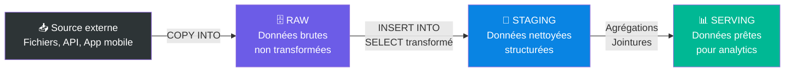
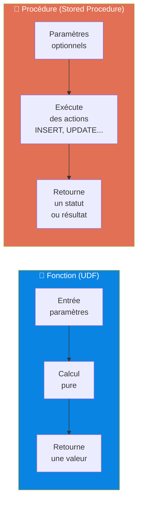
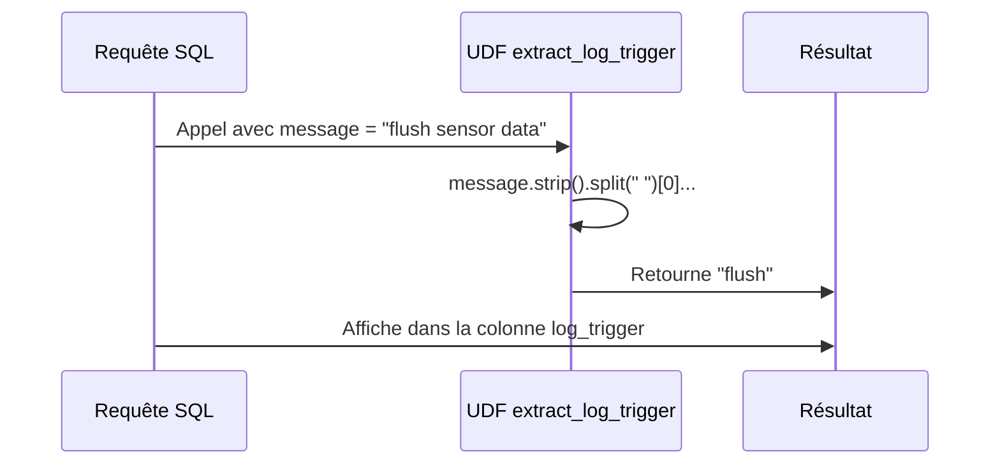
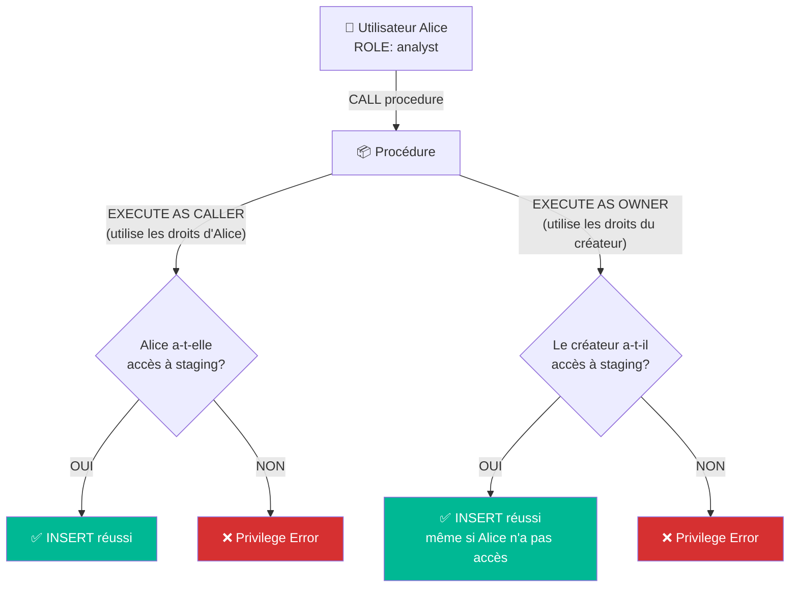
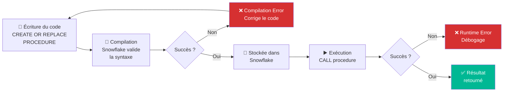
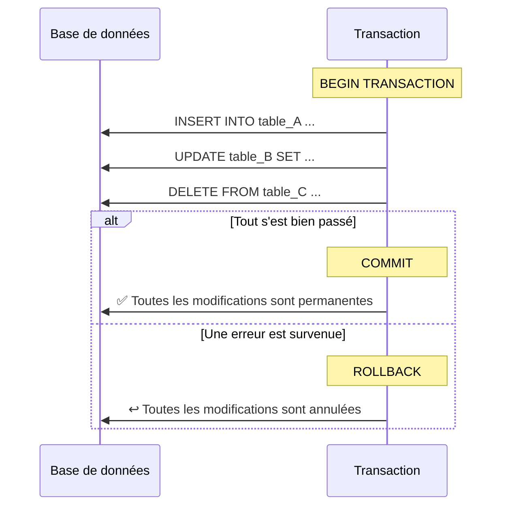
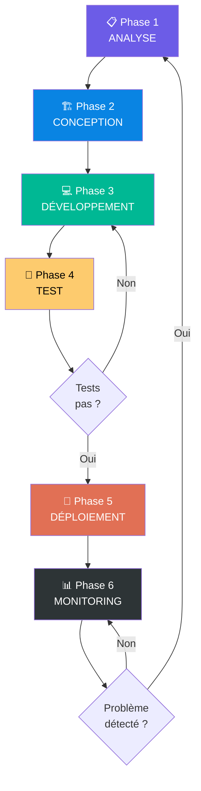
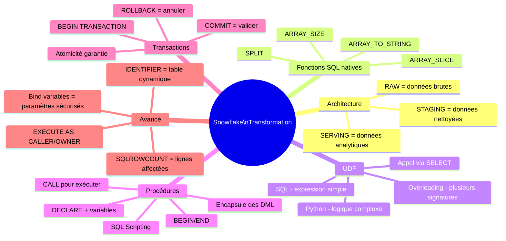

# 🏔️ Transformation des données, Fonctions et Procédures — Snowflake
### Chapitre #3 — Support de cours complet pour débutants

---

> **À qui s'adresse ce cours ?**
> Ce document est conçu pour toute personne qui débute avec Snowflake et qui n'a jamais écrit de procédure stockée, d'UDF ou de transaction. Chaque concept est expliqué de zéro, avec des analogies, des exemples concrets, et du code commenté ligne par ligne.

---

## 📋 Table des matières

1. [Introduction & Contexte du projet](#1-introduction--contexte-du-projet)
2. [Architecture logique : RAW → STAGING → SERVING](#2-architecture-logique--raw--staging--serving)
3. [Contexte d'exécution Snowflake](#3-contexte-dexécution-snowflake)
4. [Création des tables cibles (STAGING)](#4-création-des-tables-cibles-staging)
5. [Fonctions SQL natives — Manipulation de données](#5-fonctions-sql-natives--manipulation-de-données)
6. [User Defined Functions (UDF)](#6-user-defined-functions-udf)
7. [Concept de Function Overloading](#7-concept-de-function-overloading)
8. [Stored Procedures (Procédures stockées)](#8-stored-procedures-procédures-stockées)
9. [Transactions dans les procédures](#9-transactions-dans-les-procédures)
10. [Paramètres, variables et IDENTIFIER](#10-paramètres-variables-et-identifier)
11. [Exercice complet — Data Quality](#11-exercice-complet--data-quality)
12. [Méthodologie professionnelle](#12-méthodologie-professionnelle)
13. [Tableau des erreurs courantes](#13-tableau-des-erreurs-courantes)
14. [Ressources et documentation officielle](#14-ressources-et-documentation-officielle)

---

## 1. Introduction & Contexte du projet

### 🎯 Objectifs du chapitre

Ce chapitre couvre les sujets suivants :

- Écrire des requêtes pour distribuer des données vers les tables cibles
- Stocker ces requêtes dans des **procédures stockées**
- Créer des **fonctions** pour valider et transformer les données
- Créer un **DAG** (Directed Acyclic Graph) de transformation
- Automatiser ce DAG pour une exécution planifiée ou événementielle

### 🏥 Présentation du projet fil rouge

Tout au long de ce cours, nous travaillons sur un projet réel : une **application de santé mobile** (`HEALTH_APP`).

Cette application enregistre des événements dans une table brute `raw.raw_events`, avec la structure suivante :

| Colonne | Type | Description |
|---|---|---|
| `event_timestamp` | TIMESTAMP | Horodatage de l'événement |
| `process_name` | STRING | Nom du processus applicatif |
| `process_id` | NUMBER | Identifiant du processus |
| `message` | STRING | Message brut de l'événement |

**Exemple de données réelles :**

| event_timestamp | process_name | process_id | message |
|---|---|---|---|
| 2017-12-23 22:15:29 | Step_LSC | 30002312 | onStandStepChanged 3579 |
| 2017-12-23 22:15:29 | Step_LSC | 30002312 | onExtend:1514038530000 14 0 4 |
| 2017-12-23 22:15:29 | Step_SPUtils | 30002312 | flush sensor data |

La colonne `message` contient un message brut qui mélange le **log trigger** (premier mot) et le **reste du message**. Notre travail est de **décomposer, nettoyer et distribuer** ces données dans des tables structurées par type de processus.

---

## 2. Architecture logique : RAW → STAGING → SERVING

Avant d'écrire du code, comprendre l'architecture est fondamental. Snowflake organise les données en couches.

### 🧱 Les 3 couches de données



**Analogie :** Imaginez un entrepôt alimentaire.
- **RAW** = la réception des marchandises brutes (légumes non lavés, emballages variés)
- **STAGING** = le nettoyage, le tri, la mise en portion
- **SERVING** = les plats préparés prêts à être servis en restaurant

### 📂 Structure de la base de données dans ce cours

```
HEALTH_APP (base de données)
├── RAW (schéma)
│   ├── raw_events (table brute principale)
│   └── data_anomalies (table de qualité)
├── STAGING (schéma)
│   ├── hih_listener_manager
│   ├── hih_hi_broadcast_util
│   ├── step_stand_step_counter
│   ├── step_lsc
│   └── ... (une table par process_name)
└── PUBLIC (schéma)
    ├── Functions (fonctions UDF)
    └── Procedures (procédures stockées)
```

---

## 3. Contexte d'exécution Snowflake

### 🔑 Comprendre le contexte avant d'exécuter

Dans Snowflake, **toute requête s'exécute dans un contexte précis** qui détermine les droits, les ressources et la cible des opérations. Avant de commencer à coder, il faut toujours définir ce contexte.

```sql
-- Définir la base de données active
USE DATABASE health_app;

-- Définir le schéma actif (optionnel si précisé dans les requêtes)
USE SCHEMA raw;

-- Définir le warehouse (moteur de calcul)
USE WAREHOUSE compute_wh;

-- Définir le rôle (niveau de privilèges)
USE ROLE accountadmin;
```

### 📖 Explication des éléments

**`DATABASE`** — La base de données est le conteneur principal. Toutes les tables, fonctions et procédures appartiennent à une base de données.

**`SCHEMA`** — Un schéma est un sous-dossier logique dans la base de données. On l'utilise pour séparer les couches (RAW, STAGING, SERVING).

**`WAREHOUSE`** — Le warehouse est le moteur de calcul virtuel. C'est lui qui exécute les requêtes. Il consomme des crédits Snowflake quand il tourne.

**`ROLE`** — Le rôle détermine ce que vous avez le droit de faire. `ACCOUNTADMIN` est le rôle le plus puissant (à ne pas utiliser en production quotidienne).

> **🧠 À retenir :** Dans les captures du cours, on voit systématiquement `HEALTH_APP.STAGING` ou `HEALTH_APP.PUBLIC` en haut de l'interface. Cela signifie que la requête s'exécute dans le contexte `base_de_données.schéma`.

---

## 4. Création des tables cibles (STAGING)

### 🎯 Objectif

Nous allons créer les tables de destination dans le schéma `staging`, une par type de processus applicatif.

### 4.1 Explorer les données brutes

Avant de créer des tables, on explore ce qu'on a :

```sql
-- Explorer les 10 premières lignes de la table brute
SELECT *
FROM raw.raw_events
LIMIT 10;

-- Lister les process_name distincts pour comprendre quelles tables créer
SELECT DISTINCT process_name
FROM raw.raw_events
LIMIT 10;
```

**Résultat obtenu :** on découvre des noms comme `HiH_ListenerManager`, `HiH_HiBroadcastUtil`, `Step_StandStepCounter`, `Step_LSC`, etc. Chacun deviendra une table cible.

### 4.2 Créer le schéma STAGING

```sql
-- Créer le schéma s'il n'existe pas déjà
-- IF NOT EXISTS évite une erreur si le schéma existe déjà
CREATE SCHEMA IF NOT EXISTS staging;
```

**`IF NOT EXISTS`** — Ce mot-clé est une sécurité. Sans lui, la requête échouerait si le schéma existe déjà.

### 4.3 Créer les tables avec `CREATE OR ALTER TABLE`

```sql
-- ============================================================
-- TABLE : staging.hih_listener_manager
-- Contient les événements du processus HiH_ListenerManager
-- ============================================================
CREATE OR ALTER TABLE staging.hih_listener_manager (
    event_timestamp TIMESTAMP,    -- Horodatage de l'événement
    log_trigger     STRING,       -- Premier mot du message (type d'action)
    process_id      NUMBER,       -- Identifiant numérique du processus
    message         STRING        -- Reste du message après le log_trigger
);

-- ============================================================
-- TABLE : staging.hih_hi_broadcast_util
-- Contient les événements du processus HiH_HiBroadcastUtil
-- ============================================================
CREATE OR ALTER TABLE staging.hih_hi_broadcast_util (
    event_timestamp TIMESTAMP,
    log_trigger     STRING,
    process_id      NUMBER,
    message         STRING
);

-- ============================================================
-- TABLE : staging.step_stand_step_counter
-- Contient les événements du compteur de pas
-- ============================================================
CREATE OR ALTER TABLE staging.step_stand_step_counter (
    event_timestamp TIMESTAMP,
    log_trigger     STRING,
    process_id      NUMBER,
    message         STRING
);

-- Table pour Step_LSC, Step_ScreenUtil, etc. — même structure
CREATE OR ALTER TABLE staging.step_lsc (
    event_timestamp TIMESTAMP,
    log_trigger     STRING,
    process_id      NUMBER,
    message         STRING
);

CREATE OR ALTER TABLE staging.step_screen_util (
    event_timestamp TIMESTAMP,
    log_trigger     STRING,
    process_id      NUMBER,
    message         STRING
);
```

### 📖 Explication des types de données

| Type Snowflake | Description | Exemple |
|---|---|---|
| `TIMESTAMP` | Date + heure avec millisecondes | `2017-12-23 22:15:29.606` |
| `STRING` / `VARCHAR` | Texte de longueur variable | `'onStandStepChanged'` |
| `NUMBER` / `INT` | Nombre entier | `30002312` |
| `BOOLEAN` | Vrai ou Faux | `TRUE` / `FALSE` |
| `FLOAT` | Nombre décimal | `3.14159` |

### 🆚 `CREATE TABLE` vs `CREATE OR ALTER TABLE`

```sql
-- CREATE TABLE → Erreur si la table existe déjà
CREATE TABLE staging.step_lsc (...);

-- CREATE OR REPLACE TABLE → Supprime et recrée (perte de données !)
CREATE OR REPLACE TABLE staging.step_lsc (...);

-- CREATE OR ALTER TABLE → Modifie si elle existe, crée si elle n'existe pas
CREATE OR ALTER TABLE staging.step_lsc (...);  -- ✅ Recommandé en développement
```

> **⚠️ Attention :** `CREATE OR REPLACE` supprime toutes les données existantes. En production, préférez `CREATE OR ALTER` qui est non destructif.

---

## 5. Fonctions SQL natives — Manipulation de données

### 5.1 Le problème : décomposer le champ `message`

La colonne `message` contient une chaîne brute du type :
```
onStandStepChanged 3579
onExtend:1514038530000 14 0 4
flush sensor data
getTodayTotalDetailSteps = 1514038440000
```

Nous devons **extraire le premier mot** (= le `log_trigger`) et **garder le reste** (= le `message` propre).

### 5.2 Fonctions utilisées dans ce cours

#### `SPLIT(string, delimiter)` — Découper une chaîne

```sql
-- SPLIT divise une chaîne en un tableau (ARRAY) selon un séparateur
-- Ici, on sépare sur l'espace ' '
SELECT
    message,
    SPLIT(message, ' ') AS message_as_array  -- Retourne un tableau : ["onStandStepChanged", "3579"]
FROM raw.raw_events
LIMIT 5;
```

**Analogie :** `SPLIT` fonctionne comme le bouton "Texte en colonnes" d'Excel.

#### `ARRAY_SIZE(array)` — Taille d'un tableau

```sql
-- Compter le nombre d'éléments dans le tableau
SELECT
    message,
    SPLIT(message, ' ')        AS message_as_array,
    ARRAY_SIZE(SPLIT(message, ' ')) AS array_size  -- Nombre de mots
FROM raw.raw_events
LIMIT 5;
```

#### `ARRAY_SLICE(array, start, end)` — Extraire une portion du tableau

```sql
-- Extraire les éléments du tableau de l'index 1 jusqu'à la fin
-- Index 0 = premier élément (le log_trigger)
-- Index 1 = tout ce qui suit
SELECT
    SPLIT(message, ' ')                                        AS message_as_array,
    ARRAY_SLICE(
        SPLIT(message, ' '),       -- Le tableau source
        1,                          -- Commencer à l'index 1 (ignorer le premier mot)
        ARRAY_SIZE(SPLIT(message, ' '))  -- Jusqu'à la fin du tableau
    )                                                          AS array_slice
FROM raw.raw_events
LIMIT 5;
```

#### `ARRAY_TO_STRING(array, delimiter)` — Reconstituer une chaîne depuis un tableau

```sql
-- Rejoindre les éléments du tableau en une chaîne avec un séparateur
SELECT
    ARRAY_TO_STRING(
        ARRAY_SLICE(SPLIT(message, ' '), 1, ARRAY_SIZE(SPLIT(message, ' '))),
        ' '   -- Séparateur = espace
    ) AS message_final
FROM raw.raw_events
LIMIT 5;
```

#### Accès par index : `array[0]::STRING`

```sql
-- Accéder au premier élément du tableau (index 0) et le convertir en STRING
SELECT
    SPLIT(message, ' ')[0]::STRING AS log_trigger  -- :: est l'opérateur de cast (conversion de type)
FROM raw.raw_events
LIMIT 5;
```

> **💡 Bon à savoir :** L'opérateur `::TYPE` (double deux-points) est la syntaxe Snowflake pour **convertir un type**. `[0]::STRING` signifie "prends l'élément à l'index 0 et convertis-le en STRING". Sans le `::STRING`, l'élément serait de type `VARIANT` (type générique Snowflake pour les données semi-structurées).

### 5.3 Requête complète de décomposition

```sql
-- ============================================================
-- Requête de décomposition du message brut
-- Contexte : HEALTH_APP.STAGING
-- ============================================================
SELECT
    message,                                  -- Message brut original

    SPLIT(message, ' ')
        AS message_as_array,                  -- Tableau des mots : ["flush", "sensor", "data"]

    SPLIT(message, ' ')[0]::STRING
        AS log_trigger,                        -- Premier mot = type d'action : "flush"

    ARRAY_SIZE(SPLIT(message, ' '))
        AS array_size,                         -- Nombre de mots : 3

    ARRAY_SLICE(
        SPLIT(message, ' '),
        1,
        ARRAY_SIZE(SPLIT(message, ' '))
    )   AS array_slice,                        -- Tableau sans le premier mot : ["sensor", "data"]

    ARRAY_TO_STRING(
        ARRAY_SLICE(
            SPLIT(message, ' '),
            1,
            ARRAY_SIZE(SPLIT(message, ' '))
        ),
        ' '
    )   AS message_final                       -- Chaîne reconstituée : "sensor data"

FROM raw.raw_events
LIMIT 10;
```

**Résultats obtenus :**

| MESSAGE | MESSAGE_AS_ARRAY | LOG_TRIGGER | ARRAY_SIZE | MESSAGE_FINAL |
|---|---|---|---|---|
| onStandStepChanged 3579 | ["onStandStepChanged", "3579"] | onStandStepChanged | 2 | 3579 |
| flush sensor data | ["flush", "sensor", "data"] | flush | 3 | sensor data |
| onExtend:1514038530000 14 0 4 | [...] | onExtend:1514038530000 | 4 | 14 0 4 |

### 5.4 Insérer les données transformées dans STAGING

#### Pattern `INSERT INTO ... WITH source AS (...) SELECT ...`

```sql
-- ============================================================
-- Insérer les données Step_LSC transformées dans staging.step_lsc
-- ============================================================
INSERT INTO staging.step_lsc (event_timestamp, process_id, log_trigger, message)

-- Étape 1 : Définir la source avec une CTE (Common Table Expression)
WITH source AS (
    SELECT
        event_timestamp,                               -- On récupère l'horodatage tel quel
        process_name,                                  -- Nom du processus (pour le filtre WHERE)
        process_id,                                    -- ID du processus

        -- Décomposer le message en tableau pour en extraire les parties
        SPLIT(message, ' ')
            AS message_as_array,

        -- Extraire le premier mot comme log_trigger
        SPLIT(message, ' ')[0]::STRING
            AS log_trigger,

        -- Reconstituer le reste du message sans le premier mot
        ARRAY_TO_STRING(
            ARRAY_SLICE(
                SPLIT(message, ' '),
                1,
                ARRAY_SIZE(SPLIT(message, ' '))
            ),
            ' '
        )   AS message

    FROM raw.raw_events
    WHERE process_name = 'Step_LSC'                   -- Filtrer uniquement les événements Step_LSC
)

-- Étape 2 : Sélectionner les colonnes à insérer depuis la CTE
SELECT
    event_timestamp,
    process_id,
    log_trigger,
    message
FROM source;
```

> **💡 Qu'est-ce qu'une CTE (Common Table Expression) ?**
> Le bloc `WITH source AS (...)` définit une **table temporaire nommée** utilisable dans la requête suivante. C'est comme écrire le brouillon avant la copie finale. Avantages : lisibilité, réutilisabilité, pas de table physique créée.

---

## 6. User Defined Functions (UDF)

### 6.1 Pourquoi les UDF ?

Écrire `SPLIT(message, ' ')[0]::STRING` à chaque fois est fastidieux et error-prone. Imaginez avoir 15 tables à alimenter — vous devrez copier-coller et maintenir la même logique partout.

La solution : **encapsuler cette logique dans une fonction réutilisable**.

**Analogie :** Une UDF c'est comme enregistrer une macro dans Excel. Au lieu de répéter 10 clics à chaque fois, vous appuyez sur une touche.

### 6.2 Fonction vs Procédure — La différence fondamentale



| Critère | Fonction (UDF) | Procédure (SP) |
|---|---|---|
| **Utilisation** | Dans un `SELECT` | Avec `CALL` |
| **Retourne** | Une valeur scalaire ou table | Un résultat ou un statut |
| **Peut modifier des données** | Non (lecture seule) | Oui (INSERT, UPDATE, DELETE) |
| **Transactions** | Non | Oui |
| **Analogie** | Une formule Excel | Un script automatisé |

### 6.3 Créer une UDF en SQL

Une UDF SQL est la forme la plus simple. Elle encapsule une expression SQL.

```sql
-- ============================================================
-- Syntaxe générale d'une UDF SQL
-- ============================================================
CREATE OR REPLACE FUNCTION nom_schema.nom_fonction(parametre TYPE)
    RETURNS TYPE_RETOUR           -- Type de la valeur retournée
    LANGUAGE SQL                  -- Langage utilisé
AS $$
    -- Corps de la fonction : une expression SQL
    expression_sql_utilisant_parametre
$$;
```

**Les délimiteurs `$$`** — Le double dollar `$$` marque le début et la fin du corps de la fonction. C'est nécessaire car le corps peut contenir des points-virgules qui sinon seraient interprétés comme fin de requête.

### 6.4 Exemple complet : UDF SQL de validation timestamp

```sql
-- ============================================================
-- UDF : raw.check_correct_timestamp
-- Vérifie qu'un timestamp est valide (entre 2016 et maintenant)
-- Retourne BOOLEAN : TRUE si valide, FALSE sinon
-- ============================================================
CREATE OR REPLACE FUNCTION raw.check_correct_timestamp(event_timestamp TIMESTAMP)
    RETURNS BOOLEAN      -- On retourne vrai ou faux
    LANGUAGE SQL
AS $$
    -- L'expression retourne TRUE si le timestamp est dans la plage valide
    -- AND : les deux conditions doivent être vraies
    event_timestamp > '2016-01-01 00:00:00'::TIMESTAMP   -- Pas avant 2016
    AND
    event_timestamp <= CURRENT_TIMESTAMP()                 -- Pas dans le futur
$$;

-- Test de la fonction
SELECT
    event_timestamp,
    raw.check_correct_timestamp(event_timestamp) AS is_valid
FROM raw.raw_events
LIMIT 10;
```

### 6.5 Créer une UDF en Python

Snowflake supporte Python comme langage pour les UDF, ce qui permet des transformations plus complexes.

```sql
-- ============================================================
-- UDF Python : raw.extract_log_trigger (version 1)
-- Extrait le premier mot d'un message
-- Contexte : HEALTH_APP.RAW
-- ============================================================
CREATE OR REPLACE FUNCTION raw.extract_log_trigger(message STRING)
    RETURNS STRING             -- On retourne une chaîne de caractères
    LANGUAGE PYTHON            -- Langage : Python
    RUNTIME_VERSION = '3.12'  -- Version de Python à utiliser
    HANDLER = 'extract_log_trigger'  -- Nom de la fonction Python qui sera appelée
AS $$
-- Le code Python est encadré par $$

def extract_log_trigger(message: str):
    # Nettoie les espaces, découpe sur l'espace, prend le premier mot
    # puis découpe sur ':' pour enlever un éventuel suffixe, et nettoie à nouveau
    return message.strip().split(" ")[0].split(":")[0].split("=")[0].strip()

$$;
```

**Décomposition du code Python :**

```python
message = "onStandStepChanged 3579"

# .strip()      → "onStandStepChanged 3579"  (supprime espaces avant/après)
# .split(" ")   → ["onStandStepChanged", "3579"]  (découpe sur espace)
# [0]           → "onStandStepChanged"  (premier élément)
# .split(":")[0]→ "onStandStepChanged"  (cas : "onExtend:15140..." → "onExtend")
# .split("=")[0]→ "onStandStepChanged"  (cas : "getTodayTotal=..." → "getTodayTotal")
# .strip()      → "onStandStepChanged"  (nettoyage final)
```

**Version améliorée avec expressions régulières (regex) :**

```sql
-- ============================================================
-- UDF Python : raw.extract_log_trigger (version 2 — avec regex)
-- Plus robuste, gère les cas complexes
-- ============================================================
CREATE OR REPLACE FUNCTION raw.extract_log_trigger(message STRING)
    RETURNS STRING
    LANGUAGE PYTHON
    RUNTIME_VERSION = '3.12'
    HANDLER = 'extract_log_trigger'
AS $$
def extract_log_trigger(message: str):
    import re  -- Importer le module expressions régulières

    # re.sub remplace le pattern dans la chaîne
    # Pattern : r"(\w+)(\W+)(.+)"
    #   (\w+)  → capture le premier mot (lettres/chiffres/underscore)
    #   (\W+)  → capture le(s) séparateur(s) non-alphanumérique(s)
    #   (.+)   → capture tout le reste
    # Remplacement : "\\3" → on garde uniquement le groupe 3 (le reste)
    # Résultat : on élimine le premier mot et le séparateur
    return re.sub(r"(\w+)(\W+)(.+)", "\\3", message.strip()).strip()

$$;
```

> **🧠 À retenir :** Dans Snowflake, les imports Python (`import re`) doivent se faire **à l'intérieur** de la fonction, pas au niveau global du bloc `$$`.

### 6.6 Utiliser une UDF dans une requête

```sql
-- Utilisation de la UDF exactement comme une fonction SQL native
SELECT
    message,
    raw.extract_log_trigger(message) AS log_trigger  -- schema.nom_fonction(parametre)
FROM raw.raw_events
LIMIT 20;
```



---

## 7. Concept de Function Overloading

### 7.1 Qu'est-ce que le surcharge de fonctions ?

**L'overloading** (surcharge) permet de définir **plusieurs versions d'une même fonction** avec des signatures différentes (nombre ou types de paramètres différents). Snowflake choisit automatiquement la bonne version selon les arguments passés.

**Analogie :** Comme la touche "+" sur une calculatrice : `2 + 3` (entiers) et `2.5 + 3.1` (décimaux) utilisent la même syntaxe mais un calcul différent en interne.

### 7.2 Exemple concret : deux versions de `extract_log_trigger`

```sql
-- ============================================================
-- VERSION 1 : Séparateur fixe — espace ' '
-- Signature : extract_log_trigger(STRING) → STRING
-- ============================================================
CREATE OR REPLACE FUNCTION raw.extract_log_trigger(message STRING)
    RETURNS STRING
    LANGUAGE PYTHON
    RUNTIME_VERSION = '3.12'
    HANDLER = 'extract_log_trigger'
AS $$
def extract_log_trigger(message: str):
    return message.strip().split(" ")[0].split(":")[0].split("=")[0].strip()
$$;


-- ============================================================
-- VERSION 2 : Séparateur paramétrable
-- Signature : extract_log_trigger(STRING, STRING) → STRING
-- ============================================================
CREATE OR REPLACE FUNCTION raw.extract_log_trigger(message STRING, separateur STRING)
    RETURNS STRING
    LANGUAGE PYTHON
    RUNTIME_VERSION = '3.12'
    HANDLER = 'extract_log_trigger'
AS $$
def extract_log_trigger(message: str, separateur: str):
    # Le séparateur est maintenant un paramètre
    return message.strip().split(separateur)[0].split(":")[0].split("=")[0].strip()
$$;
```

**Dans l'interface Snowflake**, les deux fonctions apparaissent avec leurs signatures distinctes :
- `EXTRACT_LOG_TRIGGER(VARCHAR)`
- `EXTRACT_LOG_TRIGGER(VARCHAR, VARCHAR)`

### 7.3 Comment Snowflake choisit la bonne version ?

```sql
-- Snowflake détecte 1 argument → utilise la VERSION 1 (séparateur espace)
SELECT raw.extract_log_trigger('flush sensor data');
-- Résultat : "flush"

-- Snowflake détecte 2 arguments → utilise la VERSION 2 (séparateur paramétrable)
SELECT raw.extract_log_trigger('flush;sensor;data', ';');
-- Résultat : "flush"
```

### 7.4 Supprimer une version spécifique

```sql
-- Pour supprimer, il faut préciser la signature complète
DROP FUNCTION raw.extract_log_trigger(STRING, STRING);

-- Sans signature, erreur si plusieurs versions existent
-- DROP FUNCTION raw.extract_log_trigger; ← ❌ Erreur si overloading
```

> **⚠️ Piège courant :** Si vous supprimez une version et la recréez, les requêtes qui l'utilisaient continuent de fonctionner si l'autre version est compatible. Mais si vous changez le type de retour, les requêtes dépendantes échoueront.

---

## 8. Stored Procedures (Procédures stockées)

### 8.1 Pourquoi les procédures ?

Les UDF sont excellentes pour **transformer une valeur**, mais elles ne peuvent pas **modifier des données** (pas d'INSERT, UPDATE, DELETE). C'est là qu'interviennent les **procédures stockées**.

**Analogie :** Si l'UDF est une formule Excel, la procédure est un **programme VBA** qui exécute une série d'actions automatiquement.

### 8.2 Syntaxe générale

```sql
-- ============================================================
-- Syntaxe d'une Stored Procedure en SQL Snowflake
-- ============================================================
CREATE OR REPLACE PROCEDURE schema.nom_procedure(param1 TYPE, param2 TYPE)
    RETURNS TYPE_RETOUR          -- Ce que la procédure retourne (souvent STRING)
    LANGUAGE SQL                 -- Langage : SQL ou JavaScript
    EXECUTE AS CALLER            -- Contexte de sécurité (voir section 8.4)
AS $$
    -- Corps de la procédure
    -- Peut contenir : INSERT, UPDATE, DELETE, SELECT, CALL...
    -- Bloc BEGIN...END pour regrouper les instructions (optionnel)
    instruction_sql_1;
    instruction_sql_2;
$$;
```

### 8.3 Première procédure : `raw.enrich_data()`

Cette procédure encapsule la logique d'insertion des données transformées.

```sql
-- ============================================================
-- PROCÉDURE : raw.enrich_data()
-- Objectif : Insérer les données Step_LSC transformées dans staging
-- Contexte : HEALTH_APP.PUBLIC
-- ============================================================
CREATE OR REPLACE PROCEDURE raw.enrich_data()
    RETURNS STRING               -- Retourne un message de statut
    LANGUAGE SQL
    EXECUTE AS CALLER            -- S'exécute avec les droits de l'appelant
AS $$
    -- Le corps de la procédure est délimité par $$

    -- Insérer les données transformées dans la table staging.step_lsc
    INSERT INTO staging.step_lsc (event_timestamp, process_id, log_trigger, message)
    WITH source AS (
        SELECT
            event_timestamp,
            process_name,
            process_id,
            -- Utilisation de notre UDF pour extraire le log_trigger
            raw.extract_log_trigger(message) AS log_trigger,
            -- Utilisation d'une 2ème UDF pour extraire le reste du message
            raw.extract_log_message(message) AS message
        FROM raw.raw_events
        WHERE process_name = 'Step_LSC'     -- Filtre : uniquement les événements Step_LSC
    )
    SELECT
        event_timestamp,
        process_id,
        log_trigger,
        message
    FROM source;

$$;
```

### 8.4 Appeler une procédure avec `CALL`

```sql
-- Vider la table avant de recharger (pour tester)
TRUNCATE TABLE staging.step_lsc;

-- Appel de la procédure
CALL raw.enrich_data();

-- Vérifier le résultat
SELECT COUNT(*) FROM staging.step_lsc;
```

> **🆚 `CALL` vs `SELECT`**
> - `SELECT ma_fonction(param)` → utilise une **UDF** dans une requête
> - `CALL ma_procedure()` → **déclenche** une procédure stockée
> - Une procédure ne peut pas être utilisée dans un SELECT
> - Une UDF ne peut pas être appelée avec CALL

### 8.5 `EXECUTE AS CALLER` vs `EXECUTE AS OWNER`

Cette option contrôle **sous quel contexte de sécurité** la procédure s'exécute.



| Option | Description | Cas d'usage |
|---|---|---|
| `EXECUTE AS CALLER` | La procédure utilise les droits de l'utilisateur qui l'appelle | Sécurité stricte, l'utilisateur doit avoir tous les droits |
| `EXECUTE AS OWNER` | La procédure utilise les droits du propriétaire (créateur) | Permet d'accorder l'accès via la procédure sans donner un accès direct |

### 8.6 Procédure avec bloc BEGIN...END et transactions

Pour une procédure qui insère dans plusieurs tables :

```sql
-- ============================================================
-- PROCÉDURE : raw.enrich_data() — Version avec BEGIN...END
-- Insère dans step_lsc ET hih_data_stat_manager en une seule exécution
-- ============================================================
CREATE OR REPLACE PROCEDURE raw.enrich_data()
    RETURNS STRING
    LANGUAGE SQL
    EXECUTE AS CALLER
AS $$
BEGIN
    -- ---- Insertion 1 : données Step_LSC ----
    INSERT INTO staging.step_lsc (event_timestamp, process_id, log_trigger, message)
    WITH source AS (
        SELECT
            event_timestamp,
            process_name,
            process_id,
            raw.extract_log_trigger(message) AS log_trigger,
            raw.extract_log_message(message)  AS message
        FROM raw.raw_events
        WHERE process_name = 'Step_LSC'
    )
    SELECT event_timestamp, process_id, log_trigger, message
    FROM source;

    -- ---- Insertion 2 : données HIH_DATA_STAT_MANAGER ----
    INSERT INTO staging.HIH_DATA_STAT_MANAGER (event_timestamp, process_id, log_trigger, message)
    WITH source AS (
        SELECT
            event_timestamp,
            process_name,
            process_id,
            raw.extract_log_trigger(message) AS log_trigger,
            raw.extract_log_message(message)  AS message
        FROM raw.raw_events
        WHERE process_name = 'HIH_DATA_STAT_MANAGER'
    )
    SELECT event_timestamp, process_id, log_trigger, message
    FROM source;

END;
$$;
```

> **💡 Le bloc `BEGIN...END`** regroupe plusieurs instructions SQL en un seul bloc logique. Il est obligatoire pour les procédures en langage SQL Snowflake quand vous avez plusieurs instructions.

### 8.7 Cycle de vie d'une procédure



---

## 9. Transactions dans les procédures

### 9.1 Qu'est-ce qu'une transaction ?

Une **transaction** est un ensemble d'opérations qui s'exécutent de manière **atomique** : soit tout réussit, soit tout est annulé.

**Analogie bancaire :**
- Vous transférez 100€ de votre compte A vers votre compte B
- Opération 1 : Débit de 100€ sur A
- Opération 2 : Crédit de 100€ sur B
- Si l'opération 2 échoue, l'opération 1 doit être **annulée** (ROLLBACK), sinon les 100€ disparaissent !

### 9.2 Les 3 commandes de transaction



| Commande | Description |
|---|---|
| `BEGIN TRANSACTION` | Démarre une transaction |
| `COMMIT` | Valide définitivement toutes les opérations |
| `ROLLBACK` | Annule toutes les opérations depuis le dernier BEGIN |

### 9.3 Transaction dans une procédure SQL

```sql
-- ============================================================
-- PROCÉDURE avec transaction
-- Si un INSERT échoue, aucune donnée n'est insérée
-- ============================================================
CREATE OR REPLACE PROCEDURE raw.enrich_data_safe()
    RETURNS STRING
    LANGUAGE SQL
    EXECUTE AS CALLER
AS $$
BEGIN TRANSACTION;                    -- Démarrer la transaction

    INSERT INTO staging.step_lsc (event_timestamp, process_id, log_trigger, message)
    WITH source AS (
        SELECT
            event_timestamp, process_id,
            raw.extract_log_trigger(message) AS log_trigger,
            raw.extract_log_message(message)  AS message
        FROM raw.raw_events
        WHERE process_name = 'Step_LSC'
    )
    SELECT event_timestamp, process_id, log_trigger, message FROM source;

    INSERT INTO staging.HIH_DATA_STAT_MANAGER (event_timestamp, process_id, log_trigger, message)
    WITH source AS (
        SELECT
            event_timestamp, process_id,
            raw.extract_log_trigger(message) AS log_trigger,
            raw.extract_log_message(message)  AS message
        FROM raw.raw_events
        WHERE process_name = 'HIH_DATA_STAT_MANAGER'
    )
    SELECT event_timestamp, process_id, log_trigger, message FROM source;

COMMIT;                               -- Valider si tout a réussi

RETURN 'SUCCESS';                     -- Retourner un message de succès
$$;
```

### 9.4 `EXECUTE IMMEDIATE` — Transaction hors procédure

Il est possible d'exécuter une transaction en dehors d'une procédure avec le bloc `EXECUTE IMMEDIATE` :

```sql
-- ============================================================
-- Exemple de bloc anonyme avec EXECUTE IMMEDIATE
-- Utilisé pour exécuter du code Snowflake Scripting inline
-- ============================================================
EXECUTE IMMEDIATE $$

DECLARE
    radiusofcircle FLOAT;              -- Déclaration d'une variable flottante
    areaofcircle   FLOAT;              -- Déclaration d'une seconde variable

BEGIN
    radiusofcircle := 3;               -- Affectation (= en SQL Snowflake c'est :=)
    areaofcircle   := PI() * radiusofcircle * radiusofcircle;  -- Calcul

    RETURN areaofcircle;               -- Retourner le résultat
END;

$$;
-- Résultat : 28.274333882308138
```

> **💡 Qu'est-ce que `EXECUTE IMMEDIATE` ?**
> C'est une instruction qui permet d'exécuter du **Snowflake Scripting** (le langage procédural de Snowflake) en dehors d'une procédure formelle. Utile pour des scripts ponctuels ou des tests rapides.

---

## 10. Paramètres, variables et IDENTIFIER

### 10.1 Passer des paramètres à une procédure

Rendre une procédure générique en passant des paramètres permet de l'appeler pour différentes tables ou processus.

```sql
-- ============================================================
-- PROCÉDURE AVEC PARAMÈTRES : raw.enrich_data(table_name, process_name)
-- Paramètres :
--   table_name   STRING → nom de la table cible (ex: 'step_lsc')
--   process_name STRING → filtre du processus (ex: 'Step_LSC')
-- ============================================================
CREATE OR REPLACE PROCEDURE raw.enrich_data(table_name STRING, process_name STRING)
    RETURNS STRING
    LANGUAGE SQL
    EXECUTE AS CALLER
AS $$
DECLARE
    -- Section de déclaration des variables locales
    -- full_table_name : concatène 'staging.' avec le paramètre table_name
    full_table_name STRING := CONCAT('staging.', :table_name);
    -- Le ':' devant table_name indique une variable de liaison (bind variable)

BEGIN
    LET nbre_lignes_inserees INT := 0;  -- Variable locale initialisée à 0

    -- IDENTIFIER() permet d'utiliser une variable comme nom de table
    -- Sans IDENTIFIER(), Snowflake interpréterait :full_table_name comme une chaîne, pas un nom de table
    INSERT INTO IDENTIFIER(:full_table_name) (event_timestamp, process_id, log_trigger, message)
    WITH source AS (
        SELECT
            event_timestamp,
            process_name,
            process_id,
            raw.extract_log_trigger(message) AS log_trigger,
            raw.extract_log_message(message)  AS message
        FROM raw.raw_events
        WHERE process_name = :process_name    -- Utilisation du paramètre avec le préfixe ':'
    )
    SELECT event_timestamp, process_id, log_trigger, message
    FROM source;

    -- SQLROWCOUNT : variable système qui contient le nombre de lignes
    -- affectées par le dernier DML (INSERT/UPDATE/DELETE)
    nbre_lignes_inserees := SQLROWCOUNT;

    -- Retourner le nombre de lignes insérées (préfixe ':' pour référencer la variable)
    RETURN :nbre_lignes_inserees;

END;
$$;
```

### 10.2 Appels de la procédure avec paramètres

```sql
-- Vider les tables
TRUNCATE TABLE staging.step_lsc;
TRUNCATE TABLE staging.hih_data_stat_manager;

-- Appel pour insérer les données Step_LSC
CALL raw.enrich_data('step_lsc', 'Step_LSC');
-- Retour attendu : nombre de lignes insérées

-- Appel pour insérer les données HIH_DATA_STAT_MANAGER
CALL raw.enrich_data('hih_data_stat_manager', 'HIH_DATA_STAT_MANAGER');

-- Vérifier
SHOW PROCEDURES IN SCHEMA raw;
```

### 10.3 La fonction `IDENTIFIER()` — Tables dynamiques

```sql
-- ❌ INCORRECTE : Snowflake traite :full_table_name comme une chaîne littérale
INSERT INTO :full_table_name ...

-- ✅ CORRECTE : IDENTIFIER() convertit la variable en référence de table
INSERT INTO IDENTIFIER(:full_table_name) ...
```

**Analogie :** C'est comme la différence entre écrire `"fichier.xlsx"` (une chaîne) et ouvrir réellement le fichier `fichier.xlsx`. `IDENTIFIER()` dit à Snowflake : "ce n'est pas une chaîne, c'est un vrai nom de table".

### 10.4 Les bind variables — Syntaxe `:`

En Snowflake Scripting (SQL), les variables se référencent avec le préfixe `:` :

```sql
DECLARE
    ma_variable STRING := 'hello';  -- Déclaration et affectation

BEGIN
    -- ':ma_variable' pour lire la valeur de la variable dans une requête
    SELECT :ma_variable;             -- Retourne 'hello'

    -- ':= ' pour affecter une valeur à une variable
    ma_variable := 'world';

    RETURN :ma_variable;             -- Retourne 'world'
END;
```

### 10.5 `SQLROWCOUNT` — Nombre de lignes affectées

```sql
-- SQLROWCOUNT est une variable système automatiquement mise à jour
-- après chaque opération DML (INSERT, UPDATE, DELETE)

BEGIN
    LET nb_lignes INT := 0;

    INSERT INTO ma_table ...;        -- On insère des données

    nb_lignes := SQLROWCOUNT;        -- Capture le nombre de lignes insérées
    -- Exemple : 42 lignes insérées → nb_lignes = 42

    RETURN :nb_lignes;               -- Retourne 42
END;
```

---

## 11. Exercice complet — Data Quality

### 11.1 Énoncé

Créer une **PROCEDURE data_quality** qui vérifie que les données dans `raw.raw_events` sont conformes aux attentes :

**Critère 1 :** La colonne `PROCESS_NAME` ne doit contenir que les noms attendus :
```
HiH_ListenerManager, HiH_HiBroadcastUtil, Step_StandStepCounter, Step_SPUtils,
Step_NotificationUtil, Step_LSC, HiH_HiHealthDataInsertStore, HiH_DataStatManager,
HiH_HiSyncUtil, Step_StandReportReceiver, Step_ScreenUtil, Step_StandStepDataManager,
Step_ExtSDM, HiH_HiHealthBinder, Step_DataCache, Step_HGNH,
Step_FlushableStepDataCache, HiH_HiAppUtil, HiH_HiSyncControl
```

**Critère 2 :** Les dates dans `event_timestamp` ne doivent pas être farfelues :
- Aucune date antérieure à 2016
- Aucune date dans le futur

### 11.2 Solution : Fonctions de validation

```sql
-- ============================================================
-- FONCTION 1 : raw.check_correct_timestamp
-- Vérifie qu'un timestamp est dans une plage valide
-- ============================================================
CREATE OR REPLACE FUNCTION raw.check_correct_timestamp(event_timestamp TIMESTAMP)
    RETURNS BOOLEAN
    LANGUAGE SQL
AS $$
    event_timestamp > '2016-01-01 00:00:00'::TIMESTAMP
    AND
    event_timestamp <= CURRENT_TIMESTAMP()
$$;

-- Test unitaire de la fonction
SELECT
    event_timestamp,
    raw.check_correct_timestamp(event_timestamp) AS is_valid
FROM raw.raw_events
LIMIT 10;


-- ============================================================
-- FONCTION 2 : raw.check_correct_process_name
-- Vérifie que le process_name est dans la liste autorisée
-- ============================================================
CREATE OR REPLACE FUNCTION raw.check_correct_process_name(process_name STRING)
    RETURNS BOOLEAN
    LANGUAGE SQL
AS $$
    process_name IN (
        'HiH_ListenerManager',
        'HiH_HiBroadcastUtil',
        'Step_StandStepCounter',
        'Step_SPUtils',
        'Step_NotificationUtil',
        'Step_LSC',
        'HiH_HiHealthDataInsertStore',
        'HiH_DataStatManager',
        'HiH_HiSyncUtil',
        'Step_StandReportReceiver',
        'Step_ScreenUtil',
        'Step_StandStepDataManager',
        'Step_ExtSDM',
        'HiH_HiHealthBinder',
        'Step_DataCache',
        'Step_HGNH',
        'Step_FlushableStepDataCache',
        'HiH_HiAppUtil',
        'HiH_HiSyncControl'
    )
$$;

-- Test unitaire
SELECT
    process_name,
    raw.check_correct_process_name(process_name) AS is_valid
FROM raw.raw_events
LIMIT 10;
```

### 11.3 Solution : Table d'anomalies et procédure

```sql
-- ============================================================
-- CRÉATION DES TABLES NÉCESSAIRES
-- ============================================================

-- Table pour stocker les anomalies détectées
CREATE OR ALTER TABLE raw.data_anomalies (
    event_id              INT,                              -- Référence vers raw_events
    is_correct_timestamp  BOOLEAN,                         -- Résultat du contrôle date
    is_correct_process_name BOOLEAN,                       -- Résultat du contrôle nom
    created_at            TIMESTAMP DEFAULT CURRENT_TIMESTAMP()  -- Date d'insertion de l'anomalie
);

-- Ajouter un event_id auto-incrémenté dans raw_events pour la jointure
CREATE OR ALTER TABLE raw.raw_events (
    event_timestamp TIMESTAMP,
    process_name    STRING,
    process_id      NUMBER,
    message         STRING,
    event_id        INT AUTOINCREMENT    -- Clé primaire auto-incrémentée
);


-- ============================================================
-- PROCÉDURE : raw.data_quality()
-- Peuple la table raw.data_anomalies avec les résultats des contrôles
-- ============================================================
CREATE OR REPLACE PROCEDURE raw.data_quality()
    RETURNS STRING
    LANGUAGE SQL
    EXECUTE AS CALLER
AS $$
DECLARE
    nbre_lignes_incorrectes INT := 0;    -- Compteur d'anomalies trouvées

BEGIN
    -- Insérer dans data_anomalies les résultats des contrôles pour chaque ligne
    INSERT INTO raw.data_anomalies (event_id, is_correct_timestamp, is_correct_process_name)
    WITH source AS (
        SELECT
            event_id,
            raw.check_correct_timestamp(event_timestamp)      AS is_correct_timestamp,
            raw.check_correct_process_name(process_name)      AS is_correct_process_name
        FROM raw.raw_events
    )
    SELECT *
    FROM source
    WHERE
        -- N'insérer que les lignes qui ont au moins une anomalie
        is_correct_timestamp    = FALSE
        OR is_correct_process_name = FALSE;

    -- Capturer le nombre de lignes anormales insérées
    nbre_lignes_incorrectes := SQLROWCOUNT;

    RETURN :nbre_lignes_incorrectes;    -- Retourner le nombre d'anomalies détectées
END;
$$;

-- Exécuter la procédure
CALL raw.data_quality();
```

### 11.4 Solution avancée : Procédure d'enrichissement avec contrôle qualité

Cette version de `enrich_data` n'insère que les données **sans anomalie connue** :

```sql
-- ============================================================
-- PROCÉDURE ENRICHISSÉE : raw.enrich_data(table_name, process_name)
-- N'insère que les événements non présents dans data_anomalies
-- LEFT JOIN + IS NULL = pattern "anti-jointure"
-- ============================================================
CREATE OR REPLACE PROCEDURE raw.enrich_data(table_name STRING, process_name STRING)
    RETURNS STRING
    LANGUAGE SQL
    EXECUTE AS CALLER
AS $$
DECLARE
    full_table_name    STRING := CONCAT('staging.', :table_name);
    nbre_lignes_inserees INT := 0;

BEGIN
    INSERT INTO IDENTIFIER(:full_table_name) (event_timestamp, process_id, log_trigger, message)
    WITH source AS (
        SELECT
            re.event_timestamp,
            re.process_name,
            re.process_id,
            raw.extract_log_trigger(re.message) AS log_trigger,
            raw.extract_log_message(re.message)  AS message
        FROM raw.raw_events re

        -- LEFT JOIN pour récupérer les données d'anomalies (peut être NULL)
        LEFT JOIN raw.data_anomalies da
            ON re.event_id = da.event_id

        WHERE re.process_name = :process_name
        AND da.event_id IS NULL           -- Garder seulement les lignes SANS anomalie
                                          -- Pattern "anti-jointure" : exclure les lignes avec une correspondance
    )
    SELECT event_timestamp, process_id, log_trigger, message
    FROM source;

    nbre_lignes_inserees := SQLROWCOUNT;
    RETURN :nbre_lignes_inserees;

END;
$$;
```

**Explication du LEFT JOIN + IS NULL :**

```
raw_events      data_anomalies
----------      ---------------
event_id:1      event_id:3  (anomalie)
event_id:2      event_id:7  (anomalie)
event_id:3
event_id:4

LEFT JOIN sur event_id :
event_id:1 → NULL  ← GARDER (pas d'anomalie)
event_id:2 → NULL  ← GARDER
event_id:3 → 3     ← EXCLURE (da.event_id IS NOT NULL)
event_id:4 → NULL  ← GARDER

Résultat : seuls les event_id 1, 2, 4 sont insérés
```

### 11.5 Vérification et exploration

```sql
-- Voir toutes les procédures du schéma raw
SHOW PROCEDURES IN SCHEMA raw;

-- Vérifier les anomalies détectées
SELECT
    da.is_correct_process_name,
    da.is_correct_timestamp,
    re.*
FROM raw.data_anomalies da
JOIN raw.raw_events re
    ON re.event_id = da.event_id;

-- Résultat attendu : des lignes avec is_correct_process_name = FALSE
-- (noms de processus non dans la liste autorisée)
```

---

## 12. Méthodologie professionnelle

> Cette section est un **canevas réutilisable** applicable à tout projet de transformation de données en entreprise.

### 12.1 Structurer une transformation en entreprise



### 12.2 Naming Convention — Conventions de nommage

Adopter des conventions claires dès le début évite de nombreuses confusions en équipe.

#### Objets SQL

| Type | Convention | Exemple |
|---|---|---|
| **Tables RAW** | Minuscules, underscores | `raw_events`, `raw_sessions` |
| **Tables STAGING** | Minuscules, nom du processus | `step_lsc`, `hih_broadcast_util` |
| **Tables SERVING** | `dim_` ou `fact_` | `fact_daily_steps`, `dim_users` |
| **Fonctions UDF** | Verbe + objet, minuscules | `extract_log_trigger`, `check_correct_timestamp` |
| **Procédures** | Verbe + objet, minuscules | `enrich_data`, `load_staging`, `data_quality` |
| **Schémas** | Majuscules ou minuscules, cohérent | `RAW`, `STAGING`, `SERVING` |

#### Paramètres et variables

```sql
DECLARE
    -- Variables locales : minuscules, underscores
    full_table_name     STRING;
    nbre_lignes         INT := 0;
    is_success          BOOLEAN := TRUE;

    -- Paramètres de procédure : minuscules, descriptifs
    -- CREATE PROCEDURE load_data(source_table STRING, target_schema STRING)
```

#### 💡 Bonnes pratiques de nommage

- **Soyez explicite :** `nbre_lignes_inserees` plutôt que `n`
- **Restez cohérent :** choisissez français OU anglais, pas les deux
- **Préfixez les booléens :** `is_`, `has_`, `can_` → `is_valid`, `has_errors`
- **Évitez les abréviations ambiguës :** `msg` peut être clair mais `prm` pour `parameter` l'est moins

### 12.3 Gestion des environnements DEV / TEST / PROD

```sql
-- ============================================================
-- Convention de bases de données par environnement
-- ============================================================

-- DEV : développement actif
USE DATABASE health_app_dev;

-- TEST : validation et recette
USE DATABASE health_app_test;

-- PROD : production
USE DATABASE health_app_prod;

-- Stratégie recommandée :
-- 1. Développer dans health_app_dev
-- 2. Tester dans health_app_test avec des données réalistes
-- 3. Déployer en health_app_prod après validation complète
```

**Stratégie de paramétrage par environnement :**

```sql
-- Une variable d'environnement peut piloter le contexte
-- En Snowflake, on utilise souvent des conventions de nommage de schémas

-- Procédure générique qui s'adapte à l'environnement
CREATE OR REPLACE PROCEDURE public.load_data(env STRING)
    RETURNS STRING
    LANGUAGE SQL
    EXECUTE AS CALLER
AS $$
DECLARE
    source_schema  STRING := :env || '_raw';        -- dev_raw, test_raw, prod_raw
    target_schema  STRING := :env || '_staging';    -- dev_staging, test_staging, prod_staging
BEGIN
    -- La procédure utilise les schémas selon l'environnement
    INSERT INTO IDENTIFIER(:target_schema || '.step_lsc') ...;
    RETURN 'SUCCESS: ' || :env;
END;
$$;

-- Appels
CALL public.load_data('dev');
CALL public.load_data('test');
CALL public.load_data('prod');
```

### 12.4 Versionner les procédures

Snowflake ne gère pas nativement le versioning des procédures. Voici les approches recommandées.

**Approche 1 — Commentaire de version dans le code :**

```sql
-- ============================================================
-- PROCÉDURE : raw.enrich_data
-- VERSION  : 2.1.0
-- AUTEUR   : Alice Martin
-- DATE     : 2026-03-01
-- CHANGELOG:
--   2.1.0 (2026-03-01) : Ajout du contrôle qualité (LEFT JOIN data_anomalies)
--   2.0.0 (2026-02-15) : Paramétrage table_name et process_name
--   1.0.0 (2026-01-10) : Version initiale
-- ============================================================
CREATE OR REPLACE PROCEDURE raw.enrich_data(table_name STRING, process_name STRING)
...
```

**Approche 2 — Git + fichiers SQL :**

```
📁 snowflake_project/
├── 📁 functions/
│   ├── raw_extract_log_trigger.sql
│   └── raw_check_correct_timestamp.sql
├── 📁 procedures/
│   ├── raw_enrich_data.sql
│   └── raw_data_quality.sql
├── 📁 tables/
│   ├── staging_tables.sql
│   └── raw_tables.sql
└── 📁 migrations/
    ├── v1.0.0_initial.sql
    ├── v2.0.0_add_params.sql
    └── v2.1.0_add_quality_check.sql
```

### 12.5 Tester une procédure

#### Test unitaire d'une fonction

```sql
-- Test 1 : Cas nominal
SELECT raw.extract_log_trigger('flush sensor data');
-- Attendu : 'flush'

-- Test 2 : Message avec ':'
SELECT raw.extract_log_trigger('onExtend:1514038530000 14 0 4');
-- Attendu : 'onExtend'

-- Test 3 : Message avec '='
SELECT raw.extract_log_trigger('getTodayTotal=1234 param2');
-- Attendu : 'getTodayTotal'

-- Test 4 : Message vide
SELECT raw.extract_log_trigger('');
-- Attendu : ''

-- Test 5 : Message avec espaces en début/fin
SELECT raw.extract_log_trigger('  flush sensor  ');
-- Attendu : 'flush'
```

#### Test d'intégration d'une procédure

```sql
-- 1. Sauvegarder l'état initial
SELECT COUNT(*) AS avant FROM staging.step_lsc;

-- 2. Vider la table pour le test
TRUNCATE TABLE staging.step_lsc;

-- 3. Exécuter la procédure
CALL raw.enrich_data('step_lsc', 'Step_LSC');

-- 4. Vérifier le résultat
SELECT COUNT(*) AS apres FROM staging.step_lsc;

-- 5. Contrôle qualité : vérifier qu'il n'y a pas de NULL inattendus
SELECT COUNT(*) AS nulls_log_trigger
FROM staging.step_lsc
WHERE log_trigger IS NULL;

-- 6. Contrôle métier : vérifier les dates
SELECT MIN(event_timestamp), MAX(event_timestamp)
FROM staging.step_lsc;
```

### 12.6 Déboguer une procédure

**Technique 1 — Ajouter des RETURN intermédiaires :**

```sql
BEGIN
    LET debug STRING := '';

    debug := 'Début de la procédure';
    RETURN :debug;   -- ← Décommentez pour déboguer étape par étape

    INSERT INTO ...;
    debug := 'INSERT terminé, lignes : ' || SQLROWCOUNT::STRING;
    RETURN :debug;   -- ← Vérifier ici

    -- Suite...
END;
```

**Technique 2 — Tester les requêtes individuellement :**

```sql
-- Avant de mettre dans une procédure, testez d'abord la requête SELECT seule
SELECT
    event_timestamp,
    raw.extract_log_trigger(message) AS log_trigger
FROM raw.raw_events
WHERE process_name = 'Step_LSC'
LIMIT 100;
-- → Vérifiez visuellement que les résultats sont corrects
-- Puis encapsulez dans INSERT INTO ... WITH source AS (...)
```

**Technique 3 — Utiliser les messages d'erreur Snowflake :**

Snowflake fournit des messages d'erreur précis avec :
- Le **numéro de ligne** où l'erreur est survenue
- Le **type d'erreur** (`compilation error`, `execution error`, etc.)
- Le **contexte** (objet concerné)

### 12.7 Documenter son code

Voici un template de documentation pour chaque procédure/fonction :

```sql
-- ============================================================
-- OBJET    : [FUNCTION|PROCEDURE] schema.nom
-- TYPE     : [UDF SQL|UDF Python|Stored Procedure SQL]
--
-- DESCRIPTION :
--   Résumé en 1-2 phrases de ce que fait l'objet.
--
-- PARAMÈTRES :
--   @param1  TYPE    Description du paramètre 1
--   @param2  TYPE    Description du paramètre 2
--
-- RETOURNE :
--   TYPE - Description de ce qui est retourné
--
-- DÉPENDANCES :
--   - raw.raw_events (table source)
--   - raw.extract_log_trigger (fonction utilisée)
--
-- EXEMPLE D'UTILISATION :
--   CALL raw.enrich_data('step_lsc', 'Step_LSC');
--   -- Retourne : 1247 (nombre de lignes insérées)
--
-- NOTES :
--   - Pré-requis : la table staging.step_lsc doit exister
--   - Les données doivent avoir passé data_quality() avant
-- ============================================================
CREATE OR REPLACE PROCEDURE raw.enrich_data(table_name STRING, process_name STRING)
...
```

### 12.8 Gérer les erreurs en production

**Principe :** En production, une procédure qui échoue silencieusement est dangereuse. Toujours gérer les erreurs explicitement.

```sql
-- Pattern de gestion d'erreur en Snowflake Scripting
CREATE OR REPLACE PROCEDURE raw.enrich_data_safe(table_name STRING, process_name STRING)
    RETURNS VARIANT                      -- VARIANT pour retourner un objet JSON structuré
    LANGUAGE SQL
    EXECUTE AS CALLER
AS $$
DECLARE
    full_table_name      STRING  := CONCAT('staging.', :table_name);
    nbre_lignes          INT     := 0;
    result               VARIANT;

BEGIN
    -- Début de la section protégée
    INSERT INTO IDENTIFIER(:full_table_name) (event_timestamp, process_id, log_trigger, message)
    WITH source AS (
        SELECT
            event_timestamp, process_id,
            raw.extract_log_trigger(message) AS log_trigger,
            raw.extract_log_message(message)  AS message
        FROM raw.raw_events
        WHERE process_name = :process_name
    )
    SELECT event_timestamp, process_id, log_trigger, message FROM source;

    nbre_lignes := SQLROWCOUNT;

    -- Construire un objet de résultat JSON structuré
    result := OBJECT_CONSTRUCT(
        'status',       'SUCCESS',
        'table',        :full_table_name,
        'rows_inserted', :nbre_lignes,
        'timestamp',    CURRENT_TIMESTAMP()::STRING
    );

    RETURN :result;

EXCEPTION
    -- Capturer toute exception
    WHEN OTHER THEN
        result := OBJECT_CONSTRUCT(
            'status',    'ERROR',
            'error_code', SQLCODE,        -- Code d'erreur Snowflake
            'error_msg',  SQLERRM,        -- Message d'erreur
            'table',     :full_table_name
        );
        RETURN :result;
END;
$$;
```

---

## 13. Tableau des erreurs courantes

| Erreur | Cause | Explication | Solution |
|---|---|---|---|
| **`Invalid identifier`** | Nom de colonne ou de table incorrect | Snowflake ne trouve pas l'objet référencé dans la requête | Vérifier l'orthographe, le schéma, et le contexte actif (`USE DATABASE/SCHEMA`) |
| **`Compilation error`** | Syntaxe SQL incorrecte dans une procédure ou UDF | Le code ne peut pas être compilé avant exécution | Lire le message d'erreur (il indique la ligne), tester les requêtes individuellement |
| **`Insufficient privileges`** | Manque de droits sur un objet | Le rôle actif n'a pas les droits requis (INSERT, SELECT...) | Changer de rôle (`USE ROLE`) ou demander les privilèges à l'admin |
| **`Object does not exist`** | Table, schéma ou fonction inexistant | L'objet n'a pas encore été créé ou a été supprimé | Vérifier avec `SHOW TABLES`, `SHOW FUNCTIONS`, etc. |
| **`Numeric value not recognized`** | Conversion de type impossible | On tente de caster un texte non numérique en NUMBER | Vérifier les données sources, utiliser `TRY_CAST` à la place de `::NUMBER` |
| **`Transaction already open`** | `BEGIN TRANSACTION` dans une transaction déjà active | Les transactions ne peuvent pas être imbriquées directement | S'assurer d'avoir `COMMIT` ou `ROLLBACK` avant d'ouvrir une nouvelle transaction |
| **`Function signature mismatch`** | Mauvais nombre ou type d'arguments | La signature d'appel ne correspond à aucune version surchargée | Vérifier `SHOW FUNCTIONS LIKE 'nom_fonction'` pour voir les signatures disponibles |
| **`IDENTIFIER() not supported`** | Utilisation de `IDENTIFIER()` dans un contexte invalide | Certaines clauses SQL n'acceptent pas les identifiants dynamiques | Vérifier la documentation Snowflake sur les contraintes d'`IDENTIFIER()` |
| **`Bind variable not found`** | Variable avec `:` non déclarée | Référence à une variable qui n'existe pas dans le scope | Déclarer la variable dans le bloc `DECLARE` avant de l'utiliser |
| **`Division by zero`** | Division par une valeur nulle ou zéro | Une expression arithmétique divise par 0 | Utiliser `NULLIF(denominateur, 0)` pour éviter la division par zéro |
| **`String too long`** | Valeur dépasse la taille définie | Un `VARCHAR(100)` reçoit une chaîne de 200 caractères | Augmenter la taille du type ou tronquer avec `LEFT(val, 100)` |
| **`Semi-structured data error`** | Accès incorrect à un VARIANT ou ARRAY | Tentative de parcourir un objet semi-structuré avec une mauvaise syntaxe | Vérifier la syntaxe d'accès (`:`, `[]`, `::`) et le type réel de la donnée |
| **`Warehouse suspended`** | Le warehouse est éteint | Aucun compute disponible pour exécuter la requête | Démarrer le warehouse : `ALTER WAREHOUSE mon_wh RESUME` |
| **`Out of memory`** | Requête trop volumineuse | Le warehouse n'a pas assez de mémoire pour la requête | Augmenter la taille du warehouse ou optimiser la requête (partition pruning, etc.) |

---

## 14. Ressources et documentation officielle

### 14.1 Documentation de `SPLIT_PART`

**URL :** https://docs.snowflake.com/fr/sql-reference/functions/split_part

`SPLIT_PART` est une alternative à `SPLIT(...)[0]`. Elle extrait la N-ième partie d'une chaîne divisée par un séparateur.

```sql
-- Syntaxe : SPLIT_PART(string, delimiter, part_number)
-- part_number commence à 1 (pas 0 !)

SELECT SPLIT_PART('a:b:c', ':', 1);   -- Retourne 'a'
SELECT SPLIT_PART('a:b:c', ':', 2);   -- Retourne 'b'
SELECT SPLIT_PART('a:b:c', ':', 3);   -- Retourne 'c'

-- Equivalent à SPLIT + accès par index (mais plus lisible pour extraire UNE partie)
SELECT SPLIT_PART(message, ' ', 1) AS log_trigger
FROM raw.raw_events
LIMIT 10;
```

**Différence avec `SPLIT` :** `SPLIT_PART` retourne directement une STRING (plus simple pour une seule extraction), `SPLIT` retourne un ARRAY (plus flexible pour manipuler plusieurs parties).

### 14.2 Documentation des fonctions semi-structurées (ARRAY & JSON)

**URL :** https://docs.snowflake.com/fr/sql-reference/functions-semistructured

Snowflake est nativement conçu pour les données semi-structurées (JSON, Avro, Parquet). Les fonctions de ce groupe permettent de manipuler les types `ARRAY`, `OBJECT`, et `VARIANT`.

Fonctions clés couvertes dans ce cours :

| Fonction | Rôle |
|---|---|
| `SPLIT(str, delim)` | Convertit une STRING en ARRAY |
| `ARRAY_SIZE(arr)` | Compte les éléments d'un ARRAY |
| `ARRAY_SLICE(arr, start, end)` | Extrait une portion d'un ARRAY |
| `ARRAY_TO_STRING(arr, delim)` | Reconvertit un ARRAY en STRING |
| `OBJECT_CONSTRUCT(k, v, ...)` | Crée un objet JSON |

### 14.3 Documentation `CREATE FUNCTION`

**URL :** https://docs.snowflake.com/fr/sql-reference/sql/create-function

Référence complète de la syntaxe `CREATE FUNCTION`, incluant :
- Les langages supportés : SQL, JavaScript, Python, Java, Scala
- Les options `SECURE` (UDF dont le code est caché aux autres utilisateurs)
- Les `TABLE FUNCTIONS` (UDF qui retournent des tables)
- La gestion des `IMPORTS` pour Python (bibliothèques externes)

**Exemple d'UDF SECURE :**
```sql
-- Une UDF SECURE cache le code source à tous sauf au owner
CREATE OR REPLACE SECURE FUNCTION raw.mon_algo_secret(input STRING)
    RETURNS STRING
    LANGUAGE SQL
AS $$
    -- Ce code n'est pas visible par les autres utilisateurs
    input || '_traite'
$$;
```

### 14.4 Documentation `CREATE PROCEDURE`

**URL :** https://docs.snowflake.com/fr/sql-reference/sql/create-procedure

Référence complète de la syntaxe `CREATE PROCEDURE`, incluant :
- Langages : SQL Scripting, JavaScript, Python, Java, Scala
- `EXECUTE AS` : CALLER vs OWNER
- Gestion des transactions
- Variables et types de données Snowflake Scripting
- Gestion d'erreurs avec `EXCEPTION`

### 14.5 Documentation `IDENTIFIER`

**URL :** https://docs.snowflake.com/fr/sql-reference/identifier-literal

La fonction `IDENTIFIER()` (ou son alias `$`) permet de résoudre une variable ou une chaîne comme un identifiant SQL (nom de table, schéma, colonne).

```sql
-- Cas d'usage : noms de tables dynamiques dans les procédures
DECLARE
    table_name STRING := 'staging.step_lsc';
BEGIN
    -- ❌ Sans IDENTIFIER : Snowflake cherche une table nommée littéralement ':table_name'
    SELECT * FROM :table_name;

    -- ✅ Avec IDENTIFIER : Snowflake résout la variable et cherche la table staging.step_lsc
    SELECT * FROM IDENTIFIER(:table_name);
END;
```

### 14.6 Documentation Bind Variables

**URL :** https://docs.snowflake.com/en/sql-reference/bind-variables

Les **bind variables** (variables de liaison) dans Snowflake Scripting sont référencées avec `:nom_variable`. Elles permettent de passer des valeurs dynamiques dans les requêtes SQL au sein des procédures.

```sql
DECLARE
    ma_valeur STRING := 'Step_LSC';
BEGIN
    -- :ma_valeur est injecté comme valeur paramétrique (pas comme texte brut)
    -- Cela prévient les injections SQL
    SELECT * FROM raw.raw_events WHERE process_name = :ma_valeur;
END;
```

> **💡 Sécurité :** Utiliser des bind variables prévient les **injections SQL**. Si on faisait une concaténation de chaîne directe (`WHERE process_name = '` || :ma_valeur || `'`), un utilisateur malveillant pourrait injecter du code SQL. Avec `:ma_valeur`, la valeur est toujours traitée comme une donnée, jamais comme du code.

---

## 🎓 Résumé visuel — Tout en une page



---

> 📚 **Ce cours est un document vivant.** Les versions Snowflake évoluent. Consultez toujours la [documentation officielle Snowflake](https://docs.snowflake.com/fr/) pour les fonctionnalités les plus récentes.
>
> 🔗 **Prochaine étape :** Automatiser le pipeline avec les **Tasks** et **Streams** Snowflake pour déclencher automatiquement les procédures à intervalle régulier ou à chaque nouvelle donnée.
