# ❄️ Chapitre 5 — Les Tasks Snowflake : automatiser et orchestrer ses pipelines

> **Niveau** : Débutant → Intermédiaire  
> **Durée estimée** : 3-4h  
> **Prérequis** : Bases SQL, avoir suivi le Chapitre 4 (RBAC), warehouse `COMPUTE_WH` disponible

---

## 📋 Sommaire

1. [Introduction aux Tasks](#1-introduction-aux-tasks)
2. [Exécuter les tasks d'un graph](#2-exécuter-les-tasks-dun-graph)
3. [Comportement en cas de bug](#3-comportement-en-cas-de-bug)
4. [Logging & qualité de la data](#4-logging--qualité-de-la-data)
5. [Gestion des exceptions](#5-gestion-des-exceptions)
6. [Introduction aux Streams](#6-introduction-aux-streams)
7. [Tasks Event Driven](#7-tasks-event-driven)
8. [La task Finalizer](#8-la-task-finalizer)
9. [Architecture du projet health_app](#9-architecture-du-projet-health_app)
10. [Glossaire complet](#10-glossaire-complet)
11. [Checklist de déploiement](#11-checklist-de-déploiement)
12. [Patterns réutilisables](#12-patterns-réutilisables)
13. [Méthodologie de résolution de problèmes](#13-méthodologie-de-résolution-de-problèmes)

---

## 1. Introduction aux Tasks

### Objectifs de cette section
- Savoir créer une task
- Définir les options de configuration importantes
- Définir l'intervalle d'exécution
- Définir le graphe de dépendance (DAG)
- Suspendre et re-démarrer une task

---

### Qu'est-ce qu'une Task ?

Une **Task** dans Snowflake est un **planificateur SQL**. Elle permet d'exécuter automatiquement du code SQL ou une procédure stockée selon deux modes :

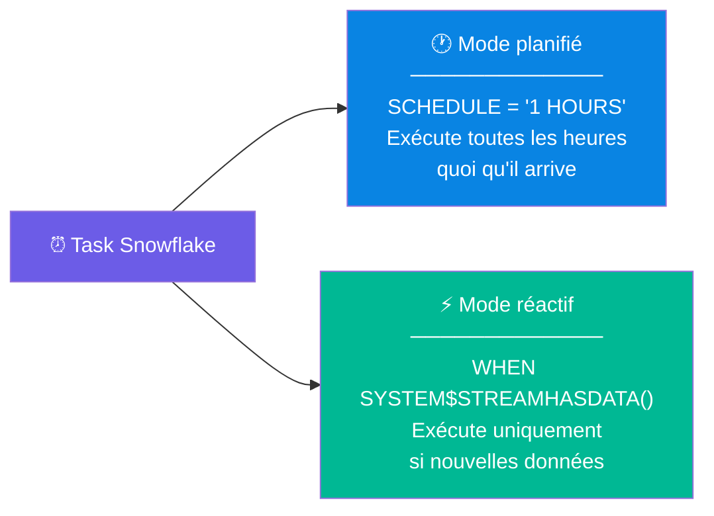
```mermaid
graph LR
    T[⏰ Task Snowflake]
    T --> M1["🕐 Mode planifié<br/>─────────────<br/>SCHEDULE = '1 HOURS'<br/>Exécute toutes les heures<br/>quoi qu'il arrive"]
    T --> M2["⚡ Mode réactif<br/>─────────────<br/>WHEN SYSTEM$STREAMHASDATA()<br/>Exécute uniquement<br/>si nouvelles données"]

    style T fill:#6c5ce7,color:#fff
    style M1 fill:#0984e3,color:#fff
    style M2 fill:#00b894,color:#fff
```

### Créer une Task — syntaxe de base

```sql
CREATE OR ALTER TASK mon_schema.ma_task
    WAREHOUSE = COMPUTE_WH      -- moteur de calcul utilisé (consomme des crédits)
    SCHEDULE  = '1 HOURS'       -- fréquence d'exécution automatique
AS
    SELECT 1;                   -- code SQL exécuté à chaque déclenchement
```

### Options de configuration importantes

| Option | Description | Exemple |
|---|---|---|
| `WAREHOUSE` | Moteur de calcul qui exécute la task | `COMPUTE_WH` |
| `SCHEDULE` | Fréquence (root task uniquement) | `'1 HOURS'`, `'5 MINUTES'`, `'USING CRON 0 * * * * UTC'` |
| `AFTER` | Dépendance vers une autre task | `AFTER mon_schema.ma_root_task` |
| `WHEN` | Condition pour s'exécuter | `WHEN SYSTEM$STREAMHASDATA('mon_stream')` |
| `USER_TASK_TIMEOUT_MS` | Timeout en millisecondes | `3600000` (= 1h) |
| `SUSPEND_TASK_AFTER_NUM_FAILURES` | Suspension auto après N échecs | `3` |

### Intervalle d'exécution — 2 syntaxes

```sql
-- Syntaxe simple (minutes ou heures)
SCHEDULE = '30 MINUTES'
SCHEDULE = '1 HOURS'

-- Syntaxe CRON (plus flexible — format Unix standard)
-- Format : minute heure jour_mois mois jour_semaine timezone
SCHEDULE = 'USING CRON 0 * * * * UTC'    -- toutes les heures pile
SCHEDULE = 'USING CRON 0 8 * * MON UTC'  -- tous les lundis à 8h UTC
SCHEDULE = 'USING CRON 0 0 1 * * UTC'    -- le 1er de chaque mois à minuit
```

### Définir un graphe de dépendance (DAG)

Un **DAG** (Directed Acyclic Graph) est un ensemble de tasks ordonnées avec des dépendances. La structure est toujours la même : une **root task** qui déclenche des **child tasks**.

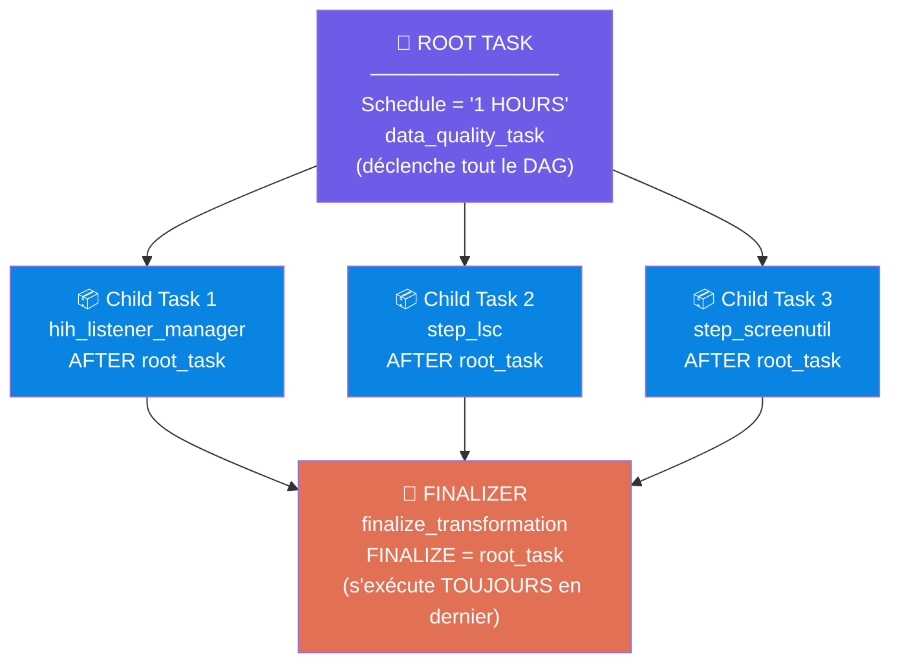
```mermaid
graph TD
    ROOT["🌱 ROOT TASK<br/>─────────────<br/>Schedule = '1 HOURS'<br/>data_quality_task<br/>(déclenche tout le DAG)"]

    ROOT --> C1["📦 Child Task 1<br/>hih_listener_manager<br/>AFTER root_task"]
    ROOT --> C2["📦 Child Task 2<br/>step_lsc<br/>AFTER root_task"]
    ROOT --> C3["📦 Child Task 3<br/>step_screenutil<br/>AFTER root_task"]

    C1 --> FIN["🏁 FINALIZER<br/>finalize_transformation<br/>FINALIZE = root_task<br/>(s'exécute TOUJOURS en dernier)"]
    C2 --> FIN
    C3 --> FIN

    style ROOT fill:#6c5ce7,color:#fff
    style C1 fill:#0984e3,color:#fff
    style C2 fill:#0984e3,color:#fff
    style C3 fill:#0984e3,color:#fff
    style FIN fill:#e17055,color:#fff
```

```sql
-- Root task : a un SCHEDULE, démarre tout le graphe
CREATE OR ALTER TASK raw.data_quality_task
    WAREHOUSE = COMPUTE_WH
    SCHEDULE  = '1 HOURS'
AS
    CALL raw.data_quality();

-- Child tasks : ont un AFTER, PAS de SCHEDULE
CREATE OR ALTER TASK raw.hih_listener_manager
    WAREHOUSE = COMPUTE_WH
    AFTER raw.data_quality_task       -- ← dépendance
AS
    CALL raw.enrich_data('hih_listener_manager', 'HiH_ListenerManager');
```

> 💡 **Règle fondamentale** : dans un DAG, **seule la root task a un `SCHEDULE`**. Les children n'ont que `AFTER`. Une task ne peut pas avoir les deux.

### Cycle de vie d'une Task

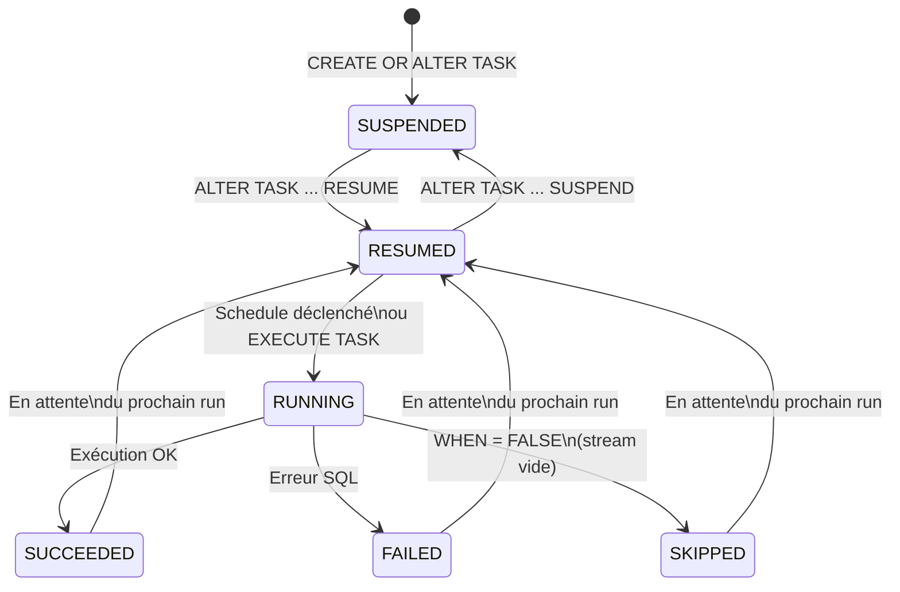
```mermaid
stateDiagram-v2
    [*] --> SUSPENDED : CREATE OR ALTER TASK

    SUSPENDED --> RESUMED : ALTER TASK ... RESUME
    RESUMED --> SUSPENDED : ALTER TASK ... SUSPEND
    RESUMED --> RUNNING : Schedule déclenché\nou EXECUTE TASK
    RUNNING --> SUCCEEDED : Exécution OK
    RUNNING --> FAILED : Erreur SQL
    RUNNING --> SKIPPED : WHEN = FALSE\n(stream vide)
    SUCCEEDED --> RESUMED : En attente\ndu prochain run
    FAILED --> RESUMED : En attente\ndu prochain run
    SKIPPED --> RESUMED : En attente\ndu prochain run
```

### Suspendre et re-démarrer — ordre obligatoire

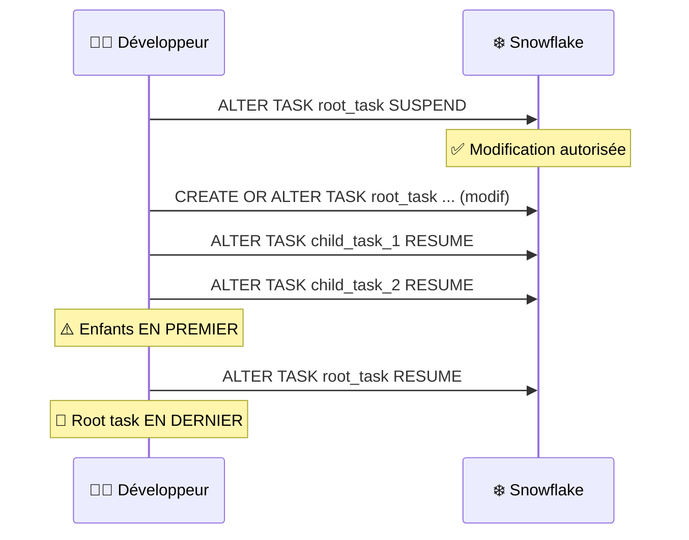
```mermaid
sequenceDiagram
    participant Dev as 👨‍💻 Développeur
    participant SF as ❄️ Snowflake

    Dev->>SF: ALTER TASK root_task SUSPEND
    Note over SF: ✅ Modification autorisée

    Dev->>SF: CREATE OR ALTER TASK root_task ... (modif)
    Dev->>SF: ALTER TASK child_task_1 RESUME
    Dev->>SF: ALTER TASK child_task_2 RESUME
    Note over Dev: ⚠️ Enfants EN PREMIER
    Dev->>SF: ALTER TASK root_task RESUME
    Note over Dev: 🔑 Root task EN DERNIER
```

```sql
-- 1. Suspendre (OBLIGATOIRE avant modification)
ALTER TASK raw.data_quality_task SUSPEND;

-- 2. Modifier la task
CREATE OR ALTER TASK raw.data_quality_task
    WAREHOUSE = COMPUTE_WH
    SCHEDULE  = '2 HOURS'  -- ← modification
AS ...;

-- 3. Re-démarrer : ENFANTS d'abord, ROOT en dernier
ALTER TASK raw.hih_listener_manager  RESUME;
ALTER TASK raw.step_lsc              RESUME;
ALTER TASK raw.step_screenutil       RESUME;
ALTER TASK raw.data_quality_task     RESUME;  -- ← EN DERNIER
```

> ⚠️ **Règle absolue** : `SUSPEND` avant toute modification, et `RESUME` de la root task **en dernier**. Si tu fais l'inverse, les children ne seront pas déclenchés.

---

## 2. Exécuter les tasks d'un graph

### Objectifs
- Exécuter manuellement un DAG
- Débugger des erreurs dans les tasks
- Utiliser `TASK_HISTORY` pour retrouver les exécutions

---

### Exécution manuelle

```sql
-- Force le déclenchement immédiat sans attendre le planning
-- Snowflake déclenche la root task, puis toutes les enfants en cascade
EXECUTE TASK raw.data_quality_task;
```

> 💡 Très utile pour tester un nouveau DAG sans attendre la prochaine échéance planifiée.

### Consulter l'historique d'exécution

```sql
-- Historique des tasks de la dernière heure
SELECT *
FROM TABLE(INFORMATION_SCHEMA.TASK_HISTORY(
    SCHEDULED_TIME_RANGE_START => DATEADD('hour', -1, current_timestamp())
))
WHERE schema_name = 'RAW'
ORDER BY SCHEDULED_TIME DESC;
```

**Colonnes clés à surveiller :**

| Colonne | Ce qu'elle indique |
|---|---|
| `NAME` | Nom de la task |
| `STATE` | `SUCCEEDED` / `FAILED` / `RUNNING` / `SKIPPED` |
| `SCHEDULED_TIME` | Quand la task était censée s'exécuter |
| `QUERY_START_TIME` | Quand elle a réellement démarré |
| `COMPLETED_TIME` | Quand elle a terminé |
| `ERROR_MESSAGE` | Détail de l'erreur si `STATE = FAILED` |
| `GRAPH_RUN_GROUP_ID` | ID unique du run complet du DAG |

### Comprendre les états d'une task

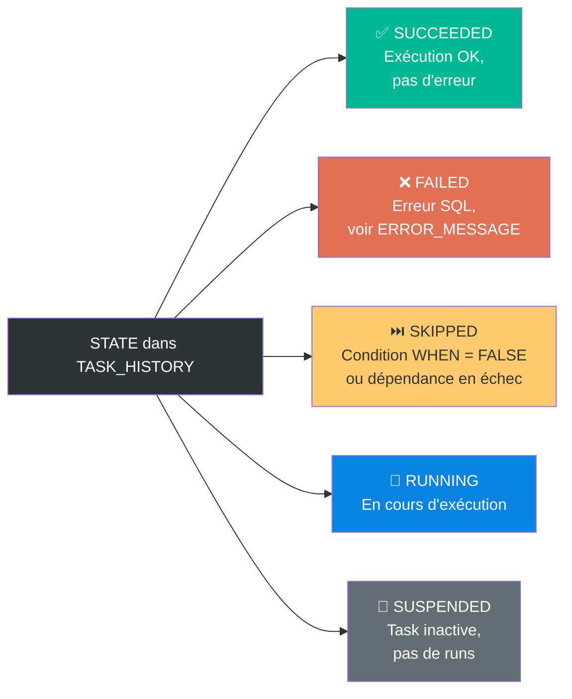
```mermaid
graph LR
    S[STATE dans TASK_HISTORY]
    S --> S1["✅ SUCCEEDED<br/>Exécution OK,<br/>pas d'erreur"]
    S --> S2["❌ FAILED<br/>Erreur SQL,<br/>voir ERROR_MESSAGE"]
    S --> S3["⏭️ SKIPPED<br/>Condition WHEN = FALSE<br/>ou dépendance en échec"]
    S --> S4["🔄 RUNNING<br/>En cours d'exécution"]
    S --> S5["🚫 SUSPENDED<br/>Task inactive,<br/>pas de runs"]

    style S fill:#2d3436,color:#fff
    style S1 fill:#00b894,color:#fff
    style S2 fill:#e17055,color:#fff
    style S3 fill:#fdcb6e,color:#333
    style S4 fill:#0984e3,color:#fff
    style S5 fill:#636e72,color:#fff
```

### Débugger une erreur dans une task

```sql
-- Étape 1 : trouver les tasks en échec
SELECT name, state, error_message, scheduled_time
FROM TABLE(INFORMATION_SCHEMA.TASK_HISTORY(
    SCHEDULED_TIME_RANGE_START => DATEADD('hour', -1, current_timestamp())
))
WHERE state = 'FAILED'
  AND schema_name = 'RAW';

-- Étape 2 : vérifier les logs de la table raw.logging
SELECT *
FROM raw.logging
WHERE error_message IS NOT NULL
ORDER BY created_at DESC;

-- Étape 3 : lister toutes les tasks et leur statut actuel
SHOW TASKS IN SCHEMA HEALTH_APP.RAW;
```

---

## 3. Comportement en cas de bug

### Objectifs
- Comprendre le comportement par défaut en cas d'erreur
- Savoir utiliser `RETRY LAST`
- Comprendre l'intérêt de découpler task et logique

---

### Comportement par défaut — propagation des erreurs

Quand une task **enfant** échoue dans un DAG :

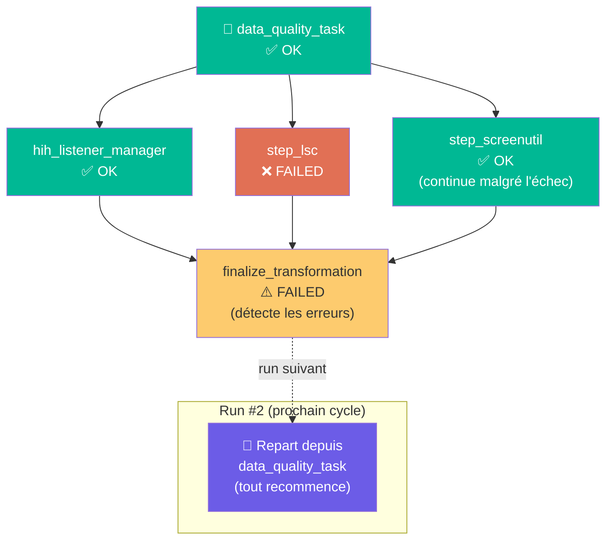
```mermaid
graph TD
    ROOT["🌱 data_quality_task<br/>✅ OK"]
    ROOT --> C1["hih_listener_manager<br/>✅ OK"]
    ROOT --> C2["step_lsc<br/>❌ FAILED"]
    ROOT --> C3["step_screenutil<br/>✅ OK<br/>(continue malgré l'échec)"]

    C1 --> FIN["finalize_transformation<br/>⚠️ FAILED<br/>(détecte les erreurs)"]
    C2 --> FIN
    C3 --> FIN

    subgraph "Run #2 (prochain cycle)"
        R2["🔄 Repart depuis<br/>data_quality_task<br/>(tout recommence)"]
    end

    FIN -.->|"run suivant"| R2

    style ROOT fill:#00b894,color:#fff
    style C1 fill:#00b894,color:#fff
    style C2 fill:#e17055,color:#fff
    style C3 fill:#00b894,color:#fff
    style FIN fill:#fdcb6e,color:#333
    style R2 fill:#6c5ce7,color:#fff
```

> **Comportement important** : les tasks enfants **parallèles** continuent même si l'une d'elles échoue. Le run suivant repart toujours depuis le début (root task).

### L'option `RETRY LAST`

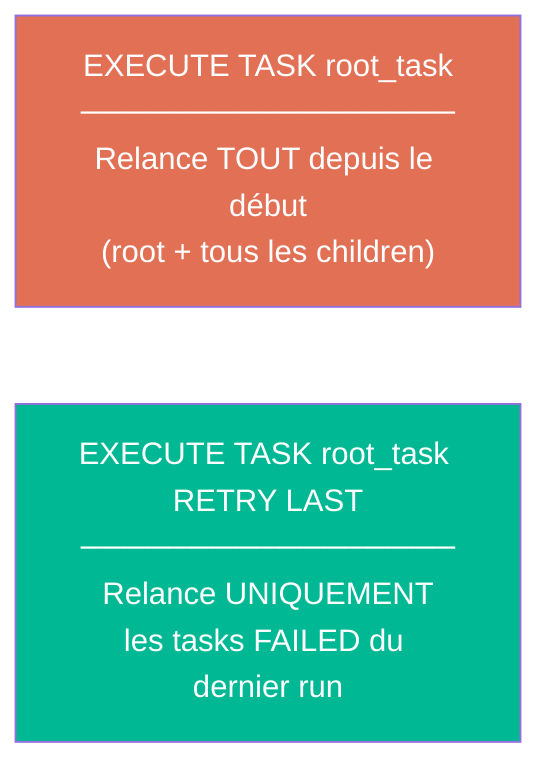
```mermaid
graph LR
    NORMAL["EXECUTE TASK root_task<br/>─────────────────<br/>Relance TOUT depuis le début<br/>(root + tous les children)"]
    RETRY["EXECUTE TASK root_task RETRY LAST<br/>─────────────────<br/>Relance UNIQUEMENT<br/>les tasks FAILED du dernier run"]

    style NORMAL fill:#e17055,color:#fff
    style RETRY fill:#00b894,color:#fff
```

```sql
-- Relancer uniquement les tasks FAILED du dernier run
EXECUTE TASK raw.data_quality_task RETRY LAST;
```

**Quand utiliser `RETRY LAST` ?**
- Le problème était temporaire (réseau, warehouse suspendu…)
- Les tasks qui ont réussi ne doivent pas être re-exécutées (éviter les doublons)
- Le DAG est long et relancer tout depuis le début est coûteux en crédits

### Découpler la définition des tasks de la logique

C'est le principe le plus important de ce chapitre.

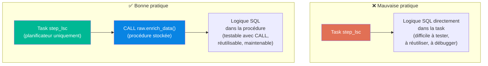
```mermaid
graph TD
    subgraph "❌ Mauvaise pratique"
        T1["Task step_lsc"] --> L1["Logique SQL directement<br/>dans la task<br/>(difficile à tester,<br/>à réutiliser, à débugger)"]
    end

    subgraph "✅ Bonne pratique"
        T2["Task step_lsc<br/>(planificateur uniquement)"] --> P2["CALL raw.enrich_data()<br/>(procédure stockée)"]
        P2 --> L2["Logique SQL<br/>dans la procédure<br/>(testable avec CALL,<br/>réutilisable, maintenable)"]
    end

    style T1 fill:#e17055,color:#fff
    style T2 fill:#00b894,color:#fff
    style P2 fill:#0984e3,color:#fff
```

```sql
-- ❌ Mauvaise pratique : logique dans la task
CREATE OR ALTER TASK raw.step_lsc
    WAREHOUSE = COMPUTE_WH
    AFTER raw.data_quality_task
AS
    -- Toute la logique est ici : difficile à tester sans déclencher la task
    INSERT INTO staging.step_lsc (event_timestamp, process_id, log_trigger, message)
    SELECT re.event_timestamp, re.process_id, ...
    FROM raw.raw_events re
    LEFT JOIN raw.data_anomalies da ON re.event_id = da.event_id
    WHERE re.process_name = 'Step_LSC'
      AND da.event_id IS NULL;

-- ✅ Bonne pratique : la task est juste un planificateur
CREATE OR ALTER TASK raw.step_lsc
    WAREHOUSE = COMPUTE_WH
    AFTER raw.data_quality_task
AS
DECLARE
    run_id STRING := SYSTEM$TASK_RUNTIME_INFO('CURRENT_TASK_GRAPH_RUN_GROUP_ID');
BEGIN
    CALL raw.enrich_data('step_lsc', 'Step_LSC', :run_id);
END;
```

**Avantages du découplage :**
- On peut tester la procédure avec `CALL` sans déclencher toute la task
- La logique est réutilisable dans d'autres contextes
- Plus facile à débugger (on isole le problème)
- Plus facile à faire évoluer sans toucher à la planification

---

## 4. Logging & qualité de la data

### Objectifs
- Mettre en place du logging dans les tasks
- Définir une procédure pour tester la qualité de la data reçue

---

### Architecture du logging

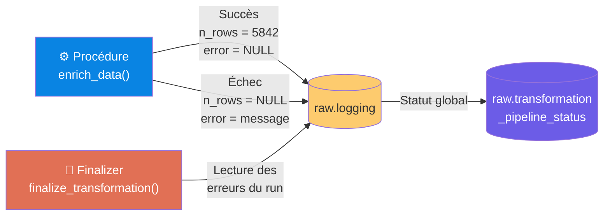
```mermaid
graph LR
    PROC["⚙️ Procédure<br/>enrich_data()"] -->|"Succès<br/>n_rows = 5842<br/>error = NULL"| LOG[(raw.logging)]
    PROC -->|"Échec<br/>n_rows = NULL<br/>error = message"| LOG
    
    FIN["🏁 Finalizer<br/>finalize_transformation()"] -->|"Lecture des<br/>erreurs du run"| LOG
    LOG -->|"Statut global"| STATUS[(raw.transformation\n_pipeline_status)]

    style PROC fill:#0984e3,color:#fff
    style FIN fill:#e17055,color:#fff
    style LOG fill:#fdcb6e,color:#333
    style STATUS fill:#6c5ce7,color:#fff
```

### La table de logging

```sql
CREATE OR ALTER TABLE raw.logging (
    created_at          TIMESTAMP DEFAULT CURRENT_TIMESTAMP(),
    graph_run_group_id  STRING,              -- ID unique du run complet du DAG
    table_name          STRING,              -- quelle table a été enrichie
    n_rows              NUMBER,              -- nb de lignes insérées (NULL si erreur)
    error_message       STRING DEFAULT NULL  -- NULL si succès, message si échec
);
```

**Comment lire les logs :**

| `n_rows` | `error_message` | Signification |
|---|---|---|
| `5842` | `NULL` | ✅ Succès — 5842 lignes insérées |
| `NULL` | `"Table not found..."` | ❌ Échec — voir le message d'erreur |
| `0` | `NULL` | ⚠️ Aucune donnée nouvelle ce run (normal) |

### La procédure de logging

```sql
CREATE OR REPLACE PROCEDURE raw.log_results(
    graph_run_group_id  STRING,
    table_name          STRING,
    n_rows              NUMBER,
    error_message       STRING
)
RETURNS STRING
LANGUAGE SQL
EXECUTE AS CALLER   -- s'exécute avec les droits de l'appelant (app_role)
AS $$
    INSERT INTO raw.logging (graph_run_group_id, table_name, n_rows, error_message)
    VALUES (:graph_run_group_id, :table_name, :n_rows, :error_message);
$$;
```

### La procédure de data quality

```sql
CREATE OR REPLACE PROCEDURE raw.data_quality(graph_run_group_id STRING)
RETURNS STRING
LANGUAGE SQL
EXECUTE AS CALLER
AS $$
BEGIN
    LET nbre_lignes_incorrectes INT := 0;

    -- Détecte les anomalies : timestamp invalide OU process_name invalide
    -- et les insère dans la table de quarantaine data_anomalies
    INSERT INTO raw.data_anomalies (event_id, is_correct_timestamp, is_correct_process_name, graph_run_group_id)
    WITH source AS (
        SELECT
            event_id,
            raw.check_correct_timestamp(event_timestamp)   AS is_correct_timestamp,
            raw.check_correct_process_name(process_name)   AS is_correct_process_name
        FROM raw.raw_events
    )
    SELECT *, :graph_run_group_id AS graph_run_group_id
    FROM source
    WHERE is_correct_timestamp = FALSE
       OR is_correct_process_name = FALSE;

    nbre_lignes_incorrectes := SQLROWCOUNT;  -- nb de lignes insérées dans data_anomalies
    RETURN :nbre_lignes_incorrectes;
END;
$$;
```

### Le `graph_run_group_id` — le concept clé du tracking

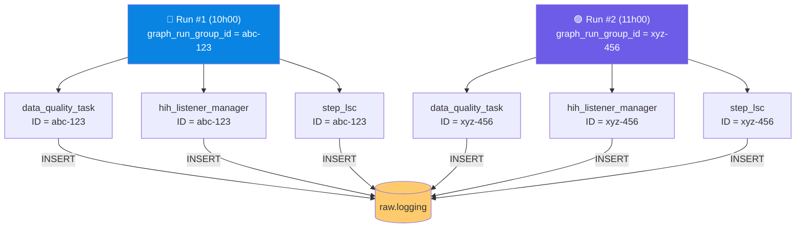
```mermaid
graph TD
    RUN1["🔵 Run #1 (10h00)<br/>graph_run_group_id = abc-123"]
    RUN1 --> T1A["data_quality_task<br/>ID = abc-123"]
    RUN1 --> T1B["hih_listener_manager<br/>ID = abc-123"]
    RUN1 --> T1C["step_lsc<br/>ID = abc-123"]

    RUN2["🟣 Run #2 (11h00)<br/>graph_run_group_id = xyz-456"]
    RUN2 --> T2A["data_quality_task<br/>ID = xyz-456"]
    RUN2 --> T2B["hih_listener_manager<br/>ID = xyz-456"]
    RUN2 --> T2C["step_lsc<br/>ID = xyz-456"]

    LOG[(raw.logging)]
    T1A -->|"INSERT"| LOG
    T1B -->|"INSERT"| LOG
    T1C -->|"INSERT"| LOG
    T2A -->|"INSERT"| LOG
    T2B -->|"INSERT"| LOG
    T2C -->|"INSERT"| LOG

    style RUN1 fill:#0984e3,color:#fff
    style RUN2 fill:#6c5ce7,color:#fff
    style LOG fill:#fdcb6e,color:#333
```

```sql
-- Retrouver TOUT ce qui s'est passé lors d'un run spécifique
SELECT * FROM raw.logging WHERE graph_run_group_id = 'abc-123';

-- Récupérer l'ID dans une task (variable système)
DECLARE
    run_id STRING := SYSTEM$TASK_RUNTIME_INFO('CURRENT_TASK_GRAPH_RUN_GROUP_ID');
```

---

## 5. Gestion des exceptions

### Objectifs
- Attraper les exceptions avec `WHEN OTHER THEN`
- Définir et lancer des exceptions personnalisées
- Utiliser `SQLERRM` pour comprendre la cause d'une erreur

---

### Structure d'un bloc avec exceptions

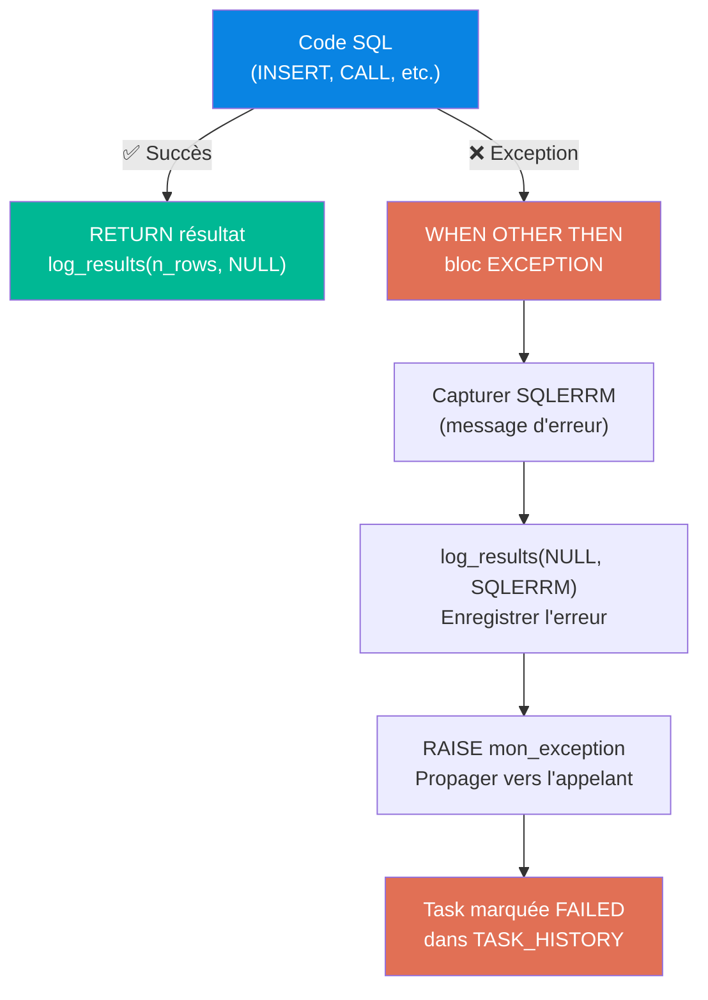
```mermaid
graph TD
    CODE["Code SQL<br/>(INSERT, CALL, etc.)"]
    CODE -->|"✅ Succès"| SUC["RETURN résultat<br/>log_results(n_rows, NULL)"]
    CODE -->|"❌ Exception"| EXC["WHEN OTHER THEN<br/>bloc EXCEPTION"]
    EXC --> CAP["Capturer SQLERRM<br/>(message d'erreur)"]
    CAP --> LOG["log_results(NULL, SQLERRM)<br/>Enregistrer l'erreur"]
    LOG --> RAISE["RAISE mon_exception<br/>Propager vers l'appelant"]
    RAISE --> FAIL["Task marquée FAILED<br/>dans TASK_HISTORY"]

    style CODE fill:#0984e3,color:#fff
    style SUC fill:#00b894,color:#fff
    style EXC fill:#e17055,color:#fff
    style FAIL fill:#e17055,color:#fff
```

```sql
DECLARE
    -- Exception personnalisée
    -- Code négatif (-9999) pour éviter les conflits avec les codes système Snowflake
    mon_exception EXCEPTION (-9999, 'Description de mon erreur');

BEGIN
    -- Code qui peut potentiellement échouer
    INSERT INTO ma_table ...;

EXCEPTION
    -- WHEN OTHER THEN = attrape TOUTES les exceptions non gérées
    WHEN OTHER THEN
        -- SQLERRM : variable système contenant le MESSAGE de l'erreur
        -- Ex: "Table 'STAGING.STEP_LSC' does not exist"
        LET message STRING := SQLERRM;

        -- Logger l'erreur
        INSERT INTO raw.logging (error_message) VALUES (:message);

        -- RAISE : re-propage l'exception vers l'appelant
        -- SANS RAISE : l'erreur est avalée silencieusement (dangereux !)
        RAISE mon_exception;
END;
```

### Les 3 variables système à connaître

| Variable | Contient | Disponible |
|---|---|---|
| `SQLROWCOUNT` | Nb de lignes affectées par le dernier DML | Après chaque INSERT/UPDATE/DELETE |
| `SQLERRM` | Message texte de la dernière erreur | Dans le bloc `EXCEPTION` uniquement |
| `SQLCODE` | Code numérique de la dernière erreur | Dans le bloc `EXCEPTION` uniquement |

### Exemple complet — `enrich_data` avec exceptions

```sql
CREATE OR REPLACE PROCEDURE raw.enrich_data(
    table_name          STRING,   -- nom de la table staging cible (ex: 'step_lsc')
    process_name        STRING,   -- filtre sur raw_events.process_name
    graph_run_group_id  STRING    -- ID du run pour la traçabilité
)
RETURNS STRING
LANGUAGE SQL
EXECUTE AS CALLER
AS $$
DECLARE
    -- IDENTIFIER() permet d'utiliser une variable STRING comme nom de table
    -- Équivalent dynamique de : INSERT INTO staging.step_lsc ...
    full_table_name  STRING := CONCAT('staging.', :table_name);
    insert_exception EXCEPTION (-9999, 'Exception in data loading into staging tables');

BEGIN
    LET n_rows INT := 0;

    -- Insertion dans la table staging dynamique
    INSERT INTO IDENTIFIER(:full_table_name) (event_timestamp, process_id, log_trigger, message)
    WITH source AS (
        SELECT
            re.event_timestamp,
            re.process_id,
            raw.extract_log_trigger(re.message) AS log_trigger,   -- UDF d'extraction
            raw.extract_log_message(re.message) AS message        -- UDF d'extraction
        FROM raw.raw_events re
        -- Anti-join : exclure les lignes marquées comme anomalies
        LEFT JOIN raw.data_anomalies da ON re.event_id = da.event_id
        WHERE re.process_name = :process_name
          AND da.event_id IS NULL        -- ← seulement les lignes SANS anomalie
    )
    SELECT event_timestamp, process_id, log_trigger, message
    FROM source;

    n_rows := SQLROWCOUNT;  -- récupère le nb de lignes insérées

    -- Log du SUCCÈS : n_rows = nb inséré, error_message = NULL
    CALL raw.log_results(:graph_run_group_id, :table_name, :n_rows, NULL);
    RETURN :n_rows;

EXCEPTION
    WHEN OTHER THEN
        -- 1. Log l'ÉCHEC : n_rows = NULL, error_message = texte de l'erreur
        -- 2. RAISE re-propage → Task marquée FAILED dans TASK_HISTORY
        CALL raw.log_results(:graph_run_group_id, :table_name, NULL, :SQLERRM);
        RAISE insert_exception;

END;
$$;
```

---

## 6. Introduction aux Streams

### Objectifs
- Comprendre le concept de Stream (CDC)
- Savoir créer et lire un stream
- Comprendre quand il est consommé

---

### Qu'est-ce qu'un Stream ?

Un **Stream** est un objet Snowflake qui **capture les changements** (INSERT, UPDATE, DELETE) survenus sur une table depuis sa dernière lecture. C'est du **Change Data Capture (CDC)** natif.

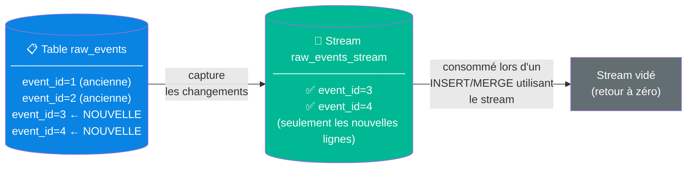
```mermaid
graph LR
    SRC[("📋 Table raw_events<br/>─────────────────<br/>event_id=1 (ancienne)<br/>event_id=2 (ancienne)<br/>event_id=3 ← NOUVELLE<br/>event_id=4 ← NOUVELLE")]
    STR[("🌊 Stream raw_events_stream<br/>─────────────────<br/>✅ event_id=3<br/>✅ event_id=4<br/>(seulement les nouvelles lignes)")]
    SRC -->|"capture<br/>les changements"| STR
    STR -->|"consommé lors d'un<br/>INSERT/MERGE utilisant<br/>le stream"| CONSUMED["Stream vidé<br/>(retour à zéro)"]

    style SRC fill:#0984e3,color:#fff
    style STR fill:#00b894,color:#fff
    style CONSUMED fill:#636e72,color:#fff
```

### Créer un Stream

```sql
-- Stream standard (capture INSERT + UPDATE + DELETE)
CREATE OR REPLACE STREAM raw.raw_events_stream
    ON TABLE raw.raw_events;

-- Stream append-only (capture uniquement les INSERT — plus léger)
-- Recommandé quand la table source ne reçoit que des nouvelles lignes
CREATE OR REPLACE STREAM raw.raw_events_stream
    ON TABLE raw.raw_events
    APPEND_ONLY = TRUE;
```

### Colonnes spéciales d'un Stream

Quand tu lis un stream, des colonnes supplémentaires sont automatiquement disponibles :

| Colonne | Type | Contient |
|---|---|---|
| `METADATA$ACTION` | STRING | `INSERT` ou `DELETE` |
| `METADATA$ISUPDATE` | BOOLEAN | `TRUE` si c'est la partie UPDATE d'un changement |
| `METADATA$ROW_ID` | STRING | Identifiant unique de la ligne dans le stream |

### Comportement clé : consommation du stream

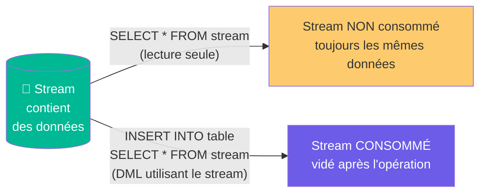
```mermaid
graph LR
    S[("🌊 Stream<br/>contient<br/>des données")]
    S -->|"SELECT * FROM stream<br/>(lecture seule)"| NC["Stream NON consommé<br/>toujours les mêmes données"]
    S -->|"INSERT INTO table<br/>SELECT * FROM stream<br/>(DML utilisant le stream)"| C["Stream CONSOMMÉ<br/>vidé après l'opération"]

    style S fill:#00b894,color:#fff
    style NC fill:#fdcb6e,color:#333
    style C fill:#6c5ce7,color:#fff
```

```sql
-- ❌ Ne consomme PAS le stream (lecture simple)
SELECT * FROM raw.raw_events_stream;

-- ✅ Consomme le stream (les données lues disparaissent du stream)
INSERT INTO staging.raw_events_copy
SELECT * FROM raw.raw_events_stream;

-- Vérifier si un stream a des données
SELECT SYSTEM$STREAMHASDATA('raw.raw_events_stream');
-- → TRUE  : données non consommées présentes
-- → FALSE : stream vide
```

---

## 7. Tasks Event Driven

### Objectifs
- Comprendre l'architecture réactive vs planifiée
- Utiliser `SYSTEM$STREAMHASDATA` dans une task
- Débugger des tasks event-driven

---

### Architecture planifiée vs réactive

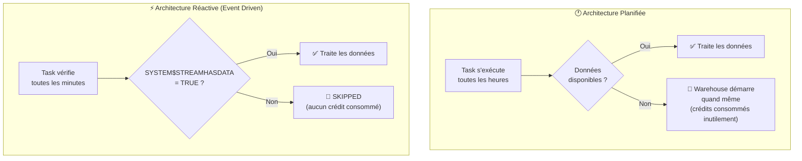
```mermaid
graph TD
    subgraph "🕐 Architecture Planifiée"
        T1["Task s'exécute<br/>toutes les heures"] --> C1{"Données<br/>disponibles ?"}
        C1 -->|"Oui"| P1["✅ Traite les données"]
        C1 -->|"Non"| W1["💸 Warehouse démarre<br/>quand même<br/>(crédits consommés inutilement)"]
    end

    subgraph "⚡ Architecture Réactive (Event Driven)"
        T2["Task vérifie<br/>toutes les minutes"] --> C2{"SYSTEM$STREAMHASDATA<br/>= TRUE ?"}
        C2 -->|"Oui"| P2["✅ Traite les données"]
        C2 -->|"Non"| W2["🎉 SKIPPED<br/>(aucun crédit consommé)"]
    end
```

> 💡 **Avantage clé** : en mode event-driven, quand `SYSTEM$STREAMHASDATA` retourne `FALSE`, la task est marquée `SKIPPED` et le warehouse ne démarre **pas**. Pas de crédits consommés pour rien.

### Créer une task déclenchée par un stream

```sql
-- Root task avec SCHEDULE + condition WHEN
-- Le SCHEDULE définit la fréquence de VÉRIFICATION, pas d'exécution
CREATE OR ALTER TASK raw.data_quality_task
    WAREHOUSE = COMPUTE_WH
    SCHEDULE  = '1 MINUTES'   -- vérifie toutes les minutes
    WHEN SYSTEM$STREAMHASDATA('raw.raw_events_stream')  -- s'exécute SEULEMENT si données
AS
DECLARE
    run_id STRING := SYSTEM$TASK_RUNTIME_INFO('CURRENT_TASK_GRAPH_RUN_GROUP_ID');
BEGIN
    CALL raw.data_quality(:run_id);
END;
```

### Débugger une task event-driven

```sql
-- Vérifier les états : SKIPPED = normal (stream vide), FAILED = erreur
SELECT name, state, error_message, scheduled_time
FROM TABLE(INFORMATION_SCHEMA.TASK_HISTORY(
    SCHEDULED_TIME_RANGE_START => DATEADD('hour', -1, current_timestamp())
))
WHERE schema_name = 'RAW'
ORDER BY scheduled_time DESC;
-- STATE = 'SKIPPED'    → normal, stream vide à ce moment-là
-- STATE = 'SUCCEEDED'  → données traitées ✅
-- STATE = 'FAILED'     → erreur, voir error_message ❌

-- Vérifier manuellement l'état du stream
SELECT SYSTEM$STREAMHASDATA('raw.raw_events_stream');
SELECT COUNT(*) FROM raw.raw_events_stream;  -- combien de lignes en attente ?
```

---

## 8. La task Finalizer

### Objectifs
- Définir une task de clôture de DAG
- Comprendre le rôle et la syntaxe du Finalizer
- Débugger les tasks Finalizer

---

### Qu'est-ce qu'un Finalizer ?

Le **Finalizer** est une task spéciale qui s'exécute **toujours en dernier**, que le DAG ait réussi ou échoué.

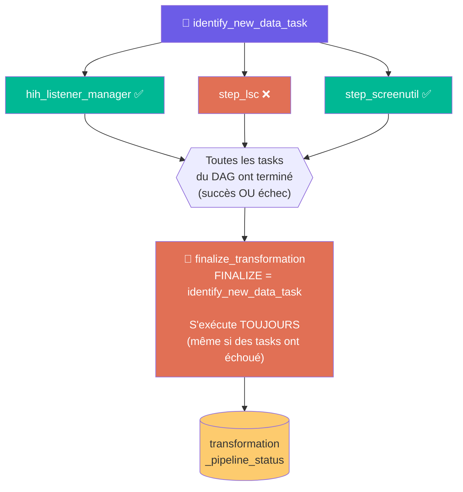
```mermaid
graph TD
    ROOT["🌱 identify_new_data_task"]
    ROOT --> C1["hih_listener_manager ✅"]
    ROOT --> C2["step_lsc ❌"]
    ROOT --> C3["step_screenutil ✅"]
    C1 --> BARRIER{{"Toutes les tasks<br/>du DAG ont terminé<br/>(succès OU échec)"}}
    C2 --> BARRIER
    C3 --> BARRIER
    BARRIER --> FIN["🏁 finalize_transformation<br/>FINALIZE = identify_new_data_task<br/><br/>S'exécute TOUJOURS<br/>(même si des tasks ont échoué)"]
    FIN --> STATUS[(transformation\n_pipeline_status)]

    style ROOT fill:#6c5ce7,color:#fff
    style C1 fill:#00b894,color:#fff
    style C2 fill:#e17055,color:#fff
    style C3 fill:#00b894,color:#fff
    style FIN fill:#e17055,color:#fff
    style STATUS fill:#fdcb6e,color:#333
```

**Différence `AFTER` vs `FINALIZE` :**

| | `AFTER` | `FINALIZE` |
|---|---|---|
| S'exécute après | UNE task spécifique | TOUTES les tasks du DAG |
| Si la parente a échoué | Ne s'exécute PAS | S'exécute QUAND MÊME |
| Nombre par DAG | Illimité | Un seul |
| Usage | Dépendance normale | Clôture, nettoyage, notification |

### Table de suivi du pipeline

```sql
-- Stocke le statut global de chaque run du DAG
CREATE OR ALTER TABLE raw.transformation_pipeline_status (
    graph_run_group_id  STRING,     -- ID unique du run
    started_at          TIMESTAMP,  -- heure de démarrage (root task)
    finished_at         TIMESTAMP,  -- heure de fin (enregistrée par le Finalizer)
    status              STRING      -- 'SUCCEEDED' ou 'FAILED'
);
```

### La procédure `finalize_transformation`

```sql
CREATE OR REPLACE PROCEDURE raw.finalize_transformation(
    graph_run_group_id  STRING,    -- ID du run transmis par la task
    started_at          TIMESTAMP  -- timestamp de démarrage de la root task
)
RETURNS STRING
LANGUAGE SQL
EXECUTE AS CALLER
AS
$$
DECLARE
    pipeline_exception EXCEPTION (-20002, 'Exception in the transformation pipeline');
BEGIN
    LET n_errors INT := 0;

    -- Étape A : Compter les erreurs de ce run dans raw.logging
    -- error_message IS NOT NULL = au moins une task a planté
    SELECT COUNT(*) INTO n_errors
    FROM raw.logging
    WHERE graph_run_group_id = :graph_run_group_id
      AND error_message IS NOT NULL;

    -- Étape B : Enregistrer le statut global du run
    -- IFF(condition, valeur_si_vrai, valeur_si_faux) = ternaire Snowflake
    INSERT INTO raw.transformation_pipeline_status (graph_run_group_id, started_at, finished_at, status)
    SELECT
        :graph_run_group_id  AS graph_run_group_id,
        :started_at          AS started_at,
        CURRENT_TIMESTAMP()  AS finished_at,
        IFF(:n_errors > 0, 'FAILED', 'SUCCEEDED');  -- ← statut conditionnel

    -- Étape C : Nettoyage conditionnel
    IF (n_errors = 0) THEN
        -- Tout s'est bien passé → nettoyage de la table intermédiaire
        TRUNCATE TABLE raw.data_to_process;
    ELSE
        -- Des erreurs ont eu lieu → propage l'exception (Finalizer = FAILED)
        RAISE pipeline_exception;
    END IF;

END;
$$;
```

### La task Finalizer

```sql
CREATE OR ALTER TASK raw.finalize_transformation
    WAREHOUSE = COMPUTE_WH
    FINALIZE  = 'raw.identify_new_data_task'  -- ← lié à la root task du DAG
AS
DECLARE
    -- Récupère l'ID du run (partagé par toutes les tasks du DAG)
    graph_run_group_id STRING    := SYSTEM$TASK_RUNTIME_INFO('CURRENT_TASK_GRAPH_RUN_GROUP_ID');
    -- Timestamp de démarrage prévu de la root task (pour calculer la durée)
    started_at         TIMESTAMP := SYSTEM$TASK_RUNTIME_INFO('CURRENT_TASK_GRAPH_ORIGINAL_SCHEDULED_TIMESTAMP');
BEGIN
    CALL raw.finalize_transformation(:graph_run_group_id, :started_at);
END;
```

### Flux complet du Finalizer

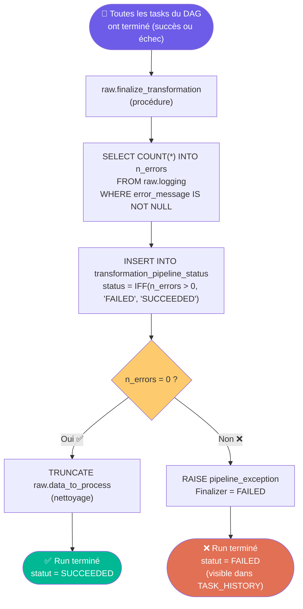
```mermaid
flowchart TD
    START(["🏁 Toutes les tasks du DAG<br/>ont terminé (succès ou échec)"])
    START --> PROC["raw.finalize_transformation<br/>(procédure)"]
    PROC --> COUNT["SELECT COUNT(*) INTO n_errors<br/>FROM raw.logging<br/>WHERE error_message IS NOT NULL"]
    COUNT --> INSERT["INSERT INTO transformation_pipeline_status<br/>status = IFF(n_errors > 0, 'FAILED', 'SUCCEEDED')"]
    INSERT --> COND{n_errors = 0 ?}
    COND -->|"Oui ✅"| TRUNC["TRUNCATE raw.data_to_process<br/>(nettoyage)"]
    COND -->|"Non ❌"| RAISE["RAISE pipeline_exception<br/>Finalizer = FAILED"]
    TRUNC --> END1(["✅ Run terminé<br/>statut = SUCCEEDED"])
    RAISE --> END2(["❌ Run terminé<br/>statut = FAILED<br/>(visible dans TASK_HISTORY)"])

    style START fill:#6c5ce7,color:#fff
    style COND fill:#fdcb6e,color:#333
    style END1 fill:#00b894,color:#fff
    style END2 fill:#e17055,color:#fff
```

### `SYSTEM$TASK_RUNTIME_INFO` — paramètres utiles

| Paramètre | Type | Contient |
|---|---|---|
| `'CURRENT_TASK_GRAPH_RUN_GROUP_ID'` | STRING | ID unique du run complet du DAG |
| `'CURRENT_TASK_GRAPH_ORIGINAL_SCHEDULED_TIMESTAMP'` | TIMESTAMP | Timestamp prévu de démarrage de la root task |
| `'CURRENT_TASK_NAME'` | STRING | Nom complet de la task en cours |

---

## 9. Architecture du projet health_app

### Vue d'ensemble du pipeline complet

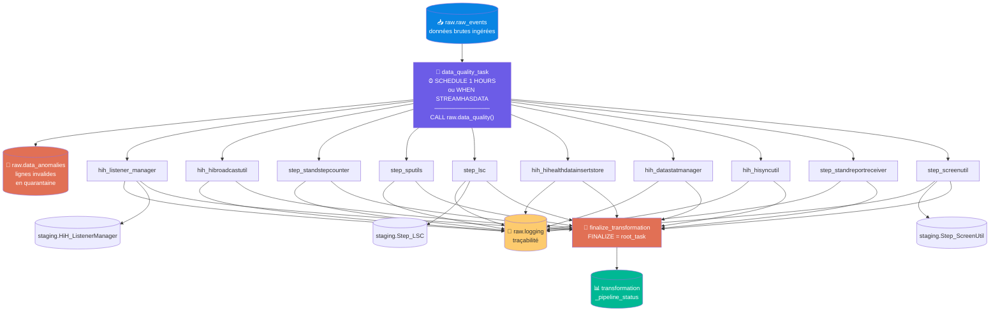
```mermaid
graph TD
    SRC[("📥 raw.raw_events<br/>données brutes ingérées")]

    SRC --> ROOT["🌱 data_quality_task<br/>⏰ SCHEDULE 1 HOURS<br/>ou WHEN STREAMHASDATA<br/>─────────────<br/>CALL raw.data_quality()"]

    ROOT --> QA[("🚫 raw.data_anomalies<br/>lignes invalides<br/>en quarantaine")]

    ROOT --> T1["hih_listener_manager"]
    ROOT --> T2["hih_hibroadcastutil"]
    ROOT --> T3["step_standstepcounter"]
    ROOT --> T4["step_sputils"]
    ROOT --> T5["step_lsc"]
    ROOT --> T6["hih_hihealthdatainsertstore"]
    ROOT --> T7["hih_datastatmanager"]
    ROOT --> T8["hih_hisyncutil"]
    ROOT --> T9["step_standreportreceiver"]
    ROOT --> T10["step_screenutil"]

    T1 & T2 & T3 & T4 & T5 & T6 & T7 & T8 & T9 & T10 --> LOG[("📝 raw.logging<br/>traçabilité")]
    T1 --> S1[("staging.HiH_ListenerManager")]
    T5 --> S5[("staging.Step_LSC")]
    T10 --> S10[("staging.Step_ScreenUtil")]

    T1 & T2 & T3 & T4 & T5 & T6 & T7 & T8 & T9 & T10 --> FIN["🏁 finalize_transformation<br/>FINALIZE = root_task"]

    FIN --> STATUS[("📊 transformation<br/>_pipeline_status")]

    style SRC fill:#0984e3,color:#fff
    style ROOT fill:#6c5ce7,color:#fff
    style QA fill:#e17055,color:#fff
    style LOG fill:#fdcb6e,color:#333
    style FIN fill:#e17055,color:#fff
    style STATUS fill:#00b894,color:#fff
```

### Les tables du projet

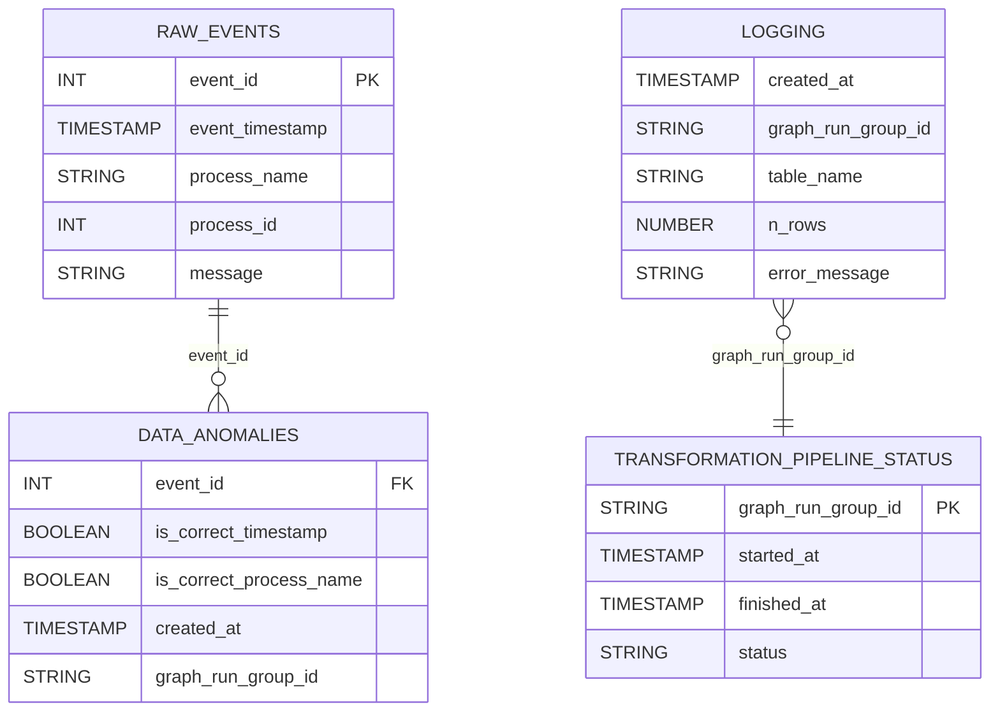
```mermaid
erDiagram
    RAW_EVENTS {
        INT event_id PK
        TIMESTAMP event_timestamp
        STRING process_name
        INT process_id
        STRING message
    }

    DATA_ANOMALIES {
        INT event_id FK
        BOOLEAN is_correct_timestamp
        BOOLEAN is_correct_process_name
        TIMESTAMP created_at
        STRING graph_run_group_id
    }

    LOGGING {
        TIMESTAMP created_at
        STRING graph_run_group_id
        STRING table_name
        NUMBER n_rows
        STRING error_message
    }

    TRANSFORMATION_PIPELINE_STATUS {
        STRING graph_run_group_id PK
        TIMESTAMP started_at
        TIMESTAMP finished_at
        STRING status
    }

    RAW_EVENTS ||--o{ DATA_ANOMALIES : "event_id"
    LOGGING }o--|| TRANSFORMATION_PIPELINE_STATUS : "graph_run_group_id"
```

### Le LEFT JOIN anti-anomalie

Technique pour exclure les lignes invalides sans les supprimer de la table source :

```sql
-- Exclure les lignes marquées comme anomalies
SELECT re.*
FROM raw.raw_events re
LEFT JOIN raw.data_anomalies da ON re.event_id = da.event_id
WHERE da.event_id IS NULL;  -- ← garde UNIQUEMENT les lignes SANS entrée dans data_anomalies
```

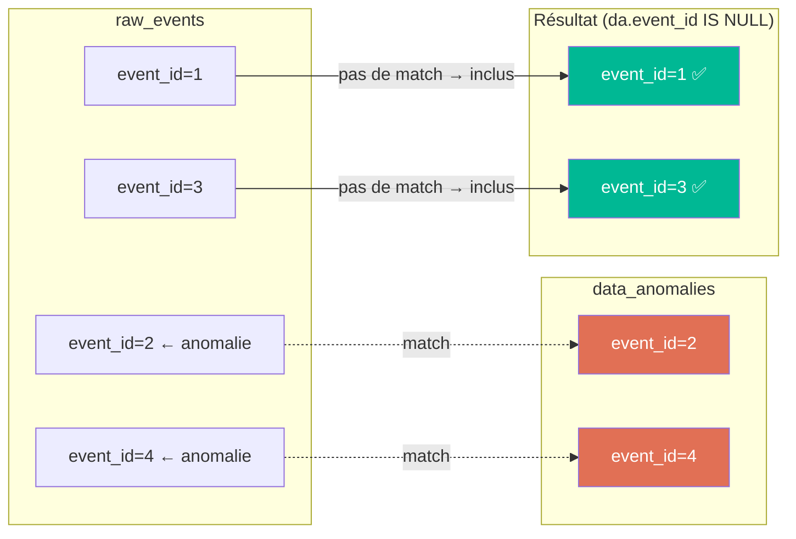
```mermaid
graph LR
    subgraph "raw_events"
        R1["event_id=1"]
        R2["event_id=2 ← anomalie"]
        R3["event_id=3"]
        R4["event_id=4 ← anomalie"]
    end

    subgraph "data_anomalies"
        A2["event_id=2"]
        A4["event_id=4"]
    end

    subgraph "Résultat (da.event_id IS NULL)"
        OK1["event_id=1 ✅"]
        OK3["event_id=3 ✅"]
    end

    R2 -.->|"match"| A2
    R4 -.->|"match"| A4
    R1 -->|"pas de match → inclus"| OK1
    R3 -->|"pas de match → inclus"| OK3

    style OK1 fill:#00b894,color:#fff
    style OK3 fill:#00b894,color:#fff
    style A2 fill:#e17055,color:#fff
    style A4 fill:#e17055,color:#fff
```

### Les UDFs requises

| UDF | Rôle | Signature |
|---|---|---|
| `raw.check_correct_timestamp()` | Valide le format/plage du timestamp | `(TIMESTAMP) → BOOLEAN` |
| `raw.check_correct_process_name()` | Valide que le process_name est connu | `(STRING) → BOOLEAN` |
| `raw.extract_log_trigger()` | Extrait le type d'événement du message brut | `(STRING) → STRING` |
| `raw.extract_log_message()` | Nettoie et extrait le message réel | `(STRING) → STRING` |

---

## 10. Glossaire complet

| Terme | Définition |
|---|---|
| **Task** | Tâche SQL automatisée dans Snowflake (planificateur) |
| **DAG** | Directed Acyclic Graph — graphe de tâches ordonnées sans cycle |
| **Root Task** | Tâche principale du DAG (a un `SCHEDULE`, démarre tout) |
| **Child Task** | Tâche enfant déclenchée après une autre (a un `AFTER`) |
| **Finalizer Task** | Tâche spéciale qui s'exécute après TOUTES les tasks du DAG |
| **Warehouse** | Moteur de calcul Snowflake (CPU/RAM), consomme des crédits |
| `SCHEDULE` | Fréquence de déclenchement automatique |
| `AFTER` | Dépendance — s'exécute après la task citée |
| `FINALIZE` | Paramètre désignant une task comme finaliseur du DAG |
| `WHEN` | Condition supplémentaire pour s'exécuter (ex: STREAMHASDATA) |
| `SUSPEND / RESUME` | Désactiver / activer une task |
| `RETRY LAST` | Relancer uniquement les tasks FAILED du dernier run |
| **Stream** | Objet qui capture les changements (CDC) sur une table |
| **Append-Only Stream** | Stream qui capture uniquement les INSERT (plus léger) |
| `SYSTEM$STREAMHASDATA` | Retourne TRUE si un stream a des données non consommées |
| `SYSTEM$TASK_RUNTIME_INFO` | Expose les infos du run en cours (ID, timestamp...) |
| **graph_run_group_id** | ID unique d'un run complet du DAG — partagé par toutes les tasks |
| **Procédure stockée** | Bloc de code SQL nommé et réutilisable (appelé avec `CALL`) |
| **UDF** | User Defined Function — fonction personnalisée |
| `IDENTIFIER()` | Permet d'utiliser une variable STRING comme nom de table dynamique |
| `SQLROWCOUNT` | Nb de lignes affectées par le dernier INSERT/UPDATE/DELETE |
| `SQLERRM` | Message texte de la dernière erreur (disponible dans `EXCEPTION`) |
| `SQLCODE` | Code numérique de la dernière erreur |
| `WHEN OTHER THEN` | Intercepte toutes les exceptions non gérées |
| `RAISE` | Re-propage une exception vers l'appelant |
| `EXECUTE AS CALLER` | La procédure s'exécute avec les droits de l'appelant |
| **CDC** | Change Data Capture — mécanisme de capture des changements |

---

## 11. Checklist de déploiement

### Prérequis

```
[ ] Les UDFs existent dans le schéma raw :
    [ ] raw.check_correct_timestamp()
    [ ] raw.check_correct_process_name()
    [ ] raw.extract_log_trigger()
    [ ] raw.extract_log_message()

[ ] Les tables staging existent pour chaque process

[ ] Le warehouse COMPUTE_WH existe et est actif

[ ] Le rôle a les droits (voir Chapitre 4 — RBAC) :
    [ ] CREATE TASK sur le schéma raw
    [ ] INSERT sur les tables staging
    [ ] EXECUTE sur les procédures
    [ ] CREATE STREAM (si architecture event-driven)
```

### Ordre d'exécution du script

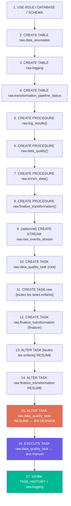
```mermaid
graph TD
    S1["1. USE ROLE / DATABASE / SCHEMA"]
    S2["2. CREATE TABLE raw.data_anomalies"]
    S3["3. CREATE TABLE raw.logging"]
    S4["4. CREATE TABLE raw.transformation_pipeline_status"]
    S5["5. CREATE PROCEDURE raw.log_results()"]
    S6["6. CREATE PROCEDURE raw.data_quality()"]
    S7["7. CREATE PROCEDURE raw.enrich_data()"]
    S8["8. CREATE PROCEDURE raw.finalize_transformation()"]
    S9["9. (optionnel) CREATE STREAM raw.raw_events_stream"]
    S10["10. CREATE TASK raw.data_quality_task (root)"]
    S11["11. CREATE TASK raw.[toutes les tasks enfants]"]
    S12["12. CREATE TASK raw.finalize_transformation (finalizer)"]
    S13["13. ALTER TASK [toutes les enfants] RESUME"]
    S14["14. ALTER TASK raw.finalize_transformation RESUME"]
    S15["15. ALTER TASK raw.data_quality_task RESUME ← EN DERNIER"]
    S16["16. EXECUTE TASK raw.data_quality_task ← test manuel"]
    S17["17. Vérifier TASK_HISTORY + raw.logging"]

    S1 --> S2 --> S3 --> S4 --> S5 --> S6 --> S7 --> S8 --> S9 --> S10 --> S11 --> S12 --> S13 --> S14 --> S15 --> S16 --> S17

    style S15 fill:#e17055,color:#fff
    style S16 fill:#6c5ce7,color:#fff
    style S17 fill:#00b894,color:#fff
```

---

## 12. Patterns réutilisables

### Pattern 1 — DAG complet avec logging et exceptions

```sql
-- ============================================================
-- ROOT TASK
-- ============================================================
CREATE OR ALTER TASK mon_schema.root_task
    WAREHOUSE = COMPUTE_WH
    SCHEDULE = '1 HOURS'
AS
DECLARE
    run_id STRING := SYSTEM$TASK_RUNTIME_INFO('CURRENT_TASK_GRAPH_RUN_GROUP_ID');
BEGIN
    CALL mon_schema.ma_procedure_principale(:run_id);
END;

-- ============================================================
-- CHILD TASK (dupliquer ce pattern pour chaque enfant)
-- ============================================================
CREATE OR ALTER TASK mon_schema.child_task
    WAREHOUSE = COMPUTE_WH
    AFTER mon_schema.root_task
AS
DECLARE
    run_id STRING := SYSTEM$TASK_RUNTIME_INFO('CURRENT_TASK_GRAPH_RUN_GROUP_ID');
BEGIN
    CALL mon_schema.ma_procedure_secondaire(:run_id);
END;

-- ============================================================
-- FINALIZER
-- ============================================================
CREATE OR ALTER TASK mon_schema.finalizer_task
    WAREHOUSE = COMPUTE_WH
    FINALIZE = 'mon_schema.root_task'
AS
DECLARE
    run_id     STRING    := SYSTEM$TASK_RUNTIME_INFO('CURRENT_TASK_GRAPH_RUN_GROUP_ID');
    started_at TIMESTAMP := SYSTEM$TASK_RUNTIME_INFO('CURRENT_TASK_GRAPH_ORIGINAL_SCHEDULED_TIMESTAMP');
BEGIN
    CALL mon_schema.ma_procedure_finale(:run_id, :started_at);
END;

-- ============================================================
-- ACTIVATION — ordre obligatoire
-- ============================================================
ALTER TASK mon_schema.child_task     RESUME;
ALTER TASK mon_schema.finalizer_task RESUME;
ALTER TASK mon_schema.root_task      RESUME;  -- ← EN DERNIER
```

### Pattern 2 — Task event-driven avec Stream

```sql
-- Créer le stream (append-only si table source = insert only)
CREATE OR REPLACE STREAM mon_schema.ma_table_stream
    ON TABLE mon_schema.ma_table
    APPEND_ONLY = TRUE;

-- Task déclenchée uniquement si le stream a des données
CREATE OR ALTER TASK mon_schema.ma_task_reactive
    WAREHOUSE = COMPUTE_WH
    SCHEDULE = '1 MINUTES'  -- fréquence de vérification
    WHEN SYSTEM$STREAMHASDATA('mon_schema.ma_table_stream')  -- condition de déclenchement
AS
DECLARE
    run_id STRING := SYSTEM$TASK_RUNTIME_INFO('CURRENT_TASK_GRAPH_RUN_GROUP_ID');
BEGIN
    CALL mon_schema.traiter_nouvelles_donnees(:run_id);
END;
```

### Pattern 3 — Procédure avec logging et gestion d'erreur

```sql
CREATE OR REPLACE PROCEDURE mon_schema.traiter_table(
    table_name STRING,
    run_id     STRING
)
RETURNS STRING
LANGUAGE SQL
EXECUTE AS CALLER
AS $$
DECLARE
    full_table  STRING    := CONCAT('mon_staging.', :table_name);
    mon_erreur  EXCEPTION (-9999, 'Erreur lors du traitement');
BEGIN
    LET n INT := 0;

    -- Traitement
    INSERT INTO IDENTIFIER(:full_table) (col1, col2)
    SELECT col1, col2
    FROM mon_schema.ma_source
    WHERE condition = :table_name;

    n := SQLROWCOUNT;  -- nb de lignes insérées

    -- Log succès
    CALL mon_schema.log_results(:run_id, :table_name, :n, NULL);
    RETURN :n;

EXCEPTION
    WHEN OTHER THEN
        -- Log échec + re-propagation de l'erreur
        CALL mon_schema.log_results(:run_id, :table_name, NULL, :SQLERRM);
        RAISE mon_erreur;

END;
$$;
```

### Pattern 4 — Requêtes de monitoring standard

```sql
-- ============================================================
-- DASHBOARD D'UN RUN SPÉCIFIQUE
-- ============================================================
SELECT
    table_name,
    n_rows,
    CASE WHEN error_message IS NULL THEN '✅ Succès' ELSE '❌ Échec' END AS statut,
    error_message
FROM raw.logging
WHERE graph_run_group_id = 'TON_RUN_ID'
ORDER BY created_at;

-- ============================================================
-- TASKS EN ÉCHEC DES DERNIÈRES 24H
-- ============================================================
SELECT name, state, error_message, scheduled_time
FROM TABLE(INFORMATION_SCHEMA.TASK_HISTORY(
    SCHEDULED_TIME_RANGE_START => DATEADD('hour', -24, current_timestamp())
))
WHERE state = 'FAILED'
  AND schema_name = 'RAW'
ORDER BY scheduled_time DESC;

-- ============================================================
-- RÉSUMÉ PAR RUN (nb succès, nb échecs)
-- ============================================================
SELECT
    graph_run_group_id,
    MIN(created_at) AS started_at,
    COUNT(*) AS total_tables,
    SUM(CASE WHEN error_message IS NULL THEN 1 ELSE 0 END) AS succes,
    SUM(CASE WHEN error_message IS NOT NULL THEN 1 ELSE 0 END) AS echecs
FROM raw.logging
GROUP BY graph_run_group_id
ORDER BY MIN(created_at) DESC;
```

---

## 13. Méthodologie de résolution de problèmes

> Une task ne s'exécute pas comme prévu ? Suis ce guide avant de modifier quoi que ce soit.

### Arbre de décision : "Ma task ne fonctionne pas"

```mermaid
flowchart TD
    START(["❌ Problème avec une task"]) --> Q1{Quel symptôme ?}

    Q1 -->|"Task jamais déclenchée"| B1[Chemin A : pas de déclenchement]
    Q1 -->|"Task FAILED"| B2[Chemin B : échec d'exécution]
    Q1 -->|"Task SKIPPED en permanence"| B3[Chemin C : toujours skippée]
    Q1 -->|"Task SUCCEEDED mais données manquantes"| B4[Chemin D : résultat incorrect]
    Q1 -->|"Impossible de modifier la task"| B5[Chemin E : modification bloquée]

    B1 --> C1{"SHOW TASKS : task<br/>à l'état RESUMED ?"}
    C1 -->|"Non (SUSPENDED)"| F1["ALTER TASK ... RESUME;<br/>⚠️ Résumer les children D'ABORD<br/>puis la root EN DERNIER"]
    C1 -->|"Oui"| C2{"Root task a<br/>un SCHEDULE ?"}
    C2 -->|"Non"| F2["Ajouter SCHEDULE à la root task<br/>(children ont AFTER, pas SCHEDULE)"]
    C2 -->|"Oui"| C3{"Droits EXECUTE TASK<br/>sur le compte ?"}
    C3 -->|"Non"| F3["GRANT EXECUTE TASK ON ACCOUNT<br/>TO ROLE <role>"]
    C3 -->|"Oui"| F4["Attendre le prochain<br/>créneau planifié<br/>ou EXECUTE TASK ... manuellement"]

    B2 --> C4{"TASK_HISTORY :<br/>ERROR_MESSAGE ?"}
    C4 -->|"Oui"| C5{"Type d'erreur ?"}
    C5 -->|"SQL error<br/>(table, colonne...)"| F5["Tester la procédure<br/>directement avec CALL<br/>pour isoler l'erreur"]
    C5 -->|"Insufficient privileges"| F6["Vérifier le rôle de la task<br/>et ses droits (voir Chap. 4 RBAC)"]
    C5 -->|"Warehouse error"| F7["Vérifier que le warehouse<br/>existe et n'est pas suspendu<br/>SHOW WAREHOUSES"]
    C4 -->|"Non"| F8["Vérifier raw.logging<br/>pour les erreurs custom<br/>de la procédure"]

    B3 --> C6{"Task a une<br/>condition WHEN ?"}
    C6 -->|"Oui"| C7{"SYSTEM$STREAMHASDATA<br/>retourne TRUE ?"}
    C7 -->|"Non"| F9["Stream vide = comportement normal<br/>Insérer des données dans la table source<br/>pour alimenter le stream"]
    C7 -->|"Oui"| F10["Vérifier le nom du stream<br/>dans la condition WHEN<br/>(typo fréquente)"]
    C6 -->|"Non"| F11["Task SKIPPED sans WHEN<br/>= impossible en mode RESUMED<br/>Vérifier TASK_HISTORY"]

    B4 --> C8{"Vérifier raw.logging :<br/>n_rows = 0 ou NULL ?"}
    C8 -->|"n_rows = 0"| F12["Source vide pour ce filtre<br/>Vérifier la condition WHERE<br/>dans la procédure"]
    C8 -->|"n_rows > 0"| F13["Données insérées mais<br/>table cible incorrecte ?<br/>Vérifier IDENTIFIER(:full_table)"]
    C8 -->|"n_rows = NULL"| F14["Erreur silencieuse :<br/>RAISE absent dans EXCEPTION<br/>Vérifier la procédure"]

    B5 --> C9{"Task est<br/>à l'état RESUMED ?"}
    C9 -->|"Oui"| F15["ALTER TASK ... SUSPEND;<br/>avant toute modification"]
    C9 -->|"Non"| F16["Vérifier les droits :<br/>CREATE TASK ON SCHEMA<br/>ou être propriétaire de la task"]

    style START fill:#e17055,color:#fff
    style F1 fill:#55efc4,color:#333
    style F2 fill:#55efc4,color:#333
    style F3 fill:#55efc4,color:#333
    style F4 fill:#74b9ff,color:#333
    style F5 fill:#55efc4,color:#333
    style F6 fill:#55efc4,color:#333
    style F7 fill:#55efc4,color:#333
    style F8 fill:#74b9ff,color:#333
    style F9 fill:#fdcb6e,color:#333
    style F10 fill:#55efc4,color:#333
    style F11 fill:#74b9ff,color:#333
    style F12 fill:#55efc4,color:#333
    style F13 fill:#55efc4,color:#333
    style F14 fill:#55efc4,color:#333
    style F15 fill:#55efc4,color:#333
    style F16 fill:#55efc4,color:#333
```

---

### Les 5 étapes du diagnostic task

```mermaid
graph LR
    E1["**1. Vérifier l'état de la task**<br/>─────────────────<br/>SHOW TASKS IN SCHEMA raw;<br/>→ colonne 'state' (suspended/started)"]
    E2["**2. Consulter TASK_HISTORY**<br/>─────────────────<br/>SELECT * FROM TABLE(<br/>INFORMATION_SCHEMA.TASK_HISTORY(...))<br/>WHERE schema_name = 'RAW';"]
    E3["**3. Lire les logs custom**<br/>─────────────────<br/>SELECT * FROM raw.logging<br/>WHERE error_message IS NOT NULL<br/>ORDER BY created_at DESC;"]
    E4["**4. Tester la procédure seule**<br/>─────────────────<br/>CALL raw.enrich_data(<br/>'step_lsc', 'Step_LSC', 'test-run-id');"]
    E5["**5. Vérifier le stream**<br/>─────────────────<br/>SELECT SYSTEM$STREAMHASDATA(<br/>'raw.raw_events_stream');<br/>SELECT COUNT(*) FROM raw.raw_events_stream;"]

    E1 --> E2 --> E3 --> E4 --> E5

    style E1 fill:#6c5ce7,color:#fff
    style E2 fill:#0984e3,color:#fff
    style E3 fill:#00b894,color:#fff
    style E4 fill:#fdcb6e,color:#333
    style E5 fill:#e17055,color:#fff
```

---

### Tableau des erreurs fréquentes et leurs causes

| Symptôme | Cause probable | Solution |
|---|---|---|
| Task reste à `SUSPENDED` pour toujours | `ALTER TASK ... RESUME` non exécuté | `ALTER TASK <t> RESUME;` (children avant root) |
| `FAILED` : `Insufficient privileges` | Rôle de la task sans droits | Vérifier RBAC (Chap. 4) — `GRANT EXECUTE TASK`, `INSERT`, etc. |
| `FAILED` : `Object does not exist` | Table staging non créée | Créer la table staging avant d'activer les tasks |
| `FAILED` : `Warehouse not found` | Warehouse inexistant ou nom incorrect | `SHOW WAREHOUSES;` et corriger le nom |
| Task toujours `SKIPPED` | Stream toujours vide / WHEN toujours FALSE | Insérer des données test dans la table source |
| `n_rows = NULL` dans logging | Exception non propagée (RAISE manquant) | Ajouter `RAISE` dans le bloc `EXCEPTION` |
| Modification de task bloquée | Task à l'état `RESUMED` | `ALTER TASK ... SUSPEND;` avant modification |
| Children ne se déclenchent pas après root | Children résumés après la root | Suspendre tout, résumer children d'abord, root en dernier |
| Doublons dans staging après relance | `RETRY LAST` non utilisé | Utiliser `EXECUTE TASK ... RETRY LAST;` |
| Finalizer ne s'exécute pas | Task non liée avec `FINALIZE =` | Vérifier la syntaxe `FINALIZE = 'schema.root_task'` |

---

### Commandes de diagnostic rapide (copier-coller)

```sql
-- ============================================================
-- DIAGNOSTIC RAPIDE — à exécuter dans l'ordre
-- ============================================================

-- 1. État de toutes les tasks du schéma
SHOW TASKS IN SCHEMA HEALTH_APP.RAW;

-- 2. Historique des 2 dernières heures
SELECT name, state, error_message, scheduled_time, completed_time
FROM TABLE(INFORMATION_SCHEMA.TASK_HISTORY(
    SCHEDULED_TIME_RANGE_START => DATEADD('hour', -2, current_timestamp())
))
WHERE schema_name = 'RAW'
ORDER BY scheduled_time DESC;

-- 3. Tasks en échec uniquement
SELECT name, state, error_message, scheduled_time
FROM TABLE(INFORMATION_SCHEMA.TASK_HISTORY(
    SCHEDULED_TIME_RANGE_START => DATEADD('hour', -24, current_timestamp())
))
WHERE state = 'FAILED' AND schema_name = 'RAW'
ORDER BY scheduled_time DESC;

-- 4. Derniers logs d'erreur custom
SELECT * FROM raw.logging
WHERE error_message IS NOT NULL
ORDER BY created_at DESC
LIMIT 20;

-- 5. Statut des derniers runs du pipeline
SELECT * FROM raw.transformation_pipeline_status
ORDER BY finished_at DESC
LIMIT 10;

-- 6. État du stream
SELECT SYSTEM$STREAMHASDATA('raw.raw_events_stream') AS has_data;
SELECT COUNT(*) AS pending_rows FROM raw.raw_events_stream;

-- 7. Rôle actif et ses droits
SELECT CURRENT_ROLE();
SHOW GRANTS TO ROLE app_role;
```

---

## 📚 Ressources complémentaires

- [Documentation Snowflake : CREATE TASK](https://docs.snowflake.com/en/sql-reference/sql/create-task)
- [Documentation Snowflake : EXECUTE TASK](https://docs.snowflake.com/en/sql-reference/sql/execute-task)
- [Documentation Snowflake : TASK_HISTORY](https://docs.snowflake.com/en/sql-reference/functions/task_history)
- [Documentation Snowflake : CREATE STREAM](https://docs.snowflake.com/en/sql-reference/sql/create-stream)
- [Documentation Snowflake : SYSTEM$STREAMHASDATA](https://docs.snowflake.com/en/sql-reference/functions/system_streamhasdata)
- [Documentation Snowflake : Gestion des exceptions SQL](https://docs.snowflake.com/en/developer-guide/snowflake-scripting/exception)
- [Documentation Snowflake : SYSTEM$TASK_RUNTIME_INFO](https://docs.snowflake.com/en/sql-reference/functions/system_task_runtime_info)

---

## 🎯 Les 5 principes à retenir

```mermaid
mindmap
  root((Tasks Snowflake))
    Découplage
      Task = planificateur uniquement
      Logique dans la procédure
      Testable avec CALL indépendamment
    DAG
      Root task avec SCHEDULE
      Children avec AFTER
      Finalizer avec FINALIZE
      RESUME children avant root
    Logging
      graph_run_group_id relie tout le run
      n_rows + error_message par table
      Finalizer consolide le statut global
    Exceptions
      WHEN OTHER THEN attrape tout
      SQLERRM capture le message
      RAISE propage vers TASK_HISTORY
    Event Driven
      Stream = CDC natif
      WHEN STREAMHASDATA
      SKIPPED = aucun crédit consommé
```

---

*Chapitre 5 — Cours Snowflake Tasks · Projet `health_app` · Dernière mise à jour : 2026*
