# ❄️ Snowflake — Chapitre 4 : Charger les Données

> **Niveau** : Débutant → Intermédiaire | **Durée estimée** : 3-4h  
> **Prérequis** : Bases SQL, compte Snowflake actif, warehouse `COMPUTE_WH` disponible  
> **Projet fil rouge** : Pipeline `health_app` — ingestion du fichier `HealthApp_2k.log` depuis GCS vers Snowflake

---

## 📋 Sommaire

1. [Vue d'ensemble & Architecture](#1-vue-densemble--architecture)
2. [Créer la structure de données](#2-créer-la-structure-de-données)
3. [Les Stages : zone de transit](#3-les-stages--zone-de-transit)
4. [File Formats : décrire vos fichiers](#4-file-formats--décrire-vos-fichiers)
5. [COPY INTO : chargement en masse](#5-copy-into--chargement-en-masse)
6. [Workflow complet GCS → Snowflake](#6-workflow-complet-gcs--snowflake)
7. [Chargement INSERT (petits volumes)](#7-chargement-insert-petits-volumes)
8. [Snowpipe : ingestion continue](#8-snowpipe--ingestion-continue)
9. [PUT & GET : CLI SnowSQL](#9-put--get--cli-snowsql)
10. [Formats de fichiers supportés](#10-formats-de-fichiers-supportés)
11. [Cas pratiques complets](#11-cas-pratiques-complets)
12. [🔴 Dictionnaire des erreurs communes](#12--dictionnaire-des-erreurs-communes)
13. [Patterns réutilisables](#13-patterns-réutilisables)
14. [✅ Checklist & Bonnes pratiques](#14--checklist--bonnes-pratiques)
15. [Glossaire complet](#15-glossaire-complet)

---

## 1. Vue d'ensemble & Architecture

### Objectifs de cette section
- Comprendre les 3 mécanismes de chargement et savoir lequel choisir
- Visualiser l'architecture globale Source → Stage → Table
- Identifier les composants clés (Storage Integration, Stage, File Format)

---

### 1.1 Les 3 grandes méthodes

| Méthode | Cas d'usage | Latence | Complexité | Coût |
|---|---|---|---|---|
| **COPY INTO** (Batch) | Fichiers en masse : CSV, JSON, Parquet… | Minutes | ⭐ Faible | WH classique |
| **Snowpipe** (Near-realtime) | Ingestion continue déclenchée par événement | Secondes | ⭐⭐ Moyenne | Serverless |
| **PUT + COPY** (CLI) | Dev/test, uploads manuels ponctuels | Variable | ⭐ Faible | WH classique |
| **INSERT** | Petits volumes, données statiques | Immédiat | ⭐ Faible | WH classique |

> 💡 **Règle de décision** : volume > 1 MB → COPY INTO. Besoin de réactivité < 1 min → Snowpipe. Test rapide ou quelques dizaines de lignes → INSERT.

---

### 1.2 Architecture globale

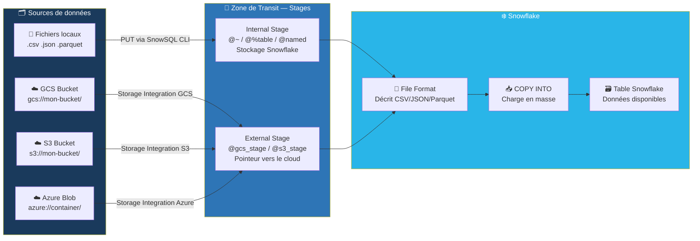

---

### 1.3 Flux de chargement — schéma mental

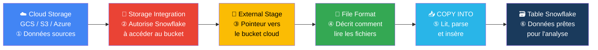

---

### 1.4 Cycle de vie d'un fichier chargé

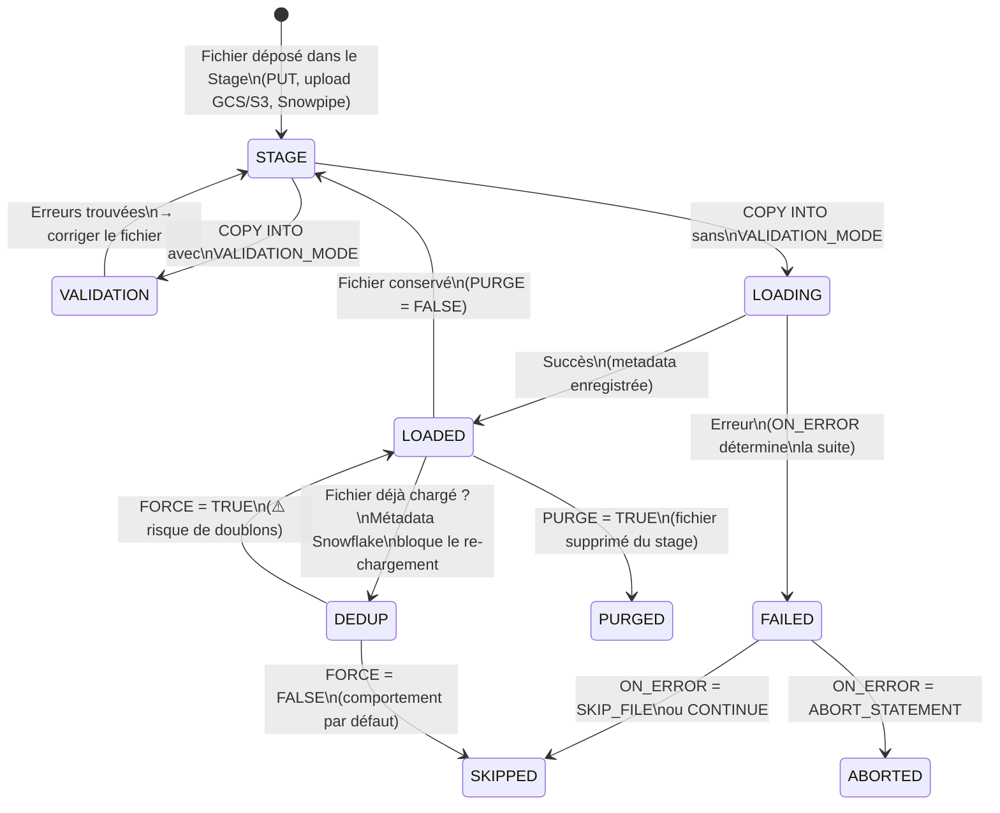

📖 **Doc officielle** : [Data Loading Overview](https://docs.snowflake.com/fr/user-guide/data-load-overview)

---

## 2. Créer la Structure de Données

### Objectifs de cette section
- Créer la hiérarchie Database → Schema → Table
- Choisir les bons types de données Snowflake
- Comprendre `CREATE OR REPLACE` vs `CREATE IF NOT EXISTS`

---

### 2.1 Créer Database, Schema, Table

```sql
-- ① Créer la base de données
-- IF NOT EXISTS : ne plante pas si elle existe déjà (idempotent)
CREATE DATABASE IF NOT EXISTS HEALTH_APP
    COMMENT = 'Base principale application santé';

-- ② Créer le schéma de données brutes
CREATE SCHEMA IF NOT EXISTS HEALTH_APP.RAW
    COMMENT = 'Données brutes avant transformation — ne jamais modifier directement';

-- ③ Sélectionner le contexte de travail
USE DATABASE HEALTH_APP;
USE SCHEMA RAW;

-- ④ Créer la table de destination
-- OR REPLACE : recrée la table si elle existe (attention : supprime les données existantes)
CREATE OR REPLACE TABLE RAW_EVENTS (
    event_id        INTEGER,            -- identifiant unique de l'event
    event_timestamp TIMESTAMP,          -- horodatage de l'event (UTC recommandé)
    process_name    VARCHAR(100),       -- nom du process applicatif (ex: 'Step_LSC')
    process_id      INTEGER,            -- PID du process
    message         VARCHAR(16777216)   -- message brut (max = 16MB dans Snowflake)
);
```

> ⚠️ **`CREATE OR REPLACE` vs `CREATE IF NOT EXISTS`** : `OR REPLACE` recrée la table et **supprime toutes les données**. En production, préférer `CREATE TABLE IF NOT EXISTS` ou `ALTER TABLE` pour ajouter des colonnes.

---

### 2.2 Types de données Snowflake — référence complète

| Type | Alias courants | Taille max | Quand l'utiliser |
|---|---|---|---|
| `NUMBER(p, s)` | `INTEGER`, `BIGINT`, `DECIMAL` | 38 chiffres | Entiers, montants, IDs |
| `FLOAT` | `DOUBLE`, `REAL` | ~15 chiffres sig. | Mesures, ratios, coordonnées GPS |
| `VARCHAR(n)` | `STRING`, `TEXT` | 16 777 216 chars | Texte, noms, codes |
| `DATE` | — | — | Date seule sans heure |
| `TIMESTAMP_NTZ` | `TIMESTAMP` | — | Date+heure **sans** fuseau |
| `TIMESTAMP_TZ` | — | — | Date+heure **avec** fuseau (logs prod) |
| `BOOLEAN` | — | — | Flags, indicateurs binaires |
| `VARIANT` | — | 16 MB | JSON, AVRO, XML semi-structuré |
| `ARRAY` | — | 16 MB | Listes JSON |
| `OBJECT` | — | 16 MB | Objets JSON avec clés nommées |

> 💡 **Conseil** : pour les logs applicatifs, utiliser `TIMESTAMP_TZ` (conserve le fuseau d'origine) ou `TIMESTAMP_NTZ` + convention UTC. Ne pas utiliser `TIMESTAMP_LTZ` (fuseau local du compte Snowflake — source de bugs).

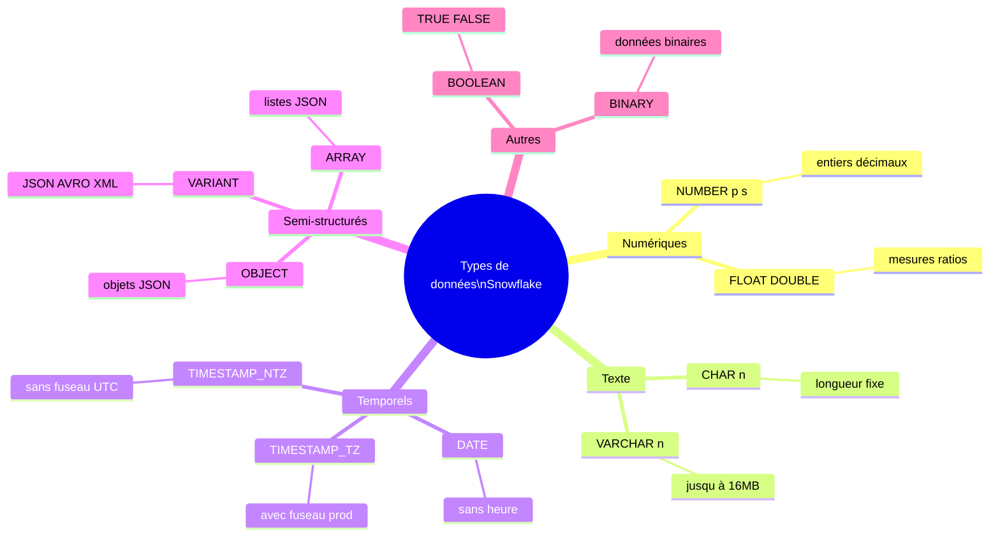

📖 Docs officielles :
- [CREATE DATABASE](https://docs.snowflake.com/fr/sql-reference/sql/create-database)
- [CREATE SCHEMA](https://docs.snowflake.com/fr/sql-reference/sql/create-schema)
- [CREATE TABLE](https://docs.snowflake.com/fr/sql-reference/sql/create-table)
- [Types de données](https://docs.snowflake.com/fr/sql-reference-data-types)

---

## 3. Les Stages : Zone de Transit

### Objectifs de cette section
- Comprendre la différence entre stage interne et externe
- Créer un stage externe GCS avec Storage Integration
- Utiliser LIST, REMOVE et inspecter le contenu brut d'un stage

---

### 3.1 Qu'est-ce qu'un Stage ?

Un **Stage** est une zone de transit où les fichiers sont déposés avant d'être chargés dans une table. Snowflake ne stocke pas les données dans les stages externes — il pointe vers le cloud.

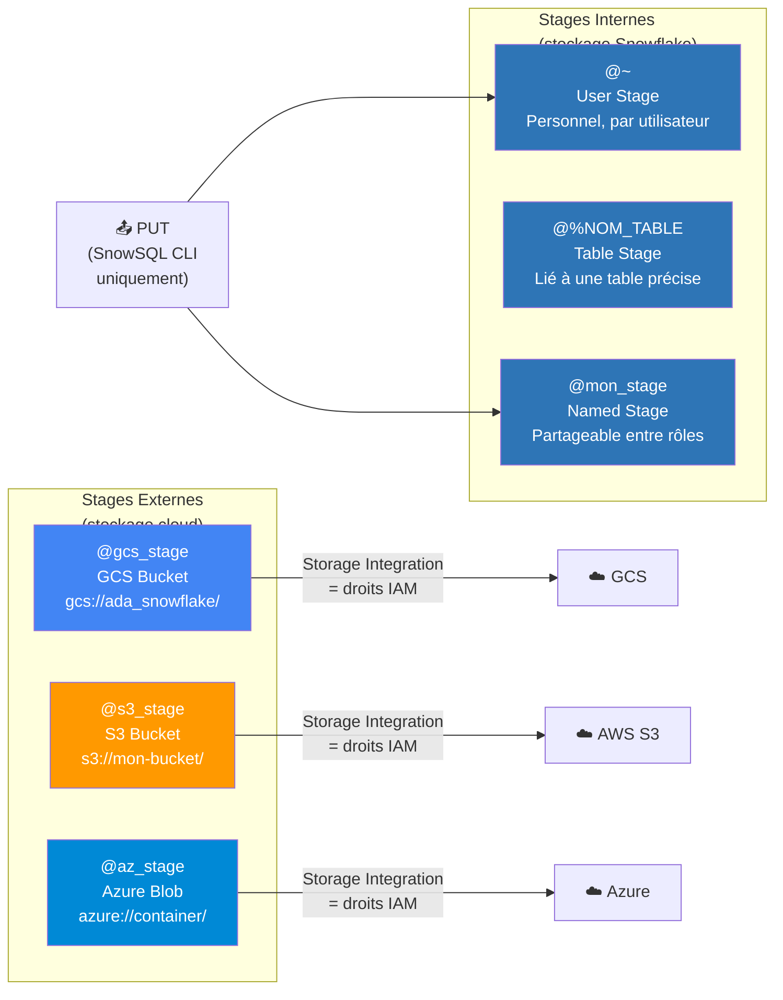

---

### 3.2 Comparaison des Stages

| Type | Syntaxe | Stockage | Limites | Usage recommandé |
|---|---|---|---|---|
| User Stage | `@~` | Interne Snowflake | Personnel, non partageable | Tests rapides perso |
| Table Stage | `@%NOM_TABLE` | Interne Snowflake | Lié à 1 seule table | Chargement ponctuel dans 1 table |
| Named Stage (interne) | `@mon_stage` | Interne Snowflake | Quota de stockage Snowflake | Partage entre équipes, pipelines internes |
| Named Stage (externe) | `@gcs_stage` | GCS / S3 / Azure | Dépend du cloud | **Production, gros volumes, équipes** |

---

### 3.3 Créer un Stage Interne Nommé — syntaxe annotée

```sql
-- Stage interne le plus simple
CREATE OR REPLACE STAGE mon_stage_interne
    COMMENT = 'Stage interne pour chargement CSV de test';

-- Stage interne avec File Format intégré
-- Avantage : pas besoin de répéter le format dans chaque COPY INTO
CREATE OR REPLACE STAGE mon_stage_csv
    FILE_FORMAT = (
        TYPE            = 'CSV'
        FIELD_DELIMITER = ','
        SKIP_HEADER     = 1
    )
    COMMENT = 'Stage CSV avec en-tête ignoré';

-- Lister les fichiers présents dans le stage
LIST @mon_stage_interne;
-- → Retourne : name, size, md5, last_modified

-- Inspecter le contenu brut d'un fichier (sans charger)
SELECT $1, $2, $3, $4, $5
FROM @mon_stage_interne/mon_fichier.csv
    (FILE_FORMAT => (TYPE = 'CSV'))
LIMIT 10;
-- $1, $2... = colonnes positionnelles du fichier brut

-- Supprimer un fichier spécifique du stage
REMOVE @mon_stage_interne/mon_fichier.csv;

-- Vider entièrement un stage
REMOVE @mon_stage_interne;
```

---

### 3.4 Créer un Stage Externe GCS — workflow complet

La création d'un stage externe nécessite d'abord une **Storage Integration** — objet Snowflake qui contient les credentials IAM sécurisés pour accéder au bucket.

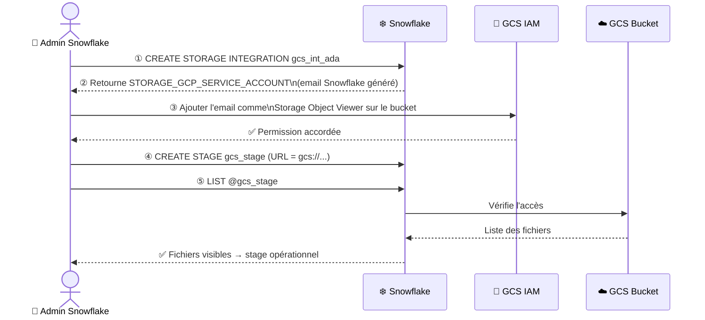

```sql
-- ① Créer la Storage Integration (une seule fois par compte/bucket)
-- Nécessite le rôle ACCOUNTADMIN
CREATE OR REPLACE STORAGE INTEGRATION gcs_int_ada
    TYPE                      = EXTERNAL_STAGE   -- type obligatoire
    STORAGE_PROVIDER          = GCS              -- fournisseur cloud
    ENABLED                   = TRUE             -- activer immédiatement
    STORAGE_ALLOWED_LOCATIONS = ('gcs://ada_snowflake/');  -- bucket(s) autorisé(s)

-- ② Récupérer l'email du service account Snowflake
-- → Copier la valeur de STORAGE_GCP_SERVICE_ACCOUNT
DESC INTEGRATION gcs_int_ada;
-- Exemple : abc123xyz@gcpserviceaccount.iam.gserviceaccount.com

-- ③ (Dans GCS Console)
-- GCS > Votre Bucket > Permissions > + Grant Access
-- Principal : coller l'email Snowflake
-- Role : Storage Object Viewer (lecture seule) ou Storage Object Admin (lecture + écriture)

-- ④ Créer le stage externe lié à l'intégration
CREATE OR REPLACE STAGE gcs_stage
    URL                 = 'gcs://ada_snowflake/'   -- bucket + chemin (dossier optionnel)
    STORAGE_INTEGRATION = gcs_int_ada             -- référence l'intégration créée ci-dessus
    FILE_FORMAT         = csv_file                -- format par défaut du stage
    COMMENT             = 'Stage GCS production — projet health_app';

-- ⑤ Tester : lister les fichiers du bucket
LIST @gcs_stage;
-- Si erreur Access Denied → vérifier étape ③
```

> ⚠️ **Bonne pratique sécurité** : ne jamais utiliser de clés d'accès (`AWS_KEY_ID` / `AWS_SECRET_KEY`) directement dans le stage. Toujours passer par une Storage Integration — les credentials sont gérés par Snowflake, pas exposés dans le SQL.

📖 [CREATE STAGE](https://docs.snowflake.com/fr/sql-reference/sql/create-stage) | [CREATE STORAGE INTEGRATION](https://docs.snowflake.com/fr/sql-reference/sql/create-storage-integration) | [Config GCS](https://docs.snowflake.com/fr/user-guide/data-load-gcs-config)

---

## 4. File Formats : Décrire vos Fichiers

### Objectifs de cette section
- Créer des File Formats nommés et réutilisables
- Maîtriser les options clés pour CSV, JSON, Parquet
- Comprendre pourquoi définir un format nommé plutôt qu'inline

---

### 4.1 Pourquoi un File Format nommé ?

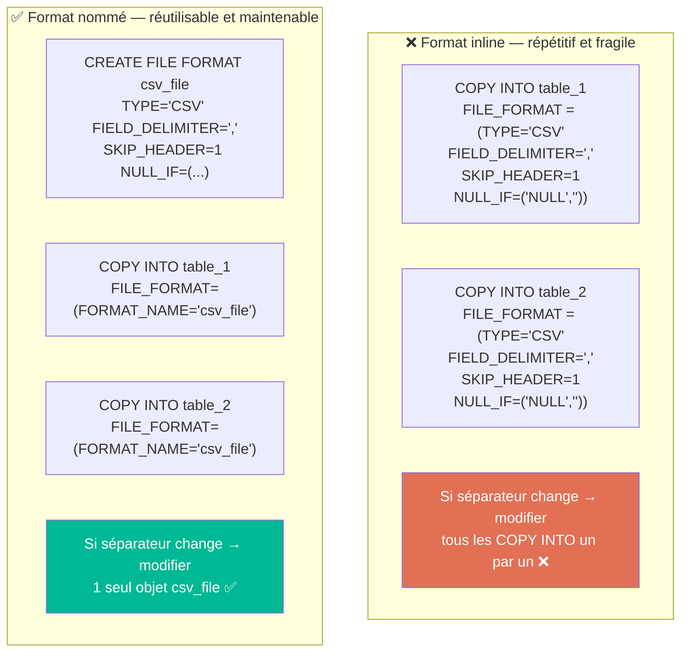

---

### 4.2 Format CSV — options complètes annotées

```sql
CREATE OR REPLACE FILE FORMAT csv_file
    TYPE                        = CSV
    FIELD_DELIMITER             = ','       -- ① séparateur de colonnes (défaut: virgule)
    RECORD_DELIMITER            = '\n'      -- ② fin de ligne (défaut: \n)
    SKIP_HEADER                 = 1         -- ③ nb de lignes d'en-tête à ignorer
    FIELD_OPTIONALLY_ENCLOSED_BY = '"'      -- ④ guillemets autour des champs texte
    NULL_IF                     = ('NULL', 'null', '', '\\N')  -- ⑤ valeurs → NULL Snowflake
    EMPTY_FIELD_AS_NULL         = TRUE      -- ⑥ champ vide = NULL (sans le mettre dans NULL_IF)
    TRIM_SPACE                  = TRUE      -- ⑦ supprimer espaces début/fin de chaque champ
    DATE_FORMAT                 = 'YYYY-MM-DD'          -- ⑧ format attendu pour les dates
    TIMESTAMP_FORMAT            = 'YYYY-MM-DD HH24:MI:SS'  -- ⑨ format pour les timestamps
    ENCODING                    = 'UTF-8'  -- ⑩ encodage (UTF-8 recommandé, ou ISO-8859-1)
    COMMENT                     = 'Format CSV standard pour exports health_app';
```

**Options `FIELD_DELIMITER` courantes :**

| Valeur | Séparateur | Usage |
|---|---|---|
| `','` | Virgule | CSV standard |
| `';'` | Point-virgule | Exports Excel France |
| `'\t'` | Tabulation | TSV (Tab-Separated Values) |
| `'|'` | Pipe | EDI, exports legacy |

---

### 4.3 Format JSON

```sql
CREATE OR REPLACE FILE FORMAT fmt_json
    TYPE               = JSON
    STRIP_OUTER_ARRAY  = TRUE    -- ① [{...},{...}] → lignes séparées (ESSENTIEL pour tableaux JSON)
    STRIP_NULL_VALUES  = FALSE   -- ② conserver les nulls JSON dans VARIANT
    IGNORE_UTF8_ERRORS = FALSE   -- ③ TRUE = ignorer les caractères invalides (mode permissif)
    ALLOW_DUPLICATE    = FALSE   -- ④ FALSE = rejeter les clés JSON dupliquées
    COMMENT            = 'Format JSON pour events streamés';

-- Charger JSON dans une colonne VARIANT
CREATE OR REPLACE TABLE raw_events_json (
    data      VARIANT,                           -- stocke le JSON entier
    loaded_at TIMESTAMP DEFAULT CURRENT_TIMESTAMP()
);

COPY INTO raw_events_json (data)
FROM (SELECT $1 FROM @gcs_stage/events/)
FILE_FORMAT = (FORMAT_NAME = 'fmt_json');

-- Requêter le JSON avec la notation : (colon)
SELECT
    data:event_id::INTEGER      AS event_id,
    data:process_name::STRING   AS process_name,
    data:timestamp::TIMESTAMP   AS ts,
    data:properties:cpu_usage   AS cpu_usage   -- accès imbriqué
FROM raw_events_json
LIMIT 10;
```

> 💡 **`STRIP_OUTER_ARRAY = TRUE`** : si votre fichier contient `[{...}, {...}]` (tableau JSON), cette option déstructure le tableau en lignes séparées. Sans elle, tout le tableau est mis dans une seule cellule VARIANT.

---

### 4.4 Format Parquet

```sql
CREATE OR REPLACE FILE FORMAT fmt_parquet
    TYPE               = PARQUET
    SNAPPY_COMPRESSION = TRUE    -- compression Snappy (défaut Parquet, très efficace)
    BINARY_AS_TEXT     = FALSE   -- FALSE = conserver les binaires tels quels
    COMMENT            = 'Format Parquet pour Data Lake';

-- Inspecter la structure d'un fichier Parquet avant chargement
SELECT $1
FROM @gcs_stage/data.parquet
    (FILE_FORMAT => (TYPE = 'PARQUET'))
LIMIT 5;
-- → Retourne des lignes VARIANT avec la structure du fichier

-- Charger Parquet avec mapping automatique des colonnes
COPY INTO ma_table
FROM @gcs_stage/data.parquet
FILE_FORMAT        = (TYPE = 'PARQUET')
MATCH_BY_COLUMN_NAME = CASE_INSENSITIVE;  -- mappe les colonnes par nom (pas par position)
```

📖 [CREATE FILE FORMAT](https://docs.snowflake.com/fr/sql-reference/sql/create-file-format) — toutes les options par format

---

## 5. COPY INTO : Chargement en Masse

### Objectifs de cette section
- Maîtriser la syntaxe complète de COPY INTO
- Choisir la bonne option `ON_ERROR`
- Utiliser `VALIDATION_MODE` avant de charger
- Transformer les données à la volée pendant le chargement
- Interroger l'historique via `COPY_HISTORY`

---

### 5.1 Syntaxe complète annotée

```sql
COPY INTO ma_table                              -- ① table de destination
FROM @mon_stage/dossier/fichier.csv             -- ② source (stage + chemin optionnel)
FILE_FORMAT   = (FORMAT_NAME = 'csv_file')      -- ③ format nommé ou inline
FILES         = ('file1.csv', 'file2.csv')      -- ④ fichiers spécifiques (optionnel)
PATTERN       = '.*2024.*\.csv'                 -- ⑤ pattern regex (alternative à FILES)
ON_ERROR      = 'CONTINUE'                      -- ⑥ comportement en cas d'erreur
PURGE         = FALSE                           -- ⑦ TRUE = supprimer le fichier après chargement
FORCE         = FALSE                           -- ⑧ TRUE = re-charger même si déjà traité
TRUNCATECOLUMNS = FALSE                         -- ⑨ TRUE = tronquer si valeur > taille colonne
LOAD_UNCERTAIN_FILES = FALSE;                   -- ⑩ TRUE = tenter les fichiers de statut incertain
```

> ⚠️ **`FORCE = TRUE`** désactive la déduplication native de Snowflake. Chaque COPY INTO avec FORCE=TRUE peut créer des **doublons**. Réserver à la migration initiale ou aux tests.

---

### 5.2 Options ON_ERROR — comportement et choix

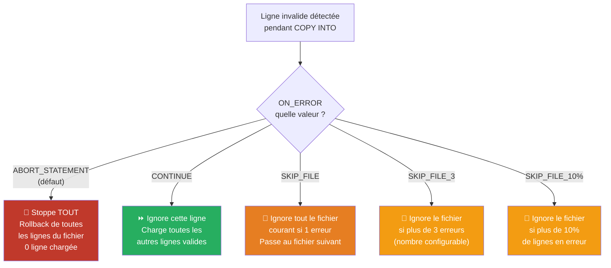

| Option | Comportement | Quand l'utiliser |
|---|---|---|
| `ABORT_STATEMENT` (défaut) | Stoppe tout, rollback complet | Données critiques, 0 tolérance erreur |
| `CONTINUE` | Charge les lignes valides, ignore les mauvaises | Logs, données semi-fiables |
| `SKIP_FILE` | Ignore tout le fichier à la première erreur | Fichiers atomiques (tout ou rien) |
| `SKIP_FILE_n` | Ignore si plus de n erreurs dans le fichier | Seuil d'erreur connu et acceptable |
| `SKIP_FILE_n%` | Ignore si plus de n% de lignes invalides | Qualité relative acceptable |

---

### 5.3 VALIDATION_MODE — tester avant de charger

```sql
-- Dry run : liste toutes les erreurs sans charger une seule ligne
COPY INTO RAW_EVENTS
FROM @gcs_stage/HealthApp_2k.log
FILE_FORMAT      = (FORMAT_NAME = 'csv_file')
VALIDATION_MODE  = 'RETURN_ALL_ERRORS';   -- ← aucune donnée chargée
-- → Retourne : ERROR, FILE, LINE, CHARACTER, BYTE_OFFSET, CATEGORY, CODE, SQL_STATE, COLUMN_NAME, ROW_NUMBER, ROW_START_LINE, REJECTED_RECORD

-- Retourner seulement les N premières erreurs (plus rapide sur gros fichiers)
COPY INTO RAW_EVENTS
FROM @gcs_stage/HealthApp_2k.log
FILE_FORMAT      = (FORMAT_NAME = 'csv_file')
VALIDATION_MODE  = 'RETURN_ERRORS';       -- ← retourne les erreurs du dernier COPY INTO
```

> 💡 **Workflow recommandé** : toujours faire un `VALIDATION_MODE = 'RETURN_ALL_ERRORS'` sur un échantillon avant le premier chargement en production. Permet de corriger le File Format sans toucher les données.

---

### 5.4 COPY INTO avec transformation à la volée

Snowflake permet de transformer les données pendant le chargement avec un sous-SELECT :

```sql
-- Chargement avec cast de types et transformation
COPY INTO RAW_EVENTS (event_id, event_timestamp, process_name, process_id, message)
FROM (
    SELECT
        $1::INTEGER                        AS event_id,        -- cast en entier
        TO_TIMESTAMP($2, 'MM/DD/YYYY HH24:MI:SS') AS event_timestamp,  -- parse date custom
        UPPER(TRIM($3))                    AS process_name,    -- nettoyage texte
        $4::INTEGER                        AS process_id,
        $5                                 AS message          -- colonne brute
    FROM @gcs_stage/HealthApp_2k.log
)
FILE_FORMAT = (FORMAT_NAME = 'csv_file')
ON_ERROR    = 'CONTINUE';

-- Charger seulement certaines colonnes d'un fichier plus large
COPY INTO clients (id, nom, email)
FROM (
    SELECT $1, $2, $4     -- $3 = colonne ignorée (téléphone non nécessaire)
    FROM @gcs_stage/clients_export.csv
)
FILE_FORMAT = (FORMAT_NAME = 'csv_file');
```

> 💡 **`$1`, `$2`... sont des références positionnelles** aux colonnes du fichier brut (indépendantes des noms de colonnes de la table cible). Très utile quand le fichier a plus de colonnes que la table.

---

### 5.5 Vérifier l'historique de chargement

```sql
-- Historique des chargements sur une table (30 derniers jours max)
SELECT
    FILE_NAME,
    STATUS,
    ROW_COUNT,
    ROW_PARSED,
    ERROR_COUNT,
    FIRST_ERROR,
    FIRST_ERROR_LINE,
    FIRST_ERROR_COLUMN_NAME,
    LAST_LOAD_TIME
FROM TABLE(INFORMATION_SCHEMA.COPY_HISTORY(
    TABLE_NAME => 'RAW_EVENTS',
    START_TIME => DATEADD('HOURS', -24, CURRENT_TIMESTAMP())
))
ORDER BY LAST_LOAD_TIME DESC;

-- Voir uniquement les fichiers avec des erreurs
SELECT FILE_NAME, STATUS, ERROR_COUNT, FIRST_ERROR
FROM TABLE(INFORMATION_SCHEMA.COPY_HISTORY(
    TABLE_NAME => 'RAW_EVENTS',
    START_TIME => DATEADD('HOURS', -24, CURRENT_TIMESTAMP())
))
WHERE STATUS = 'LOAD_FAILED' OR ERROR_COUNT > 0
ORDER BY LAST_LOAD_TIME DESC;

-- Valider les erreurs du dernier COPY INTO (après exécution)
SELECT * FROM TABLE(VALIDATE(
    RAW_EVENTS,
    JOB_ID => '_last'
));
```

📖 [COPY INTO \<table\>](https://docs.snowflake.com/fr/sql-reference/sql/copy-into-table) | [COPY_HISTORY](https://docs.snowflake.com/fr/sql-reference/functions/copy_history)

---

## 6. Workflow Complet GCS → Snowflake

### Objectifs de cette section
- Reproduire le pipeline health_app de bout en bout
- Comprendre le rôle précis de chaque composant
- Valider le chargement étape par étape

---

### 6.1 Contexte du projet health_app

**Scénario** : l'application mobile `health_app` génère des logs applicatifs stockés dans GCS. L'objectif est de charger le fichier `HealthApp_2k.log` dans la table `RAW_EVENTS` pour analyse.

```
Fichier source : gcs://ada_snowflake/HealthApp_2k.log
Format         : CSV, séparateur virgule, 1 ligne d'en-tête
Destination    : HEALTH_APP.RAW.RAW_EVENTS
```

---

### 6.2 Étape 1 — Définir le contexte

```sql
-- Sélectionner le rôle avec les droits nécessaires
-- ACCOUNTADMIN requis pour CREATE STORAGE INTEGRATION uniquement
USE ROLE ACCOUNTADMIN;
USE DATABASE HEALTH_APP;
USE SCHEMA RAW;
```

> 💡 En production, créer un rôle dédié `data_loader_role` avec uniquement les droits nécessaires. `ACCOUNTADMIN` ne doit pas être utilisé pour les opérations courantes. Voir Chapitre RBAC.

---

### 6.3 Étape 2 — Storage Integration GCS

```sql
CREATE OR REPLACE STORAGE INTEGRATION gcs_int_ada
    TYPE                      = EXTERNAL_STAGE
    STORAGE_PROVIDER          = GCS
    ENABLED                   = TRUE
    STORAGE_ALLOWED_LOCATIONS = ('gcs://ada_snowflake/');

-- Récupérer l'email de service Snowflake (à donner aux droits GCS)
DESC INTEGRATION gcs_int_ada;
-- → Copier STORAGE_GCP_SERVICE_ACCOUNT
-- Exemple : sn12345@gcpserviceaccount.iam.gserviceaccount.com
```

---

### 6.4 Étape 3 — Configurer les droits GCS

Dans la **Google Cloud Console** :

1. `Cloud Storage` → Votre bucket (`ada_snowflake`) → onglet **Permissions**
2. `+ Grant Access` → coller l'email Snowflake dans **New principals**
3. Role : **Storage Object Viewer** (lecture seule suffit pour COPY INTO)
4. Cliquer **Save**

> ⚠️ **Délai IAM** : les changements de permissions GCS peuvent prendre 1-2 minutes à se propager. Si `LIST @gcs_stage` retourne encore une erreur, patienter quelques secondes.

---

### 6.5 Étape 4 — File Format

```sql
-- Format CSV adapté au fichier HealthApp_2k.log
CREATE OR REPLACE FILE FORMAT csv_file
    TYPE                         = CSV
    FIELD_DELIMITER              = ','
    SKIP_HEADER                  = 1
    FIELD_OPTIONALLY_ENCLOSED_BY = '"'
    NULL_IF                      = ('NULL', 'null', '')
    EMPTY_FIELD_AS_NULL          = TRUE
    TRIM_SPACE                   = TRUE;
```

---

### 6.6 Étape 5 — Stage Externe GCS

```sql
CREATE OR REPLACE STAGE gcs_stage
    URL                 = 'gcs://ada_snowflake/'
    STORAGE_INTEGRATION = gcs_int_ada
    FILE_FORMAT         = csv_file
    COMMENT             = 'Stage GCS principal — projet health_app';
```

---

### 6.7 Étape 6 — Tester l'accès et inspecter le fichier

```sql
-- Vérifier que Snowflake voit les fichiers du bucket
LIST @gcs_stage;

-- Inspecter les premières lignes du fichier brut (sans charger)
SELECT $1, $2, $3, $4, $5
FROM @gcs_stage/HealthApp_2k.log
    (FILE_FORMAT => (TYPE = 'CSV' SKIP_HEADER = 1))
LIMIT 10;
-- → Permet de vérifier : nb colonnes, séparateur, format dates, valeurs nulles
```

---

### 6.8 Étape 7 — Valider avant de charger (Dry Run)

```sql
-- Dry run : liste toutes les erreurs sans insérer une seule ligne
COPY INTO RAW_EVENTS
FROM @gcs_stage
FILES            = ('HealthApp_2k.log')
FILE_FORMAT      = (FORMAT_NAME = 'csv_file')
VALIDATION_MODE  = 'RETURN_ALL_ERRORS';
-- Si aucune erreur → 0 lignes retournées → prêt pour le chargement réel
```

---

### 6.9 Étape 8 — Charger les données

```sql
COPY INTO RAW_EVENTS
FROM @gcs_stage
FILES    = ('HealthApp_2k.log')    -- spécifier le fichier exact
ON_ERROR = 'CONTINUE'              -- continuer si quelques lignes sont invalides
PURGE    = FALSE;                  -- conserver le fichier dans GCS pour audit
```

---

### 6.10 Étape 9 — Vérifier le chargement

```sql
-- Volume total chargé
SELECT COUNT(*) AS total_lignes FROM RAW_EVENTS;

-- Vérification visuelle d'un échantillon
SELECT * FROM RAW_EVENTS LIMIT 20;

-- Répartition par process_name (sanity check)
SELECT process_name, COUNT(*) AS nb_events
FROM RAW_EVENTS
GROUP BY 1
ORDER BY 2 DESC;

-- Historique du chargement
SELECT FILE_NAME, STATUS, ROW_COUNT, ERROR_COUNT, LAST_LOAD_TIME
FROM TABLE(INFORMATION_SCHEMA.COPY_HISTORY(
    TABLE_NAME => 'RAW_EVENTS',
    START_TIME => DATEADD('HOURS', -1, CURRENT_TIMESTAMP())
));
```

---

### 6.11 Résumé visuel — rôle de chaque composant

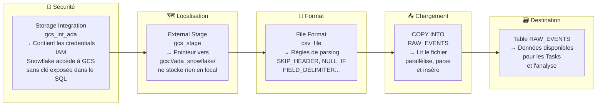

📖 Docs officielles :
- [CREATE STORAGE INTEGRATION](https://docs.snowflake.com/fr/sql-reference/sql/create-storage-integration)
- [Configurer GCS pour Snowflake](https://docs.snowflake.com/fr/user-guide/data-load-gcs-config)
- [COPY INTO \<table\>](https://docs.snowflake.com/fr/sql-reference/sql/copy-into-table)

---

## 7. Chargement INSERT (Petits Volumes)

### Objectifs de cette section
- Utiliser INSERT pour des données statiques ou de test
- Comprendre les limites et quand basculer sur COPY INTO

---

### 7.1 Syntaxes INSERT

```sql
-- ① INSERT de plusieurs lignes en une fois (le plus efficace pour <100 lignes)
INSERT INTO RAW_EVENTS (event_id, event_timestamp, process_name, process_id, message)
VALUES
    (1, '2024-01-15 10:30:00', 'Step_LSC',         101, '10:30:00.123 D/Step_LSC test'),
    (2, '2024-01-15 10:30:01', 'HiH_ListenerManager', 102, '10:30:01.456 D/HiH test'),
    (3, '2024-01-15 10:30:02', 'Step_ScreenUtil',   103, '10:30:02.789 D/Screen test');

-- ② INSERT depuis un SELECT (ETL interne — de table à table)
INSERT INTO RAW_EVENTS_ARCHIVE
SELECT *
FROM RAW_EVENTS
WHERE event_timestamp < DATEADD('YEAR', -1, CURRENT_DATE());

-- ③ INSERT avec transformation
INSERT INTO staging.step_lsc (event_timestamp, process_id, message)
SELECT
    event_timestamp,
    process_id,
    TRIM(message)   -- nettoyage à la volée
FROM RAW_EVENTS
WHERE process_name = 'Step_LSC';
```

---

### 7.2 INSERT vs COPY INTO — quand choisir

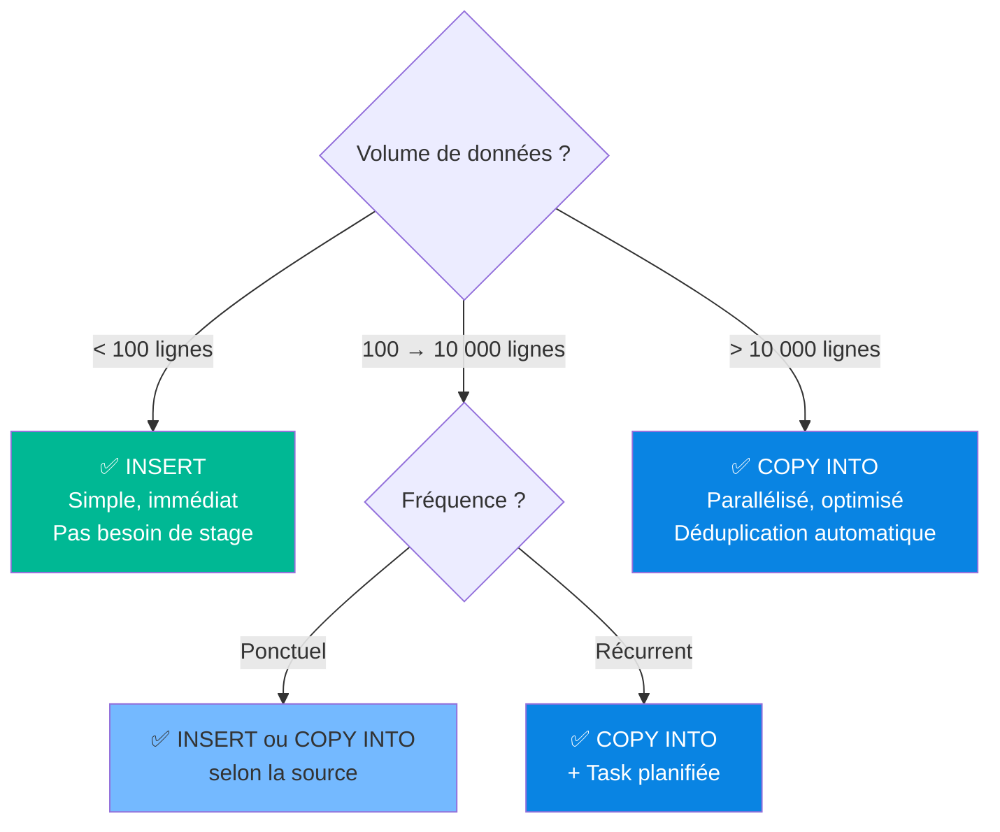

> ⚠️ `INSERT` crée une micro-transaction par exécution. Pour des millions de lignes, toujours préférer `COPY INTO` qui est massivement parallélisé et 10-100x plus rapide.

📖 [INSERT](https://docs.snowflake.com/fr/sql-reference/sql/insert)

---

## 8. Snowpipe : Ingestion Continue

### Objectifs de cette section
- Comprendre l'architecture Snowpipe et son modèle de coût
- Créer un pipe avec `AUTO_INGEST`
- Monitorer et administrer un pipe en production

---

### 8.1 Comment fonctionne Snowpipe

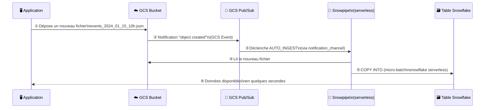

---

### 8.2 COPY INTO vs Snowpipe — comparaison détaillée

| | COPY INTO (Batch) | Snowpipe (Near-realtime) |
|---|---|---|
| Déclenchement | Manuel ou Task planifiée | Automatique dès qu'un fichier arrive |
| Latence | Minutes (selon schedule) | Secondes |
| Compute | Virtual Warehouse (WH classique) | Serverless (géré Snowflake) |
| Facturation | Temps de WH actif | À la seconde de traitement |
| Cas optimal | Gros fichiers, batch nocturne | Petits fichiers fréquents |
| Déduplication | Oui (metadata COPY INTO) | Oui (metadata Snowpipe) |
| Monitoring | `COPY_HISTORY` | `COPY_HISTORY` + `SYSTEM$PIPE_STATUS` |

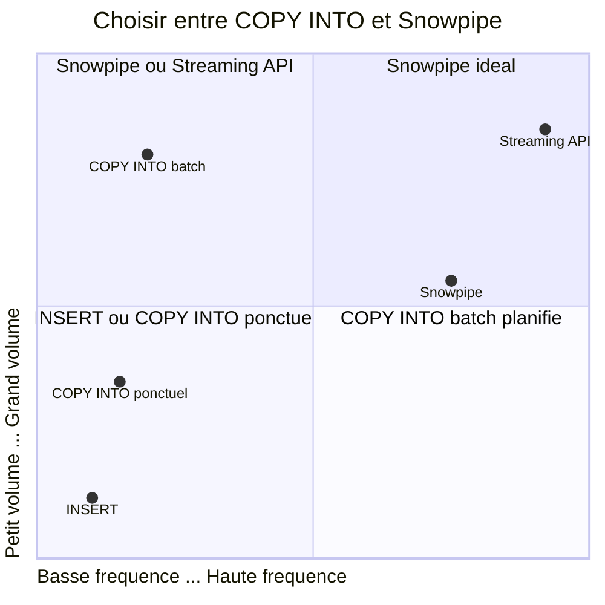

---

### 8.3 Créer un Pipe — syntaxe annotée

```sql
-- ① Créer le format de fichier (JSON pour les events streamés)
CREATE OR REPLACE FILE FORMAT fmt_events_json
    TYPE              = JSON
    STRIP_OUTER_ARRAY = TRUE;   -- [{...},{...}] → lignes séparées

-- ② Créer le stage externe (voir Section 3)
-- CREATE OR REPLACE STAGE gcs_stage ...

-- ③ Créer le pipe
CREATE OR REPLACE PIPE pipe_raw_events
    AUTO_INGEST = TRUE   -- déclenchement automatique via GCS Pub/Sub
    COMMENT     = 'Ingestion continue des events health_app depuis GCS'
AS
-- Le COPY INTO est le corps du pipe (définition statique)
COPY INTO RAW_EVENTS
FROM (
    SELECT $1        -- tout le JSON dans une colonne VARIANT
    FROM @gcs_stage/events/
)
FILE_FORMAT = (FORMAT_NAME = 'fmt_events_json')
ON_ERROR    = 'CONTINUE';

-- ④ Récupérer le Notification Channel (SQS pour S3 / Pub/Sub pour GCS)
-- → Copier notification_channel pour configurer GCS
DESC PIPE pipe_raw_events;
-- Colonne notification_channel : projects/PROJECT_ID/subscriptions/SF_SUB_...
```

---

### 8.4 Configurer GCS Pub/Sub pour AUTO_INGEST

Après `DESC PIPE` :

1. Dans **GCS Console** : `Pub/Sub` → `Topics` → créer un topic pour le bucket
2. `Cloud Storage` → bucket → `Notifications` → configurer sur le topic
3. `Pub/Sub` → créer une **Subscription** push vers le `notification_channel` de Snowflake

> 📖 [Configurer Snowpipe avec GCS](https://docs.snowflake.com/fr/user-guide/data-load-snowpipe-auto-gcs)

---

### 8.5 Administrer et monitorer Snowpipe

```sql
-- Statut complet du pipe (JSON enrichi)
SELECT PARSE_JSON(SYSTEM$PIPE_STATUS('pipe_raw_events'));
-- → pendingFileCount, notificationChannelName, lastIngestedTimestamp...

-- Historique des ingestions (dernière heure)
SELECT
    FILE_NAME,
    STATUS,
    ROW_COUNT,
    ERROR_COUNT,
    FIRST_ERROR,
    LAST_LOAD_TIME
FROM TABLE(INFORMATION_SCHEMA.COPY_HISTORY(
    TABLE_NAME => 'RAW_EVENTS',
    START_TIME => DATEADD('HOURS', -1, CURRENT_TIMESTAMP())
))
ORDER BY LAST_LOAD_TIME DESC;

-- Pause / Reprise (maintenance, incident)
ALTER PIPE pipe_raw_events PAUSE;
ALTER PIPE pipe_raw_events RESUME;

-- Forcer le re-chargement de fichiers spécifiques
ALTER PIPE pipe_raw_events REFRESH
    PREFIX     = 'events/2024-01-15/'   -- dossier spécifique
    MODIFIED_AFTER = '2024-01-15T00:00:00Z';

-- Voir tous les pipes du schéma
SHOW PIPES IN SCHEMA HEALTH_APP.RAW;
```

📖 [Snowpipe Introduction](https://docs.snowflake.com/fr/user-guide/data-load-snowpipe-intro) | [Snowpipe Streaming](https://docs.snowflake.com/fr/user-guide/snowpipe-streaming/data-load-snowpipe-streaming-overview)

---

## 9. PUT & GET : CLI SnowSQL

### Objectifs de cette section
- Installer SnowSQL et uploader des fichiers locaux vers un stage interne
- Utiliser le connecteur Python pour automatiser PUT + COPY INTO
- Comprendre les contraintes de PUT/GET

---

### 9.1 Contraintes importantes

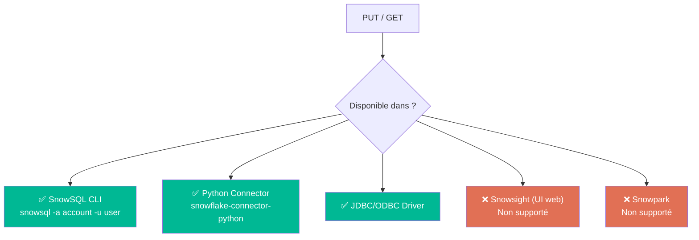

---

### 9.2 Installer SnowSQL

```bash
# ── macOS ─────────────────────────────────────────────────────
brew install --cask snowflake-snowsql

# ── Linux (x86_64) ────────────────────────────────────────────
curl -O https://sfc-repo.snowflakecomputing.com/snowsql/bootstrap/1.2/linux_x86_64/snowsql-1.2.9-linux_x86_64.bash
bash snowsql-1.2.9-linux_x86_64.bash

# ── Connexion ─────────────────────────────────────────────────
snowsql -a <account_identifier> -u <username>
# account_identifier : ex: abc12345.eu-west-1 (visible dans l'URL Snowsight)
```

---

### 9.3 PUT — uploader vers un Stage Interne

```sql
-- Uploader un fichier local vers le stage user (@~)
PUT file:///chemin/absolu/data.csv @~;

-- Uploader avec options complètes annotées
PUT file:///data/HealthApp_2k.log @mon_stage
    AUTO_COMPRESS = TRUE    -- ① compresser en .gz avant upload (réduit la taille)
    PARALLEL      = 4       -- ② threads parallèles (défaut 4, max 99)
    OVERWRITE     = FALSE;  -- ③ FALSE = ne pas écraser si fichier déjà présent

-- Uploader plusieurs fichiers avec wildcard
PUT file:///data/logs/*.log @mon_stage AUTO_COMPRESS=TRUE;

-- Vérifier que le fichier est bien arrivé
LIST @mon_stage;
```

---

### 9.4 GET — télécharger depuis un Stage

```sql
-- Télécharger un fichier spécifique
GET @mon_stage/data.csv.gz file:///tmp/output/;

-- Télécharger tous les fichiers du stage
GET @mon_stage file:///tmp/output/ PARALLEL = 8;
```

---

### 9.5 Pipeline complet via Python Connector

```python
import snowflake.connector
import os

# ① Connexion Snowflake
conn = snowflake.connector.connect(
    account   = os.environ['SNOWFLAKE_ACCOUNT'],   # ne jamais hardcoder les credentials
    user      = os.environ['SNOWFLAKE_USER'],
    password  = os.environ['SNOWFLAKE_PASSWORD'],
    database  = 'HEALTH_APP',
    schema    = 'RAW',
    warehouse = 'COMPUTE_WH'
)

cur = conn.cursor()

try:
    # ② Upload du fichier local vers le stage interne
    cur.execute("""
        PUT file:///tmp/HealthApp_2k.log @mon_stage
        AUTO_COMPRESS = TRUE
        OVERWRITE     = FALSE
    """)
    print("PUT terminé :", cur.fetchall())

    # ③ Chargement dans la table
    cur.execute("""
        COPY INTO RAW_EVENTS
        FROM @mon_stage/HealthApp_2k.log.gz
        FILE_FORMAT = (FORMAT_NAME = 'csv_file')
        ON_ERROR    = 'CONTINUE'
    """)
    result = cur.fetchall()
    print("COPY INTO terminé :", result)

    # ④ Vérification
    cur.execute("SELECT COUNT(*) FROM RAW_EVENTS")
    count = cur.fetchone()[0]
    print(f"Lignes chargées : {count}")

    # ⑤ Nettoyage du stage
    cur.execute("REMOVE @mon_stage/HealthApp_2k.log.gz")

except Exception as e:
    print(f"Erreur : {e}")
    raise
finally:
    cur.close()
    conn.close()
```

📖 [PUT](https://docs.snowflake.com/fr/sql-reference/sql/put) | [GET](https://docs.snowflake.com/fr/sql-reference/sql/get) | [Python Connector](https://docs.snowflake.com/fr/user-guide/python-connector-example)

---

## 10. Formats de Fichiers Supportés

### 10.1 Vue d'ensemble

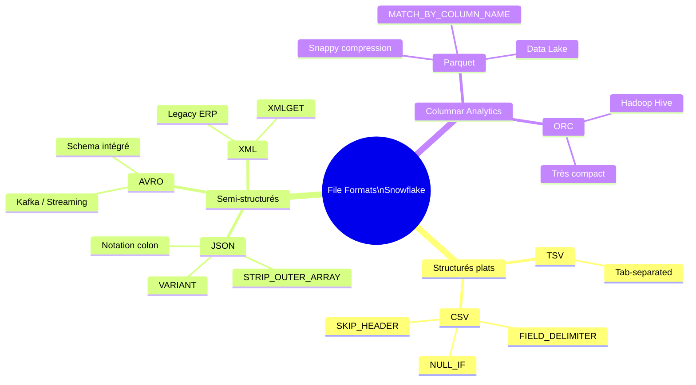

---

### 10.2 Tableau comparatif complet

| Format | Extension | Compression | Semi-structuré | Perf. lecture | Recommandé pour |
|---|---|---|---|---|---|
| CSV | `.csv` | Optionnelle (`.gz`) | Non | Moyenne | Exports Excel, fichiers plats |
| TSV | `.tsv` | Optionnelle | Non | Moyenne | Exports avec virgules dans les valeurs |
| JSON | `.json` | Optionnelle | ✅ Oui | Moyenne | APIs REST, logs applicatifs, events |
| Parquet | `.parquet` | ✅ Auto (Snappy) | Partiel | ⚡ Excellente | Data Lake, Analytics, migrations |
| ORC | `.orc` | ✅ Auto | Non | ⚡ Excellente | Écosystème Hadoop/Hive |
| AVRO | `.avro` | Optionnelle | ✅ Oui | Bonne | Kafka, streaming, schéma évolutif |
| XML | `.xml` | Non | ✅ Oui | Faible | Legacy ERP, SOAP, fichiers config |

---

### 10.3 Requêter les données semi-structurées (JSON/AVRO)

```sql
-- Après COPY INTO dans une colonne VARIANT :
CREATE OR REPLACE TABLE raw_events_json (data VARIANT);

COPY INTO raw_events_json
FROM @gcs_stage/events.json
FILE_FORMAT = (FORMAT_NAME = 'fmt_json');

-- Accès aux champs JSON
SELECT
    data:event_id::INTEGER          AS event_id,
    data:process_name::VARCHAR      AS process_name,
    data:timestamp::TIMESTAMP       AS ts,
    data:properties:cpu_usage       AS cpu_usage,          -- champ imbriqué
    data:tags[0]::VARCHAR           AS first_tag,          -- premier élément d'un tableau
    FLATTEN(data:tags)              AS tag                 -- dérouler un tableau
FROM raw_events_json;

-- Aplatir une colonne JSON vers une vraie table relationnelle
CREATE OR REPLACE VIEW events_flat AS
SELECT
    data:event_id::INTEGER        AS event_id,
    data:process_name::VARCHAR    AS process_name,
    data:process_id::INTEGER      AS process_id,
    data:timestamp::TIMESTAMP     AS event_timestamp,
    data:message::VARCHAR         AS message
FROM raw_events_json;
```

📖 [Semi-structured data](https://docs.snowflake.com/fr/user-guide/semistructured-intro) | [VARIANT type](https://docs.snowflake.com/fr/sql-reference/data-types-semistructured)

---

## 11. Cas Pratiques Complets

### 🔵 Cas 1 — Premier chargement du fichier `HealthApp_2k.log`

**Scénario** : environnement de staging, premier chargement depuis zéro.

```sql
-- ════════════════════════════════════════════════════════════
-- SETUP COMPLET — ordre à respecter
-- ════════════════════════════════════════════════════════════

-- ① Contexte
USE ROLE ACCOUNTADMIN;
USE DATABASE HEALTH_APP;
USE SCHEMA RAW;

-- ② Table de destination
CREATE OR REPLACE TABLE RAW_EVENTS (
    event_id        INTEGER,
    event_timestamp TIMESTAMP,
    process_name    VARCHAR(100),
    process_id      INTEGER,
    message         VARCHAR(16777216)
);

-- ③ File Format
CREATE OR REPLACE FILE FORMAT csv_file
    TYPE                         = CSV
    FIELD_DELIMITER              = ','
    SKIP_HEADER                  = 1
    FIELD_OPTIONALLY_ENCLOSED_BY = '"'
    NULL_IF                      = ('NULL', 'null', '')
    EMPTY_FIELD_AS_NULL          = TRUE
    TRIM_SPACE                   = TRUE;

-- ④ Storage Integration GCS
CREATE OR REPLACE STORAGE INTEGRATION gcs_int_ada
    TYPE                      = EXTERNAL_STAGE
    STORAGE_PROVIDER          = GCS
    ENABLED                   = TRUE
    STORAGE_ALLOWED_LOCATIONS = ('gcs://ada_snowflake/');

-- → DESC INTEGRATION gcs_int_ada → récupérer STORAGE_GCP_SERVICE_ACCOUNT
-- → Configurer les droits dans GCS Console (Storage Object Viewer)

-- ⑤ Stage externe
CREATE OR REPLACE STAGE gcs_stage
    URL                 = 'gcs://ada_snowflake/'
    STORAGE_INTEGRATION = gcs_int_ada
    FILE_FORMAT         = csv_file;

-- ⑥ Test accès
LIST @gcs_stage;

-- ⑦ Inspecter le fichier brut
SELECT $1, $2, $3, $4, $5
FROM @gcs_stage/HealthApp_2k.log
    (FILE_FORMAT => (TYPE = 'CSV' SKIP_HEADER = 1))
LIMIT 5;

-- ⑧ Dry run
COPY INTO RAW_EVENTS
FROM @gcs_stage
FILES           = ('HealthApp_2k.log')
FILE_FORMAT     = (FORMAT_NAME = 'csv_file')
VALIDATION_MODE = 'RETURN_ALL_ERRORS';

-- ⑨ Chargement réel
COPY INTO RAW_EVENTS
FROM @gcs_stage
FILES    = ('HealthApp_2k.log')
ON_ERROR = 'CONTINUE'
PURGE    = FALSE;

-- ⑩ Vérification
SELECT COUNT(*) AS total FROM RAW_EVENTS;
SELECT process_name, COUNT(*) FROM RAW_EVENTS GROUP BY 1 ORDER BY 2 DESC;
SELECT FILE_NAME, STATUS, ROW_COUNT, ERROR_COUNT
FROM TABLE(INFORMATION_SCHEMA.COPY_HISTORY(
    TABLE_NAME => 'RAW_EVENTS',
    START_TIME => DATEADD('MINUTES', -10, CURRENT_TIMESTAMP())
));
```

---

### 🟡 Cas 2 — Chargement récurrent avec gestion d'erreurs et audit

**Scénario** : les fichiers `HealthApp_*.log` arrivent chaque heure dans GCS. Un rapport d'audit doit être produit après chaque chargement.

```sql
-- Table d'audit des chargements (traçabilité complète)
CREATE OR REPLACE TABLE RAW.loading_audit (
    loaded_at       TIMESTAMP DEFAULT CURRENT_TIMESTAMP(),
    file_name       VARCHAR(500),
    status          VARCHAR(50),   -- 'SUCCEEDED', 'PARTIAL', 'FAILED'
    rows_loaded     INTEGER,
    rows_error      INTEGER,
    first_error     VARCHAR(2000),
    notes           VARCHAR(1000)
);

-- Procédure de chargement avec audit automatique
CREATE OR REPLACE PROCEDURE RAW.load_health_events(pattern STRING)
RETURNS STRING
LANGUAGE SQL
EXECUTE AS CALLER
AS $$
DECLARE
    load_exception EXCEPTION (-9999, 'Erreur lors du chargement des events');
BEGIN
    -- ① Chargement avec pattern dynamique (ex: '.*2024-01-15.*\.log')
    COPY INTO RAW_EVENTS
    FROM @gcs_stage
    PATTERN  = :pattern
    ON_ERROR = 'CONTINUE'
    PURGE    = FALSE;

    -- ② Audit automatique depuis COPY_HISTORY
    INSERT INTO RAW.loading_audit (file_name, status, rows_loaded, rows_error, first_error)
    SELECT
        FILE_NAME,
        CASE
            WHEN ERROR_COUNT = 0         THEN 'SUCCEEDED'
            WHEN ROW_COUNT > 0           THEN 'PARTIAL'
            ELSE                              'FAILED'
        END AS status,
        ROW_COUNT,
        ERROR_COUNT,
        FIRST_ERROR
    FROM TABLE(INFORMATION_SCHEMA.COPY_HISTORY(
        TABLE_NAME => 'RAW_EVENTS',
        START_TIME => DATEADD('MINUTES', -5, CURRENT_TIMESTAMP())
    ));

    RETURN 'Chargement terminé — voir RAW.loading_audit';

EXCEPTION
    WHEN OTHER THEN
        INSERT INTO RAW.loading_audit (file_name, status, notes)
        VALUES (:pattern, 'FAILED', :SQLERRM);
        RAISE load_exception;
END;
$$;

-- Appel de la procédure (manuellement ou via Task)
CALL RAW.load_health_events('.*HealthApp.*\.log');

-- Consulter l'audit
SELECT * FROM RAW.loading_audit ORDER BY loaded_at DESC LIMIT 20;

-- KPI : taux de succès sur 7 jours
SELECT
    DATE_TRUNC('day', loaded_at)   AS jour,
    COUNT(*)                       AS total_fichiers,
    SUM(CASE WHEN status = 'SUCCEEDED' THEN 1 ELSE 0 END) AS succes,
    SUM(CASE WHEN status = 'FAILED'    THEN 1 ELSE 0 END) AS echecs,
    SUM(rows_loaded)               AS total_lignes_chargees,
    SUM(rows_error)                AS total_lignes_rejetees
FROM RAW.loading_audit
WHERE loaded_at >= DATEADD('day', -7, CURRENT_DATE())
GROUP BY 1
ORDER BY 1 DESC;
```

---

### 🟢 Cas 3 — Migration depuis un Data Lake Parquet vers Snowflake

**Scénario** : migration d'un historique de 3 ans de logs Parquet stockés dans GCS vers `staging.step_lsc`.

```sql
-- ════════════════════════════════════════════════════════════
-- MIGRATION DATA LAKE PARQUET → SNOWFLAKE
-- ════════════════════════════════════════════════════════════

-- ① Stage dédié au Data Lake Parquet
CREATE OR REPLACE STAGE stage_datalake_parquet
    URL                 = 'gcs://ada_snowflake/datalake/step_lsc/'
    STORAGE_INTEGRATION = gcs_int_ada
    COMMENT             = 'Data Lake historique — fichiers Parquet 2021-2024';

-- ② Inspecter la structure du fichier Parquet
SELECT $1
FROM @stage_datalake_parquet/step_lsc_2024_01.parquet
    (FILE_FORMAT => (TYPE = 'PARQUET'))
LIMIT 3;
-- → Retourne des lignes VARIANT avec les champs du Parquet
-- → Exemple : {"event_timestamp":"...","process_id":101,"log_trigger":"...","message":"..."}

-- ③ Table de destination
CREATE OR REPLACE TABLE staging.step_lsc (
    event_timestamp TIMESTAMP,
    process_id      INTEGER,
    log_trigger     VARCHAR(200),
    message         VARCHAR(16777216)
);

-- ④ Chargement Parquet avec MATCH_BY_COLUMN_NAME
-- (mappe les colonnes par nom, pas par position — robuste aux réorganisations)
COPY INTO staging.step_lsc
FROM @stage_datalake_parquet
FILE_FORMAT          = (TYPE = 'PARQUET')
MATCH_BY_COLUMN_NAME = CASE_INSENSITIVE   -- case-insensitive : event_timestamp = EVENT_TIMESTAMP
PATTERN              = '.*step_lsc.*\.parquet'
ON_ERROR             = 'CONTINUE';

-- ⑤ Vérification post-migration
SELECT COUNT(*)                              AS total_lignes  FROM staging.step_lsc;
SELECT MIN(event_timestamp), MAX(event_timestamp) AS plage_dates FROM staging.step_lsc;

-- ⑥ Contrôle qualité : lignes avec message vide (suspect)
SELECT COUNT(*) AS messages_vides
FROM staging.step_lsc
WHERE message IS NULL OR TRIM(message) = '';

-- ⑦ Vérification via COPY_HISTORY
SELECT FILE_NAME, STATUS, ROW_COUNT, ERROR_COUNT
FROM TABLE(INFORMATION_SCHEMA.COPY_HISTORY(
    TABLE_NAME => 'STEP_LSC',
    START_TIME => DATEADD('HOURS', -2, CURRENT_TIMESTAMP())
))
ORDER BY LAST_LOAD_TIME DESC;
```

---

## 12. 🔴 Dictionnaire des Erreurs Communes

### 12.1 Arbre de décision — diagnostiquer une erreur de chargement

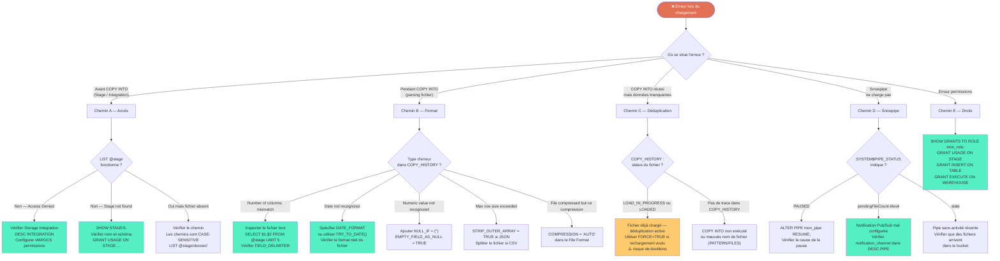

---

### 12.2 Erreurs COPY INTO — Fichiers & Formats

| Code / Message | Cause | Solution | Doc |
|---|---|---|---|
| `Number of columns in file (N) does not match that of the corresponding table (M)` | Nb colonnes fichier ≠ table | Inspecter avec `SELECT $1,$2 FROM @stage LIMIT 5` — vérifier `FIELD_DELIMITER` | [Troubleshooting](https://docs.snowflake.com/fr/user-guide/data-load-troubleshooting) |
| `Field delimiter ',' found after quoted field` | Guillemets non fermés dans le CSV | Vérifier `FIELD_OPTIONALLY_ENCLOSED_BY` — nettoyer les guillemets mal échappés | [File Format](https://docs.snowflake.com/fr/sql-reference/sql/create-file-format) |
| `Numeric value '' is not recognized` | Champ vide là où un nombre est attendu | Ajouter `NULL_IF = ('')` ou `EMPTY_FIELD_AS_NULL = TRUE` | [File Format](https://docs.snowflake.com/fr/sql-reference/sql/create-file-format) |
| `Date '13/25/2024' is not recognized` | Format de date non reconnu | Spécifier `DATE_FORMAT = 'DD/MM/YYYY'` ou utiliser `TRY_TO_DATE($col, 'DD/MM/YYYY')` | [TRY_TO_DATE](https://docs.snowflake.com/fr/sql-reference/functions/try_to_date) |
| `Max row size (16777216) exceeded` | Ligne dépasse 16 MB (JSON imbriqué volumineux) | Splitter le fichier, `STRIP_OUTER_ARRAY=TRUE`, préparer en amont | [Data Prep](https://docs.snowflake.com/fr/user-guide/data-load-considerations-prepare) |
| `File is compressed (gzip) but COPY option FILE_FORMAT specifies NONE` | Fichier `.gz` mais `COMPRESSION = NONE` | Changer `COMPRESSION = 'AUTO'` dans le File Format | [File Format](https://docs.snowflake.com/fr/sql-reference/sql/create-file-format) |
| `Character not UTF-8 encoded` | Fichier encodé en ISO-8859-1 ou Latin-1 | Ajouter `ENCODING = 'ISO-8859-1'` ou convertir le fichier en UTF-8 | [File Format](https://docs.snowflake.com/fr/sql-reference/sql/create-file-format) |
| `COPY INTO already loaded file` | Fichier déjà chargé — déduplication active | Normal. Utiliser `FORCE = TRUE` pour recharger (⚠️ doublons possibles) | [COPY INTO](https://docs.snowflake.com/fr/sql-reference/sql/copy-into-table) |

---

### 12.3 Erreurs d'Accès & Stage

| Code / Message | Cause | Solution | Doc |
|---|---|---|---|
| `Stage does not exist or not authorized` | Stage inexistant ou rôle sans droits USAGE | `SHOW STAGES;` → `GRANT USAGE ON STAGE s TO ROLE r;` | [Access Control](https://docs.snowflake.com/fr/user-guide/security-access-control-privileges) |
| `GCS: 403 Access Denied` | Email Snowflake absent des permissions GCS | `DESC INTEGRATION` → ajouter l'email dans GCS > Permissions du bucket | [GCS Config](https://docs.snowflake.com/fr/user-guide/data-load-gcs-config) |
| `Invalid credentials for GCS bucket` | Storage Integration désactivée ou mal créée | Vérifier `DESC INTEGRATION` → `ENABLED = TRUE` — recréer si nécessaire | [Storage Integration](https://docs.snowflake.com/fr/sql-reference/sql/create-storage-integration) |
| `File 'HealthApp_2k.log' not found in stage` | Chemin ou nom incorrect (case-sensitive) | `LIST @gcs_stage;` → les chemins sont sensibles à la casse | [LIST](https://docs.snowflake.com/fr/sql-reference/sql/list) |
| `Location not allowed by integration` | URL du stage hors des `STORAGE_ALLOWED_LOCATIONS` | Modifier la Storage Integration ou ajuster l'URL du stage | [Storage Integration](https://docs.snowflake.com/fr/sql-reference/sql/create-storage-integration) |

---

### 12.4 Erreurs de Permissions

| Code / Message | Cause | Solution | Doc |
|---|---|---|---|
| `Insufficient privileges to operate on table` | Rôle sans droit `INSERT` sur la table | `GRANT INSERT ON TABLE RAW_EVENTS TO ROLE mon_role;` | [Privileges](https://docs.snowflake.com/fr/user-guide/security-access-control-privileges) |
| `No active warehouse selected` | `USE WAREHOUSE` non exécuté ou WH inexistant | `USE WAREHOUSE COMPUTE_WH;` → `SHOW WAREHOUSES;` | [Warehouses](https://docs.snowflake.com/fr/user-guide/warehouses-overview) |
| `Schema does not exist or not authorized` | Schéma absent ou contexte incorrect | `USE DATABASE HEALTH_APP; USE SCHEMA RAW;` | [USE SCHEMA](https://docs.snowflake.com/fr/sql-reference/sql/use-schema) |
| `Create stage requires a database and a schema` | Pas de contexte DB/Schema défini | `USE DATABASE HEALTH_APP; USE SCHEMA RAW;` avant `CREATE STAGE` | [CREATE STAGE](https://docs.snowflake.com/fr/sql-reference/sql/create-stage) |

---

### 12.5 Erreurs Snowpipe Spécifiques

| Code / Message | Cause | Solution | Doc |
|---|---|---|---|
| `Auto-ingest not triggering` | Notification GCS Pub/Sub non configurée ou mauvais SQS ARN | `DESC PIPE mon_pipe` → copier `notification_channel` → reconfigurer Pub/Sub | [Snowpipe GCS](https://docs.snowflake.com/fr/user-guide/data-load-snowpipe-auto-gcs) |
| `Files already loaded (skipped by Snowpipe)` | Snowpipe ne recharge pas les fichiers déjà traités | Renommer le fichier ou utiliser `ALTER PIPE ... REFRESH` | [Snowpipe Manage](https://docs.snowflake.com/fr/user-guide/data-load-snowpipe-manage) |
| `Pipe is in PAUSED state` | Pipe mis en pause manuellement ou suite à erreur répétée | `ALTER PIPE mon_pipe RESUME;` + diagnostiquer la cause | [Snowpipe Manage](https://docs.snowflake.com/fr/user-guide/data-load-snowpipe-manage) |
| `pendingFileCount très élevé dans PIPE_STATUS` | Backlog de fichiers — Snowpipe en retard | Vérifier les erreurs dans `COPY_HISTORY` — scaling du WH si besoin | [PIPE_STATUS](https://docs.snowflake.com/fr/sql-reference/functions/system_pipe_status) |

---

### 12.6 Commandes de diagnostic rapide

```sql
-- ════════════════════════════════════════════════════════════
-- DIAGNOSTIC COMPLET — exécuter dans l'ordre
-- ════════════════════════════════════════════════════════════

-- ① Vérifier les fichiers visibles dans le stage
LIST @gcs_stage;
LIST @gcs_stage/dossier/;   -- sous-dossier spécifique

-- ② Inspecter le contenu brut d'un fichier (sans charger)
SELECT $1, $2, $3, $4, $5
FROM @gcs_stage/HealthApp_2k.log
    (FILE_FORMAT => (TYPE = 'CSV' SKIP_HEADER = 1))
LIMIT 20;

-- ③ Dry run complet — liste toutes les erreurs potentielles
COPY INTO RAW_EVENTS FROM @gcs_stage/HealthApp_2k.log
    FILE_FORMAT     = (FORMAT_NAME = 'csv_file')
    VALIDATION_MODE = 'RETURN_ALL_ERRORS';

-- ④ Historique des chargements avec erreurs
SELECT FILE_NAME, STATUS, ROW_COUNT, ERROR_COUNT, FIRST_ERROR, FIRST_ERROR_LINE
FROM TABLE(INFORMATION_SCHEMA.COPY_HISTORY(
    TABLE_NAME => 'RAW_EVENTS',
    START_TIME => DATEADD('HOURS', -24, CURRENT_TIMESTAMP())
))
WHERE STATUS = 'LOAD_FAILED' OR ERROR_COUNT > 0
ORDER BY LAST_LOAD_TIME DESC;

-- ⑤ Statut d'un pipe Snowpipe
SELECT PARSE_JSON(SYSTEM$PIPE_STATUS('RAW.pipe_raw_events'));
-- → clés : executionState, pendingFileCount, lastIngestedTimestamp

-- ⑥ Vérifier les droits du rôle actif
SELECT CURRENT_ROLE();
SHOW GRANTS TO ROLE app_role;

-- ⑦ Stages disponibles dans le schéma
SHOW STAGES IN SCHEMA HEALTH_APP.RAW;

-- ⑧ File Formats disponibles
SHOW FILE FORMATS IN SCHEMA HEALTH_APP.RAW;

-- ⑨ Vérifier l'intégration storage
DESC INTEGRATION gcs_int_ada;
-- → STORAGE_GCP_SERVICE_ACCOUNT : email à autoriser dans GCS
-- → ENABLED : doit être TRUE
```

---

## 13. Patterns Réutilisables

### Pattern 1 — Chargement CSV depuis GCS (pipeline production complet)

```sql
-- ════════════════════════════════════════════════════════════
-- SETUP INITIAL (à exécuter une seule fois)
-- ════════════════════════════════════════════════════════════

-- File Format
CREATE OR REPLACE FILE FORMAT mon_schema.csv_standard
    TYPE                         = CSV
    FIELD_DELIMITER              = ','
    SKIP_HEADER                  = 1
    FIELD_OPTIONALLY_ENCLOSED_BY = '"'
    NULL_IF                      = ('NULL', 'null', '', '\\N')
    EMPTY_FIELD_AS_NULL          = TRUE
    TRIM_SPACE                   = TRUE
    DATE_FORMAT                  = 'AUTO'       -- détection auto du format date
    TIMESTAMP_FORMAT             = 'AUTO';      -- détection auto du format timestamp

-- Storage Integration (ACCOUNTADMIN requis)
CREATE OR REPLACE STORAGE INTEGRATION gcs_int_prod
    TYPE                      = EXTERNAL_STAGE
    STORAGE_PROVIDER          = GCS
    ENABLED                   = TRUE
    STORAGE_ALLOWED_LOCATIONS = ('gcs://mon-bucket-prod/');
-- → DESC INTEGRATION gcs_int_prod → configurer IAM GCS avec l'email retourné

-- Stage externe
CREATE OR REPLACE STAGE mon_schema.stage_gcs_prod
    URL                 = 'gcs://mon-bucket-prod/data/'
    STORAGE_INTEGRATION = gcs_int_prod
    FILE_FORMAT         = mon_schema.csv_standard;

-- ════════════════════════════════════════════════════════════
-- CHARGEMENT RÉCURRENT (pattern)
-- ════════════════════════════════════════════════════════════
COPY INTO mon_schema.ma_table
FROM @mon_schema.stage_gcs_prod
PATTERN  = '.*YYYY-MM-DD.*\.csv'   -- adapter le pattern au nommage des fichiers
ON_ERROR = 'CONTINUE'
PURGE    = FALSE;

-- Vérification post-chargement
SELECT COUNT(*) FROM mon_schema.ma_table;
SELECT FILE_NAME, STATUS, ROW_COUNT, ERROR_COUNT
FROM TABLE(INFORMATION_SCHEMA.COPY_HISTORY(
    TABLE_NAME => 'MA_TABLE',
    START_TIME => DATEADD('MINUTES', -10, CURRENT_TIMESTAMP())
));
```

---

### Pattern 2 — Snowpipe avec AUTO_INGEST GCS

```sql
-- File Format JSON
CREATE OR REPLACE FILE FORMAT mon_schema.fmt_json_events
    TYPE              = JSON
    STRIP_OUTER_ARRAY = TRUE;

-- Pipe
CREATE OR REPLACE PIPE mon_schema.pipe_events_auto
    AUTO_INGEST = TRUE
    COMMENT     = 'Ingestion continue events JSON depuis GCS'
AS
COPY INTO mon_schema.raw_events_json (data)
FROM (SELECT $1 FROM @mon_schema.stage_gcs_prod/events/)
FILE_FORMAT = (FORMAT_NAME = 'mon_schema.fmt_json_events')
ON_ERROR    = 'CONTINUE';

-- Récupérer notification_channel pour Pub/Sub
DESC PIPE mon_schema.pipe_events_auto;

-- Monitoring
SELECT PARSE_JSON(SYSTEM$PIPE_STATUS('mon_schema.pipe_events_auto'));
ALTER PIPE mon_schema.pipe_events_auto PAUSE;
ALTER PIPE mon_schema.pipe_events_auto RESUME;
```

---

### Pattern 3 — Chargement Parquet Data Lake avec mapping automatique

```sql
-- File Format Parquet
CREATE OR REPLACE FILE FORMAT mon_schema.fmt_parquet_dl
    TYPE               = PARQUET
    SNAPPY_COMPRESSION = TRUE
    BINARY_AS_TEXT     = FALSE;

-- Stage Data Lake
CREATE OR REPLACE STAGE mon_schema.stage_datalake
    URL                 = 'gcs://mon-datalake/tables/'
    STORAGE_INTEGRATION = gcs_int_prod
    FILE_FORMAT         = mon_schema.fmt_parquet_dl;

-- Chargement avec mapping automatique par nom de colonne
COPY INTO mon_schema.ma_table_analytique
FROM @mon_schema.stage_datalake/ma_table/
FILE_FORMAT          = (TYPE = 'PARQUET')
MATCH_BY_COLUMN_NAME = CASE_INSENSITIVE  -- mapping colonne par nom
PATTERN              = '.*\.parquet'
ON_ERROR             = 'CONTINUE';
```

---

### Pattern 4 — Monitoring standard (copier-coller)

```sql
-- ── Historique chargements 24h ───────────────────────────────
SELECT
    FILE_NAME,
    STATUS,
    ROW_COUNT,
    ERROR_COUNT,
    FIRST_ERROR,
    LAST_LOAD_TIME
FROM TABLE(INFORMATION_SCHEMA.COPY_HISTORY(
    TABLE_NAME => 'MA_TABLE',
    START_TIME => DATEADD('HOURS', -24, CURRENT_TIMESTAMP())
))
ORDER BY LAST_LOAD_TIME DESC;

-- ── Taux de succès sur 7 jours ────────────────────────────────
SELECT
    DATE_TRUNC('day', LAST_LOAD_TIME)   AS jour,
    COUNT(*)                            AS total_fichiers,
    SUM(CASE WHEN STATUS = 'LOADED'          THEN 1 ELSE 0 END) AS succes,
    SUM(CASE WHEN STATUS = 'LOAD_FAILED'     THEN 1 ELSE 0 END) AS echecs,
    SUM(ROW_COUNT)                      AS total_lignes,
    SUM(ERROR_COUNT)                    AS total_erreurs
FROM TABLE(INFORMATION_SCHEMA.COPY_HISTORY(
    TABLE_NAME => 'MA_TABLE',
    START_TIME => DATEADD('DAYS', -7, CURRENT_TIMESTAMP())
))
GROUP BY 1
ORDER BY 1 DESC;

-- ── Fichiers jamais chargés (dans stage mais pas dans COPY_HISTORY) ──
-- Utile pour détecter des fichiers oubliés
SELECT s.name AS stage_file
FROM TABLE(RESULT_SCAN(LAST_QUERY_ID())) s  -- résultat du dernier LIST @stage
LEFT JOIN TABLE(INFORMATION_SCHEMA.COPY_HISTORY(
    TABLE_NAME => 'MA_TABLE',
    START_TIME => DATEADD('DAYS', -30, CURRENT_TIMESTAMP())
)) h ON h.FILE_NAME LIKE '%' || s.name
WHERE h.FILE_NAME IS NULL;
```

---

## 14. ✅ Checklist & Bonnes Pratiques

### Prérequis avant tout chargement

```
[ ] Contexte défini :
    [ ] USE ROLE mon_role;
    [ ] USE DATABASE HEALTH_APP;
    [ ] USE SCHEMA RAW;
    [ ] USE WAREHOUSE COMPUTE_WH;

[ ] Table de destination créée et schéma vérifié

[ ] File Format nommé créé (pas inline) :
    [ ] Type correct (CSV / JSON / Parquet)
    [ ] FIELD_DELIMITER adapté au fichier
    [ ] SKIP_HEADER = 1 si en-têtes présents
    [ ] NULL_IF et DATE_FORMAT testés

[ ] Stage accessible :
    [ ] LIST @mon_stage; retourne des fichiers
    [ ] Permissions IAM configurées (Storage Integration)

[ ] Droits du rôle vérifiés :
    [ ] USAGE ON STAGE
    [ ] INSERT ON TABLE
    [ ] USAGE ON WAREHOUSE
```

### Ordre recommandé pour un premier chargement

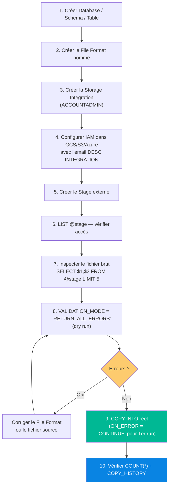

### Pendant le chargement

- [ ] `ON_ERROR = 'CONTINUE'` en phase de découverte, `'ABORT_STATEMENT'` en production critique
- [ ] `PURGE = FALSE` par défaut — conserver les fichiers pour audit
- [ ] Ne jamais utiliser `FORCE = TRUE` en production (doublons possibles)
- [ ] Partitionner les gros fichiers en chunks de **100–250 MB** pour la parallélisation optimale

### Après le chargement

- [ ] Vérifier `COUNT(*)` et comparer avec le nombre de lignes attendu
- [ ] Contrôler `COPY_HISTORY` — `ERROR_COUNT` doit être 0 ou acceptable
- [ ] Vérifier un échantillon (`SELECT * LIMIT 100`) : types corrects, nulls cohérents
- [ ] Nettoyer le stage si `PURGE = FALSE` : `REMOVE @mon_stage/fichier.csv;`
- [ ] Documenter le File Format utilisé dans un registre d'objets Snowflake

### Bonnes pratiques générales

- [ ] **Toujours créer un `FILE FORMAT` nommé** — jamais inline dans COPY INTO
- [ ] **Utiliser des `STORAGE INTEGRATION`** — ne jamais mettre de clés AWS/GCS en dur dans le SQL
- [ ] **Nommer les objets clairement** : `stage_gcs_health_prod`, `csv_health_events`
- [ ] **Pour les chargements récurrents** : encapsuler dans une Procédure Stockée appelée par une Task
- [ ] **Monitorer Snowpipe** avec `SYSTEM$PIPE_STATUS` — créer des alertes sur `pendingFileCount`
- [ ] **Tester le File Format** sur un échantillon de 100-1000 lignes avant de charger millions de lignes

---

## 15. Glossaire Complet

| Terme | Définition |
|---|---|
| **Stage** | Zone de transit Snowflake où les fichiers sont déposés avant d'être chargés dans une table |
| **Internal Stage** | Stage géré par Snowflake (stockage interne) : `@~`, `@%table`, `@named` |
| **External Stage** | Stage pointant vers un stockage cloud externe (GCS, S3, Azure) sans copier les fichiers |
| **Storage Integration** | Objet Snowflake contenant les credentials IAM sécurisés pour accéder à un bucket cloud |
| **File Format** | Objet décrivant comment parser un fichier (séparateur, encoding, format dates…) |
| **COPY INTO** | Commande principale de chargement en masse depuis un stage vers une table |
| **Snowpipe** | Mécanisme d'ingestion continue (serverless) déclenché par événement cloud |
| **PUT** | Commande SnowSQL CLI pour uploader un fichier local vers un stage interne |
| **GET** | Commande SnowSQL CLI pour télécharger un fichier depuis un stage interne |
| **VALIDATION_MODE** | Option COPY INTO pour tester le chargement sans insérer de données (dry run) |
| **ON_ERROR** | Comportement en cas d'erreur : `ABORT_STATEMENT`, `CONTINUE`, `SKIP_FILE` |
| **PURGE** | Option COPY INTO : `TRUE` = supprimer le fichier du stage après chargement |
| **FORCE** | Option COPY INTO : `TRUE` = recharger même si déjà traité (⚠️ doublons) |
| **Déduplication** | Mécanisme natif Snowflake : empêche de recharger deux fois le même fichier |
| **VARIANT** | Type de données Snowflake pour stocker du JSON/AVRO/XML semi-structuré |
| **STRIP_OUTER_ARRAY** | Option JSON File Format : déstructure `[{...},{...}]` en lignes séparées |
| **MATCH_BY_COLUMN_NAME** | Option COPY INTO Parquet : mapping des colonnes par nom au lieu de position |
| **COPY_HISTORY** | Vue `INFORMATION_SCHEMA` traçant tous les chargements des 30 derniers jours |
| **AUTO_INGEST** | Option Snowpipe : déclenche le chargement automatiquement via notifications cloud |
| **notification_channel** | ARN Pub/Sub/SQS à configurer dans le cloud pour déclencher `AUTO_INGEST` |
| **SYSTEM$PIPE_STATUS** | Fonction système retournant le statut complet d'un pipe (JSON) |
| **LIST** | Commande listant les fichiers présents dans un stage |
| **REMOVE** | Commande supprimant des fichiers d'un stage interne |
| `$1`, `$2`… | Références positionnelles aux colonnes d'un fichier brut dans un stage |
| **IDENTIFIER()** | Permet d'utiliser une variable STRING comme nom de table dynamique dans les procédures |
| **TRY_TO_DATE()** | Variante de TO_DATE() qui retourne NULL au lieu d'une erreur si le format est invalide |
| **SQLERRM** | Variable de contexte contenant le message de la dernière erreur (dans un bloc EXCEPTION) |
| **SQLROWCOUNT** | Variable contenant le nombre de lignes affectées par le dernier DML |

---

## 📚 Ressources Officielles

| Sujet | Lien |
|---|---|
| Vue d'ensemble chargement | [data-load-overview](https://docs.snowflake.com/fr/user-guide/data-load-overview) |
| Considérations préparation | [data-load-considerations-prepare](https://docs.snowflake.com/fr/user-guide/data-load-considerations-prepare) |
| CREATE DATABASE | [create-database](https://docs.snowflake.com/fr/sql-reference/sql/create-database) |
| CREATE SCHEMA | [create-schema](https://docs.snowflake.com/fr/sql-reference/sql/create-schema) |
| CREATE TABLE | [create-table](https://docs.snowflake.com/fr/sql-reference/sql/create-table) |
| Types de données | [sql-reference-data-types](https://docs.snowflake.com/fr/sql-reference-data-types) |
| CREATE STAGE | [create-stage](https://docs.snowflake.com/fr/sql-reference/sql/create-stage) |
| CREATE FILE FORMAT | [create-file-format](https://docs.snowflake.com/fr/sql-reference/sql/create-file-format) |
| COPY INTO \<table\> | [copy-into-table](https://docs.snowflake.com/fr/sql-reference/sql/copy-into-table) |
| COPY_HISTORY | [functions/copy_history](https://docs.snowflake.com/fr/sql-reference/functions/copy_history) |
| INSERT | [insert](https://docs.snowflake.com/fr/sql-reference/sql/insert) |
| PUT | [sql/put](https://docs.snowflake.com/fr/sql-reference/sql/put) |
| GET | [sql/get](https://docs.snowflake.com/fr/sql-reference/sql/get) |
| CREATE STORAGE INTEGRATION | [create-storage-integration](https://docs.snowflake.com/fr/sql-reference/sql/create-storage-integration) |
| Configurer GCS IAM | [data-load-gcs-config](https://docs.snowflake.com/fr/user-guide/data-load-gcs-config) |
| Snowpipe Introduction | [data-load-snowpipe-intro](https://docs.snowflake.com/fr/user-guide/data-load-snowpipe-intro) |
| Snowpipe GCS AUTO_INGEST | [data-load-snowpipe-auto-gcs](https://docs.snowflake.com/fr/user-guide/data-load-snowpipe-auto-gcs) |
| Snowpipe Streaming | [snowpipe-streaming-overview](https://docs.snowflake.com/fr/user-guide/snowpipe-streaming/data-load-snowpipe-streaming-overview) |
| Troubleshooting chargement | [data-load-troubleshooting](https://docs.snowflake.com/fr/user-guide/data-load-troubleshooting) |
| Semi-structured data | [semistructured-intro](https://docs.snowflake.com/fr/user-guide/semistructured-intro) |
| Python Connector | [python-connector-example](https://docs.snowflake.com/fr/user-guide/python-connector-example) |

---

## 🎯 Les 5 Principes à Retenir

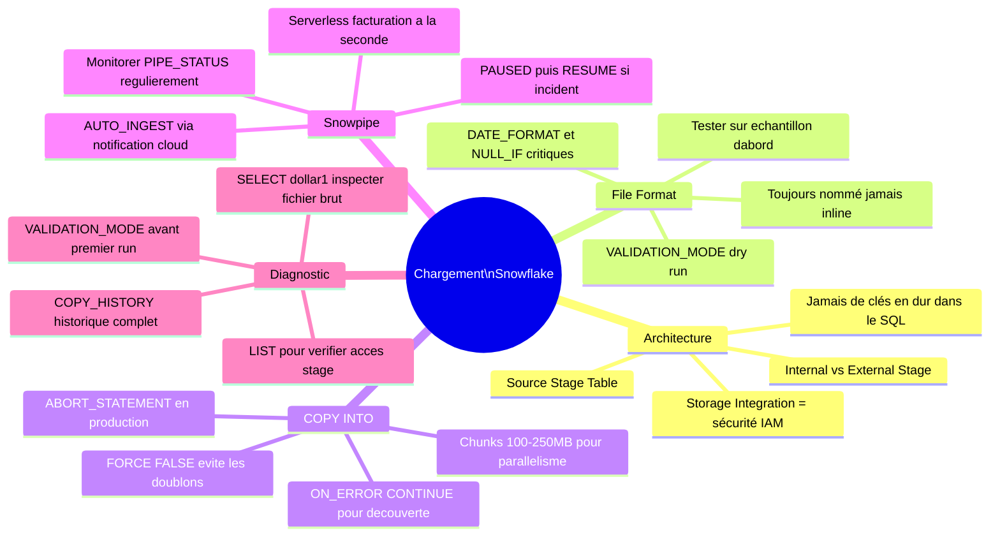

---

*❄️ Snowflake Data Loading — Guide Professionnel | Projet health_app | docs.snowflake.com/fr*
